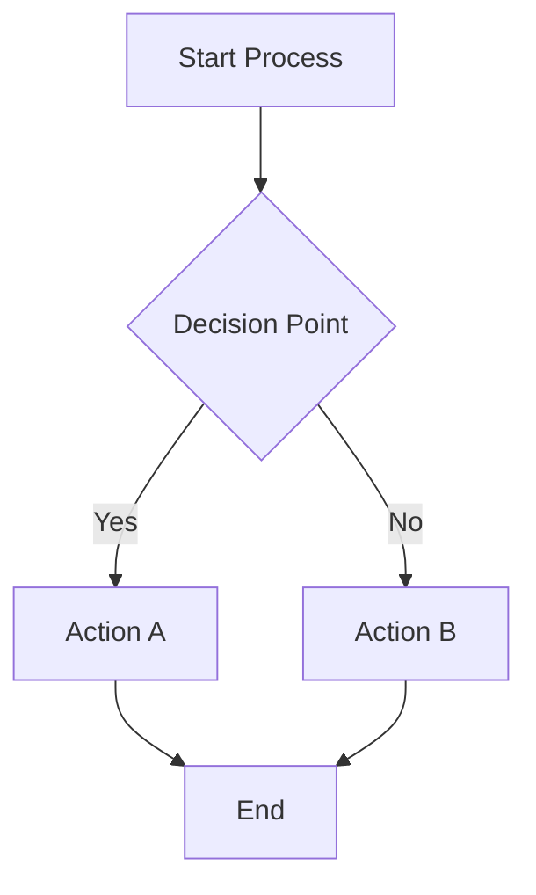
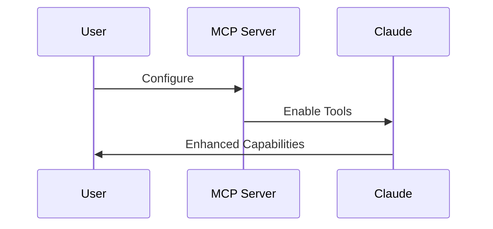
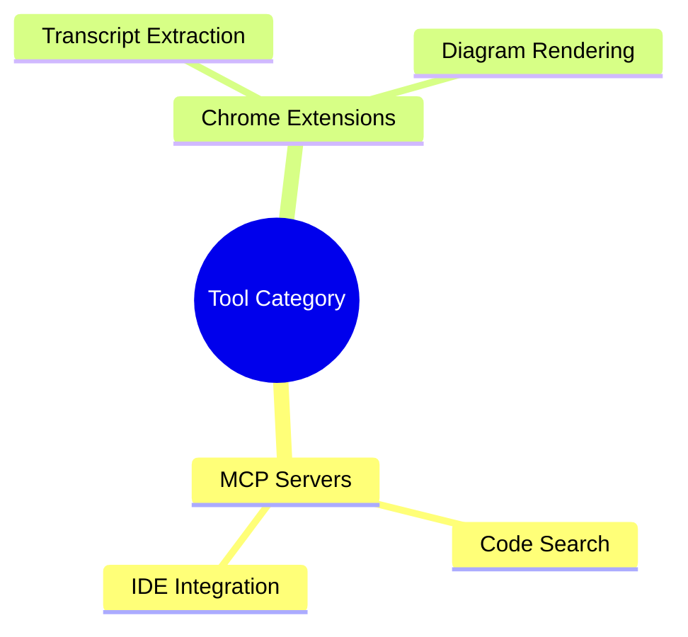

# CLAUDE.md

This file provides guidance to Claude Code (claude.ai/code) when working with code in this repository.

## Repository Overview

This is a documentation and tools repository focused on development workflow enhancements. It contains:

- **Claude Code Documentation**: Comprehensive guides for Anthropic's agentic coding tool
- **MCP Server Configurations**: Ready-to-use configurations for Model Context Protocol servers
- **Tool Documentation**: Comprehensive guides for productivity tools and Chrome extensions
- **Sequential Thinking Methodology**: Advanced problem-solving framework documentation

## Repository Structure

```
/
├── mcp.json                              # MCP server configuration for sequential-thinking
├── tools/
│   ├── claude-code/
│   │   ├── claude-code-guide.md         # Comprehensive Claude Code overview and features
│   │   ├── cli-reference.md             # Complete CLI command reference
│   │   └── workflow-examples.md         # Practical development workflow examples
│   ├── mcp/
│   │   ├── mcp-servers-guide.md         # Configurations for ggrep, GitHub Copilot, Serena, Claude Code integration
│   │   └── sequential-thinking-guide.md  # Complete usage guide for sequential thinking tool
│   └── chrome-extensions/
│       ├── glasp-youtube-summary.md     # YouTube transcript extraction tool
│       └── markdown-diagrams.md        # Markdown diagram rendering extension
└── tmp/                                 # Scratch directory (gitignored)
```

## Working with Documentation

### Content Standards
- All documentation uses GitHub-flavored Markdown
- Include practical examples and configuration snippets
- Provide both overview and detailed usage instructions
- Include security considerations for tools requiring authentication
- **Use Mermaid diagrams** to explain complex concepts visually (flowcharts, sequence diagrams, mindmaps, etc.)
- Visual diagrams enhance understanding of workflows, decision trees, and system architectures

### Visual Documentation with Mermaid

Use Mermaid diagrams to enhance documentation clarity:

**Flowcharts** for processes and decision trees:


**Sequence diagrams** for tool interactions:


**Mind maps** for concept organization:


The repository includes the Markdown Diagrams Chrome extension guide to help render these diagrams in browsers.

### File Organization
- **Claude Code documentation** goes in `tools/claude-code/`
- **MCP guides** go in `tools/mcp/`
- **Chrome extension docs** go in `tools/chrome-extensions/`
- Use descriptive filenames with hyphens (kebab-case)

## MCP Configuration

The repository includes `mcp.json` which configures the sequential-thinking MCP server:

```json
{
  "mcpServers": {
    "sequential-thinking": {
      "command": "npx",
      "args": ["-y", "@modelcontextprotocol/server-sequential-thinking"]
    }
  }
}
```

This configuration can be used as a reference or template for MCP server setups.

## Key Documentation Files

### Claude Code Documentation
- `tools/claude-code/claude-code-guide.md`: Comprehensive overview of Claude Code, installation, features, and MCP integration
- `tools/claude-code/cli-reference.md`: Complete reference for all CLI commands, flags, and slash commands
- `tools/claude-code/workflow-examples.md`: Practical examples for development workflows including debugging, refactoring, and Git operations

### MCP and Tool Documentation
- `tools/mcp/mcp-servers-guide.md`: Comprehensive guide covering ggrep (code search), GitHub Copilot integration, Serena IDE assistant, and Claude Code MCP integration
- `tools/mcp/sequential-thinking-guide.md`: Complete methodology guide for using the sequential thinking tool with examples, patterns, and best practices
- Chrome extension docs provide setup instructions and use cases for productivity tools

## Development Workflow

Since this is a documentation repository:

1. **Adding new tools**: Create appropriate markdown files in the relevant subdirectory
2. **Updating configurations**: Ensure example configurations are tested and valid
3. **Documentation updates**: Follow existing format and include practical examples
4. **Visual enhancement**: Add Mermaid diagrams to explain complex workflows, decision trees, or system architectures
5. **Content validation**: Ensure all URLs, configurations, examples, and diagrams are current and functional

## Keeping Documentation Updated

### Fetching Latest Documentation

This repository includes a system for fetching the latest official documentation from various sources:

```bash
# Check for updates without fetching
python tools/scripts/fetch-docs.py --check

# Fetch Claude Code documentation
python tools/scripts/fetch-docs.py --source claude-code

# Fetch all configured documentation sources
python tools/scripts/fetch-docs.py --all

# Force re-fetch everything (ignore cached hashes)
python tools/scripts/fetch-docs.py --all --force

# Dry run to see what would be fetched
python tools/scripts/fetch-docs.py --source claude-code --dry-run
```

### How the Documentation System Works

1. **Configuration** (`tools/scripts/docs-config.json`): Defines documentation sources
2. **Manifest Files** (`.docs-manifest.json`): Track document hashes (committed to git)
3. **Generated Content** (`gen/` directories): Fetched documentation (gitignored)

The manifest files are tracked in git so the team can see when documentation needs updating:
- When you run the fetch script, it compares current docs against stored hashes
- Only changed/new documents are fetched
- The manifest is updated with new hashes
- **Commit the updated manifest** to let the team know docs have changed

### Adding New Documentation Sources

To add a new documentation source, edit `tools/scripts/docs-config.json`:

```json
{
  "name": "new-tool",
  "sitemap": "https://example.com/sitemap.xml",
  "url_pattern": "/docs/",
  "output_dir": "tools/new-tool/gen",
  "manifest_file": "tools/new-tool/.docs-manifest.json",
  "fetch_markdown": true
}
```

### Documentation Structure

- **Curated Documentation**: Manually written guides (e.g., `claude-code-guide.md`)
- **Generated Documentation**: Auto-fetched from official sources (in `gen/` directories)
- **Manifest Files**: Track changes and hashes (`.docs-manifest.json`)

This separation allows us to maintain custom guides while staying updated with official documentation.

## Security Notes

When documenting tools that require authentication:
- Never include actual API keys or tokens in documentation
- Use placeholder values like `YOUR_GITHUB_TOKEN`
- Include security best practices and token management guidance
- Document required permissions and access levels