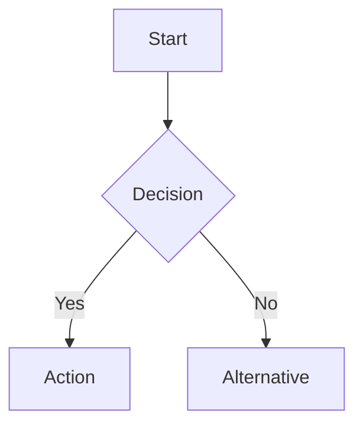

# CLAUDE.md

This file provides guidance to Claude Code (claude.ai/code) when working with code in this repository.

## Critical Context (Always Loaded)

The following files should be consulted for key information:

@tools/claude-code/README.md
@tools/claude-code/CLAUDE-CODE-UPDATE-INFO.md
@tools/scripts/docs-config.json

## Current State Awareness

**Last Documentation Update**: 2025-10-18
**Claude Code Version**: v1.0.88+
**Total Official Docs**: 44 files in tools/claude-code/gen/
**Key Recent Changes**:
- Skills system added (5th plugin component type)
- MultiEdit tool deprecated and removed
- New keyboard shortcuts (Ctrl+O, Ctrl+V, @, ?)
- Homebrew installation support
- Prompt caching configuration options
- Haiku 4.5 default models for Bedrock/Vertex AI

**When updating documentation**, always verify:
1. Is this feature current with v1.0.88+?
2. Are there related changes in official docs requiring sync?
3. Should CLAUDE-CODE-UPDATE-INFO.md be updated with changes?
4. Do curated guides need updates to match official docs?

## Repository Overview

This is a comprehensive documentation repository for Claude Code and development workflow tools. It contains:

- **Claude Code Documentation**: Complete documentation suite including:
  - Custom guides on agents, output styles, workflows, and advanced features
  - 44 official documents fetched from Anthropic's documentation
  - Practical examples for coding and non-coding applications
  - **BMAD-METHOD framework** with comprehensive features from Brian's masterclass:
    - 20+ brainstorming techniques for creative problem-solving
    - 20+ advanced elicitation methods for LLM quality
    - Complete workflow example with agent personas
    - Course correction for mid-project pivots
- **MCP Server Configurations**: Ready-to-use configurations for Model Context Protocol servers
- **Tool Documentation**: Guides for productivity tools and Chrome extensions
- **Development Frameworks**: BMAD-METHOD documentation for AI agent workflows
- **SaaS Stack Guides**: Rapid development stacks (Clerk + Convex + Stripe, etc.)
- **Sequential Thinking Methodology**: Advanced problem-solving framework
- **Automated Documentation System**: Fetches and tracks official documentation updates

## Repository Structure

```
/
├── BMAD-ENHANCEMENTS-SUMMARY.md         # Summary of BMAD documentation enhancements  
├── CLAUDE.md                            # This file - project instructions for Claude Code
├── mcp.json                             # MCP server configuration for sequential-thinking
└── tools/
    ├── claude-code/                     # Comprehensive Claude Code documentation
    │   ├── .docs-manifest.json          # Tracks document hashes for updates
    │   ├── README.md                    # Claude Code documentation overview
    │   ├── CLAUDE-CODE-UPDATE-INFO.md   # Update tracking (v1.0.88, commit eb0e434)
    │   ├── advanced-techniques.md       # Expert patterns from Ray Fernando and Eric Buess
    │   ├── claude-code-guide.md         # Comprehensive overview with agents, output styles, MCP
    │   ├── cli-reference.md             # Complete CLI commands, flags, advanced config
    │   ├── context-management.md        # Context window optimization strategies
    │   ├── custom-commands.md           # Creating custom slash commands
    │   ├── hooks-cookbook.md            # Comprehensive hooks patterns and examples
    │   ├── performance-optimization.md  # Performance tuning and best practices
    │   ├── subagent-templates.md        # Subagent creation templates
    │   ├── workflow-examples.md         # Practical workflows, BMAD integration, non-coding uses
    │   ├── plugin-ecosystem-guide.md    # Complete guide to Claude Code plugin system
    │   ├── community-resources.md       # Catalog of frameworks, tools, and IDE integrations
    │   ├── frameworks/                  # Development framework documentation
    │   │   ├── bmad-method.md          # BMAD-METHOD complete guide (ENHANCED with Brian's masterclass)
    │   │   └── BMAD-UPDATE-INFO.md     # BMAD update tracking (v4.39.1, commit ab70bac)
    │   └── gen/                         # Official documentation fetched from Anthropic (44 docs)
    │       ├── overview.md              # Claude Code overview
    │       ├── quickstart.md            # Quick start guide
    │       ├── setup.md                 # Installation and setup
    │       ├── cli-reference.md         # Official CLI reference
    │       ├── interactive-mode.md      # Interactive REPL mode
    │       ├── slash-commands.md        # All slash commands
    │       ├── settings.md              # Configuration and settings
    │       ├── output-styles.md         # Output style customization
    │       ├── sub-agents.md            # Agents/subagents documentation
    │       ├── mcp.md                   # MCP integration
    │       ├── hooks.md                 # Event hooks
    │       ├── memory.md                # Memory management
    │       ├── costs.md                 # Pricing and costs
    │       ├── plugins.md               # Plugin system (NEW)
    │       ├── jetbrains.md             # JetBrains IDE integration (NEW)
    │       └── ... (44 total docs)      # Plus security, troubleshooting, integrations, etc.
    ├── mcp/
    │   ├── mcp-servers-guide.md         # ggrep, GitHub Copilot, Serena, Claude Code integration
    │   └── sequential-thinking-guide.md # Complete usage guide for sequential thinking tool
    ├── saas-stacks/                     # Rapid SaaS development stack guides
    │   ├── README.md                    # Overview of available SaaS stacks
    │   └── clerk-convex-stripe-speedrun.md # 10-minute SaaS with auth, payments, real-time DB
    ├── chrome-extensions/
    │   ├── glasp-youtube-summary.md     # YouTube transcript extraction tool
    │   └── markdown-diagrams.md         # Markdown diagram rendering extension
    ├── mermaid-guide.md                 # Comprehensive Mermaid diagrams guide with CLI validation
    └── scripts/
        ├── fetch-docs.py                # Documentation fetcher with parallel downloads & retry
        └── docs-config.json             # Configuration for documentation sources
```

**Note**: The `tmp/` directory exists at the root level but is gitignored and used for scratch/working files.

## Working with Documentation

### Content Standards
- All documentation uses GitHub-flavored Markdown
- Include practical examples and configuration snippets
- Provide both overview and detailed usage instructions
- Include security considerations for tools requiring authentication
- **Use Mermaid diagrams** to explain complex concepts visually (flowcharts, sequence diagrams, mindmaps, etc.)
- Visual diagrams enhance understanding of workflows, decision trees, and system architectures

### Visual Documentation with Mermaid

Use Mermaid diagrams to enhance documentation clarity. **Always use Mermaid syntax within markdown code blocks** - avoid generating separate image files.

**See `tools/mermaid-guide.md` for:**
- Complete diagram syntax for all types (flowchart, sequence, state, class, ER, Gantt, etc.)
- Dark mode considerations and best practices
- Syntax validation with Mermaid CLI
- Examples and troubleshooting

Quick example:


### File Organization
- **Claude Code documentation** goes in `tools/claude-code/`
- **MCP guides** go in `tools/mcp/`
- **Chrome extension docs** go in `tools/chrome-extensions/`
- Use descriptive filenames with hyphens (kebab-case)

## MCP Configuration

The repository includes `mcp.json` which configures the sequential-thinking MCP server:

```json
{
  "mcpServers": {
    "sequential-thinking": {
      "command": "npx",
      "args": ["-y", "@modelcontextprotocol/server-sequential-thinking"]
    }
  }
}
```

This configuration can be used as a reference or template for MCP server setups.

## Key Documentation Files

### Claude Code Documentation

#### Curated Guides (Manually Written)
- `tools/claude-code/claude-code-guide.md`: Comprehensive overview with agents, output styles, system prompt customization
- `tools/claude-code/cli-reference.md`: Complete reference with advanced configuration, permissions, 1M context
- `tools/claude-code/workflow-examples.md`: Practical workflows, BMAD integration examples, non-coding applications
- `tools/claude-code/plugin-ecosystem-guide.md`: Complete guide to Claude Code plugin system with examples
- `tools/claude-code/community-resources.md`: Comprehensive catalog of community frameworks, tools, and IDE integrations

#### Framework Documentation
- `tools/claude-code/frameworks/bmad-method.md`: Complete BMAD-METHOD integration guide for structured AI development workflows (ENHANCED with Brian's masterclass insights)
  - Two-phase approach (Planning → Development)
  - Agent roles with personas (Mary/Analyst, James/Developer, Quinn/QA)
  - Story-driven development with embedded context
  - **20+ Brainstorming techniques** for creative problem-solving
  - **20+ Advanced elicitation methods** for pushing LLM quality
  - **Course correction feature** for mid-project pivots
  - **Complete workflow example** from video tutorial
  - Installation (5-second process!), configuration, and uninstallation

#### Official Documentation (Auto-Fetched)
- `tools/claude-code/gen/`: Contains 44 official docs from Anthropic
  - Setup, installation, and quickstart guides
  - Complete slash commands and CLI reference
  - Agents/subagents, output styles, hooks
  - MCP integration, security, troubleshooting
  - IDE integrations, GitHub Actions, SDK
  - Corporate proxy, Amazon Bedrock, Google Vertex AI support

#### Update Tracking
- `tools/claude-code/CLAUDE-CODE-UPDATE-INFO.md`: Tracks Claude Code v1.0.88 (commit eb0e434)
- `tools/claude-code/frameworks/BMAD-UPDATE-INFO.md`: Tracks BMAD v4.39.1 (commit ab70bac) - ENHANCED with Brian's masterclass documentation

### MCP and Tool Documentation
- `tools/mcp/mcp-servers-guide.md`: Comprehensive guide covering ggrep (code search), GitHub Copilot integration, Serena IDE assistant, and Claude Code MCP integration
- `tools/mcp/sequential-thinking-guide.md`: Complete methodology guide for using the sequential thinking tool with examples, patterns, and best practices
- Chrome extension docs provide setup instructions and use cases for productivity tools

### SaaS Stack Documentation
- `tools/saas-stacks/README.md`: Overview and comparison of rapid SaaS development stacks
- `tools/saas-stacks/clerk-convex-stripe-speedrun.md`: Complete 10-minute SaaS setup guide
  - Authentication with Clerk (Google, Apple, Email)
  - Real-time database with Convex
  - Stripe payments via Clerk integration
  - Production-ready webhooks and security
  - From zero to accepting payments in 10 minutes

## Development Workflow

Since this is a documentation repository:

1. **Adding new tools**: Create appropriate markdown files in the relevant subdirectory
2. **Updating configurations**: Ensure example configurations are tested and valid
3. **Documentation updates**: Follow existing format and include practical examples
4. **Visual enhancement**: Add Mermaid diagrams to explain complex workflows, decision trees, or system architectures
5. **Content validation**: Ensure all URLs, configurations, examples, and diagrams are current and functional

## Common Documentation Workflows

### Workflow 1: Updating Official Documentation

When asked to "update claude docs" or "fetch latest documentation":

```bash
# Step 1: Check for updates without fetching
python tools/scripts/fetch-docs.py --check

# Step 2: If updates available, fetch with verbose output
python tools/scripts/fetch-docs.py --source claude-code --verbose

# Step 3: Review what changed
git diff --stat tools/claude-code/gen/
git diff tools/claude-code/gen/

# Step 4: Analyze changes and update tracking
# Update CLAUDE-CODE-UPDATE-INFO.md with:
# - List of updated files
# - Summary of major changes (new features, deprecations, updates)
# - Impact on curated guides

# Step 5: Update affected curated guides
# Check which curated guides reference changed features:
# - plugin-ecosystem-guide.md (if plugin system changed)
# - cli-reference.md (if CLI commands changed)
# - hooks-cookbook.md (if hooks changed)
# - claude-code-guide.md (if core features changed)

# Step 6: Update main CLAUDE.md
# Update "Current State Awareness" section with new version/changes
# Update "Documentation Status" section with update date and summary
```

### Workflow 2: Creating New Documentation

When documenting a new tool or feature:

1. **Determine location**:
   - Curated guide → `tools/[category]/[name].md`
   - Official doc → Wait for fetch-docs.py to retrieve it

2. **Use standard structure**:
   ```markdown
   # Title

   Brief description (1-2 sentences)

   ## Table of Contents

   ## Overview
   [Include Mermaid diagram if complex]

   ## Installation/Setup

   ## Usage Examples

   ## Advanced Topics

   ## Troubleshooting

   ## Resources
   ```

3. **Add visual aids**: Include Mermaid diagrams for workflows, architectures, decision trees

4. **Link from navigation**: Add entry to README.md navigation table

5. **Update structure diagram**: If adding new directory, update repository structure

### Workflow 3: Synchronizing Curated Guides with Official Docs

When official docs change features documented in curated guides:

1. **Identify affected curated files**:
   ```bash
   # Find files referencing the changed feature
   grep -r "feature_name" tools/claude-code/*.md --exclude-dir=gen
   ```

2. **For each affected file**:
   - Read the official doc change
   - Update curated guide to match
   - Preserve curated insights and examples
   - Remove deprecated feature references

3. **Common sync patterns**:
   - **Tool removed** (e.g., MultiEdit): Remove from all tool lists and examples
   - **Feature added** (e.g., Skills): Add to architecture diagrams, examples, guides
   - **Behavior changed**: Update descriptions, update examples if needed

### Workflow 4: Quality Validation

Before completing documentation tasks, verify:

- [ ] All code blocks have language identifiers (```bash, ```json, etc.)
- [ ] Mermaid diagrams render correctly (test in markdown preview)
- [ ] Internal links use relative paths and are valid
- [ ] Examples are tested and current with latest versions
- [ ] No actual API keys or secrets (use placeholders like `YOUR_TOKEN`)
- [ ] Security considerations documented where applicable
- [ ] File follows existing formatting conventions
- [ ] TOC is updated if structure changed

## Context Management for Documentation Work

### The 50% Context Rule

Research from Chroma DB shows Claude Code's effectiveness degrades significantly after using 50% of the context window:

- **0-50% usage**: Optimal performance
- **50-75% usage**: Noticeable quality degradation
- **75-100% usage**: Poor results, missed requirements

### Monitoring Context Usage

Check context usage regularly:
```bash
# In Claude Code session
/cost
# Look for context window percentage
```

### When Context Approaches 50%

**For documentation updates**:

1. **Save current state**:
   ```bash
   # Update CLAUDE-CODE-UPDATE-INFO.md with:
   # - Progress so far
   # - Remaining tasks
   # - Key decisions made
   # - Files modified
   ```

2. **Clear context**:
   ```bash
   /clear
   ```

3. **Resume with focused context**:
   ```bash
   # Claude will read CLAUDE-CODE-UPDATE-INFO.md and continue
   # with fresh context window
   ```

### Using Subagents to Preserve Context

For large documentation analysis or updates, delegate to subagents:

```bash
# Analyze multiple changed files without polluting main context
claude "Spawn subagent to analyze all changes in tools/claude-code/gen/
and return a 500-word summary of major changes by category"

# Parallel processing of updates
claude "Spawn 3 subagents to update:
1. plugin-ecosystem-guide.md with Skills changes
2. cli-reference.md with new shortcuts
3. hooks-cookbook.md removing MultiEdit references
Each should return a brief completion report"
```

**Benefits**:
- Main context stays clean
- Each subagent gets fresh 200K token context
- Parallel execution speeds up work
- Only summaries return to main context

### Documentation Index Pattern

**Optimization**: Create PROJECT_INDEX.json to reduce navigation tokens by ~90%:

```json
{
  "curated_guides": {
    "count": 15,
    "location": "tools/claude-code/",
    "key_files": [
      "README.md - Navigation hub",
      "plugin-ecosystem-guide.md - Most comprehensive plugin docs",
      "cli-reference.md - Complete CLI reference",
      "workflow-examples.md - Practical patterns"
    ]
  },
  "official_docs": {
    "count": 44,
    "location": "tools/claude-code/gen/",
    "note": "Auto-fetched, DO NOT EDIT directly"
  },
  "update_tracking": [
    "CLAUDE-CODE-UPDATE-INFO.md",
    "BMAD-UPDATE-INFO.md"
  ]
}
```

**Always consult PROJECT_INDEX.json first** before searching for files.

## Keeping Documentation Updated

### Version Tracking

This repository tracks external documentation sources:
- **Claude Code**: v1.0.88 (repository commit: eb0e434)
- **BMAD-METHOD**: v4.39.1 (repository commit: ab70bac) + Brian's masterclass enhancements

### Fetching Latest Documentation

This repository includes a system for fetching the latest official documentation from various sources:

```bash
# Check for updates without fetching
python tools/scripts/fetch-docs.py --check

# Fetch Claude Code documentation
python tools/scripts/fetch-docs.py --source claude-code

# Fetch with more parallel workers for speed
python tools/scripts/fetch-docs.py --source claude-code --max-workers 10

# Force re-fetch everything (ignore cached hashes)
python tools/scripts/fetch-docs.py --all --force

# Dry run to see what would be fetched
python tools/scripts/fetch-docs.py --source claude-code --dry-run

# Verbose mode with custom retry attempts
python tools/scripts/fetch-docs.py --source claude-code --verbose --max-retries 5
```

### Updating from External Repositories

#### Update Claude Code Documentation
```bash
# Pull latest changes from Claude Code repository
cd /tmp/claude-code
git pull origin main
git log --oneline 4e63568ab..HEAD

# Check for documentation updates
python tools/scripts/fetch-docs.py --check
python tools/scripts/fetch-docs.py --source claude-code
```

#### Update BMAD-METHOD Documentation
```bash
# Pull latest changes from BMAD repository
cd /tmp/BMAD-METHOD
git pull origin main
git log --oneline f3cc410fb..HEAD

# Review changes and update documentation accordingly
git diff f3cc410fb..HEAD README.md docs/user-guide.md
```

### How the Documentation System Works

1. **Configuration** (`tools/scripts/docs-config.json`): Defines documentation sources
2. **Manifest Files** (`.docs-manifest.json`): Track document hashes and last fetch times
3. **Generated Content** (`gen/` directories): Official documentation fetched from sources

All documentation is tracked in git:
- The fetch script compares current docs against stored hashes
- Only changed/new documents are fetched (efficient updates)
- Parallel fetching with retry logic ensures reliability
- Progress bars show fetch status in real-time

#### Enhanced Fetch Script Features
- **Parallel Downloads**: Up to 10 concurrent fetches (configurable)
- **Retry Logic**: Automatic retries with exponential backoff
- **Progress Tracking**: Visual progress bars with tqdm
- **Performance**: 2-3x faster than sequential fetching

### Adding New Documentation Sources

To add a new documentation source, edit `tools/scripts/docs-config.json`:

```json
{
  "name": "new-tool",
  "sitemap": "https://example.com/sitemap.xml",
  "url_pattern": "/docs/",
  "output_dir": "tools/new-tool/gen",
  "manifest_file": "tools/new-tool/.docs-manifest.json",
  "fetch_markdown": true
}
```

### Documentation Structure

- **Curated Documentation**: Manually written guides with insights from real usage
  - Enhanced with Mermaid diagrams, practical examples, and best practices
  - Covers advanced topics like agent chaining, custom output styles, non-coding uses
- **Official Documentation**: Complete set of Anthropic's Claude Code docs
  - 33 documents covering all features, integrations, and troubleshooting
  - Automatically fetched and updated using the documentation system
- **Manifest Files**: Track document versions and changes

This dual approach provides both official reference material and practical, experience-based guidance.

### System Requirements

For the documentation fetching system:
```bash
# Install required packages
pip install requests tqdm

# tqdm is optional but recommended for progress bars
```

## Tool Usage Patterns for Documentation

### When to Use Each Tool

**Grep (Search)**:
- Finding all references to specific features (e.g., "Skills", "MultiEdit")
- Locating terminology across documentation
- Identifying files that need updates
```bash
# Find all files mentioning a deprecated feature
grep -r "MultiEdit" tools/claude-code/*.md --exclude-dir=gen
```

**Read (File Access)**:
- Reading specific documentation files
- Checking update tracking files first
- Reviewing configuration files
```bash
# Always read tracking file first for context
Read tools/claude-code/CLAUDE-CODE-UPDATE-INFO.md
```

**Edit (Modifications)**:
- Updating curated guides (tools/claude-code/*.md)
- Fixing outdated information
- Synchronizing with official doc changes
```bash
# Edit curated guides only, never gen/ files
Edit tools/claude-code/plugin-ecosystem-guide.md
```

**Bash (Automation)**:
- Running fetch-docs.py for updates
- Git operations (diff, status, add, commit)
- Executing validation scripts
```bash
python tools/scripts/fetch-docs.py --source claude-code
```

**Task (Subagents)**:
- Analyzing large sets of documentation changes
- Parallel processing of multiple file updates
- Isolated exploration without polluting main context

### Critical Rules: DO and DON'T

**DO**:
- ✅ Always read CLAUDE-CODE-UPDATE-INFO.md first for version context
- ✅ Update curated guides when official docs change
- ✅ Use Mermaid diagrams for complex concepts
- ✅ Include practical examples in documentation
- ✅ Validate all code blocks have language identifiers
- ✅ Use PROJECT_INDEX.json for navigation (when it exists)
- ✅ Monitor context usage with `/cost` command
- ✅ Use subagents for large analysis tasks

**DON'T**:
- ❌ NEVER edit files in `tools/claude-code/gen/` directory (auto-overwritten by fetch-docs.py)
- ❌ NEVER edit `.docs-manifest.json` files directly (managed by fetch script)
- ❌ NEVER create documentation files without explicit request
- ❌ NEVER include actual API keys or secrets (use placeholders)
- ❌ NEVER skip quality validation checklist
- ❌ NEVER document deprecated features (check version first)
- ❌ DON'T let context exceed 50% without clearing

### File Type Classification

Understanding file types prevents mistakes:

- 🔵 **Curated Guides** (`tools/claude-code/*.md` except gen/):
  - Manual maintenance required
  - Include expert insights and practical examples
  - Update when official docs change
  - Examples: plugin-ecosystem-guide.md, cli-reference.md

- 🟢 **Official Docs** (`tools/claude-code/gen/*.md`):
  - Auto-fetched from Anthropic
  - READ-ONLY - never edit directly
  - Overwritten on next fetch
  - Source of truth for features

- 🟡 **Generated Files** (`.docs-manifest.json`, `PROJECT_INDEX.json`):
  - Created by scripts/automation
  - Managed programmatically
  - Don't edit manually

- 🔴 **Configuration** (`mcp.json`, `docs-config.json`):
  - System configuration
  - Edit with caution
  - Validate after changes

## Security Notes

When documenting tools that require authentication:
- Never include actual API keys or tokens in documentation
- Use placeholder values like `YOUR_GITHUB_TOKEN`
- Include security best practices and token management guidance
- Document required permissions and access levels

## Documentation Status

### Latest Updates (2025-10-18)
- **Documentation refresh**: Fetched 17 updated documents
- **Major changes**:
  - Skills added to plugin system (5th component type)
  - Skills vs slash commands comprehensive guide
  - MultiEdit tool deprecated and removed
  - New keyboard shortcuts (Ctrl+O, Ctrl+V, @-mentions, ?)
  - Homebrew installation support
  - Prompt caching configuration options
  - Haiku 4.5 default models for Bedrock/Vertex AI
  - MCP command simplifications
  - Bug report retention changed to 5 years
- **Stats**: +232 lines, -43 lines across 16 files

### Previous Update (2025-10-11)
- **Documentation refresh**: Fetched 41 updated documents (30 modified, 11 new)
- **New documentation**: Plugins system, JetBrains/VS Code IDE integrations, headless mode, checkpointing, GitLab CI/CD, model/network configuration
- **Updated total**: 44 official documents (was 33)
- **Removed**: corporate-proxy, ide-integrations, sdk (consolidated)
- **New community guides**:
  - `plugin-ecosystem-guide.md` - Complete guide to Claude Code plugin system with manifest structure, development best practices
  - `community-resources.md` - Comprehensive catalog of community tools:
    - SuperClaude Framework (14 agents, 21 commands, 6 modes)
    - Claude Code Spec Workflow (spec-driven development)
    - Subagent collections, IDE integrations (Neovim, VS Code, Theia)
    - Web UIs, notification systems, automation tools
    - 20+ community projects documented

### Previous Updates (2025-08-17)
- Added comprehensive BMAD-METHOD framework documentation
- **ENHANCED BMAD documentation with Brian's masterclass insights**:
  - 20+ brainstorming techniques with detailed descriptions
  - 20+ advanced elicitation methods for quality improvement
  - Agent personas (Mary, James, Quinn) and their roles
  - Course correction feature for mid-project pivots
  - Complete workflow example from video tutorial
  - Core philosophy of "collaborative elevation"
  - Best practices and workflow tips from the creator
- Created update tracking files for version synchronization
- Enhanced workflow examples with BMAD integration
- Updated Claude Code guide with development frameworks section

### Repository Sources
- **Claude Code**: [github.com/anthropics/claude-code](https://github.com/anthropics/claude-code)
- **BMAD-METHOD**: [github.com/bmad-code-org/BMAD-METHOD](https://github.com/bmad-code-org/BMAD-METHOD)
# important-instruction-reminders
Do what has been asked; nothing more, nothing less.
NEVER create files unless they're absolutely necessary for achieving your goal.
ALWAYS prefer editing an existing file to creating a new one.
NEVER proactively create documentation files (*.md) or README files. Only create documentation files if explicitly requested by the User.