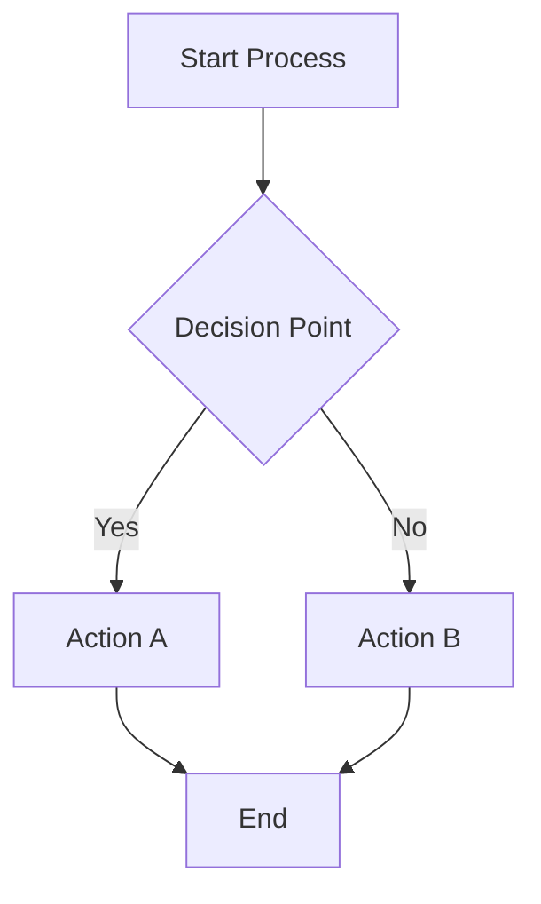
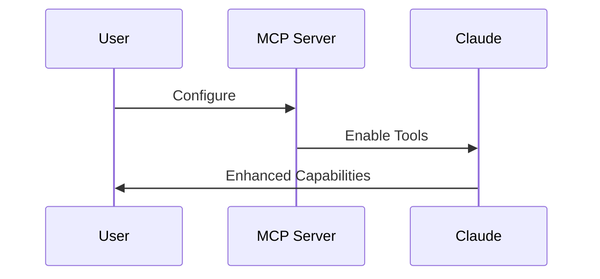
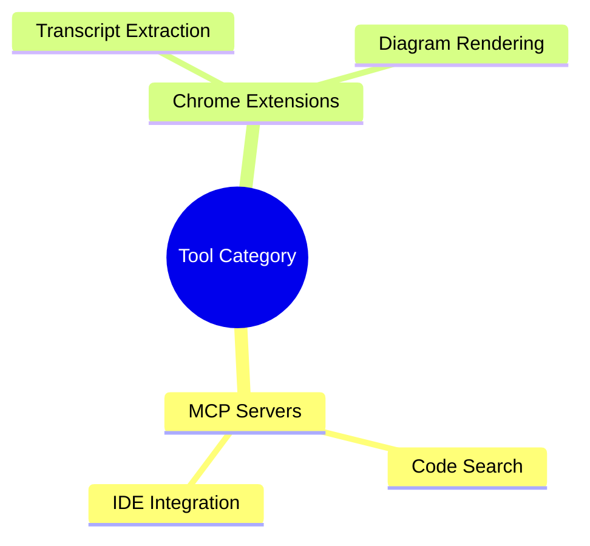

# CLAUDE.md

This file provides guidance to Claude Code (claude.ai/code) when working with code in this repository.

## Repository Overview

This is a comprehensive documentation repository for Claude Code and development workflow tools. It contains:

- **Claude Code Documentation**: Complete documentation suite including:
  - Custom guides on agents, output styles, workflows, and advanced features
  - 33 official documents fetched from Anthropic's documentation
  - Practical examples for coding and non-coding applications
  - **BMAD-METHOD framework** with comprehensive features from Brian's masterclass:
    - 20+ brainstorming techniques for creative problem-solving
    - 20+ advanced elicitation methods for LLM quality
    - Complete workflow example with agent personas
    - Course correction for mid-project pivots
- **MCP Server Configurations**: Ready-to-use configurations for Model Context Protocol servers
- **Tool Documentation**: Guides for productivity tools and Chrome extensions
- **Development Frameworks**: BMAD-METHOD documentation for AI agent workflows
- **SaaS Stack Guides**: Rapid development stacks (Clerk + Convex + Stripe, etc.)
- **Sequential Thinking Methodology**: Advanced problem-solving framework
- **Automated Documentation System**: Fetches and tracks official documentation updates

## Repository Structure

```
/
├── BMAD-ENHANCEMENTS-SUMMARY.md         # Summary of BMAD documentation enhancements  
├── CLAUDE.md                            # This file - project instructions for Claude Code
├── mcp.json                             # MCP server configuration for sequential-thinking
└── tools/
    ├── claude-code/                     # Comprehensive Claude Code documentation
    │   ├── .docs-manifest.json          # Tracks document hashes for updates
    │   ├── README.md                    # Claude Code documentation overview
    │   ├── CLAUDE-CODE-UPDATE-INFO.md   # Update tracking (v1.0.82, commit 4e63568ab)
    │   ├── advanced-techniques.md       # Expert patterns from Ray Fernando and Eric Buess
    │   ├── claude-code-guide.md         # Comprehensive overview with agents, output styles, MCP
    │   ├── cli-reference.md             # Complete CLI commands, flags, advanced config
    │   ├── context-management.md        # Context window optimization strategies
    │   ├── custom-commands.md           # Creating custom slash commands
    │   ├── hooks-cookbook.md            # Comprehensive hooks patterns and examples
    │   ├── performance-optimization.md  # Performance tuning and best practices
    │   ├── subagent-templates.md        # Subagent creation templates
    │   ├── workflow-examples.md         # Practical workflows, BMAD integration, non-coding uses
    │   ├── frameworks/                  # Development framework documentation
    │   │   ├── bmad-method.md          # BMAD-METHOD complete guide (ENHANCED with Brian's masterclass)
    │   │   └── BMAD-UPDATE-INFO.md     # BMAD update tracking (v4.39.1 + video insights)
    │   └── gen/                         # Official documentation fetched from Anthropic (33 docs)
    │       ├── overview.md              # Claude Code overview
    │       ├── quickstart.md            # Quick start guide
    │       ├── setup.md                 # Installation and setup
    │       ├── cli-reference.md         # Official CLI reference
    │       ├── interactive-mode.md      # Interactive REPL mode
    │       ├── slash-commands.md        # All slash commands
    │       ├── settings.md              # Configuration and settings
    │       ├── output-styles.md         # Output style customization
    │       ├── sub-agents.md            # Agents/subagents documentation
    │       ├── mcp.md                   # MCP integration
    │       ├── hooks.md                 # Event hooks
    │       ├── memory.md                # Memory management
    │       ├── costs.md                 # Pricing and costs
    │       └── ... (33 total docs)      # Plus security, troubleshooting, integrations, etc.
    ├── mcp/
    │   ├── mcp-servers-guide.md         # ggrep, GitHub Copilot, Serena, Claude Code integration
    │   └── sequential-thinking-guide.md # Complete usage guide for sequential thinking tool
    ├── saas-stacks/                     # Rapid SaaS development stack guides
    │   ├── README.md                    # Overview of available SaaS stacks
    │   └── clerk-convex-stripe-speedrun.md # 10-minute SaaS with auth, payments, real-time DB
    ├── chrome-extensions/
    │   ├── glasp-youtube-summary.md     # YouTube transcript extraction tool
    │   └── markdown-diagrams.md         # Markdown diagram rendering extension
    └── scripts/
        ├── fetch-docs.py                # Documentation fetcher with parallel downloads & retry
        └── docs-config.json             # Configuration for documentation sources
```

**Note**: The `tmp/` directory exists at the root level but is gitignored and used for scratch/working files.

## Working with Documentation

### Content Standards
- All documentation uses GitHub-flavored Markdown
- Include practical examples and configuration snippets
- Provide both overview and detailed usage instructions
- Include security considerations for tools requiring authentication
- **Use Mermaid diagrams** to explain complex concepts visually (flowcharts, sequence diagrams, mindmaps, etc.)
- Visual diagrams enhance understanding of workflows, decision trees, and system architectures

### Visual Documentation with Mermaid

Use Mermaid diagrams to enhance documentation clarity:

**Flowcharts** for processes and decision trees:


**Sequence diagrams** for tool interactions:


**Mind maps** for concept organization:


The repository includes the Markdown Diagrams Chrome extension guide to help render these diagrams in browsers.

### File Organization
- **Claude Code documentation** goes in `tools/claude-code/`
- **MCP guides** go in `tools/mcp/`
- **Chrome extension docs** go in `tools/chrome-extensions/`
- Use descriptive filenames with hyphens (kebab-case)

## MCP Configuration

The repository includes `mcp.json` which configures the sequential-thinking MCP server:

```json
{
  "mcpServers": {
    "sequential-thinking": {
      "command": "npx",
      "args": ["-y", "@modelcontextprotocol/server-sequential-thinking"]
    }
  }
}
```

This configuration can be used as a reference or template for MCP server setups.

## Key Documentation Files

### Claude Code Documentation

#### Curated Guides (Manually Written)
- `tools/claude-code/claude-code-guide.md`: Comprehensive overview with agents, output styles, system prompt customization
- `tools/claude-code/cli-reference.md`: Complete reference with advanced configuration, permissions, 1M context
- `tools/claude-code/workflow-examples.md`: Practical workflows, BMAD integration examples, non-coding applications

#### Framework Documentation
- `tools/claude-code/frameworks/bmad-method.md`: Complete BMAD-METHOD integration guide for structured AI development workflows (ENHANCED with Brian's masterclass insights)
  - Two-phase approach (Planning → Development)
  - Agent roles with personas (Mary/Analyst, James/Developer, Quinn/QA)
  - Story-driven development with embedded context
  - **20+ Brainstorming techniques** for creative problem-solving
  - **20+ Advanced elicitation methods** for pushing LLM quality
  - **Course correction feature** for mid-project pivots
  - **Complete workflow example** from video tutorial
  - Installation (5-second process!), configuration, and uninstallation

#### Official Documentation (Auto-Fetched)
- `tools/claude-code/gen/`: Contains 33 official docs from Anthropic
  - Setup, installation, and quickstart guides
  - Complete slash commands and CLI reference
  - Agents/subagents, output styles, hooks
  - MCP integration, security, troubleshooting
  - IDE integrations, GitHub Actions, SDK
  - Corporate proxy, Amazon Bedrock, Google Vertex AI support

#### Update Tracking
- `tools/claude-code/CLAUDE-CODE-UPDATE-INFO.md`: Tracks Claude Code v1.0.82 (commit 4e63568ab)
- `tools/claude-code/frameworks/BMAD-UPDATE-INFO.md`: Tracks BMAD v4.39.1 (commit f3cc410fb) - ENHANCED with Brian's masterclass documentation

### MCP and Tool Documentation
- `tools/mcp/mcp-servers-guide.md`: Comprehensive guide covering ggrep (code search), GitHub Copilot integration, Serena IDE assistant, and Claude Code MCP integration
- `tools/mcp/sequential-thinking-guide.md`: Complete methodology guide for using the sequential thinking tool with examples, patterns, and best practices
- Chrome extension docs provide setup instructions and use cases for productivity tools

### SaaS Stack Documentation
- `tools/saas-stacks/README.md`: Overview and comparison of rapid SaaS development stacks
- `tools/saas-stacks/clerk-convex-stripe-speedrun.md`: Complete 10-minute SaaS setup guide
  - Authentication with Clerk (Google, Apple, Email)
  - Real-time database with Convex
  - Stripe payments via Clerk integration
  - Production-ready webhooks and security
  - From zero to accepting payments in 10 minutes

## Development Workflow

Since this is a documentation repository:

1. **Adding new tools**: Create appropriate markdown files in the relevant subdirectory
2. **Updating configurations**: Ensure example configurations are tested and valid
3. **Documentation updates**: Follow existing format and include practical examples
4. **Visual enhancement**: Add Mermaid diagrams to explain complex workflows, decision trees, or system architectures
5. **Content validation**: Ensure all URLs, configurations, examples, and diagrams are current and functional

## Keeping Documentation Updated

### Version Tracking

This repository tracks external documentation sources:
- **Claude Code**: v1.0.82 (repository commit: 4e63568ab)
- **BMAD-METHOD**: v4.39.1 (repository commit: f3cc410fb) + Brian's masterclass enhancements

### Fetching Latest Documentation

This repository includes a system for fetching the latest official documentation from various sources:

```bash
# Check for updates without fetching
python tools/scripts/fetch-docs.py --check

# Fetch Claude Code documentation
python tools/scripts/fetch-docs.py --source claude-code

# Fetch with more parallel workers for speed
python tools/scripts/fetch-docs.py --source claude-code --max-workers 10

# Force re-fetch everything (ignore cached hashes)
python tools/scripts/fetch-docs.py --all --force

# Dry run to see what would be fetched
python tools/scripts/fetch-docs.py --source claude-code --dry-run

# Verbose mode with custom retry attempts
python tools/scripts/fetch-docs.py --source claude-code --verbose --max-retries 5
```

### Updating from External Repositories

#### Update Claude Code Documentation
```bash
# Pull latest changes from Claude Code repository
cd /tmp/claude-code
git pull origin main
git log --oneline 4e63568ab..HEAD

# Check for documentation updates
python tools/scripts/fetch-docs.py --check
python tools/scripts/fetch-docs.py --source claude-code
```

#### Update BMAD-METHOD Documentation
```bash
# Pull latest changes from BMAD repository
cd /tmp/BMAD-METHOD
git pull origin main
git log --oneline f3cc410fb..HEAD

# Review changes and update documentation accordingly
git diff f3cc410fb..HEAD README.md docs/user-guide.md
```

### How the Documentation System Works

1. **Configuration** (`tools/scripts/docs-config.json`): Defines documentation sources
2. **Manifest Files** (`.docs-manifest.json`): Track document hashes and last fetch times
3. **Generated Content** (`gen/` directories): Official documentation fetched from sources

All documentation is tracked in git:
- The fetch script compares current docs against stored hashes
- Only changed/new documents are fetched (efficient updates)
- Parallel fetching with retry logic ensures reliability
- Progress bars show fetch status in real-time

#### Enhanced Fetch Script Features
- **Parallel Downloads**: Up to 10 concurrent fetches (configurable)
- **Retry Logic**: Automatic retries with exponential backoff
- **Progress Tracking**: Visual progress bars with tqdm
- **Performance**: 2-3x faster than sequential fetching

### Adding New Documentation Sources

To add a new documentation source, edit `tools/scripts/docs-config.json`:

```json
{
  "name": "new-tool",
  "sitemap": "https://example.com/sitemap.xml",
  "url_pattern": "/docs/",
  "output_dir": "tools/new-tool/gen",
  "manifest_file": "tools/new-tool/.docs-manifest.json",
  "fetch_markdown": true
}
```

### Documentation Structure

- **Curated Documentation**: Manually written guides with insights from real usage
  - Enhanced with Mermaid diagrams, practical examples, and best practices
  - Covers advanced topics like agent chaining, custom output styles, non-coding uses
- **Official Documentation**: Complete set of Anthropic's Claude Code docs
  - 33 documents covering all features, integrations, and troubleshooting
  - Automatically fetched and updated using the documentation system
- **Manifest Files**: Track document versions and changes

This dual approach provides both official reference material and practical, experience-based guidance.

### System Requirements

For the documentation fetching system:
```bash
# Install required packages
pip install requests tqdm

# tqdm is optional but recommended for progress bars
```

## Security Notes

When documenting tools that require authentication:
- Never include actual API keys or tokens in documentation
- Use placeholder values like `YOUR_GITHUB_TOKEN`
- Include security best practices and token management guidance
- Document required permissions and access levels

## Documentation Status

### Latest Updates (2025-08-17)
- Added comprehensive BMAD-METHOD framework documentation
- **ENHANCED BMAD documentation with Brian's masterclass insights**:
  - 20+ brainstorming techniques with detailed descriptions
  - 20+ advanced elicitation methods for quality improvement
  - Agent personas (Mary, James, Quinn) and their roles
  - Course correction feature for mid-project pivots
  - Complete workflow example from video tutorial
  - Core philosophy of "collaborative elevation"
  - Best practices and workflow tips from the creator
- Created update tracking files for version synchronization
- Enhanced workflow examples with BMAD integration
- Updated Claude Code guide with development frameworks section

### Repository Sources
- **Claude Code**: [github.com/anthropics/claude-code](https://github.com/anthropics/claude-code)
- **BMAD-METHOD**: [github.com/bmad-code-org/BMAD-METHOD](https://github.com/bmad-code-org/BMAD-METHOD)
# important-instruction-reminders
Do what has been asked; nothing more, nothing less.
NEVER create files unless they're absolutely necessary for achieving your goal.
ALWAYS prefer editing an existing file to creating a new one.
NEVER proactively create documentation files (*.md) or README files. Only create documentation files if explicitly requested by the User.