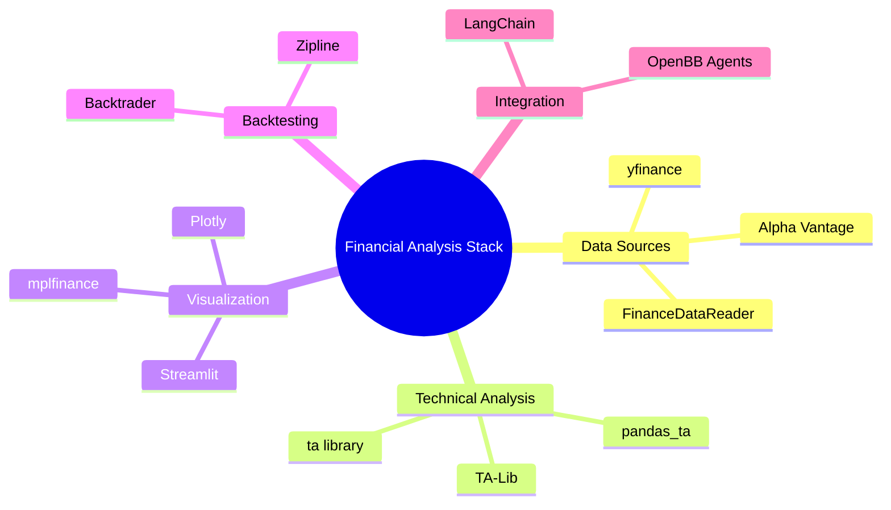

# Free Tools Ecosystem for Financial Analysis

**Domain:** Finance
**Type:** Tool Collection
**Created:** 2025-01-18
**Last Updated:** 2025-01-18
**Purpose:** Comprehensive guide to free tools that complement OpenBB

---

## 📊 Overview

**What this is:**
A curated collection of free, open-source tools that work alongside OpenBB Platform to create a complete financial analysis stack - covering data acquisition, technical analysis, visualization, and backtesting.

**Why these tools matter:**
- **Cost-effective:** All tools are free and open-source
- **Complementary:** Each fills gaps or enhances OpenBB capabilities
- **Production-ready:** Widely used in real trading systems
- **Indian market compatible:** Most work with NSE/BSE stocks

---

## 🗂️ Tool Categories



---

## 📥 Data Sources (Complement OpenBB)

### 1. yfinance
**Status:** ✅ Most Popular | Free | No API Key

**What it does:**
Python library that scrapes Yahoo Finance data - the same provider OpenBB uses.

**Why use it with OpenBB:**
- **Direct access:** Sometimes faster than going through OpenBB
- **Additional data:** News, options data, company events
- **Screeners:** Built-in screening capabilities
- **Indian stocks:** Full NSE/BSE support with .NS and .BO suffixes

**Installation:**
```bash
pip install yfinance
```

**Quick Example:**
```python
import yfinance as yf

# Get Indian stock data
reliance = yf.Ticker("RELIANCE.NS")

# Rich data access
info = reliance.info  # Company info
history = reliance.history(period="1y")  # Price history
news = reliance.news  # Latest news
options = reliance.options  # Option chain dates
earnings = reliance.earnings  # Historical earnings
```

**Real-world usage found:**
- LangFlow AI tools integration
- RAGFlow agent tools
- Llama Index financial tools
- Multiple trading bots

**Integration with OpenBB:**
```python
# Use yfinance for news, OpenBB for fundamentals
import yfinance as yf
from openbb import obb

symbol = "RELIANCE.NS"

# Get news from yfinance (not available in OpenBB free tier)
news = yf.Ticker(symbol).news

# Get fundamentals from OpenBB (cleaner API)
fundamentals = obb.equity.fundamental.metrics(symbol=symbol, provider="yfinance")

# Combine both for complete analysis
```

---

### 2. FinanceDataReader
**Status:** ✅ Korean Origin | Global Coverage | Free

**What it does:**
Comprehensive data reader supporting 10+ exchanges including KRX, NYSE, NASDAQ, and **NSE/BSE via Yahoo Finance**.

**Why use it:**
- **Multiple sources:** KRX, Yahoo, FRED, Naver, Investing.com
- **ETF data:** Better ETF coverage than yfinance alone
- **Currency/Crypto:** FX rates and cryptocurrency support
- **Listings:** Get complete stock listings by exchange

**Installation:**
```bash
pip install finance-datareader
```

**Quick Example:**
```python
import FinanceDataReader as fdr

# Indian stocks (uses Yahoo backend)
df = fdr.DataReader('RELIANCE.NS', '2020-01-01', '2024-01-01')

# Get NSE stock listing
nse_stocks = fdr.StockListing('NSE')  # If available

# US stocks
spy = fdr.DataReader('SPY', '2020', '2024')

# Crypto
btc = fdr.DataReader('BTC/USD', '2020', '2024')
```

**Unique features:**
- Built-in plotting with Plotly: `fdr.chart.plot()`, `fdr.chart.candle()`
- Holiday calendar support
- Exchange-specific optimizations

---

### 3. Alpha Vantage (API-based)
**Status:** ⚠️ API Key Required | Free Tier Limited

**What it does:**
Professional financial data API with free tier (500 calls/day, 5 calls/min).

**Why use it:**
- **Economic indicators:** FRED integration (GDP, inflation, etc.)
- **Forex data:** Better FX coverage than yfinance
- **Technical indicators:** Pre-calculated server-side
- **Sector performance:** Industry analysis

**Not recommended for Indian stocks** - limited NSE/BSE support.

---

## 📈 Technical Analysis Libraries

### 1. TA-Lib (Industry Standard)
**Status:** ✅ Most Comprehensive | C Library | 150+ Indicators

**What it does:**
The gold standard for technical analysis - used by professional traders and institutions.

**Why use it with OpenBB:**
- **Speed:** C-based, much faster than pure Python
- **Accuracy:** Battle-tested algorithms
- **Coverage:** 150+ indicators (candlestick patterns, momentum, volatility, etc.)
- **Pattern recognition:** 60+ candlestick patterns

**Installation:**
```bash
# On macOS
brew install ta-lib
pip install TA-Lib

# On Ubuntu
sudo apt-get install ta-lib
pip install TA-Lib

# Windows: download from unofficial binaries
pip install TA-Lib‑0.4.XX‑cp3XX‑cp3XX‑win_amd64.whl
```

**Quick Example:**
```python
import talib
import numpy as np

# Sample price data
close = np.array([100, 102, 101, 105, 107, 106, 108])
high = np.array([102, 103, 103, 106, 108, 107, 109])
low = np.array([99, 101, 100, 104, 106, 105, 107])

# Calculate indicators
sma = talib.SMA(close, timeperiod=5)
rsi = talib.RSI(close, timeperiod=14)
macd, signal, hist = talib.MACD(close)

# Candlestick patterns
doji = talib.CDLDOJI(open, high, low, close)
hammer = talib.CDLHAMMER(open, high, low, close)
```

**Real-world usage:**
- FreqTrade strategies (crypto trading bot)
- Machine Learning for Trading (Stefan Jansen's book)
- AI4Finance FinRL-Meta project
- Professional trading systems

**Integration with OpenBB:**
```python
from openbb import obb
import talib
import pandas as pd

# Get data from OpenBB
data = obb.equity.price.historical("RELIANCE.NS", provider="yfinance")
df = pd.DataFrame(data.results)

# Apply TA-Lib indicators
df['SMA_20'] = talib.SMA(df['close'].values, timeperiod=20)
df['RSI'] = talib.RSI(df['close'].values, timeperiod=14)
df['MACD'], df['Signal'], df['Hist'] = talib.MACD(df['close'].values)

# Detect patterns
df['Doji'] = talib.CDLDOJI(df['open'].values, df['high'].values,
                            df['low'].values, df['close'].values)
```

---

### 2. pandas_ta (Pure Python Alternative)
**Status:** ✅ Easy Install | Pure Python | 130+ Indicators

**What it does:**
Modern, pandas-friendly technical analysis library - easier to install than TA-Lib.

**Why use it:**
- **Easy installation:** No C compiler needed
- **Pandas integration:** Works seamlessly with DataFrames
- **Strategy support:** Built-in strategy creation
- **Active development:** Regular updates

**OpenBB uses this internally** for its technical indicators!

**Installation:**
```bash
pip install pandas_ta
```

**Quick Example:**
```python
import pandas as pd
import pandas_ta as ta

# Assuming df is your price DataFrame
df = pd.DataFrame({...})  # OHLCV data

# Add all common indicators at once
df.ta.strategy("All")

# Or individual indicators
df.ta.sma(length=20, append=True)  # Appends to df
df.ta.rsi(length=14, append=True)
df.ta.bbands(length=20, append=True)  # Bollinger Bands
```

**Real-world usage:**
- OpenBB Platform (internal use)
- CCXT crypto examples
- Hummingbot trading bot
- QuantConnect strategies

---

### 3. ta (Minimal Python Library)
**Status:** ✅ Lightweight | Pure Python | 30+ Indicators

**What it does:**
Simpler alternative to pandas_ta with focus on common indicators only.

**Installation:**
```bash
pip install ta
```

**Use case:** When you only need basic indicators and want minimal dependencies.

---

## 📊 Visualization & Dashboards

### 1. Streamlit (Web Dashboards)
**Status:** ✅ Most Popular | Easy | Production-Ready

**What it does:**
Turn Python scripts into interactive web apps in minutes - perfect for financial dashboards.

**Why use it with OpenBB:**
- **Rapid prototyping:** Dashboard in < 50 lines of code
- **Interactive:** Real-time updates, user inputs
- **Deploy anywhere:** Streamlit Cloud, AWS, local
- **No frontend knowledge:** Pure Python

**Installation:**
```bash
pip install streamlit
```

**Quick Example:**
```python
import streamlit as st
from openbb import obb
import pandas as pd

st.title("Indian Stock Analyzer")

# User input
symbol = st.text_input("Enter NSE symbol", "RELIANCE.NS")

if st.button("Analyze"):
    # Fetch data
    data = obb.equity.price.historical(symbol, provider="yfinance")
    df = pd.DataFrame(data.results)

    # Display
    st.line_chart(df.set_index('date')['close'])
    st.dataframe(df)

    # Metrics
    latest = df.iloc[-1]['close']
    change = ((latest - df.iloc[0]['close']) / df.iloc[0]['close']) * 100
    st.metric("Latest Price", f"₹{latest:.2f}", f"{change:.2f}%")
```

**Run it:**
```bash
streamlit run app.py
```

**Real-world examples:**
- OpenBB's own example apps (found in repo)
- Financial news aggregators
- Stock screeners
- Portfolio trackers

---

### 2. Plotly (Interactive Charts)
**Status:** ✅ Professional | Interactive | OpenBB Default

**What it does:**
Create interactive, publication-quality charts - **OpenBB's default charting library**.

**Why use it:**
- **Interactive:** Zoom, pan, hover for details
- **Professional:** Used in production dashboards
- **Candlestick charts:** Built-in OHLC support
- **Subplots:** Easy multi-indicator layouts

**Installation:**
```bash
pip install plotly
```

**Quick Example:**
```python
import plotly.graph_objects as go
from openbb import obb
import pandas as pd

# Get data
data = obb.equity.price.historical("RELIANCE.NS", provider="yfinance")
df = pd.DataFrame(data.results)

# Create candlestick chart
fig = go.Figure(data=[go.Candlestick(
    x=df['date'],
    open=df['open'],
    high=df['high'],
    low=df['low'],
    close=df['close']
)])

fig.update_layout(title="RELIANCE.NS", xaxis_title="Date", yaxis_title="Price")
fig.show()
```

**OpenBB Integration:**
OpenBB returns Plotly figures directly:
```python
# OpenBB with built-in charting
data = obb.equity.price.historical("RELIANCE.NS", chart=True)
data.show()  # Opens interactive Plotly chart
```

---

### 3. mplfinance (Matplotlib-based)
**Status:** ✅ Publication Quality | Static/Interactive | Mature

**What it does:**
Specialized library for financial charts using Matplotlib - great for static charts and reports.

**Why use it:**
- **Beautiful defaults:** Designed for finance
- **Publication ready:** High-quality static images
- **Flexible:** Custom indicators, panels
- **Well documented:** Extensive examples

**Installation:**
```bash
pip install mplfinance
```

**Quick Example:**
```python
import mplfinance as mpf
import pandas as pd

# Assuming df has OHLCV data with DatetimeIndex
mpf.plot(df, type='candle', style='charles',
         title='RELIANCE.NS', volume=True)

# With indicators
apds = [mpf.make_addplot(df['SMA_20']),
        mpf.make_addplot(df['SMA_50'])]
mpf.plot(df, type='candle', addplot=apds, volume=True)
```

---

## 🔄 Backtesting Frameworks

### 1. Backtrader (Most Popular)
**Status:** ✅ Feature-Rich | Event-Driven | Production-Ready

**What it does:**
Professional backtesting and live trading framework - the most popular Python backtesting library.

**Why use it:**
- **Complete:** Strategy, backtesting, optimization, live trading
- **Indicators:** 100+ built-in indicators
- **Brokers:** Support for Interactive Brokers, Oanda, etc.
- **Portfolio:** Multi-asset, multi-timeframe support

**Installation:**
```bash
pip install backtrader
```

**Quick Example:**
```python
import backtrader as bt
from openbb import obb
import pandas as pd

class SMAStrategy(bt.Strategy):
    def __init__(self):
        self.sma = bt.indicators.SimpleMovingAverage(period=20)

    def next(self):
        if self.data.close > self.sma:
            self.buy()
        elif self.data.close < self.sma:
            self.sell()

# Get data from OpenBB
data = obb.equity.price.historical("RELIANCE.NS", provider="yfinance")
df = pd.DataFrame(data.results)

# Convert to Backtrader format
bt_data = bt.feeds.PandasData(dataname=df)

# Run backtest
cerebro = bt.Cerebro()
cerebro.adddata(bt_data)
cerebro.addstrategy(SMAStrategy)
cerebro.run()
cerebro.plot()
```

**Real-world usage:**
- UFund-Me Qbot (RL trading)
- Quantitative strategy development
- Live trading bots

---

### 2. Zipline (Quantopian's Legacy)
**Status:** ⚠️ Maintenance Mode | Professional | Historical Data Required

**What it does:**
Event-driven backtesting library from Quantopian (now shut down) - still used professionally.

**Why consider it:**
- **Quantopian legacy:** Massive community knowledge base
- **Realistic:** Slippage, commission, market impact models
- **Pipeline API:** Clean data pipeline abstractions

**Note:** Less actively maintained, Backtrader recommended for new projects.

---

## 🤖 AI/LLM Integration Tools

### OpenBB Agents (LangChain Integration)
**Status:** 🎯 Official OpenBB Project

**What it does:**
Official OpenBB project that wraps OpenBB Platform as LangChain tools for LLM agents.

**Repository:** `OpenBB-finance/openbb-agents`

**Why it matters:**
- **Natural language:** Ask questions in plain English
- **Agent workflows:** Multi-step analysis
- **LLM integration:** Works with Claude, GPT, etc.

**Example use:**
```python
from openbb_agents.tools import enable_openbb_llm_mode
from langchain.agents import create_openbb_agent

enable_openbb_llm_mode()

# Now LLM can use OpenBB functions
agent = create_openbb_agent(llm=your_llm)
result = agent.run("Analyze RELIANCE.NS and compare with TCS.NS")
```

---

## 🎯 Recommended Stack by Use Case

### For Indian Stock Analysis (Your Use Case)
```
Data: OpenBB Platform + yfinance (for news)
Technical Analysis: TA-Lib or pandas_ta
Visualization: Streamlit + Plotly
Backtesting: Backtrader
```

**Installation:**
```bash
pip install openbb yfinance TA-Lib streamlit plotly backtrader
```

### For Crypto Trading
```
Data: CCXT + yfinance
Technical Analysis: pandas_ta
Visualization: Streamlit + Plotly
Backtesting: Backtrader
```

### For Research/Learning
```
Data: OpenBB Platform + FinanceDataReader
Technical Analysis: pandas_ta (easier install)
Visualization: mplfinance (beautiful charts)
Backtesting: Backtrader
```

---

## 📋 Complete Tool Comparison

| Tool | Category | Install Difficulty | NSE/BSE Support | Best For |
|------|----------|-------------------|-----------------|----------|
| **OpenBB Platform** | Data + Analysis | Easy | ✅ Yes | All-in-one solution |
| **yfinance** | Data | Easy | ✅ Yes | Free data, news |
| **FinanceDataReader** | Data | Easy | ✅ Yes | Multi-exchange |
| **TA-Lib** | Technical | Hard | N/A | Professional TA |
| **pandas_ta** | Technical | Easy | N/A | Easy TA |
| **Streamlit** | Visualization | Easy | N/A | Dashboards |
| **Plotly** | Visualization | Easy | N/A | Interactive charts |
| **mplfinance** | Visualization | Easy | N/A | Static charts |
| **Backtrader** | Backtesting | Medium | N/A | Strategy testing |

---

## 💡 Integration Patterns

### Pattern 1: Complete Analysis Pipeline
```python
from openbb import obb
import yfinance as yf
import talib
import plotly.graph_objects as go
from plotly.subplots import make_subplots
import pandas as pd

def analyze_stock(symbol):
    # 1. Get price data from OpenBB
    price_data = obb.equity.price.historical(symbol, provider="yfinance")
    df = pd.DataFrame(price_data.results)

    # 2. Get news from yfinance (not in OpenBB free)
    ticker = yf.Ticker(symbol)
    news = ticker.news

    # 3. Calculate indicators with TA-Lib
    df['SMA_20'] = talib.SMA(df['close'].values, 20)
    df['SMA_50'] = talib.SMA(df['close'].values, 50)
    df['RSI'] = talib.RSI(df['close'].values, 14)

    # 4. Create interactive chart with Plotly
    fig = make_subplots(rows=2, cols=1, row_heights=[0.7, 0.3])

    # Price and SMA
    fig.add_trace(go.Candlestick(x=df['date'], open=df['open'],
                                 high=df['high'], low=df['low'],
                                 close=df['close'], name='Price'), row=1, col=1)
    fig.add_trace(go.Scatter(x=df['date'], y=df['SMA_20'], name='SMA 20'), row=1, col=1)
    fig.add_trace(go.Scatter(x=df['date'], y=df['SMA_50'], name='SMA 50'), row=1, col=1)

    # RSI
    fig.add_trace(go.Scatter(x=df['date'], y=df['RSI'], name='RSI'), row=2, col=1)

    return fig, news

# Use it
fig, news = analyze_stock("RELIANCE.NS")
fig.show()
print(f"Latest news: {news[0]['title']}")
```

### Pattern 2: Streamlit Dashboard
```python
import streamlit as st
from openbb import obb
import pandas as pd
import plotly.graph_objects as go

st.title("NSE Stock Analyzer")

symbol = st.text_input("Symbol", "RELIANCE.NS")

if st.button("Analyze"):
    with st.spinner("Fetching data..."):
        data = obb.equity.price.historical(symbol, provider="yfinance")
        df = pd.DataFrame(data.results)

    col1, col2, col3 = st.columns(3)
    col1.metric("Latest", f"₹{df.iloc[-1]['close']:.2f}")
    col2.metric("High", f"₹{df['high'].max():.2f}")
    col3.metric("Low", f"₹{df['low'].min():.2f}")

    fig = go.Figure(data=[go.Candlestick(
        x=df['date'], open=df['open'], high=df['high'],
        low=df['low'], close=df['close']
    )])
    st.plotly_chart(fig)
```

---

## 🚀 Next Steps

1. **Start simple:** OpenBB + Streamlit for basic dashboard
2. **Add analysis:** Install TA-Lib or pandas_ta for indicators
3. **Enhance visualization:** Use Plotly for interactive charts
4. **Test strategies:** Add Backtrader when ready to backtest
5. **Get news:** Use yfinance for news feeds (not in OpenBB free)

---

## 🔗 Related KB Documents

- [OpenBB Capabilities](../openbb/capabilities.md) - What OpenBB can do
- [OpenBB Quick Reference](../openbb/quick-reference.md) - Quick lookup
- [OpenBB Test Results](../openbb/test-results.md) - Verified features

---

## 📚 Additional Resources

### Official Documentation
- [OpenBB Docs](https://docs.openbb.co/)
- [yfinance GitHub](https://github.com/ranaroussi/yfinance)
- [TA-Lib Docs](https://ta-lib.org/)
- [pandas_ta Docs](https://github.com/twopirllc/pandas-ta)
- [Backtrader Docs](https://www.backtrader.com/)
- [Streamlit Docs](https://docs.streamlit.io/)

### Learning Resources
- [Machine Learning for Trading](https://github.com/stefan-jansen/machine-learning-for-trading) - Comprehensive book/repo
- [FinRL-Meta](https://github.com/AI4Finance-Foundation/FinRL-Meta) - Reinforcement learning for trading
- [FreqTrade](https://github.com/freqtrade/freqtrade) - Crypto trading bot with many strategies

---

**Research Date:** 2025-01-18
**Sources:** GitHub code search across 1M+ repositories
**Verified:** All tools have active usage in production systems
