# Business Strategy for AI Apps

> Transform your AI-generated apps from expensive development hobbies into profitable businesses using proven strategies, frameworks, and real-world insights.

## 🎯 Quick Start

**The Problem**: You're spending hundreds monthly on AI tools (Claude Code, Cursor Ultra) to build amazing apps, but you're burning money instead of making it.

**The Solution**: Learn the business strategies that turn code into cash.

```mermaid
flowchart LR
    A[❌ Current State] --> B[Spending $400+/month]
    B --> C[Building Features]
    C --> D[No Revenue]
    
    E[✅ Target State] --> F[Market Research]
    F --> G[Validated Problem]
    G --> H[$50K+ Monthly Revenue]
    
    style A fill:#ffebee
    style E fill:#e8f5e8
```

**Start Here**: [AI Apps Monetization Guide](ai-apps-monetization-guide.md) - Complete framework from market research to profitable growth.

## 📚 Guide Collection

### 🚀 [AI Apps Monetization Guide](ai-apps-monetization-guide.md)
**The Complete Business Framework**

Transform from developer to entrepreneur with this comprehensive guide covering:
- The "Rich People Problems" principle
- Market-first approach vs feature-first approach  
- Product validation before building
- Growth strategies and customer acquisition
- Real case studies from $50K+ monthly apps

**Best for**: Complete beginners to app monetization  
**Time to read**: 45 minutes  
**Action items**: 25+ specific tasks  

### 🔍 [Market Validation Playbook](market-validation-playbook.md)
**Validate Before You Build**

Systematic approach to validate your app idea before writing code:
- The "Bad Reviews Goldmine" strategy
- Competitor revenue analysis with AppFigures
- Direct customer interview frameworks
- Market signal detection methods
- Validation scoring system (rate opportunities 1-10)

**Best for**: Developers with an app idea ready to validate  
**Time to read**: 35 minutes  
**Tools included**: Interview scripts, research templates  

### 💰 [Pricing Strategies Guide](pricing-strategies.md)
**Psychology-Based Pricing That Converts**

Master pricing psychology to maximize revenue and attract better customers:
- Why higher prices often convert better
- Price point strategy by customer segment
- Free trial optimization (achieve 30-40% conversion)
- A/B testing frameworks for pricing
- Real experiments and results

**Best for**: Apps ready to launch or optimize pricing  
**Time to read**: 30 minutes  
**Frameworks included**: Pricing calculators, test designs  

## 🎯 Choose Your Path

### Path 1: Complete Beginner
**"I have an app idea but don't know if it's worth building"**

1. 📖 Read: [AI Apps Monetization Guide](ai-apps-monetization-guide.md) (sections 1-3)
2. 🔍 Do: [Market Validation Playbook](market-validation-playbook.md) exercises
3. 💰 Plan: [Pricing Strategies](pricing-strategies.md) for your validated idea

**Timeline**: 2-3 weeks research → 6-8 weeks building → Launch

### Path 2: Built But Not Selling  
**"I've built an app but it's not making money"**

1. 🔍 Validate: [Market Validation Playbook](market-validation-playbook.md) - validate your existing market
2. 💰 Optimize: [Pricing Strategies Guide](pricing-strategies.md) - fix your pricing
3. 🚀 Grow: [AI Apps Monetization Guide](ai-apps-monetization-guide.md) sections 5-7

**Focus**: Customer interviews, pricing optimization, growth tactics

### Path 3: Making Some Revenue
**"I'm making $1K-10K monthly but want to scale"**

1. 💰 Master: [Pricing Strategies Guide](pricing-strategies.md) - optimize for higher LTV
2. 🚀 Scale: [AI Apps Monetization Guide](ai-apps-monetization-guide.md) sections 6-8  
3. 🔍 Expand: [Market Validation Playbook](market-validation-playbook.md) for new markets

**Focus**: Conversion optimization, customer acquisition, market expansion

## 📊 Success Metrics by Stage

### Stage 1: Validation (Weeks 1-4)
- ✅ 10+ customer interviews completed
- ✅ Market validation score 6.0+ out of 10.0  
- ✅ 3+ competitors making $30K+ monthly
- ✅ Clear pricing strategy defined

### Stage 2: Launch (Months 1-3)
- ✅ $1K+ monthly recurring revenue
- ✅ 25%+ trial-to-paid conversion rate
- ✅ <15% monthly churn rate
- ✅ 50+ active paying customers

### Stage 3: Growth (Months 4-12)
- ✅ $10K+ monthly recurring revenue  
- ✅ 35%+ trial-to-paid conversion rate
- ✅ <10% monthly churn rate
- ✅ Clear path to $50K+ monthly revenue

### Stage 4: Scale (Year 2+)
- ✅ $50K+ monthly recurring revenue
- ✅ Multiple customer acquisition channels
- ✅ Strong unit economics (3:1 LTV:CAC)
- ✅ Exit opportunity or continued scaling

## 🛠️ Essential Tools

### Market Research
- **AppFigures** ($83/month): Competitor app revenue data
- **Screen Design**: App performance tracking  
- **Reddit/LinkedIn**: Community research
- **Google Trends**: Market interest validation

### Customer Validation  
- **Calendly**: Schedule customer interviews
- **Loom**: Record demo videos for feedback
- **Typeform**: Create validation surveys
- **Notion**: Organize research and insights

### Pricing & Analytics
- **RevenueCat**: Mobile subscription analytics
- **Stripe**: Payment processing with built-in analytics
- **Mixpanel**: User behavior and conversion tracking
- **Google Analytics**: Web traffic and funnel analysis

### Customer Acquisition
- **ConvertKit**: Email marketing automation
- **Buffer**: Social media scheduling  
- **Canva**: Marketing graphics and materials
- **Luma**: Community events and networking

## 📈 Real-World Success Stories

### Case Study 1: CloserCoach
**Market**: Sales training for professionals  
**Strategy**: Bad reviews research → niche focus → premium pricing  
**Results**: $10K-30K monthly, 30% trial conversion, successful micro-influencer partnerships

**Key Lessons**:
- One detailed bad review led to major feature that became core differentiator
- Higher pricing ($19.99 vs $9.99) converted better for sales professionals
- Community-first approach drove retention and word-of-mouth growth

### Case Study 2: Field Service Management App
**Market**: HVAC, plumbing, electrical contractors  
**Strategy**: Direct observation → clear problem → B2B pricing  
**Opportunity**: 100 contractors × $49/month = $60K ARR = $200K+ business value

**Key Lessons**:
- "Boring" businesses have huge unmet needs
- Direct observation revealed problems customers couldn't articulate
- B2B pricing allows for much higher margins than consumer apps

### Case Study 3: Logistics Platform
**Market**: High-volume shipping businesses  
**Strategy**: Partnership approach → percentage-based revenue model  
**Results**: Client spending $100K daily → 15% platform margin = $15K daily revenue

**Key Lessons**:
- B2B percentage models can scale to enormous revenues
- Demonstrating ROI in person is incredibly powerful
- Enterprise clients will pay premium for significant savings

## 🔄 Implementation Timeline

### Month 1: Foundation
**Week 1-2**: Market research and validation
- Choose target market using frameworks
- Complete competitor analysis  
- Interview 10+ potential customers
- Score market opportunity

**Week 3-4**: Product strategy
- Define minimum viable product based on research
- Set pricing strategy using psychology principles
- Plan customer acquisition approach
- Create go-to-market timeline

### Month 2-3: Build and Launch
**Week 5-8**: MVP development
- Build core features that solve validated problem
- Implement analytics and conversion tracking
- Create onboarding flow optimized for trial conversion
- Prepare launch marketing materials

**Week 9-12**: Launch and optimize
- Launch to early customer list
- A/B test pricing and onboarding
- Optimize trial-to-paid conversion
- Gather customer feedback and iterate

### Month 4-6: Growth and Scale
**Month 4**: Customer acquisition
- Launch referral program
- Begin content marketing
- Test paid advertising channels
- Build community around product

**Month 5**: Conversion optimization  
- Optimize pricing based on data
- Improve onboarding flow
- Reduce churn through customer success
- Expand feature set based on usage

**Month 6**: Market expansion
- Validate adjacent markets
- Consider enterprise tier
- Explore partnership opportunities
- Plan international expansion

## 💡 Key Insights Summary

### The Rich People Problems Principle
**Core Truth**: Don't build for broke people. Prosumers and businesses pay for quality solutions.

**Target Customers**:
- Making $60K+ annually
- Willing to invest in themselves  
- Value quality over price
- Have real problems worth solving

### The Market-First Approach
**Wrong**: "I have this cool idea, now I need users"  
**Right**: "I found a market with problems, now I'll build the solution"

### Pricing Psychology
**Key Insight**: Higher prices often convert better because:
- Price signals quality to customers
- Premium customers have lower churn
- Better customers provide better feedback
- Higher margins enable better customer service

### Validation Before Building
**Most Important**: One week of proper market validation saves months of building the wrong thing.

**Strong Validation Signals**:
- Customers paying for existing solutions
- Detailed complaints in competitor bad reviews  
- Active communities discussing the problem
- Clear willingness to pay established through interviews

## 🤝 Community and Support

### Connect with Other App Entrepreneurs
- **School Community**: Join Alim's free community for app builders
- **LinkedIn**: Connect with other developers turning apps into businesses
- **Reddit**: r/entrepreneur, r/SaaS, r/startups for ongoing discussions
- **Twitter/X**: Follow successful app entrepreneurs and VCs

### Get Help
- **Customer Interviews**: Need help with validation? Use the templates in the Market Validation Playbook
- **Pricing Questions**: Reference the Pricing Strategies guide for specific scenarios  
- **General Strategy**: The AI Apps Monetization Guide covers most common situations

### Contribute Back
Have a success story or lesson learned? Consider:
- Writing a case study for this collection
- Sharing metrics and insights with the community
- Mentoring other developers making the transition
- Contributing to open-source business strategy resources

## 📝 Quick Reference

### Essential Questions Before Building
1. **Who** specifically has this problem? (Not "everyone")
2. **How** do they currently solve it? (What do they pay?)
3. **Why** would they switch to your solution? (Clear differentiation)
4. **Where** do these customers spend time? (Customer acquisition)
5. **When** do they feel this pain most acutely? (Timing and urgency)

### Red Flags (Don't Build)
- ❌ Only you think it's a problem
- ❌ Free alternatives work fine
- ❌ No one currently pays for solutions
- ❌ Market is declining (Google Trends down)
- ❌ You can't reach your target customers

### Green Lights (Build This)
- ✅ Multiple people describe same problem unprompted
- ✅ Existing solutions are expensive but inadequate  
- ✅ Clear budget exists for solutions
- ✅ You have access to target customers
- ✅ Market is growing (Google Trends up)

---

## 🚀 Ready to Start?

**Your Next Action**: Pick one guide above based on your current situation and spend 2 hours implementing the first three action items.

**Remember**: The AI tools make building easier than ever, but success still requires solving real problems for people willing to pay. Start with the market, validate the problem, then build the solution.

*The difference between a profitable app and an expensive hobby is understanding your customers' needs before you write the first line of code.*

---

*Based on insights from Alim (former head mobile engineer at PrizeFix) and other successful app entrepreneurs who've built multiple $50K+ monthly revenue applications.*