# AI Apps Monetization Guide: From Code to Cash

> Transform your AI-generated apps from expensive hobbies into profitable businesses using proven strategies from a former PrizeFix engineer who scaled apps to $50K+ monthly revenue.

## Table of Contents

- [Introduction: The AI App Monetization Problem](#introduction-the-ai-app-monetization-problem)
- [The Rich People Problems Principle](#the-rich-people-problems-principle)
- [Finding Your Profitable Market](#finding-your-profitable-market)
- [Product Validation Before Building](#product-validation-before-building)
- [Pricing Psychology & Strategy](#pricing-psychology--strategy)
- [Growth & Customer Acquisition](#growth--customer-acquisition)
- [Conversion Optimization](#conversion-optimization)
- [Case Studies & Real Examples](#case-studies--real-examples)
- [Tools & Resources](#tools--resources)
- [Action Plan](#action-plan)

## Introduction: The AI App Monetization Problem

You're spending hundreds of dollars monthly on Claude Code, Cursor Ultra, and other AI tools to build amazing apps faster than ever. But there's a problem: **you're burning money instead of making it**.

The issue isn't your technical skills or AI capabilities. It's that most developers approach app building backwards:

```mermaid
flowchart LR
    A[❌ Wrong Way] --> B[Build App] --> C[Find Users] --> D[Hope for Revenue]
    
    E[✅ Right Way] --> F[Find Market] --> G[Validate Problem] --> H[Build Solution] --> I[Scale Revenue]
    
    style A fill:#ffebee
    style E fill:#e8f5e8
```



### The Reality Check

- **80% of apps** never generate meaningful revenue
- **Most developers** focus on features instead of markets
- **Technical excellence** doesn't equal business success
- **AI makes building easier** but doesn't solve the business problem

This guide shares strategies from Alim, former head mobile engineer at PrizeFix who:
- Scaled PrizeFix from 2,000 to 2+ million users
- Built multiple apps generating $50K+ monthly
- Worked with data scientists, marketers, and growth teams
- Invested $630K+ in paid advertising to crack customer acquisition

## The Rich People Problems Principle

### Core Philosophy: Don't Build for Broke People

**The Golden Rule**: People don't value cheap solutions, and broke customers create expensive problems.


### The Three Categories Framework

All painful problems worth solving fall into three categories:

#### 1. Health
- Physical fitness and wellness
- Mental health and productivity
- Medical and healthcare solutions
- Performance optimization

#### 2. Wealth
- Making money
- Saving money
- Investing and financial planning
- Business growth and efficiency

#### 3. Relationships
- Personal relationships
- Professional networking
- Team collaboration
- Customer relationships

### Target Customer Profile

**Prosumers**: Ambitious, motivated, money-minded, knowledge-forward people who are serious about life.

**Characteristics of Ideal Customers:**
- Making $60K+ annually
- Willing to invest in themselves
- Value quality over price
- Understand the ROI of good tools
- Have real problems worth solving

## Finding Your Profitable Market

### The Market-First Approach

**Wrong**: "I have this cool app idea, now I need to find users"
**Right**: "I've found a market with problems, now I'll build the solution"

### Market Segmentation Strategy

Start with broad categories, then narrow down:


### The Power of Niching Down

**Example: High Net Worth Divorce Lawyers**
- Husband and wife both have $10M+ businesses
- Need help splitting complex assets
- Have children and multiple properties
- Can afford $10K+ solutions
- Highly motivated to solve quickly

**Why This Works:**
- **Specific**: Easy to identify and target
- **Wealthy**: Can afford premium pricing
- **Painful**: High-stakes problems
- **Reachable**: Known communities and channels

### Market Research Tactics

#### 1. Go Outside and Talk to People
```bash
# Real-world market research
1. Visit local businesses
2. Ask about their operations
3. Identify pain points in their workflow
4. Understand their spending priorities
5. Find problems worth $5K+ annually
```

#### 2. The $5K+ Business Rule
Only work with businesses generating at least $5K monthly net profit:
- Real businesses, not freelancers
- Have budget for solutions
- Understand ROI calculations
- Take tools seriously

#### 3. Conversation Starters
- "How do you currently handle [specific process]?"
- "What's the most frustrating part of your business?"
- "Have you thought about building an app?"
- "What would save you the most time/money?"

### Market Validation Signals

**Strong Signals:**
- Multiple businesses mention same problem
- Existing solutions are expensive but inadequate
- Manual processes costing significant time/money
- Regulatory or compliance requirements
- YC funding in the space
- Bad reviews for existing solutions

**Weak Signals:**
- "Nice to have" features
- Only you think it's a problem
- Free alternatives exist
- Consumer-focused solutions
- No one currently paying for solutions

## Product Validation Before Building

### The Bad Reviews Goldmine

**Key Insight**: Bad reviews represent the highest intent level possible - people who really wanted the problem solved, paid for a solution, and were disappointed enough to write a detailed complaint.

#### Why Bad Reviews Are Valuable
1. **Highest Intent**: These users desperately wanted the problem solved
2. **Detailed Feedback**: They'll tell you exactly what's wrong
3. **Market Validation**: Proves demand exists
4. **Competitive Intelligence**: Shows gaps in existing solutions
5. **Feature Roadmap**: Direct guidance on what to build

#### How to Use Bad Reviews

**Step 1: Find Competitors**
```bash
# Use these tools to find competing apps
- AppFigures: Revenue and download data
- Screen Design: User interface analysis
- App Store: Direct competitor research
- Google Play: Android market research
```

**Step 2: Analyze Reviews**
Look for recurring complaints:
- Missing features users desperately need
- Pricing issues (too expensive/too cheap)
- User experience problems
- Integration or compatibility issues

**Real Example from CloserCoach:**
> "Not a huge fan of the five minute timer and you only have pre-made bots... It would be much better if you could create your own conversational bot... I would happily pay more."

**Result**: Built custom challenge creation feature based on this single review.

#### Validation Research Tools

**1. AppFigures Analysis**
```
Target Revenue Benchmarks:
- $100K+ monthly = Scalable via paid ads
- $65K monthly = Possible with organic/SEO
- $30K monthly = Good niche product
- <$10K monthly = Hobby level
```

**2. Market Sizing**
- Research total addressable market
- Identify serviceable addressable market  
- Calculate if 1% market share = good business
- Validate pricing potential vs market size

**3. Community Research**
- Reddit threads about the problem
- YouTube videos discussing pain points
- Industry forums and discussions
- LinkedIn groups and conversations

### Building Community Before Product

**Why Community First:**
- **Longevity**: Communities last longer than apps
- **Feedback Loop**: Direct access to user needs
- **Distribution**: Built-in marketing channel
- **Validation**: Real problems surface naturally

**Community Building Strategies:**
1. **Join Existing Communities**: Where your market already congregates
2. **Create Value First**: Share knowledge before selling
3. **Ask Questions**: "What's your biggest challenge with X?"
4. **Document Problems**: Build a database of real pain points
5. **Test Solutions**: Validate ideas with community members

## Pricing Psychology & Strategy

### The Psychology of Pricing

**Key Principle**: People don't value cheap solutions.

```mermaid
graph TD
    A[Price Point] --> B{Customer Perception}
    B -->|$4.99/month| C[😒 Must be low quality]
    B -->|$19.99/month| D[🤔 Seems reasonable]
    B -->|$99/month| E[😍 Must be valuable]
    
    style C fill:#ffebee
    style D fill:#fff3e0
    style E fill:#e8f5e8
```



### Pricing Tiers Strategy

**Avoid These Price Points:**
- $4.99/month (too cheap, signals low quality)
- $6.99/month (weird pricing, no clear value)
- $9.99/month (consumer app territory)

**Target These Price Points:**
- $19.99/month (prosumer sweet spot)
- $49/month (serious tool territory)
- $99/month (premium business solution)

### Product-Price-Market Fit

Your pricing must align with:
1. **Customer Profile**: High earners can afford premium pricing
2. **Problem Severity**: Big problems justify big solutions
3. **Market Standards**: Price within market expectations
4. **Value Delivered**: ROI must be clear and compelling

### Real Pricing Experiments

**CloserCoach Price Test:**
- Tested $19.99/month vs $9.99/month
- **Result**: Higher price converted better
- **Reason**: Salespeople want to appear successful/rich
- **Learning**: Match pricing to customer psychology

**Price Reduction Experiment:**
- Cut price in half on August 19th
- Conversion rate: 31% → 50%
- Churn rate: Decreased by 30%
- **Net Result**: Higher LTV despite lower upfront revenue

### Free Trial Strategy

**The Science of Free Trials:**

```mermaid
flowchart LR
    A[Without Free Trial] --> B[Download → Paywall → 5% Convert]
    C[With Free Trial] --> D[Download → Trial → 22% Convert → 33% Trial to Paid]
    
    style D fill:#e8f5e8
```



**Free Trial Benefits:**
- 3x higher initial conversion rates
- Better user experience
- Time to demonstrate value
- Lower customer acquisition cost

**Free Trial Requirements:**
- 30-40% trial-to-paid conversion rate
- Clear value demonstration during trial
- Strategic paywall placement
- Retention-focused onboarding

### Pricing for Different Markets

**Consumer Apps ($4.99 - $19.99/month):**
- High volume, low margin
- Requires viral marketing
- Difficult customer acquisition
- High churn rates

**Prosumer Apps ($19.99 - $99/month):**
- Medium volume, good margin
- Word-of-mouth marketing
- Reasonable acquisition costs
- Lower churn rates

**Business Apps ($99+ /month):**
- Low volume, high margin
- Direct sales and partnerships
- High acquisition costs but high LTV
- Very low churn rates

## Growth & Customer Acquisition

### The Micro-Influencer Strategy

**Why Micro-Influencers Work:**
- 10K-30K subscriber sweet spot
- Hungry to monetize
- Manageable inbox/reachable
- Niche, engaged audiences
- Reasonable partnership terms

#### Finding the Right Influencers

**Search Strategy:**
```bash
# YouTube search examples
"scaling HVAC companies"
"divorce lawyer marketing" 
"software engineering productivity"
"small business automation"
```

**Criteria for Good Partners:**
- 5K-30K engaged subscribers
- Content matches your market exactly
- Previous monetization experience
- Professional presentation
- Regular posting schedule

#### Partnership Models

**1. Revenue Share:**
- Give equity in exchange for marketing
- Influencer handles promotion
- You handle product and operations
- Both benefit from growth

**2. Paid Partnerships:**
- Pay per post or campaign
- Maintain full ownership
- Clear performance metrics
- Short-term arrangements

**3. Product Collaboration:**
- Build product for their audience
- They provide market insights
- Shared development and marketing
- Joint ownership model

### Community-Driven Growth

**The Compound Effect:**
Building community creates exponential returns through:
- Word-of-mouth referrals
- User-generated content
- Organic social proof
- Retention improvements

#### Community Building Tactics

**1. Weekly Group Calls:**
- Live feedback sessions
- User success stories
- Problem-solving workshops
- Feature request discussions

**2. Beta User Programs:**
- Early access to features
- Direct feedback channels
- Success story development
- Referral incentives

**3. Content Creation:**
- User case studies
- Problem-solving tutorials
- Industry insights
- Behind-the-scenes content

### Paid Advertising Strategy

**When to Use Paid Ads:**
- Product-market fit achieved
- Positive unit economics
- Scalable customer acquisition
- Available capital for investment

**Key Metrics to Track:**
- Customer Acquisition Cost (CAC)
- Lifetime Value (LTV)
- Return on Ad Spend (ROAS)
- Payback period

**Alim's Experience:**
- Invested $630K+ in Meta ads
- Learned customer psychology
- Achieved profitable ROAS
- Scaled to $50K+ monthly revenue

### Organic Growth Channels

**SEO Strategy:**
- Target long-tail keywords
- Create problem-solving content
- Build domain authority
- Local SEO for service businesses

**Content Marketing:**
- YouTube tutorials
- Blog posts solving problems
- Case studies and examples
- Industry trend analysis

**Partnership Channels:**
- Integration partnerships
- Referral programs
- Affiliate marketing
- Cross-promotion deals

## Conversion Optimization

### Understanding Your Funnel

**Basic App Funnel:**


### Key Conversion Metrics

**Download to Paywall View Rate:**
- **Target**: 80%+ of downloads should see paywall
- **Improvement**: Streamline onboarding flow
- **Measurement**: Analytics tracking through app

**Trial to Paid Conversion Rate:**
- **Target**: 30-40% of trials convert to paid
- **Industry Average**: 15-25% (aim higher)
- **Optimization**: Focus on value demonstration

**Monthly Churn Rate:**
- **Target**: <10% monthly churn
- **Measurement**: Track subscription cancellations
- **Improvement**: Focus on user success and engagement

### Trust Building for Conversions

**High-Trust Sources:**
- Long-form YouTube videos
- Influencer recommendations
- Word-of-mouth referrals
- Industry publications

**Low-Trust Sources:**
- Cold ads
- App store discovery
- Generic marketing
- Unknown sources

**Trust Building Tactics:**
- Social proof and testimonials
- Free valuable content
- Transparent pricing
- Money-back guarantees
- Industry recognition

### Cancellation Flow Intelligence

**Why Track Cancellations:**
- Highest intent feedback source
- Product improvement insights
- Retention optimization opportunities
- Pricing validation data

**Cancellation Reasons to Track:**
- Too expensive
- Found better alternative
- Didn't use enough
- Technical problems
- Missing features

**Real Example:**
PrizeFix tracked that price was #1 cancellation reason, cut price in half, achieved:
- 31% → 50% conversion rate increase
- 30% reduction in churn
- Net positive impact on LTV

## Case Studies & Real Examples

### Case Study 1: CloserCoach (Sales Training App)

**Market**: Salespeople who want to practice sales calls
**Problem**: No way to practice sales conversations safely
**Solution**: AI-powered sales practice with conversational bots

**Key Metrics:**
- Monthly Revenue: $10K-30K range
- Target Market: Ambitious salespeople
- Pricing: $19.99/month (tested vs $9.99, higher converted better)
- Growth Channel: Influencer partnerships

**Lessons Learned:**
1. **Bad Review Gold**: One user requested custom scenarios → became major feature
2. **Pricing Psychology**: Salespeople want to appear successful, higher price worked
3. **Trial Importance**: Free trial essential for sales tools
4. **Community Value**: Regular user feedback sessions drive retention

### Case Study 2: Logistics Platform (B2B)

**Market**: Businesses with high shipping volumes
**Problem**: Expensive and inefficient shipping management
**Solution**: Custom logistics platform with better rates

**Key Numbers:**
- Client spent $100K daily on shipping
- Platform takes 15% margin
- Client saves money, platform makes $15K daily
- Boring business, huge revenue potential

**Lessons Learned:**
1. **Boring Can Be Profitable**: Unsexy industries have unmet needs
2. **High-Stakes Problems**: When money is involved, solutions get bought
3. **Margin Opportunities**: B2B allows for percentage-based revenue
4. **Personal Selling**: Demo the problem in person when possible

### Case Study 3: ScamProfit (Investment Education)

**Market**: People learning about investments and trading
**Problem**: Need education and community around investing
**Solution**: Educational content plus community platform

**Growth Strategy:**
- Partnered with financial influencer
- Built product for his existing community
- Monthly live sessions for feedback
- Community-first approach

**Lessons Learned:**
1. **Community > Product**: Community provides longer-term value
2. **Influencer Partnerships**: Let them handle marketing, you handle product
3. **Live Feedback**: Regular user sessions prevent product drift
4. **Educational Market**: People pay for knowledge and community

### Case Study 4: Field Service Management

**Market**: HVAC, plumbing, electrical contractors
**Problem**: Manual processes for quotes, invoicing, scheduling
**Solution**: Mobile app for field service management

**Market Validation:**
- Contractor writing quotes on notepad
- Manual invoicing via email
- No payment links or easy acceptance
- Clear efficiency gains available

**Opportunity Size:**
- 100 contractors × $49/month = $5K monthly
- $60K annual revenue
- Business worth $200K+ at 3-5x multiple
- Scalable to thousands of contractors

**Implementation Approach:**
1. Find local contractors
2. Observe current processes
3. Build mobile-first solution
4. Price at $49/month (business tool pricing)
5. Scale through industry associations

## Tools & Resources

### Market Research Tools

**Competitor Analysis:**
- **AppFigures**: App revenue and download data
- **Screen Design**: App revenue tracking and interface analysis
- **Similar Web**: Website traffic analysis
- **SEMrush**: Keyword and competition research

**Market Validation:**
- **Google Trends**: Search volume trends
- **Reddit**: Community discussions and pain points
- **YouTube**: Search for problem-related content
- **LinkedIn**: Professional community insights

### Financial Modeling Tools

**Revenue Tracking:**
- **Mixpanel**: User behavior and conversion analytics
- **Google Analytics**: Web traffic and conversion tracking
- **Stripe Dashboard**: Payment and subscription metrics
- **RevenueCat**: Mobile subscription analytics

**Financial Planning:**
- **Google Sheets**: Custom financial models
- **Airtable**: Customer and revenue tracking
- **Notion**: All-in-one business planning
- **Excel**: Advanced financial modeling

### Marketing and Growth Tools

**Content Creation:**
- **Canva**: Graphics and marketing materials
- **Loom**: Screen recordings and tutorials
- **OBS**: Live streaming and content creation
- **Buffer**: Social media scheduling

**Email and Communication:**
- **ConvertKit**: Email marketing automation
- **Intercom**: Customer communication
- **Typeform**: Surveys and feedback collection
- **Calendly**: Meeting scheduling

### Development and Operations

**App Development:**
- **Cursor**: AI-powered coding
- **Claude Code**: AI development assistant
- **Vercel**: Web app deployment
- **Supabase**: Backend as a service

**Analytics and Monitoring:**
- **PostHog**: Product analytics
- **Sentry**: Error tracking
- **LogRocket**: User session recording
- **Hotjar**: Heatmaps and user behavior

## Action Plan

### Phase 1: Market Discovery (Week 1-2)

**Step 1: Choose Your Market Segment**
```bash
# Exercise: Market Selection
1. List 10 potential customer types you could serve
2. Research market size for each (aim for 100K+ people)
3. Identify which markets have money to spend
4. Pick the one you have access to or interest in
5. Narrow down to specific sub-niche
```

**Step 2: Talk to 10 People**
- Find 10 people in your chosen market
- Ask about their biggest business problems
- Understand their current solutions
- Identify what they'd pay to solve
- Document common pain points

**Step 3: Research Competition**
- Use AppFigures to find competing apps
- Analyze their pricing and features
- Read their bad reviews extensively
- Identify gaps and opportunities
- Estimate market size and revenue potential

### Phase 2: Validation (Week 3-4)

**Step 1: Community Research**
- Join 5 communities where your market congregates
- Lurk and observe common problems
- Engage in discussions about pain points
- Build relationships with potential customers
- Document problems and frequency

**Step 2: Build an Audience**
- Start creating content about the problem space
- Share insights from your research
- Build email list of interested people
- Engage with micro-influencers in the space
- Document interested prospects

**Step 3: Create a Simple Landing Page**
- Describe the problem you're solving
- Explain your planned solution
- Collect email addresses
- Run small paid ads to test interest
- Measure signup rates and engagement

### Phase 3: Build and Launch (Week 5-8)

**Step 1: MVP Development**
- Build the minimum viable solution
- Focus on core problem solving
- Use AI tools to accelerate development
- Keep it simple and focused
- Plan for rapid iteration

**Step 2: Beta Testing**
- Recruit 5-10 beta users from your audience
- Provide free access in exchange for feedback
- Conduct weekly feedback calls
- Iterate based on user input
- Document feature requests and problems

**Step 3: Pricing and Launch Strategy**
- Set pricing based on market research
- Implement free trial (7-14 days)
- Create simple onboarding flow
- Launch to your email list first
- Gather initial reviews and testimonials

### Phase 4: Growth and Optimization (Week 9-12)

**Step 1: Conversion Optimization**
- Track key funnel metrics
- Optimize trial-to-paid conversion
- Reduce churn through user success
- A/B test pricing and features
- Focus on user retention

**Step 2: Marketing Scale-Up**
- Partner with micro-influencers
- Create valuable content consistently
- Build referral program
- Consider paid advertising
- Expand to new customer segments

**Step 3: Financial Management**
- Track unit economics carefully
- Calculate customer lifetime value
- Monitor customer acquisition costs
- Build financial models for growth
- Plan for scale-up investment

### Success Metrics by Phase

**Phase 1 Success:**
- ✅ Identified specific market niche
- ✅ Found 3+ recurring pain points
- ✅ Validated people will pay for solutions
- ✅ Built initial prospect list

**Phase 2 Success:**
- ✅ 100+ email subscribers
- ✅ 5+ potential customers identified
- ✅ Clear problem-solution fit
- ✅ Competitive differentiation identified

**Phase 3 Success:**
- ✅ 10+ beta users providing feedback
- ✅ Product solving core problem
- ✅ First paying customers
- ✅ Basic metrics tracking in place

**Phase 4 Success:**
- ✅ $1K+ monthly recurring revenue
- ✅ 30%+ trial-to-paid conversion
- ✅ <15% monthly churn rate
- ✅ Clear path to $10K+ MRR

### Long-term Milestones

**6 Months: $10K MRR**
- 500+ monthly active users
- Strong product-market fit
- Efficient customer acquisition
- Clear growth trajectory

**12 Months: $50K MRR**
- 2,500+ monthly active users
- Multiple growth channels
- Strong unit economics
- Considering exit opportunities

**18 Months: Exit or Scale**
- $100K+ MRR or exit opportunity
- Proven business model
- Strong market position
- Team scaling decisions

## Conclusion

Building profitable AI apps isn't about the technology - it's about understanding markets, serving real needs, and creating value people will pay for.

**Key Takeaways:**

1. **Start with Markets, Not Ideas**: Find profitable customer segments before building anything
2. **Focus on Rich People Problems**: Prosumers and businesses pay for quality solutions
3. **Validate Before Building**: Use bad reviews, community feedback, and market research
4. **Price for Value**: Higher prices attract better customers and signal quality
5. **Build Community First**: Long-term relationships beat one-time transactions
6. **Optimize Conversions**: Track metrics and improve your funnel systematically
7. **Scale Thoughtfully**: Growth requires investment, planning, and focused execution

The AI tools make building easier than ever, but success still requires solving real problems for people willing to pay. Use this guide to bridge the gap between your technical skills and business success.

**Start today**: Pick a market, talk to 5 people, and identify one real problem worth solving. Your profitable AI app business begins with that first conversation.

---

*Based on insights from Alim, former head mobile engineer at PrizeFix, who scaled multiple apps to $50K+ monthly revenue. This guide represents real-world experience from building, launching, and growing profitable AI-powered applications.*