# Market Validation Playbook

> A systematic approach to validate your app idea before writing a single line of code. Based on proven strategies from successful app entrepreneurs who've built multiple $50K+ monthly revenue products.

## Table of Contents

- [Introduction: Why Validation Matters](#introduction-why-validation-matters)
- [The Bad Reviews Strategy](#the-bad-reviews-strategy)
- [Competitor Revenue Analysis](#competitor-revenue-analysis)
- [Community Research Methods](#community-research-methods)
- [Direct Customer Interviews](#direct-customer-interviews)
- [Market Signal Detection](#market-signal-detection)
- [Validation Scoring Framework](#validation-scoring-framework)
- [Common Validation Mistakes](#common-validation-mistakes)
- [Tools and Templates](#tools-and-templates)

## Introduction: Why Validation Matters

**The Expensive Reality**: You can spend months building a perfect app that nobody wants to pay for.

**The Cheap Solution**: Spend days validating your market before building anything.

### Validation vs. Building


### What Validation Tells You

✅ **Market Size**: How many people have this problem  
✅ **Problem Severity**: How badly they need it solved  
✅ **Willingness to Pay**: What they'll spend on solutions  
✅ **Competition Gaps**: Where existing solutions fail  
✅ **Customer Characteristics**: Who exactly you're serving  

## The Bad Reviews Strategy

### Why Bad Reviews Are Gold

**Insight**: Bad reviews represent the highest intent possible - people who:
- Really wanted the problem solved
- Paid money for a solution
- Were disappointed enough to write detailed feedback
- Will likely pay for a better solution

### Finding Bad Reviews

**Step 1: Identify Competitor Apps**
```bash
# Search patterns for finding competitors
"[problem] app"
"[industry] software" 
"[task] automation"
"[profession] tools"
```

**Step 2: Analyze Review Patterns**
Look for:
- ⭐ 1-2 star reviews with detailed explanations
- Recurring complaints across multiple apps
- Feature requests in negative reviews
- Pricing complaints (too high/too low)
- Integration or compatibility issues

**Step 3: Extract Opportunity Signals**

**Red Flag Patterns** (avoid these markets):
- "This app is perfect, no complaints"
- Only generic complaints ("crashes sometimes")
- Very few total reviews
- All competitors have 4.5+ star ratings

**Green Flag Patterns** (pursue these markets):
- Specific feature requests in bad reviews
- "I would pay more for X feature"
- Technical complaints you can solve
- Multiple apps with same problems

### Real Examples

**Example 1: Sales Training App**
Bad Review: *"Not a huge fan of the five minute timer and you only have pre-made bots... It would be much better if you could create your own conversational bot... I would happily pay more."*

**Validation Signal**: ✅ Specific feature request + willingness to pay more

**Example 2: Invoicing App**
Bad Review: *"App works but invoices get buried in email spam. Wish I could text the link to customers instead."*

**Validation Signal**: ✅ Clear problem + obvious solution pathway

### Bad Review Research Template

```markdown
## App: [Competitor Name]
**Revenue**: $X/month (from AppFigures)
**Rating**: X.X stars
**Total Reviews**: XXX

### Negative Review Themes:
1. [Theme 1]: X% of bad reviews mention this
2. [Theme 2]: X% of bad reviews mention this
3. [Theme 3]: X% of bad reviews mention this

### Opportunity Signals:
- Feature requests: [list specific requests]
- Pricing complaints: [too high/low/confusing]
- Integration gaps: [what they can't connect to]
- User experience issues: [specific UX problems]

### Business Opportunity:
[Your assessment of whether this represents a real business opportunity]
```

## Competitor Revenue Analysis

### Revenue Research Tools

**AppFigures**: Most comprehensive app revenue data
- Download estimates
- Revenue estimates  
- Ranking history
- Competitor tracking

**Screen Design**: Visual revenue tracking
- Revenue charts over time
- App store performance
- User interface screenshots
- Feature analysis

### Revenue Benchmarks

**Market Viability Indicators:**

```mermaid
graph TD
    A[Monthly Revenue] --> B{Market Assessment}
    B -->|$100K+| C[✅ Scalable via paid ads]
    B -->|$30K-100K| D[✅ Good niche market]
    B -->|$10K-30K| E[⚠️ Small but viable]
    B -->|<$10K| F[❌ Hobby level]
    
    style C fill:#e8f5e8
    style D fill:#e8f5e8
    style E fill:#fff3e0
    style F fill:#ffebee
```



**What Revenue Numbers Tell You:**

**$100K+ Monthly**: 
- Market is large enough for multiple players
- Paid advertising is likely profitable
- High customer lifetime value potential
- Serious business opportunity

**$30K-100K Monthly**:
- Solid niche market
- Organic growth possible
- Good bootstrap opportunity
- Room for improvement on existing solutions

**$10K-30K Monthly**:
- Small but dedicated market
- May require multiple revenue streams
- Good learning opportunity
- Validate before major investment

**<$10K Monthly**:
- Likely too small for viable business
- May be feature, not product
- Consider as part of larger platform
- Proceed with extreme caution

### Competitor Analysis Framework

```markdown
## Competitor Analysis: [Market Category]

### Top 3 Competitors:
1. **[App Name]**: $X/month, X.X rating, [key features]
2. **[App Name]**: $X/month, X.X rating, [key features]  
3. **[App Name]**: $X/month, X.X rating, [key features]

### Market Insights:
- **Total Market Size**: $XXX/month across top 10 apps
- **Average Price Point**: $XX/month
- **Market Leader Strategy**: [how #1 app differentiates]
- **Common Features**: [what all apps include]
- **Feature Gaps**: [what no one does well]

### Opportunity Assessment:
- **Market Size**: [Large/Medium/Small]
- **Competition Level**: [High/Medium/Low]
- **Differentiation Potential**: [High/Medium/Low]
- **Entry Difficulty**: [High/Medium/Low]

### Strategy Recommendation:
[Your plan for entering this market]
```

## Community Research Methods

### Where Your Market Lives

**Professional Communities:**
- LinkedIn Groups
- Industry Forums
- Reddit Subreddits
- Discord Servers
- Slack Communities

**Content Platforms:**
- YouTube Channels
- Podcasts
- Industry Blogs
- Newsletter Communities
- Twitter/X Lists

### Community Research Process

**Phase 1: Observation (Week 1)**
- Join 5-10 relevant communities
- Lurk and observe common discussions
- Document frequent pain points
- Note language and terminology used
- Identify influential community members

**Phase 2: Engagement (Week 2)**
- Start participating in discussions
- Ask helpful questions
- Share valuable insights
- Build relationships with active members
- Offer assistance where appropriate

**Phase 3: Problem Validation (Week 3)**
- Post thoughtful questions about pain points
- Share potential solution concepts
- Gauge interest and feedback
- Identify early adopter candidates
- Document specific use cases

### Community Research Questions

**Pain Point Discovery:**
- "What's the most frustrating part of [process]?"
- "What tools do you wish existed for [task]?"
- "How much time do you spend on [manual process]?"
- "What would make [workflow] 10x easier?"

**Solution Validation:**
- "Would a tool that [description] be valuable?"
- "What would you pay for [solution]?"
- "How do you currently handle [problem]?"
- "What stops you from using [existing solution]?"

**Market Sizing:**
- "How common is [problem] in your experience?"
- "Do others in your industry face [challenge]?"
- "What size companies deal with [issue]?"
- "Is this a growing or shrinking problem?"

## Direct Customer Interviews

### Finding Interview Subjects

**Where to Find Potential Customers:**
- LinkedIn outreach
- Industry events and meetups
- Community introductions
- Cold email to businesses
- Social media engagement

### Interview Structure

**Pre-Interview Preparation:**
- Research the person and their business
- Prepare 8-10 open-ended questions
- Set 30-minute time limit
- Record with permission
- Have note-taking system ready

**Interview Flow:**

**Opening (5 minutes):**
- Thank them for their time
- Explain your research goals
- Ask about their role and business
- Set expectations for conversation

**Problem Discovery (15 minutes):**
- "Walk me through your typical [workflow]"
- "What's most challenging about [process]?"
- "How do you currently solve [problem]?"
- "What tools do you use for [task]?"
- "How much time/money does [issue] cost you?"

**Solution Validation (8 minutes):**
- "What would an ideal solution look like?"
- "Would [solution concept] be valuable?"
- "What would you pay for [solution]?"
- "Who else in your organization cares about [problem]?"

**Closing (2 minutes):**
- "What did I not ask that I should have?"
- "Can you introduce me to others who face [problem]?"
- "Would you be interested in beta testing a solution?"

### Interview Analysis Template

```markdown
## Interview #X: [Name, Title, Company]
**Date**: [Date]
**Duration**: [Minutes]
**Industry**: [Industry]
**Company Size**: [Size]

### Key Problems Identified:
1. [Problem 1]: [Specific details and pain level]
2. [Problem 2]: [Specific details and pain level]
3. [Problem 3]: [Specific details and pain level]

### Current Solutions:
- [Tool/Method 1]: [How they use it, limitations]
- [Tool/Method 2]: [How they use it, limitations]

### Willingness to Pay:
- Stated budget: $X/month
- Current spending: $X/month on related tools
- Decision maker: [Who approves purchases]

### Solution Interest:
- Concept reaction: [Positive/Neutral/Negative]
- Specific features wanted: [List]
- Beta testing interest: [Yes/No]

### Follow-up Actions:
- [ ] Send thank you note
- [ ] Request introductions to [specific people]
- [ ] Schedule follow-up in [timeframe]
```

## Market Signal Detection

### Strong Market Signals

**Investment Activity:**
- VC funding in the space
- Y Combinator companies
- Recent acquisitions
- IPO activity

**Regulatory Changes:**
- New compliance requirements
- Industry regulations
- Government initiatives
- Legal precedents

**Technology Shifts:**
- New platforms or APIs
- Hardware improvements
- Infrastructure changes
- Integration opportunities

**Market Research:**
```bash
# Research sources for market signals
- Crunchbase: Funding and acquisition data
- YC Directory: Y Combinator companies
- PitchBook: Private market data
- CB Insights: Market intelligence
- Google Trends: Search volume trends
```

### Weak Market Signals

**Red Flags to Avoid:**

❌ **Declining Interest**: Google Trends showing downward trajectory  
❌ **No Investment**: Zero VC interest or funding  
❌ **Regulatory Uncertainty**: Unclear legal landscape  
❌ **Platform Risk**: Dependent on single platform that may change  
❌ **Fad Indicators**: Only popular on social media temporarily  

### Market Signal Research Template

```markdown
## Market Signal Analysis: [Market Category]

### Investment Signals:
- Recent funding: [List recent raises with amounts]
- Active investors: [Who's investing in this space]
- Acquisition activity: [Recent acquisitions and valuations]
- Public companies: [Relevant public company performance]

### Technology Signals:
- Platform changes: [New APIs, integrations, capabilities]
- Hardware trends: [Relevant hardware improvements]
- Infrastructure: [Cloud, mobile, AI developments]

### Regulatory Signals:
- Compliance requirements: [New or changing regulations]
- Government initiatives: [Relevant government programs]
- Legal precedents: [Important court decisions]

### Search and Social Signals:
- Google Trends: [5-year trend analysis]
- Social media: [Discussion volume and sentiment]
- News coverage: [Media attention and sentiment]

### Signal Strength Assessment:
- **Investment**: [Strong/Medium/Weak]
- **Technology**: [Strong/Medium/Weak]
- **Regulatory**: [Strong/Medium/Weak]
- **Social**: [Strong/Medium/Weak]

### Overall Market Signal: [Strong/Medium/Weak]
```

## Validation Scoring Framework

### Scoring Your Market Opportunity

Use this framework to score potential markets on a 1-10 scale:

### Market Size Score (Weight: 25%)

**10 points**: 1M+ potential customers, $1B+ market  
**8 points**: 500K+ potential customers, $500M+ market  
**6 points**: 100K+ potential customers, $100M+ market  
**4 points**: 50K+ potential customers, $50M+ market  
**2 points**: 10K+ potential customers, $10M+ market  
**1 point**: <10K potential customers, <$10M market  

### Problem Severity Score (Weight: 25%)

**10 points**: Mission-critical problem, business stops without solution  
**8 points**: Major pain point, significant time/money wasted  
**6 points**: Regular frustration, clear efficiency gains available  
**4 points**: Minor inconvenience, nice-to-have improvement  
**2 points**: Occasional annoyance, minimal impact  
**1 point**: Barely noticeable problem  

### Willingness to Pay Score (Weight: 20%)

**10 points**: Customers already spending $100+/month on solutions  
**8 points**: Customers spending $50+/month on solutions  
**6 points**: Clear budget allocated, proven spending in category  
**4 points**: Some spending on related tools/services  
**2 points**: Mostly free solutions currently used  
**1 point**: No evidence of spending on solutions  

### Competition Gap Score (Weight: 15%)

**10 points**: No good solutions exist, clear market gap  
**8 points**: Existing solutions have major limitations  
**6 points**: Some solutions exist but have clear weaknesses  
**4 points**: Good solutions exist but expensive/complex  
**2 points**: Market is crowded but room for improvement  
**1 point**: Market is saturated with excellent solutions  

### Customer Access Score (Weight: 15%)

**10 points**: Direct access to customers, existing relationships  
**8 points**: Clear path to customers through partners/communities  
**6 points**: Customers are reachable through known channels  
**4 points**: Customers exist but require effort to reach  
**2 points**: Customers are hard to identify and reach  
**1 point**: No clear path to customer acquisition  

### Validation Score Calculation

```
Total Score = (Market Size × 0.25) + (Problem Severity × 0.25) + 
              (Willingness to Pay × 0.20) + (Competition Gap × 0.15) + 
              (Customer Access × 0.15)
```

### Score Interpretation

**8.0-10.0**: 🟢 **Excellent Opportunity** - Proceed with confidence  
**6.0-7.9**: 🟡 **Good Opportunity** - Validate further then proceed  
**4.0-5.9**: 🟠 **Risky Opportunity** - Consider pivoting or finding better market  
**0.0-3.9**: 🔴 **Poor Opportunity** - Find a different market  

## Common Validation Mistakes

### Mistake 1: Confirmation Bias

**The Problem**: Only looking for evidence that supports your idea

**How to Avoid**:
- Actively seek disconfirming evidence
- Ask devil's advocate questions
- Talk to people who might NOT be customers
- Look for reasons why your idea might fail

### Mistake 2: Fake Validation Signals

**The Problem**: Relying on weak signals that don't predict purchasing

**Weak Signals** (don't rely on these):
- Landing page signups
- Social media likes/shares
- "That's a great idea" comments
- Family and friends feedback
- Generic survey responses

**Strong Signals** (rely on these):
- People paying for existing solutions
- Detailed problem descriptions in interviews
- Specific feature requests
- Time/money currently spent on problem
- Willingness to beta test

### Mistake 3: Wrong Customer Interviews

**The Problem**: Talking to the wrong people or asking leading questions

**Interview Mistakes**:
- Talking to people who aren't decision makers
- Asking "Would you use this?" instead of exploring current behavior
- Leading with your solution concept
- Not asking about current spending/solutions
- Interviewing friends and family

**Better Approach**:
- Find actual customers of competing solutions
- Ask about current behavior and pain points first
- Listen more than you talk
- Dig into specific examples and stories
- Interview strangers in your target market

### Mistake 4: Ignoring Market Economics

**The Problem**: Not validating the business model alongside the problem

**Economic Questions to Validate**:
- How much do customers currently spend on solutions?
- What's their budget for this category?
- Who makes the purchasing decision?
- How long is the sales cycle?
- What ROI do they expect?

### Mistake 5: Building Before Validating

**The Problem**: Starting with development because it feels productive

**Why This Fails**:
- Sunk cost fallacy keeps you building wrong thing
- Technical constraints influence product decisions
- Harder to pivot after significant development
- Validation becomes biased toward existing features

**Better Approach**:
- Validate market and problem first
- Create mockups/prototypes for validation
- Build minimal viable solution only after validation
- Stay open to major pivots during validation

## Tools and Templates

### Research Tools

**Free Tools**:
- Google Trends: Search volume trends
- Reddit: Community research
- LinkedIn: Professional networking and research
- YouTube: Content and creator research
- App Store/Google Play: Competitor research

**Paid Tools**:
- AppFigures ($83/month): App revenue and download data
- Screen Design: App performance tracking
- SEMrush ($119/month): Keyword and competitor research
- Ahrefs ($99/month): SEO and content research
- SimilarWeb: Website traffic analysis

### Validation Templates

**Customer Interview Script**:
```markdown
# Customer Interview Script

## Introduction (5 min)
"Hi [Name], thanks for taking time to chat. I'm researching [problem area] and would love to learn about your experience. This is just research - I'm not selling anything. Mind if I record this?"

## Current State Questions (15 min)
1. "Tell me about your role and what a typical day looks like"
2. "Walk me through how you currently handle [process]"
3. "What's most frustrating about [current process]?"
4. "What tools do you use for [task]?"
5. "How much time does [problem] cost you per week?"
6. "Have you looked for solutions to [problem]?"

## Ideal State Questions (8 min)
7. "What would an ideal solution look like?"
8. "If you could wave a magic wand, how would [process] work?"
9. "What would you pay for a solution that [outcome]?"
10. "Who else in your organization cares about this problem?"

## Wrap-up (2 min)
11. "What didn't I ask that I should have?"
12. "Do you know others who face this problem?"
13. "Would you be interested in testing a solution?"
```

**Market Research Template**:
```markdown
# Market Research Summary

## Market Overview
- **Target Customer**: [Specific customer profile]
- **Market Size**: [Number of potential customers]
- **Problem**: [Specific problem being solved]
- **Current Solutions**: [How problem is solved today]

## Validation Evidence
### Strong Signals:
- [ ] Customers paying for existing solutions
- [ ] Detailed complaints in competitor reviews
- [ ] Active communities discussing problem
- [ ] Recent investment in space
- [ ] Clear willingness to pay established

### Validation Score: X.X/10.0

## Business Opportunity
- **Estimated Market Size**: $XXX
- **Target Price Point**: $XX/month
- **Customer Acquisition**: [Primary channels]
- **Key Success Metrics**: [How you'll measure success]

## Next Steps
1. [ ] [Specific next validation step]
2. [ ] [Another validation step]
3. [ ] [Plan for MVP development]
```

### Validation Checklist

Before building your app, ensure you can check all these boxes:

**Market Understanding**:
- [ ] I can describe my target customer in detail
- [ ] I know where my customers spend time online
- [ ] I understand how customers currently solve this problem
- [ ] I know what customers pay for existing solutions
- [ ] I've identified specific gaps in current solutions

**Problem Validation**:
- [ ] I've talked to at least 10 potential customers
- [ ] Multiple people have described the problem without prompting
- [ ] The problem costs customers significant time or money
- [ ] Current solutions are inadequate or expensive
- [ ] People are actively looking for better solutions

**Solution Validation**:
- [ ] I've described my solution concept to potential customers
- [ ] Customers understand the value proposition immediately
- [ ] People have expressed willingness to pay for my solution
- [ ] I know what features are most important to customers
- [ ] I have a clear idea of pricing strategy

**Business Model Validation**:
- [ ] I understand the customer decision-making process
- [ ] I know who the economic buyer is
- [ ] I've validated the price point customers will pay
- [ ] I have a plan for customer acquisition
- [ ] I understand the competitive landscape

**Go/No-Go Decision**:
- [ ] Validation score is 6.0+ out of 10.0
- [ ] I have at least 5 people interested in beta testing
- [ ] Market size supports a viable business
- [ ] I have a clear path to first customers
- [ ] I'm confident enough to invest time building

## Validation Success Stories

### Case Study: CloserCoach Validation

**Initial Hypothesis**: Salespeople need better practice tools

**Validation Process**:
1. **Bad Review Research**: Found complaints about limited practice scenarios
2. **Community Research**: Active sales communities discussing practice needs
3. **Customer Interviews**: 15 salespeople confirmed pain point
4. **Competitor Analysis**: Existing solutions had 2.8-star ratings
5. **Price Testing**: Market research showed $19.99 willingness to pay

**Validation Results**:
- Strong demand confirmed
- Clear differentiation opportunity
- Proven willingness to pay premium price
- Built product and achieved $10K+ monthly revenue

### Case Study: Field Service Management Validation

**Initial Hypothesis**: Contractors need better invoicing tools

**Validation Process**:
1. **Direct Observation**: Watched contractor create quotes on paper
2. **Problem Interview**: Confirmed manual process pain points
3. **Market Research**: Found existing solutions were complex/expensive
4. **Pricing Research**: Contractors spending $200+ on multiple tools
5. **Beta Interest**: 3 contractors agreed to test solution

**Validation Results**:
- Clear, observable problem
- Existing budget for solutions
- Simple differentiation opportunity
- Ready customers for beta testing

Remember: **Validation is not about proving your idea is right - it's about learning whether it's worth pursuing.**

---

*Proper validation can save you months of development and thousands of dollars. Spend the time upfront to validate your market, and you'll build something people actually want to buy.*