# Pricing Strategies for AI Apps

> The psychology, strategy, and tactics behind pricing that converts customers and maximizes revenue. Based on real experiments from apps generating $50K+ monthly revenue.

## Table of Contents

- [Introduction: Why Pricing Matters More Than You Think](#introduction-why-pricing-matters-more-than-you-think)
- [Pricing Psychology Fundamentals](#pricing-psychology-fundamentals)
- [Price Point Strategy by Market](#price-point-strategy-by-market)
- [Free Trial Optimization](#free-trial-optimization)
- [Pricing Experiments and Testing](#pricing-experiments-and-testing)
- [Subscription vs One-Time Pricing](#subscription-vs-one-time-pricing)
- [Price Anchoring and Positioning](#price-anchoring-and-positioning)
- [International and Tiered Pricing](#international-and-tiered-pricing)
- [Pricing Tools and Analytics](#pricing-tools-and-analytics)
- [Common Pricing Mistakes](#common-pricing-mistakes)

## Introduction: Why Pricing Matters More Than You Think

**The Counterintuitive Truth**: Higher prices often lead to better business outcomes.

### Why Most Apps Are Underpriced

**Common Developer Thinking**:
- "I'll price low to get more customers"
- "Free/cheap will help us gain market share"
- "We can raise prices later"
- "Competitors are priced at $X, so we should be cheaper"

**Why This Fails**:
- Low prices attract bad customers
- Cheap customers have highest support burden
- Price changes destroy customer relationships
- Low-price customers churn faster
- Unit economics never work at low prices

### The High-Price Advantage


**Real Example from Video**:
- CloserCoach tested $19.99 vs $9.99 monthly
- **Higher price converted better**
- Reason: Salespeople want to appear successful/rich
- They make purchasing decisions like rich people

## Pricing Psychology Fundamentals

### The Quality Signal Effect

**Customer Psychology**: Price = Quality in customer minds

```mermaid
flowchart LR
    A[$4.99/month] --> B[😒 Must be low quality]
    C[$19.99/month] --> D[🤔 Seems reasonable]  
    E[$99/month] --> F[😍 Must be valuable]
    
    style A fill:#ffebee
    style E fill:#e8f5e8
```



**Real-World Examples**:

**Mattress Shopping**:
- See $200 mattress → "This will fall apart"
- See $2000 mattress → "This must be good quality"
- Same psychology applies to software

**Restaurant Pricing**:
- $8 dinner → "What's wrong with the food?"
- $80 dinner → "This must be a special experience"

### Customer Expectation Management

**Lower Prices = Higher Expectations**:
- Cheap customers expect perfection immediately
- They complain more about small issues
- They demand more support and attention
- They're quicker to leave negative reviews

**Higher Prices = More Understanding**:
- Premium customers expect ongoing development
- They're more patient with minor issues
- They provide constructive feedback
- They understand business needs

### The Prosumer vs Consumer Psychology

**Consumer Mindset** ($4.99-$9.99):
- Price shopping mentality
- Looking for cheapest option
- High price sensitivity
- Low switching costs tolerance

**Prosumer Mindset** ($19.99-$99):
- Value shopping mentality
- Looking for best solution
- ROI-focused decision making
- Willing to pay for quality

**Business Mindset** ($99+):
- Solution shopping mentality
- Looking for competitive advantage
- Total cost of ownership focused
- Price is secondary to results

## Price Point Strategy by Market

### Consumer Apps ($4.99 - $19.99/month)

**When to Use**:
- High-volume, simple solutions
- Entertainment or lifestyle apps
- Personal productivity tools
- Viral/social features

**Characteristics**:
- High marketing costs
- Viral growth necessary
- Simple feature sets
- Mass market appeal

**Success Requirements**:
- Excellent viral marketing
- Strong social proof
- Simple value proposition
- Low customer acquisition cost

### Prosumer Apps ($19.99 - $99/month)

**When to Use**:
- Professional development tools
- Serious hobby applications
- Educational platforms
- Health and fitness solutions

**Characteristics**:
- Medium marketing costs
- Word-of-mouth growth
- Rich feature sets
- Niche market focus

**Success Requirements**:
- Clear ROI demonstration
- Strong community building
- Expert positioning
- Quality-focused marketing

### Business Apps ($99+ /month)

**When to Use**:
- Enterprise solutions
- Mission-critical tools
- Compliance software
- Team collaboration platforms

**Characteristics**:
- High marketing costs
- Sales-driven growth
- Complex feature sets
- Specific industry focus

**Success Requirements**:
- Direct sales capability
- Enterprise-grade security
- Integration capabilities
- Customer success team

### Market-Specific Pricing Guidelines

**Software Engineers** ($29-79/month):
- Understand tool value
- Willing to pay for productivity
- Compare to IDE subscriptions
- Price reference: GitHub Copilot ($10), Cursor ($20), Claude Code ($20)

**Small Business Owners** ($49-199/month):
- ROI-focused decisions
- Compare to employee costs
- Need clear business impact
- Price reference: QuickBooks ($30), Shopify ($29), Mailchimp ($20-300)

**Consultants/Freelancers** ($19-99/month):
- Personal profitability focus
- Tax-deductible business expense
- Time-saving emphasis
- Price reference: Calendly ($8-12), Notion ($8-15), Figma ($12-45)

**Enterprise Teams** ($99-999+/month):
- Multiple user pricing
- IT procurement process
- Security and compliance requirements
- Price reference: Salesforce ($25-300/user), Slack ($7-15/user)

## Free Trial Optimization

### The Science of Free Trials

**Key Insight**: Free trials have 3x higher conversion rates than direct paid conversion.

**Conversion Comparison**:


**Real Data from Video**:
- Without trial: 6% of downloads converted to paid
- With trial: 22% started trial, 30% of trials converted to paid
- Net result: Higher overall conversion despite extra step

### Free Trial Length Strategy

**7-Day Trials**:
- **Best for**: Simple apps with immediate value
- **Pros**: Creates urgency, faster decision cycle
- **Cons**: May not be enough time to see full value

**14-Day Trials**:
- **Best for**: Most prosumer apps
- **Pros**: Balanced urgency and value demonstration
- **Cons**: Can lead to procrastination

**30-Day Trials**:
- **Best for**: Complex business tools
- **Pros**: Full evaluation period, reduces risk perception
- **Cons**: Low urgency, easy to forget

### Trial-to-Paid Conversion Optimization

**Target Metrics**:
- **Excellent**: 40-50% trial-to-paid conversion
- **Good**: 30-40% trial-to-paid conversion
- **Average**: 20-30% trial-to-paid conversion
- **Poor**: <20% trial-to-paid conversion

**Improvement Strategies**:

**Onboarding Optimization**:


**Value Demonstration Tactics**:
1. **Quick Wins**: Show value in first session
2. **Progressive Disclosure**: Reveal features gradually
3. **Success Metrics**: Track and display user progress
4. **Comparison**: Show before/after improvement
5. **Social Proof**: Show other users' success

### Trial Conversion Case Study

**CloserCoach Trial Optimization**:

**Month 1 (May)**:
- 20 people started trials
- 3 converted to paid (15% conversion)
- Identified issues: Poor onboarding, unclear value

**Month 2 (June)**:
- Improved onboarding flow
- Added value demonstration
- 22% trial-to-paid conversion

**Month 3 (July)**:
- Added social proof elements
- Implemented email sequence
- 29% trial-to-paid conversion

**Lessons Learned**:
- Small onboarding improvements = big conversion gains
- Users need to experience value, not just see features
- Email sequence during trial is critical
- Social proof significantly impacts B2C conversions

## Pricing Experiments and Testing

### The Price Reduction Experiment

**Real Case Study**: App generating $50K+ monthly cut prices in half

**Before**: Higher price point
- 31% initial conversion rate
- Higher monthly churn
- Lower new customer volume

**After**: 50% price reduction
- 50% initial conversion rate (+19 percentage points)
- 30% lower churn rate
- Much higher customer volume

**Net Result**: Higher Lifetime Value despite lower upfront revenue

### Why the Price Cut Worked

**Economic Analysis**:
```
Lower Price Path:
- 50% higher conversion rate
- 30% lower churn rate
- Net LTV increase of 25%

Higher Price Path:
- Lower volume
- Higher churn
- Lower total revenue
```

**Key Insights**:
1. **Volume Matters**: More customers = more feedback = better product
2. **Retention Beats Price**: Lower churn compounds over time
3. **Market Positioning**: Price must match market expectations
4. **Customer Psychology**: Price vs value perception must align

### A/B Testing Pricing

**What to Test**:
- Price points ($19 vs $29 vs $39)
- Billing cycles (monthly vs annual)
- Free trial length (7 vs 14 days)
- Trial vs no-trial conversion
- Pricing page copy and positioning

**Testing Framework**:


**Testing Requirements**:
- Minimum 100 conversions per variant
- Run for at least 2 weeks
- Track full customer lifecycle (not just initial conversion)
- Consider seasonal effects
- Account for different traffic sources

### Pricing Test Results Analysis

**Metrics to Track**:

**Immediate Metrics**:
- Conversion rate
- Average order value
- Revenue per visitor

**Long-term Metrics**:
- Customer lifetime value
- Churn rate
- Net promoter score
- Support ticket volume

**Economic Metrics**:
- Customer acquisition cost
- Payback period
- Monthly recurring revenue
- Annual recurring revenue

## Subscription vs One-Time Pricing

### Subscription Pricing Advantages

**For Business**:
- Predictable recurring revenue
- Higher customer lifetime value
- Easier to value business
- Compound growth potential
- Better cash flow management

**For Customers**:
- Lower upfront cost
- Continuous updates and improvements
- Pay-as-you-go flexibility
- Latest features included

### When to Use Subscription Pricing

**Ideal Scenarios**:
- Ongoing value delivery (updates, support, hosting)
- Network effects or community features
- Data storage or processing requirements
- Regular content or feature updates
- Competitive landscape is subscription-based

**Subscription Pricing Models**:

**Per-User Pricing** ($X/user/month):
- Best for: Team collaboration tools
- Example: Slack ($7-15/user), Notion ($8-16/user)
- Scales with team size
- Clear value per additional user

**Usage-Based Pricing** ($X per action/GB/API call):
- Best for: Developer tools, data processing
- Example: AWS, Stripe (2.9% + $0.30), OpenAI API
- Aligns cost with value received
- Scales with customer success

**Flat-Rate Pricing** ($X/month unlimited):
- Best for: Individual productivity tools
- Example: Netflix ($15), Spotify ($10)
- Simple and predictable
- Good for personal tools

### One-Time Pricing Considerations

**When to Use One-Time Pricing**:
- Desktop software with minimal ongoing costs
- Educational content or courses
- Simple utilities without updates
- High-price point enterprise solutions

**Hybrid Models**:
- Core software: One-time purchase
- Updates/support: Annual subscription
- Premium features: Monthly subscription
- Example: Sketch (one-time) + Sketch Cloud (subscription)

## Price Anchoring and Positioning

### Pricing Tiers Strategy

**Three-Tier Psychology**:


**Effective Tier Structure**:

**Basic Tier** ($19/month):
- Core features only
- Individual use
- Community support
- Makes higher tiers seem valuable

**Professional Tier** ($49/month):
- All features
- Priority support
- Advanced integrations
- Where you want most customers

**Enterprise Tier** ($149/month):
- White-label options
- Custom integrations
- Dedicated support
- Makes Professional seem reasonable

### Anchoring Effect Implementation

**Price Presentation Order**:
1. **Show highest price first** (anchors high)
2. Present middle option as "popular"
3. Show basic option as entry point
4. Use annual discounts to encourage longer commitments

**Visual Anchoring Techniques**:
- Strikethrough original prices
- "Most Popular" badges on preferred tier
- Feature comparison tables
- "Save 20%" annual billing badges

### Competitive Positioning

**Price Positioning Strategies**:

**Premium Positioning** (20-50% above competition):
- "The professional choice"
- Superior features or support
- Target quality-focused customers
- Requires strong differentiation

**Market Positioning** (within 10% of competition):
- Feature-based differentiation
- Similar target customer
- Compete on execution
- Most common strategy

**Value Positioning** (20-30% below competition):
- "Same quality, better price"
- Efficient operations required
- Risk of price wars
- Hard to move upmarket later

## International and Tiered Pricing

### Geographic Pricing Strategy

**Purchasing Power Parity Pricing**:
- US: $49/month (baseline)
- Western Europe: $49/month (similar purchasing power)
- Eastern Europe: $29/month (lower purchasing power)
- India/Southeast Asia: $19/month (much lower purchasing power)
- Latin America: $24/month (varied by country)

**Implementation Approaches**:

**Automatic Geographic Pricing**:
- Detect location via IP
- Show local pricing automatically
- Handle with payment processor
- Tools: Stripe Climate, Paddle

**Manual Region Selection**:
- Let users choose their region
- Verify with billing address
- More control over pricing
- Prevents gaming

### Student and Nonprofit Discounts

**Discount Structure**:
- Students: 50% discount with verification
- Nonprofits: 40% discount with verification
- Educational institutions: 30% discount
- Open source projects: Free or 80% discount

**Verification Services**:
- SheerID: Student and employee verification
- TechSoup: Nonprofit verification
- GitHub Education: Student developer verification

### Volume and Enterprise Pricing

**Volume Discounts**:
- 5-10 users: No discount
- 11-25 users: 10% discount
- 26-50 users: 20% discount
- 51+ users: Custom pricing

**Enterprise Features**:
- Single sign-on (SSO)
- Advanced security controls
- Custom integrations
- Dedicated account management
- Service level agreements (SLAs)

## Pricing Tools and Analytics

### Revenue Analytics Tools

**Subscription Analytics**:
- **RevenueCat**: Mobile subscription analytics
- **ChartMogul**: SaaS metrics and cohort analysis
- **Baremetrics**: Stripe-based subscription analytics
- **ProfitWell**: Free subscription metrics

**Pricing Intelligence**:
- **Price Intelligently**: Pricing strategy consulting
- **Simon-Kucher**: Pricing optimization
- **Monetize**: Pricing research and testing
- **Paddle**: Payment processor with pricing tools

### Key Metrics to Track

**Revenue Metrics**:
- Monthly Recurring Revenue (MRR)
- Annual Recurring Revenue (ARR)
- Average Revenue Per User (ARPU)
- Customer Lifetime Value (CLV)

**Conversion Metrics**:
- Trial-to-paid conversion rate
- Visitor-to-trial conversion rate
- Price point conversion rates
- Churn rate by pricing tier

**Business Health Metrics**:
- Customer Acquisition Cost (CAC)
- CLV:CAC ratio (should be 3:1 or higher)
- Months to payback CAC
- Net revenue retention rate

### Pricing Dashboard Setup

**Essential Metrics Dashboard**:


## Common Pricing Mistakes

### Mistake 1: Underpricing at Launch

**The Problem**: "We'll start cheap and raise prices later"

**Why This Fails**:
- Attracts wrong customer segment
- Creates price sensitivity expectation
- Difficult to raise prices on existing customers
- Low prices signal low quality

**Better Approach**:
- Start with premium pricing
- Offer launch discounts if needed
- Position as high-quality solution
- Easier to lower prices than raise them

### Mistake 2: Cost-Plus Pricing

**The Problem**: "Our costs are X, so we'll charge X + 30%"

**Why This Is Wrong**:
- Ignores customer value perception
- No connection to willingness to pay
- Competitors may have different cost structure
- Misses profit optimization opportunities

**Value-Based Pricing Instead**:
- Research what customers pay for alternatives
- Understand the value you deliver
- Price based on value, not cost
- Optimize for profit, not margin

### Mistake 3: Too Many Pricing Tiers

**The Problem**: Offering 5+ different pricing options

**Why This Hurts Conversions**:
- Analysis paralysis for customers
- Harder to position each tier
- Complex internal management
- Confusing value propositions

**Best Practice**: Stick to 2-3 tiers maximum

### Mistake 4: Ignoring Price Sensitivity Research

**The Problem**: Guessing at price points without data

**Research Methods**:
- Van Westendorp Price Sensitivity Meter
- Conjoint analysis surveys
- Competitor pricing analysis
- Customer interview price discussions
- A/B testing different price points

### Mistake 5: Not Testing Pricing

**The Problem**: Setting price once and never optimizing

**Testing Opportunities**:
- Price points ($29 vs $39 vs $49)
- Billing cycles (monthly vs annual)
- Free trial duration
- Pricing page copy and positioning
- Discount strategies

### Mistake 6: Pricing Page Problems

**Common Issues**:
- No clear value proposition
- Features lists without benefits
- No social proof or testimonials
- Confusing pricing structure
- No urgency or scarcity elements

**Best Practices**:
- Lead with outcomes, not features
- Include customer testimonials
- Show "most popular" option clearly
- Offer money-back guarantee
- Create urgency with limited-time offers

## Pricing Strategy Action Plan

### Phase 1: Research and Analysis

**Week 1: Market Research**
- [ ] Analyze 5 competitor pricing strategies
- [ ] Research customer willingness to pay
- [ ] Identify pricing benchmarks in your category
- [ ] Document current customer acquisition costs

**Week 2: Customer Interviews**
- [ ] Interview 10 potential customers about pricing
- [ ] Ask about current spending on solutions
- [ ] Understand budget allocation processes
- [ ] Identify price sensitivity factors

### Phase 2: Pricing Strategy Development

**Week 3: Pricing Model Selection**
- [ ] Choose subscription vs one-time pricing
- [ ] Design pricing tier structure
- [ ] Set initial price points
- [ ] Plan free trial strategy

**Week 4: Implementation Preparation**
- [ ] Set up analytics and tracking
- [ ] Create pricing page copy
- [ ] Prepare A/B testing framework
- [ ] Plan pricing announcement strategy

### Phase 3: Testing and Optimization

**Month 2: Initial Testing**
- [ ] Launch with initial pricing
- [ ] Track key conversion metrics
- [ ] Gather customer feedback
- [ ] Identify optimization opportunities

**Month 3: Optimization**
- [ ] Run pricing A/B tests
- [ ] Optimize trial-to-paid conversion
- [ ] Refine pricing page messaging
- [ ] Analyze churn by price point

### Phase 4: Scaling and Refinement

**Month 4-6: Advanced Optimization**
- [ ] Implement geographic pricing
- [ ] Add enterprise tier if applicable
- [ ] Optimize annual vs monthly conversion
- [ ] Develop referral and discount strategies

**Ongoing: Continuous Improvement**
- [ ] Monthly pricing metrics review
- [ ] Quarterly pricing strategy assessment
- [ ] Annual comprehensive pricing review
- [ ] Competitive pricing monitoring

### Success Metrics Targets

**Month 1 Targets**:
- Trial-to-paid conversion: 25%+
- Monthly churn rate: <15%
- Average revenue per user: $35+

**Month 3 Targets**:
- Trial-to-paid conversion: 30%+
- Monthly churn rate: <10%
- Customer lifetime value: $300+

**Month 6 Targets**:
- Trial-to-paid conversion: 35%+
- Monthly churn rate: <8%
- CLV:CAC ratio: 3:1 or higher

## Conclusion

Pricing is not just about covering costs - it's a strategic tool that determines your customer base, business model sustainability, and growth trajectory.

**Key Takeaways**:

1. **Higher Prices = Better Customers**: Premium pricing attracts customers who value quality
2. **Price = Quality Signal**: Customers use price to judge value before trying your product
3. **Test Everything**: Pricing optimization requires continuous experimentation
4. **Free Trials Work**: 3x higher conversion rates justify the complexity
5. **Customer Psychology Matters**: Understand how your customers make purchasing decisions
6. **Market Positioning**: Price relative to alternatives, not costs
7. **Lifecycle Metrics**: Optimize for lifetime value, not just initial conversion

**Start Today**:
1. Research 3 competitor pricing strategies
2. Interview 5 potential customers about pricing
3. Set up basic analytics tracking
4. Design your initial pricing strategy
5. Plan your first pricing test

Remember: You can always lower prices, but raising them is much harder. Start high, test systematically, and optimize for long-term business success, not short-term conversion rates.

---

*Pricing strategy can make or break your AI app business. Use these frameworks to build a sustainable, profitable pricing model that attracts the right customers and maximizes your revenue potential.*