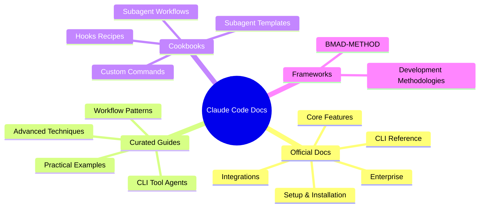
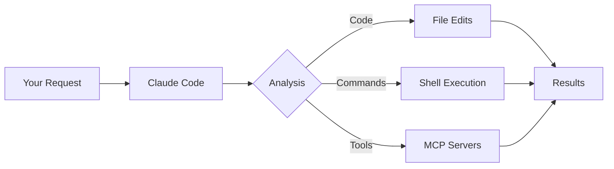

# Claude Code Documentation Hub

Welcome to the comprehensive documentation for Claude Code - Anthropic's agentic coding tool that lives in your terminal. This hub provides both official reference documentation and practical, experience-based guides.

## 🚀 Quick Start

### Installation Options

```bash
# macOS/Linux - Native installer (no Node.js required)
curl -fsSL https://claude.ai/code | sh

# Windows - PowerShell installer
iwr https://claude.ai/code.ps1 -UseBasicParsing | iex

# Homebrew (macOS/Linux)
brew install --cask claude-code

# NPM (requires Node.js)
npm install -g @anthropic-ai/claude-code
```

### Start Coding

```bash
cd your-project
claude
```

## 📚 Documentation Structure



## ✨ What's New (November 2025)

### Latest Updates (November 2025)
- 🧠 **Prompt-Based Hooks** - Intelligent hooks that use LLM evaluation instead of regex patterns for sophisticated decision-making
- 🔬 **Built-in Plan Subagent** - Automatic codebase research agent that activates in plan mode, analyzing project structure before execution
- 🔄 **Resumable Subagents** - Continue agent sessions across invocations with persistent context management
- 📦 **Native Installers** - Platform-specific curl/PowerShell scripts that install without requiring Node.js
- 🏢 **Enterprise Features** - Company announcements, enhanced sandbox controls, and MCP server allowlists for organizational deployment

### Previous Updates (October 2025)
- 🎯 **Skills System** - Plugins can now provide Agent Skills (5th component type) for automatic capability extension
- ⌨️ **New Keyboard Shortcuts** - Ctrl+O (verbose), Ctrl+V (paste image), @ (file autocomplete), ? (help)
- 🍺 **Homebrew Installation** - Install with `brew install --cask claude-code`
- 🧠 **Prompt Caching Control** - Fine-grained environment variables for caching configuration
- 🚀 **Haiku 4.5 Default** - Updated default models for Bedrock/Vertex AI
- 📝 **Skills vs Slash Commands** - Comprehensive guide on when to use each approach

### New Documentation
- 🔌 **Plugin System** - Extend Claude Code with custom commands, agents, skills, and MCP servers
- 💻 **IDE Integrations** - Native JetBrains and VS Code extensions with quick launch
- 🤖 **Headless Mode** - Run Claude Code programmatically without terminal UI
- 💾 **Session Checkpointing** - Save and restore conversation sessions
- 🔄 **Migration Guide** - Smooth upgrades between versions
- ⚙️ **Advanced Config** - Model and network configuration options
- 🚀 **GitLab CI/CD** - GitLab integration (complementing GitHub Actions)

### Community Guides
- 🌍 **Plugin Ecosystem Guide** - Complete guide to creating and using Claude Code plugins with Skills
- 🛠️ **Community Resources** - Comprehensive catalog of frameworks, tools, and IDE integrations
  - SuperClaude Framework (14 agents, 21 commands)
  - Spec Workflow for structured development
  - IDE integrations (Neovim, VS Code, Theia)
  - Web UIs, notification systems, and automation tools
- 🏭 **Skills Factory Generator** - Template-based system for bulk generation of production-ready skills with customizable complexity levels

## 🎯 Quick Navigation

### By Task

| What You Want to Do | Where to Look |
|---------------------|---------------|
| **Get Started** | [Quickstart](gen/quickstart.md) → [Setup](gen/setup.md) |
| **Learn Commands** | [CLI Reference](cli-reference.md) → [Slash Commands](gen/slash-commands.md) |
| **Build Features** | [Workflow Examples](workflow-examples.md) → [Common Workflows](gen/common-workflows.md) |
| **Use Subagents** | [Subagent Workflows Guide](subagent-workflows-guide.md) → [Subagent Templates](subagent-templates.md) → [Resumable Agents](gen/sub-agents.md#resumable-sessions) |
| **Connect Tools** | [MCP Integration](gen/mcp.md) → [MCP Servers Guide](../mcp/mcp-servers-guide.md) |
| **Extend with Plugins** | [Plugin System](gen/plugins.md) → [Plugin Ecosystem Guide](plugin-ecosystem-guide.md) → [Prompt-Based Hooks](gen/hooks.md#prompt-based) → [Skills](gen/skills.md) |
| **Generate Skills** | [Skills Factory Generator](skills-factory-generator.md) → [Skills Documentation](gen/skills.md) → [Best Practices](gen/skills.md#best-practices) |
| **IDE Integration** | [JetBrains](gen/jetbrains.md) → [VS Code](gen/vs-code.md) → [Dev Containers](gen/devcontainer.md) |
| **Community Tools** | [Community Resources](community-resources.md) → [SuperClaude Framework](community-resources.md#superclaude-framework) → [Spec Workflow](community-resources.md#claude-code-spec-workflow) |
| **Use AI Frameworks** | [BMAD-METHOD](frameworks/bmad-method.md) → [Structured Development Workflow](frameworks/bmad-method.md#workflow-phases) |
| **Build CLI Agents** | [Bash Apps Guide](bash-apps-cli-agents.md) → [CLI Tool Integration Patterns](bash-apps-cli-agents.md#templates) |
| **Customize Behavior** | [Output Styles Gallery](output-styles-gallery.md) → [Output Styles](gen/output-styles.md) → [Hooks Guide](gen/hooks-guide.md) |
| **Debug Issues** | [Troubleshooting](gen/troubleshooting.md) → [Performance Guide](performance-optimization.md) |
| **Enterprise Deployment** | [Enterprise Deployment Guide](gen/enterprise-deployment-guide.md) → [Security](gen/security.md) → [Amazon Bedrock](gen/amazon-bedrock.md) → [Google Vertex](gen/google-vertex-ai.md) |

### By Experience Level

#### 🌱 Beginners
1. [Overview](gen/overview.md) - Understand what Claude Code does
2. [Quickstart](gen/quickstart.md) - Get running in 5 minutes
3. [Interactive Mode](gen/interactive-mode.md) - Learn the REPL interface
4. [Common Workflows](gen/common-workflows.md) - Basic patterns

#### 🌿 Intermediate Users
1. [Claude Code Guide](claude-code-guide.md) - Comprehensive overview with diagrams
2. [Workflow Examples](workflow-examples.md) - Real-world scenarios
3. [Memory Management](gen/memory.md) - Configure CLAUDE.md files
4. [Subagents](gen/sub-agents.md) - Create specialized assistants

#### 🌳 Advanced Users
1. [Anthropic Best Practices](anthropic-best-practices.md) - Internal usage patterns from Anthropic's Applied AI team
2. [Plugin System](gen/plugins.md) - Extend Claude Code with custom plugins
3. [Skills Factory Generator](skills-factory-generator.md) - Generate production-ready skill libraries
4. [Hooks Cookbook](hooks-cookbook.md) - Automation patterns
5. [Custom Commands](custom-commands.md) - Build your command library
6. [BMAD-METHOD Framework](frameworks/bmad-method.md) - Structured AI agent workflows
7. [Headless Mode](gen/headless.md) - Run Claude Code without terminal UI
8. [Performance Optimization](performance-optimization.md) - Handle large codebases

## 📂 Complete File Index

### Core Documentation

#### Curated Guides (Experience-Based)
- [`claude-code-guide.md`](claude-code-guide.md) - Comprehensive overview with architecture, MCP, best practices
- [`anthropic-best-practices.md`](anthropic-best-practices.md) - Internal usage patterns and tips from Anthropic's Applied AI team
- [`cli-reference.md`](cli-reference.md) - Complete CLI commands, flags, and configurations
- [`workflow-examples.md`](workflow-examples.md) - Practical examples for real development scenarios

#### Cookbooks & Templates (New)
- [`subagent-workflows-guide.md`](subagent-workflows-guide.md) - Complete guide to practical subagent development workflows
- [`bash-apps-cli-agents.md`](bash-apps-cli-agents.md) - Build intelligent CLI tool agents with Click framework
- [`hooks-cookbook.md`](hooks-cookbook.md) - Advanced hook patterns and recipes
- [`custom-commands.md`](custom-commands.md) - Library of useful custom slash commands
- [`subagent-templates.md`](subagent-templates.md) - Pre-built subagent configurations
- [`skills-factory-generator.md`](skills-factory-generator.md) - Template-based system for generating production-ready skill libraries
- [`output-styles-gallery.md`](output-styles-gallery.md) - Collection of 15+ ready-to-use output styles with examples
- [`performance-optimization.md`](performance-optimization.md) - Best practices for large codebases

#### Ecosystem & Community
- [`plugin-ecosystem-guide.md`](plugin-ecosystem-guide.md) - Complete guide to Claude Code plugin system
- [`community-resources.md`](community-resources.md) - Catalog of frameworks, tools, and IDE integrations

#### Development Frameworks
- [`frameworks/bmad-method.md`](frameworks/bmad-method.md) - BMAD-METHOD integration for structured AI development workflows

### Official Documentation (gen/)

#### Getting Started
- [`overview.md`](gen/overview.md) - Product overview
- [`quickstart.md`](gen/quickstart.md) - Quick start guide
- [`setup.md`](gen/setup.md) - Installation and setup
- [`common-workflows.md`](gen/common-workflows.md) - Common usage patterns

#### Core Features
- [`interactive-mode.md`](gen/interactive-mode.md) - REPL interface
- [`slash-commands.md`](gen/slash-commands.md) - All slash commands
- [`sub-agents.md`](gen/sub-agents.md) - Subagent system
- [`output-styles.md`](gen/output-styles.md) - Output customization
- [`memory.md`](gen/memory.md) - Memory management

#### Configuration
- [`settings.md`](gen/settings.md) - Settings configuration
- [`hooks.md`](gen/hooks.md) - Hooks reference
- [`hooks-guide.md`](gen/hooks-guide.md) - Hooks tutorial
- [`terminal-config.md`](gen/terminal-config.md) - Terminal setup
- [`statusline.md`](gen/statusline.md) - Status line configuration
- [`model-config.md`](gen/model-config.md) - Model configuration
- [`network-config.md`](gen/network-config.md) - Network configuration
- [`migration-guide.md`](gen/migration-guide.md) - Version migration guide

#### Advanced Features
- [`mcp.md`](gen/mcp.md) - Model Context Protocol
- [`plugins.md`](gen/plugins.md) - Plugin system
- [`plugins-reference.md`](gen/plugins-reference.md) - Plugin technical specs
- [`plugin-marketplaces.md`](gen/plugin-marketplaces.md) - Plugin marketplaces
- [`headless.md`](gen/headless.md) - Headless mode
- [`checkpointing.md`](gen/checkpointing.md) - Session checkpointing
- [`github-actions.md`](gen/github-actions.md) - GitHub Actions integration
- [`gitlab-ci-cd.md`](gen/gitlab-ci-cd.md) - GitLab CI/CD integration

#### IDE Integrations
- [`jetbrains.md`](gen/jetbrains.md) - JetBrains IDEs (IntelliJ, PyCharm, WebStorm)
- [`vs-code.md`](gen/vs-code.md) - Visual Studio Code integration
- [`devcontainer.md`](gen/devcontainer.md) - Dev container support

#### Enterprise & Cloud
- [`amazon-bedrock.md`](gen/amazon-bedrock.md) - AWS Bedrock setup
- [`google-vertex-ai.md`](gen/google-vertex-ai.md) - Google Vertex setup
- [`llm-gateway.md`](gen/llm-gateway.md) - LLM gateway setup

#### Security & Compliance
- [`security.md`](gen/security.md) - Security best practices
- [`iam.md`](gen/iam.md) - Permissions and access
- [`data-usage.md`](gen/data-usage.md) - Data usage policies
- [`legal-and-compliance.md`](gen/legal-and-compliance.md) - Compliance info

#### Operations
- [`monitoring-usage.md`](gen/monitoring-usage.md) - Usage monitoring
- [`costs.md`](gen/costs.md) - Pricing and costs
- [`analytics.md`](gen/analytics.md) - Analytics
- [`troubleshooting.md`](gen/troubleshooting.md) - Troubleshooting guide

#### Reference
- [`cli-reference.md`](gen/cli-reference.md) - Official CLI reference
- [`third-party-integrations.md`](gen/third-party-integrations.md) - Third-party tools

## 🔄 Documentation Updates

This documentation is maintained through two approaches:

1. **Official Documentation** (gen/): Automatically fetched from Anthropic's documentation
   ```bash
   # Check for updates
   python ../scripts/fetch-docs.py --check
   
   # Fetch latest
   python ../scripts/fetch-docs.py --source claude-code
   ```

2. **Curated Guides**: Manually maintained based on real-world usage and community feedback

## 🎨 Visual Learning

Many guides include Mermaid diagrams for visual understanding:



## 💡 Pro Tips

### Most Useful Features
1. **Background Processes** (Ctrl+B): Run long commands without blocking
2. **Task Management** (`/todo`): Claude tracks complex multi-step tasks
3. **Memory Files** (CLAUDE.md): Persistent project instructions
4. **Plugin System**: Extend Claude Code with custom commands, agents, skills, and hooks
5. **Prompt-Based Hooks**: Create intelligent automation that uses LLM reasoning for complex decision-making
6. **Resumable Subagents**: Continue long-running research tasks across multiple sessions
7. **Skills**: Model-invoked capabilities that Claude autonomously uses based on context
8. **Custom Commands**: Create reusable prompts as slash commands
9. **MCP Servers**: Connect to 70+ external tools and services
10. **IDE Integration**: Native JetBrains and VS Code extensions

### Common Patterns
- Start broad with codebase questions, then narrow down
- Use subagents for specialized tasks to preserve context
- Configure hooks for automatic formatting and validation
- Use prompt-based hooks for intelligent, context-aware automation
- Leverage resumable subagents for multi-session research projects
- Create project-specific CLAUDE.md for team conventions
- Use the built-in plan subagent for automatic codebase exploration

## 🤝 Related Resources

### Official & Curated Guides
- [Plugin Ecosystem Guide](plugin-ecosystem-guide.md) - Claude Code plugin system
- [Community Resources](community-resources.md) - Frameworks, tools, and integrations
- [MCP Servers Guide](../mcp/mcp-servers-guide.md) - Connect external tools
- [Sequential Thinking Guide](../mcp/sequential-thinking-guide.md) - Advanced problem-solving
- [BMAD-METHOD Framework](frameworks/bmad-method.md) - Structured AI agent development workflows
- [Chrome Extensions](../chrome-extensions/) - Browser productivity tools

### Community Frameworks
- [SuperClaude Framework](community-resources.md#superclaude-framework) - 14 agents, 21 commands, 6 modes
- [Claude Code Spec Workflow](community-resources.md#claude-code-spec-workflow) - Spec-driven development
- [Subagents Collection](community-resources.md#claude-code-subagents-collection) - Specialized AI agents

## 📊 Documentation Coverage

| Category | Official Docs | Curated Guides | Cookbooks |
|----------|--------------|----------------|-----------|
| Setup & Installation | ✅ Complete | ✅ Enhanced | - |
| Core Features | ✅ Complete | ✅ Practical Examples | ✅ Patterns |
| Advanced Features | ✅ Reference | ✅ Updated | ✅ Templates |
| Enterprise | ✅ Complete | ✅ In Progress | - |
| Troubleshooting | ✅ Basic | ⚡ In Progress | - |

## 🚧 Coming Soon

- Enterprise Patterns Guide
- Troubleshooting Companion
- Team Collaboration Workflows

---

*Last Updated: November 2025 | Documentation Version: 1.2 | 45+ Official Docs*
