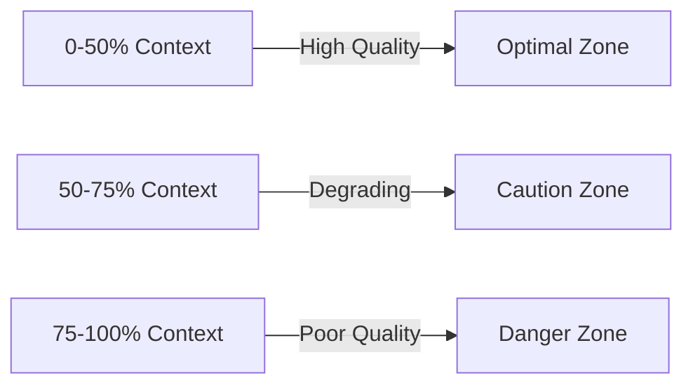
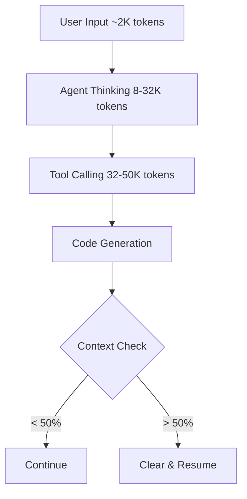
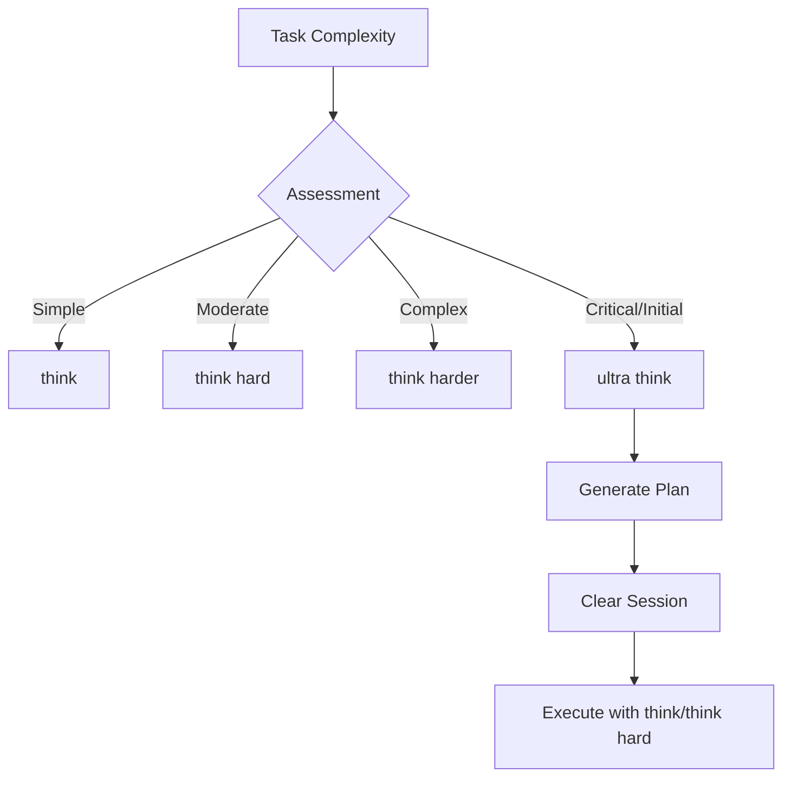
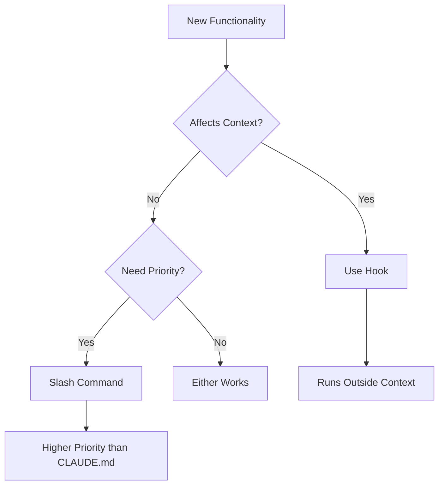
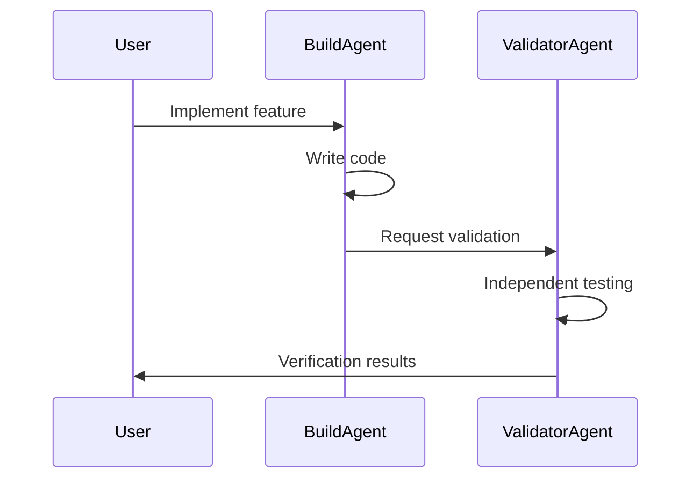
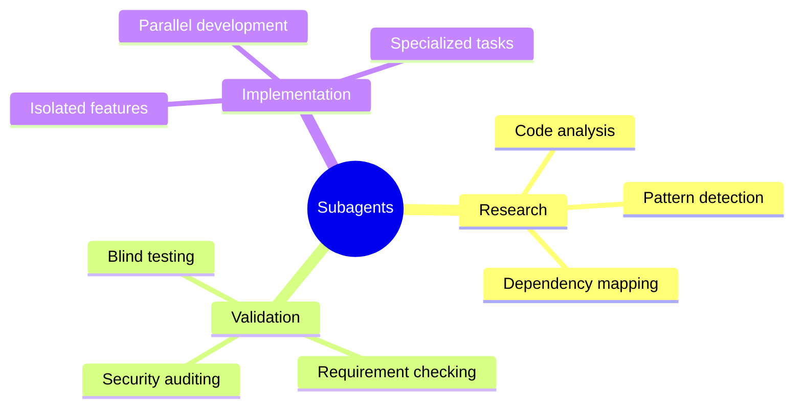
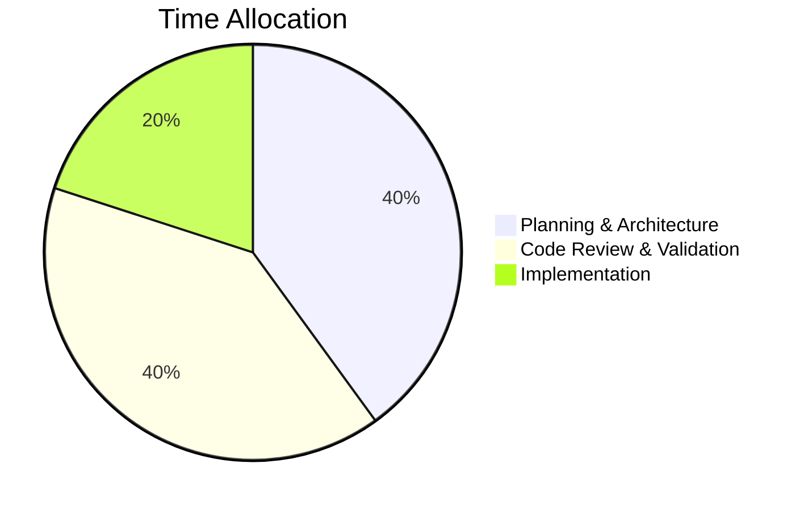

# Advanced Claude Code Techniques

> Expert-level patterns and workflows from power users Ray Fernando and Eric Buess

## Table of Contents
- [Initial Setup Optimizations](#initial-setup-optimizations)
- [Context Management Strategies](#context-management-strategies)
- [Thinking Modes Optimization](#thinking-modes-optimization)
- [Hooks vs Slash Commands](#hooks-vs-slash-commands)
- [Project Indexing System](#project-indexing-system)
- [Validation and Testing Patterns](#validation-and-testing-patterns)
- [Subagent Orchestration](#subagent-orchestration)
- [Workflow Optimization Tips](#workflow-optimization-tips)
- [BMAD-METHOD Advanced Features](#bmad-method-advanced-features)

## Initial Setup Optimizations

### Quick Access Alias
Create a single-letter alias for instant Claude Code access:

```bash
# Add to ~/.zshrc or ~/.bashrc
alias c='claude --dangerously-skip-permissions'
```

This enables rapid project switching: just type `c` in any directory to start Claude Code.

### Keyboard Text Replacements
Set up system-level text replacements for common commands:
- `u` → `ultra think`  
- `w` → `what happened ultra think and make a plan before coding`

### Claude Code Docs Local Installation
Install local documentation for faster access and offline reference:

```bash
# One-line installer for Claude Code Docs
git clone https://github.com/yourusername/claude-code-docs.git ~/.claude-code-docs
```

Benefits:
- Eliminates web fetch latency
- Provides offline access to documentation
- Auto-updates every 3 hours via GitHub Actions
- Use `/docs <question>` for instant documentation queries

### The "YOLO Mode" Flag
The `--dangerously-skip-permissions` flag bypasses permission prompts for experienced users:

```bash
claude --dangerously-skip-permissions
```

**Trade-offs:**
- ✅ No interruptions for file operations
- ✅ Faster workflow for trusted environments
- ⚠️ Claude has full system access
- ⚠️ Best used in VMs or sandboxed environments

**Safer Alternative:** Set up a dedicated VM with snapshots for experimental work.

## Context Management Strategies

### The 50% Rule
Research shows effective context window usage degrades after 50% capacity:



### Context Preservation Pattern
When approaching context limits:

1. **Document Current State**
   ```bash
   # Claude updates project documentation
   "Update CLAUDE.md with current implementation state and next steps"
   ```

2. **Clear Session**
   ```bash
   /clear
   ```

3. **Resume with Context**
   ```bash
   # Fresh start with preserved context
   "Read CLAUDE.md and continue from documented state"
   ```

### Token Usage Visualization



## Thinking Modes Optimization

### Token Consumption by Mode

| Mode | Tokens | Use Case |
|------|--------|----------|
| `think` | ~4,000 | Simple tasks, quick decisions |
| `think hard` | ~8,000 | Moderate complexity problems |
| `think harder` | ~16,000 | Complex architectural decisions |
| `ultra think` | ~32,000 | Critical problems, initial planning |

### Strategic Mode Selection



### Best Practices
1. **Start with Ultra Think** for initial planning and architecture
2. **Drop to think/think hard** for implementation
3. **Clear between major phases** to prevent context pollution
4. **Avoid ultra think** for repetitive tasks

## Hooks vs Slash Commands

### Decision Framework



### Hooks
**When to Use:**
- Background operations (file indexing, monitoring)
- Pre/post processing without context pollution
- Automated workflows that shouldn't affect main conversation

**Example: Project Indexer Hook**
```json
{
  "hooks": {
    "pre-edit": {
      "command": "update-project-index.sh",
      "description": "Updates project index before edits"
    }
  }
}
```

### Slash Commands
**When to Use:**
- User-initiated actions
- Need to override system instructions
- Want explicit control over timing

**Example: Documentation Query**
```bash
/docs how do subagents handle context sharing
/cleanup update docs and plan next phase
/fresh read all docs and project index
```

## Project Indexing System

### The Minified Codebase Pattern
Maintain a condensed view of your entire project:

```json
{
  "src/auth/login.ts": {
    "imports": ["react", "@/lib/api"],
    "exports": ["LoginForm", "useAuth"],
    "methods": ["handleLogin", "validateCredentials"],
    "dependencies": ["src/lib/api.ts", "src/hooks/useUser.ts"]
  }
}
```

### Implementation

1. **Create Index Generator**
```bash
# Generates PROJECT_INDEX.json with minified code structure
claude "Create a hook that generates a minified index of all project files"
```

2. **Install Hook**
```bash
# Auto-updates on file changes
claude "Set up pre-edit hook to update project index"
```

3. **Use in Workflows**
```bash
/fresh  # Reads entire project index
claude "Using PROJECT_INDEX.json, identify all authentication touchpoints"
```

## Validation and Testing Patterns

### Blind Validation Pattern
Never trust self-validation. Always use a separate agent:



### Implementation
```bash
# Step 1: Builder agent implements
claude "Implement user authentication with the following requirements..."

# Step 2: Spawn blind validator
claude "Spawn a subagent to blindly validate the authentication implementation against requirements.md"

# Step 3: Validator checks without implementation knowledge
# Returns: pass/fail with specific issues
```

### Test-Driven Development Flow
```bash
# 1. Define tests first
claude "Write comprehensive tests for the shopping cart feature"

# 2. Implement to pass tests
claude "Implement shopping cart to pass all tests"

# 3. Validate independently
claude "Spawn validator agent to verify all tests pass"
```

## Subagent Orchestration

### Use Cases by Type



### Orchestration Patterns

#### Parallel Research Pattern
```bash
claude "Create 3 parallel subagents to research:
1. Current authentication patterns in codebase
2. Best practices for JWT implementation  
3. Security vulnerabilities to avoid"
```

#### Sequential Validation Pattern
```bash
claude "Create validation pipeline:
1. Subagent 1: Check code functionality
2. Subagent 2: Verify security compliance
3. Subagent 3: Validate performance metrics"
```

### Context Isolation Strategy
Each subagent gets fresh 200K context:
- Main agent maintains high-level orchestration
- Subagents handle specific deep-dives
- Results returned as summaries to preserve main context

## Workflow Optimization Tips

### The 80/20 Rule
Spend 80% time planning, 20% implementing:



### Rapid Iteration Pattern
```bash
# 1. Quick prototype
claude think "Build minimal MVP of feature"

# 2. Identify issues  
claude "Review implementation and list all problems"

# 3. Fresh start with lessons learned
/clear
claude ultra think "Redesign feature avoiding these issues: [problems]"
```

### Common Pitfalls to Avoid

1. **Context Pollution**
   - Too many unrelated tasks in one session
   - Not clearing between major phase changes
   - Accumulating unnecessary tool outputs

2. **Over-Trusting Completions**
   - Always verify "done" claims with tests
   - Use blind validation for critical features
   - Require concrete evidence of completion

3. **Thinking Mode Overuse**
   - Don't use ultra think for simple tasks
   - Clear after heavy thinking sessions
   - Match mode to task complexity

### Performance Optimization Checklist

- [ ] Local docs installed for faster queries
- [ ] Aliases configured for quick access  
- [ ] Project indexing hook active
- [ ] Validation subagents defined
- [ ] Context monitoring in place
- [ ] Clear strategy documented
- [ ] Test-first approach adopted

## Expert Tips Summary

### Ray Fernando's Key Insights
- Protect context window "like your firstborn child"
- 60-70% time on planning and review
- Subagents as code reviewers
- Fresh sessions for better architecture

### Eric Buess's Key Patterns
- Hooks for context-free operations
- Project indexing for large codebases
- Blind validation requirement
- Composability as core strength

## BMAD-METHOD Advanced Features

For structured agent-driven development with advanced creative techniques, see the [BMAD-METHOD documentation](frameworks/bmad-method.md) which includes:

### Brainstorming System (Mary the Analyst)
- **20+ brainstorming techniques** including Six Thinking Hats, Five W's, Role-Playing
- **Creative modes**: Random Creative Chaos, Progressive Creative Journey
- Can be used for ANY problem-solving, not just coding
- Generates comprehensive brainstorming documents

### Advanced Elicitation Methods
- **20+ techniques** for pushing LLM quality including:
  - Hindsight is 20/20 (future retrospective)
  - Tree of Thought (multiple reasoning paths)
  - REwOO (Reasoning without Observation)
  - Red Team vs Blue Team (adversarial testing)
- Applied at each section of document creation

### Special Features
- **Course Correction** (`/bmad-sm correct course`) - Handle mid-project pivots
- **PO Checklist** (`/bmad-po run checklist`) - Pre-development validation
- **Document Sharding** - Efficient context management with md-tree
- **Agent Personas** - Mary (Analyst), James (Developer), Quinn (QA)

### Core Philosophy
"The BMAD method is all about elevating yourself, learning, and also elevating the LLM. As a whole, you are both better collectively than each one on its own." - Brian (Creator)

See the complete [BMAD workflow example](frameworks/bmad-method.md#example-2-complete-workflow-from-video-tutorial) for a step-by-step walkthrough.

## Conclusion

Advanced Claude Code usage is about:
1. **Strategic context management** - Know when to clear and preserve
2. **Appropriate thinking modes** - Match complexity to token usage
3. **Systematic validation** - Never trust, always verify
4. **Smart orchestration** - Use subagents for isolation and parallelism
5. **Continuous optimization** - Every failure is a learning opportunity
6. **Structured workflows** - Consider BMAD-METHOD for complex projects

Remember: "The capability is literally almost infinite... in many directions." - Ray Fernando