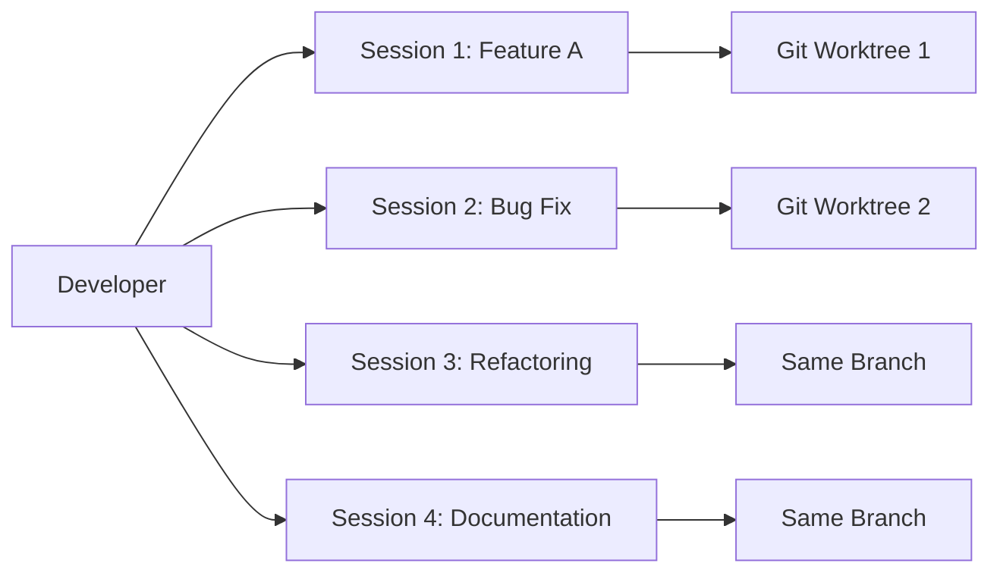

# Claude Code Best Practices from Anthropic Team

This document captures practical insights, tips, and internal usage patterns shared by Prithvi and Chris from Anthropic's Applied AI team during their presentation to Rippling engineers.

## Table of Contents

- [Core Philosophy](#core-philosophy)
- [Multi-Agent Workflows](#multi-agent-workflows)
- [Context & Memory Management](#context--memory-management)
- [Permissions & Security](#permissions--security)
- [Performance Optimization](#performance-optimization)
- [Integration Patterns](#integration-patterns)
- [Internal Anthropic Practices](#internal-anthropic-practices)
- [Practical Tips & Tricks](#practical-tips--tricks)

## Core Philosophy

### Claude Code as Bare Metal Interface

According to Prithvi, Claude Code is designed as "the most bare metal interface over our state of the art coding models" with key principles:

- **Infinite composability** through Unix-style approach
- **Models are getting more agentic** - designed to harness emerging capabilities
- **Tools in a loop** paradigm - LLMs with access to tools acting autonomously
- **Flexible harness** that can adapt as models improve

### SDK as General-Purpose Agent Framework

The Claude Code SDK is increasingly being used beyond coding:
- Building agent-powered applications
- CICD pipeline automation
- Observability and monitoring in production
- General-purpose agent SDK for any automation task

## Multi-Agent Workflows

### Standard Practice at Anthropic

**Key Insight**: Engineers at Anthropic typically run **2-4 Claude Code sessions simultaneously** as standard practice.



### Git Worktrees Pattern

For maximum parallelization without conflicts:

```bash
# Create worktree for parallel development
git worktree add ../feature-branch feature-branch
cd ../feature-branch
claude  # Start first session

# In another terminal
git worktree add ../bugfix-branch bugfix-branch
cd ../bugfix-branch
claude  # Start second session
```

### Context Switching Management

Prithvi's personal techniques:
1. **Sticky Notes**: Mac sticky notes to track what each session is doing
2. **Session Labeling**: Tell Claude "You are session 1 working on X"
3. **Query Sessions**: Ask Claude "Which session was this?" when context switching

### Plan Mode for Long-Running Tasks

Use Plan Mode for autonomous work periods:
- Set up 10-15 minute autonomous tasks
- Switch between sessions while agents work
- "Managing a fleet of agents" rather than being single-threaded

## Context & Memory Management

### Claude.md Hierarchy at Anthropic

Anthropic's monorepo uses layered Claude.md files:

```
monorepo/
├── claude.md                    # Org-wide instructions, CLI tools
├── product/
│   └── claude.md                # Product team context
├── research/
│   └── claude.md                # Research team context
└── frontend/
    └── claude.md                # Frontend-specific instructions
```

**Recursive Loading**: Claude loads from current directory up, building layered context.

### User-Level Instructions Template

Prithvi's personal template for user-level Claude.md:

```markdown
# User Instructions

## Role
You are an expert software engineer working at [Company].

## Task Description
[General purpose tasks across repositories]

## Context
- Primary languages: [List]
- My role: [Description]
- Tools we use: [List]

## Thinking Process
[How to approach problems - maps to personal style]
```

### Dynamic Context Building Pattern

First-time codebase exploration workflow:
1. Use Claude to explore and build understanding
2. Have Claude explain codebase to developer
3. **Have Claude write its findings to claude.md**
4. Context persists for future sessions

### Import Pattern for Related Files

```markdown
# claude.md

When starting work, always read:
@README.md
@docs/architecture.md
@config/environment.ts
```

## Permissions & Security

### Hierarchical Permission System

```json
// User-level permissions (~/.claude/permissions.json)
{
  "allowed": ["npm test", "npm build"],
  "denied": ["rm -rf"]
}

// Repo-level permissions (.claude/permissions.json)
{
  "allowed": ["git commit", "git push"],
  "denied": ["npm publish"]
}
```

### Autonomous Mode Best Practices

- **Default**: Ask permission for everything
- **Auto-accept edits** (Shift+Tab once): Still asks for complex/dangerous operations
- **Plan mode** (Shift+Tab twice): Read-only planning operation
- **Always denied**: RM commands, even in auto-accept mode

## Performance Optimization

### Token Burndown Insights

From Tim at Rippling's question:
- **Opus 4** tends to use more tokens than Sonnet
- Consider model choice based on task complexity and token budget
- Monitor usage with `/cost` command for detailed breakdowns

### Right-Sizing Task Chunks

Prithvi's calibration approach:
- Don't break down too granular (you could do it yourself)
- Don't make chunks too large (errors cascade)
- Find the "right fidelity" - typically 3-5 step chunks
- Avoid 10+ step autonomous runs

### Version Pinning for Libraries

Chris's tip for handling training cutoff:
```markdown
# claude.md

## Library Versions
- Use Anthropic Go SDK v2.0.0 (latest)
- Documentation: [link to latest docs]
- Do not use default v1.x from training data
```

## Integration Patterns

### MCP Server Usage at Anthropic

Popular MCP servers internally:
- **Puppeteer/Playwright**: Frontend testing automation
- **GitHub**: PR reviews and GitHub Actions
- **SQL-based**: Database access (PostgreSQL, BigQuery)
- **Figma**: Design file integration

### BigQuery CLI Integration

Example of CLI tool integration:
```bash
# Claude can run BigQuery commands directly
claude "Run a BigQuery query to analyze user engagement data"
# Claude executes: bq query --use_legacy_sql=false 'SELECT ...'
```

### TDD Loop Pattern

Test-driven development workflow:
1. Claude runs test suite
2. Analyzes failures
3. Reads relevant code
4. Fixes issues
5. Re-runs tests
6. Loops until all pass

## Internal Anthropic Practices

### Universal Cloud.md Usage

- "Liberal use" of cloud.md files throughout monorepo
- Team-specific instructions maintained by respective teams
- Discovered legacy CLI tools documented in cloud.md by other engineers

### AI-First Philosophy

- Default to using AI for everything possible
- PR reviews done by default (not on request)
- Quick feedback loops to improve AI performance
- "Wherever we see an opportunity to include AI, we'll try"

### Model Usage

- Anthropic exclusively uses their own models internally
- Heavy use of Claude Code over other IDE tools
- Increasing migration from Cursor to Claude Code
- Confidence in maintaining the lead in coding capabilities

### Continuous Improvement Loop

When AI doesn't perform well:
1. Use it anyway (by default)
2. Gather valuable signal from failures
3. Quickly tune and iterate
4. "Hill climb" to optimal performance

## Practical Tips & Tricks

### Keyboard Shortcuts

Essential bindings for efficiency:
- `Shift+Tab`: Toggle auto-accept/plan mode
- `#`: Quick memory creation
- `!`: Direct bash command execution
- `@`: File tagging for context
- `Esc/Ctrl+C`: Verbose output control
- `/`: Access slash commands

### Custom Slash Commands

Create project-specific commands:
```json
// .claude/commands/optimize.json
{
  "name": "optimize",
  "prompt": "Analyze this code for performance issues and suggest optimizations"
}
```

### Screenshot-Based Development

Visual iteration workflow:
1. Claude writes code
2. Takes screenshot of result
3. Iterates based on visual feedback
4. Particularly powerful with Playwright MCP

### Context Compaction Strategy

For long sessions:
```bash
# Manual compaction with instructions
/compact "Ignore topic A, focus only on current feature"

# Monitor context usage
claude "What percentage of context have we used?"
```

### Multiple Configuration Files

Chain MCP configurations:
```bash
claude --mcp-config base.json project.json team.json
```

### Session Management

Resume previous conversations:
```bash
# List and resume past sessions
/resume
# Select from menu of previous conversations
```

## Key Takeaways

### Top 5 Insights for Power Users

1. **Run Multiple Sessions**: 2-4 parallel Claude sessions is standard at Anthropic
2. **Layer Your Context**: Use hierarchical claude.md files for complex projects
3. **Plan Then Execute**: Heavy planning with `ultra think`, light implementation
4. **Chunk Strategically**: Find the right task granularity (3-5 steps typically)
5. **Build Shared Understanding**: Have Claude document its learning in claude.md

### Common Pitfalls to Avoid

- ❌ Running single session (underutilizing capacity)
- ❌ 10+ step autonomous runs (errors cascade)
- ❌ Not using Git worktrees for parallel work
- ❌ Forgetting to version-pin libraries in claude.md
- ❌ Breaking tasks down too granularly

### Future Direction

Based on Anthropic's vision:
- Models will become increasingly agentic
- Cloud Code will continue to "hill climb" on capabilities
- SDK will expand as general-purpose agent framework
- Deeper integration across entire software lifecycle

---

*This document synthesizes insights from the Anthropic team presentation. For official documentation, see [docs.anthropic.com](https://docs.anthropic.com/en/docs/claude-code).*