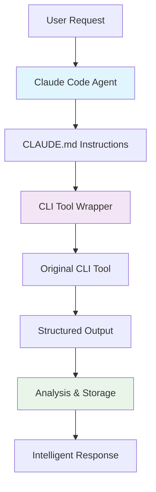
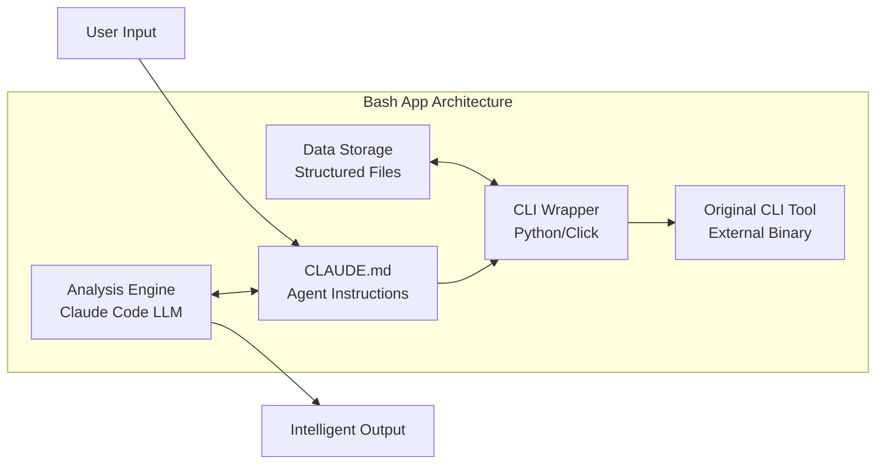
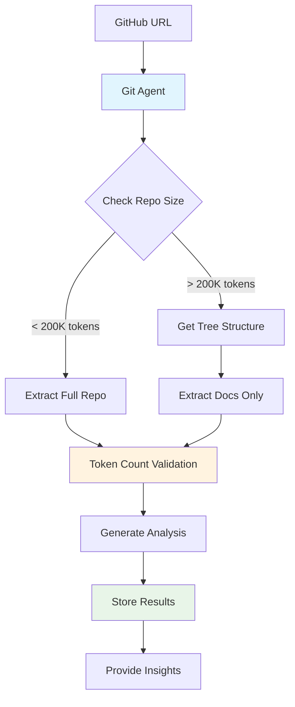

# Building Bash Apps: CLI Tool Agents with Claude Code

> Transform any command-line tool into an intelligent AI agent that integrates seamlessly with your Claude Code workflow

## Table of Contents

- [Introduction to Bash Apps](#introduction-to-bash-apps)
- [Why Bash Apps Are Revolutionary](#why-bash-apps-are-revolutionary)
- [Core Architecture](#core-architecture)
- [Quick Start: Building Your First Bash App](#quick-start-building-your-first-bash-app)
- [Case Study: Git Agent](#case-study-git-agent)
- [Technical Implementation Guide](#technical-implementation-guide)
- [Bash App Templates](#bash-app-templates)
- [Best Practices](#best-practices)
- [Troubleshooting](#troubleshooting)
- [Advanced Patterns](#advanced-patterns)

## Introduction to Bash Apps

**Bash Apps** represent a new paradigm for using Claude Code: instead of manually running terminal commands, you create dedicated AI agents that intelligently control CLI tools through Claude Code's bash tool integration.



### Key Concepts

- **CLI Tool Wrapping**: Take existing command-line tools and create intelligent wrappers
- **Agent Behavior**: Claude Code becomes a specialized agent for that specific tool
- **Workflow Integration**: Tools become part of your development workflow, not separate utilities
- **Intelligent Processing**: Add logic, validation, and analysis on top of raw CLI output

## Why Bash Apps Are Revolutionary

### Traditional Workflow vs. Bash Apps

**Traditional Approach:**
```bash
# Manual process - error-prone and repetitive
git-ingest https://github.com/user/repo
# Check output size manually
wc -w output.txt
# If too large, manually extract parts
# Copy/paste into Claude Desktop
# Lose context when switching tools
```

**Bash App Approach:**
```bash
# Intelligent agent handles everything
claude "Analyze this repository: https://github.com/user/repo"
# Agent automatically:
# - Checks repo size
# - Extracts appropriate content
# - Analyzes with full context
# - Stores structured results
# - Provides intelligent insights
```

### Benefits

1. **Workflow Integration**: Tools become part of your development process
2. **Intelligence Layer**: Add validation, analysis, and decision-making
3. **Context Preservation**: All processing happens within Claude Code's context
4. **Automation**: Eliminate repetitive manual steps
5. **Structured Storage**: Organize results for future reference

## Core Architecture

A Bash App consists of three main components:



### Component Breakdown

1. **CLAUDE.md**: Contains instructions for how Claude Code should behave when using the tool
2. **CLI Wrapper**: Python script (using Click framework) that combines original tool with custom logic
3. **Storage System**: Organized folders for data, analysis, and results
4. **Intelligence Layer**: Claude Code's LLM processes and analyzes all interactions

## Quick Start: Building Your First Bash App

### Step 1: Choose Your CLI Tool

Start with a tool you use regularly. Examples:
- **File converters** (pandoc, ffmpeg)
- **Download tools** (youtube-dl, aria2, gallery-dl)
- **Analysis tools** (grep, jq, curl)
- **Development tools** (git-ingest, tree, cloc)

### Step 2: Create the Project Structure

```bash
mkdir my-bash-app
cd my-bash-app
touch CLAUDE.md
touch cli.py
mkdir data
mkdir analysis
```

### Step 3: Write the PRD (Product Requirements Document)

Create a detailed description of what you want:

```markdown
# My Tool Agent PRD

## Objective
Create an intelligent agent that wraps [TOOL NAME] with smart preprocessing, validation, and analysis.

## Workflow
1. User provides input
2. Agent validates input and parameters
3. Execute original tool with optimized settings
4. Process and analyze output
5. Store results in structured format
6. Provide intelligent summary and insights

## Features
- Automatic input validation
- Smart parameter selection
- Output organization
- Error handling and recovery
- Progress tracking
```

### Step 4: Let Claude Code Build It

```bash
claude "Read this PRD and build a complete bash app using Click framework"
```

Claude Code will:
- Create the CLI wrapper with Click
- Implement the workflow logic
- Set up proper error handling
- Create the CLAUDE.md instructions

## Case Study: Git Agent

The Git Agent demonstrates the full power of bash apps by intelligently processing GitHub repositories for analysis.

### Problem Statement

Manual repository analysis workflow:
1. Convert repo to LLM-readable format using git-ingest
2. Check token count manually
3. If too large, manually extract documentation
4. Copy to Claude Desktop
5. Lose context when switching tools
6. Repeat for each repository

### Solution Architecture



### Implementation Details

**File Structure:**
```
git-agent/
├── CLAUDE.md              # Agent instructions
├── cli.py                 # Click-based wrapper
├── data/                  # Raw repository extractions
│   └── repo-name/
│       ├── full-extract.md
│       └── metadata.json
└── analysis/              # Structured analysis
    └── repo-name/
        ├── installation-guide.md
        ├── workflow-analysis.md
        └── architecture-overview.md
```

**Core CLI Commands:**

```python
import click
from git_ingest import process_repository

@click.group()
def git_agent():
    """Intelligent Git repository analysis agent"""
    pass

@git_agent.command()
@click.argument('url')
@click.option('--max-tokens', default=200000)
def analyze(url, max_tokens):
    """Analyze a GitHub repository with intelligent processing"""
    # Extract repo info
    repo_info = extract_repo_info(url)
    
    # Check size first
    size = check_repo_size(url)
    
    if size > max_tokens:
        # Get tree structure and extract docs only
        tree = get_repo_tree(url)
        content = extract_documentation(url, tree)
    else:
        # Extract full repository
        content = extract_full_repo(url)
    
    # Store raw data
    store_extraction(repo_info, content)
    
    # Generate analysis templates
    generate_analysis_templates(repo_info)
    
    click.echo(f"Repository {repo_info['name']} processed successfully")

@git_agent.command()
@click.argument('repo_name')
@click.argument('analysis_type')
def create_analysis(repo_name, analysis_type):
    """Create specific analysis for a processed repository"""
    # Load repository data
    data = load_repo_data(repo_name)
    
    # Generate analysis based on type
    analysis = generate_analysis(data, analysis_type)
    
    # Store structured analysis
    save_analysis(repo_name, analysis_type, analysis)
```

**CLAUDE.md Instructions:**

```markdown
# Git Agent Instructions

You are a specialized agent for analyzing GitHub repositories using the git-agent CLI tool.

## Workflow

When given a GitHub URL:

1. **Always start with size check**: Run `git-agent analyze <url>` 
2. **Process based on size**:
   - If under 200K tokens: Full repository analysis
   - If over 200K tokens: Documentation-focused analysis
3. **Offer analysis options**: Installation, workflow, architecture, etc.
4. **Store results**: Use structured storage for future reference

## Commands

- `git-agent analyze <url>`: Process and analyze repository
- `git-agent create-analysis <repo> <type>`: Generate specific analysis
- `git-agent list`: Show processed repositories
- `git-agent tree <repo>`: Show repository structure

## Analysis Types

- `installation`: Step-by-step setup guide
- `workflow`: Usage patterns and examples  
- `architecture`: System design and structure
- `api`: API documentation and endpoints
- `testing`: Test setup and patterns

## Storage Structure

Results are stored in:
- `data/<repo>/`: Raw extracted content
- `analysis/<repo>/`: Structured analysis files

Always check existing data before re-processing repositories.
```

### Usage Examples

```bash
# Basic repository analysis
claude "Analyze this repository: https://github.com/anthropics/claude-code"

# Claude Code automatically:
# 1. Runs git-agent analyze https://github.com/anthropics/claude-code
# 2. Checks size (likely > 200K tokens)
# 3. Extracts tree structure
# 4. Gets documentation files
# 5. Offers analysis options

# Request specific analysis
claude "Create installation guide for the claude-code repository"

# Claude Code runs:
# git-agent create-analysis claude-code installation
```

## Technical Implementation Guide

### Using the Click Framework

Click is the recommended framework for building CLI wrappers because:
- Easy command grouping
- Built-in parameter validation
- Help text generation
- Option parsing

**Basic Click Structure:**

```python
import click

@click.group()
def my_agent():
    """My custom CLI agent"""
    pass

@click.command()
@click.argument('input_file')
@click.option('--output', '-o', help='Output file')
@click.option('--format', default='json', help='Output format')
def process(input_file, output, format):
    """Process input file with custom logic"""
    # Add validation
    if not os.path.exists(input_file):
        click.echo(f"Error: {input_file} not found", err=True)
        return
    
    # Call original tool
    result = call_original_tool(input_file, format)
    
    # Add custom processing
    processed = add_intelligence(result)
    
    # Save with organization
    save_results(processed, output)

# Add command to group
my_agent.add_command(process)

if __name__ == '__main__':
    my_agent()
```

### Integration Patterns

**Pattern 1: Tool Enhancement**
```python
# Enhance existing tool with validation and smart defaults
@click.command()
@click.argument('url')
def smart_download(url):
    # Validate URL
    if not is_valid_url(url):
        click.echo("Invalid URL format")
        return
    
    # Detect optimal settings
    settings = detect_optimal_settings(url)
    
    # Call original tool with smart settings
    original_tool(url, **settings)
    
    # Post-process results
    organize_downloads()
```

**Pattern 2: Workflow Automation**
```python
# Automate multi-step workflows
@click.command()
@click.argument('project_path')
def analyze_project(project_path):
    # Step 1: Scan project structure
    structure = scan_project(project_path)
    
    # Step 2: Run multiple analysis tools
    results = []
    for tool in analysis_tools:
        result = tool.analyze(project_path)
        results.append(result)
    
    # Step 3: Combine and analyze results
    combined = combine_analysis(results)
    
    # Step 4: Generate report
    generate_report(combined)
```

### Data Organization Patterns

**Structured Storage:**
```
bash-app/
├── data/           # Raw tool outputs
│   ├── input-1/
│   └── input-2/
├── analysis/       # Processed analysis
│   ├── reports/
│   └── summaries/
├── cache/          # Temporary files
└── config/         # Tool settings
```

**Metadata Tracking:**
```json
{
  "timestamp": "2024-01-15T10:30:00Z",
  "input": "https://github.com/user/repo",
  "tool_version": "1.2.3",
  "parameters": {
    "max_tokens": 200000,
    "include_docs": true
  },
  "output_size": 150000,
  "processing_time": 45.2,
  "status": "completed"
}
```

## Bash App Templates

### Template 1: File Processor

For tools that process files (converters, analyzers, etc.):

```python
import click
import os
from pathlib import Path

@click.group()
def file_processor():
    """Intelligent file processing agent"""
    pass

@click.command()
@click.argument('input_file')
@click.option('--output-dir', default='./processed')
@click.option('--format', default='auto')
def process(input_file, output_dir, format):
    """Process file with intelligent format detection"""
    
    # Validation
    if not Path(input_file).exists():
        click.echo(f"Error: {input_file} not found", err=True)
        return
    
    # Auto-detect format if needed
    if format == 'auto':
        format = detect_format(input_file)
        click.echo(f"Detected format: {format}")
    
    # Create output directory
    Path(output_dir).mkdir(exist_ok=True)
    
    # Process with original tool
    result = original_tool_process(input_file, format)
    
    # Save with metadata
    output_file = Path(output_dir) / f"{Path(input_file).stem}_processed.{format}"
    save_with_metadata(result, output_file, {
        'original': input_file,
        'format': format,
        'timestamp': datetime.now().isoformat()
    })
    
    click.echo(f"Processed: {output_file}")

file_processor.add_command(process)
```

**CLAUDE.md for File Processor:**
```markdown
# File Processor Agent

You are a specialized agent for processing files using the file-processor CLI tool.

## Commands
- `file-processor process <file>`: Process file with intelligent format detection
- `file-processor batch <directory>`: Process all files in directory
- `file-processor status`: Show processing queue status

## Workflow
1. Always validate file existence before processing
2. Use auto-format detection unless user specifies format
3. Organize outputs in structured directories
4. Provide progress updates for large files
5. Offer to batch process multiple files when appropriate

## Error Handling
- Check file permissions before processing
- Validate file formats are supported
- Provide helpful error messages with suggested fixes
```

### Template 2: Web/API Tool

For tools that interact with web services or APIs:

```python
import click
import requests
from urllib.parse import urlparse

@click.group()
def web_agent():
    """Intelligent web service agent"""
    pass

@click.command()
@click.argument('url')
@click.option('--output-format', default='json')
@click.option('--cache', is_flag=True, help='Cache results')
def fetch(url, output_format, cache):
    """Fetch and process web content intelligently"""
    
    # Validate URL
    parsed = urlparse(url)
    if not parsed.scheme or not parsed.netloc:
        click.echo("Error: Invalid URL format", err=True)
        return
    
    # Check cache if enabled
    if cache:
        cached = check_cache(url)
        if cached:
            click.echo("Using cached result")
            return cached
    
    # Fetch with error handling
    try:
        response = requests.get(url, timeout=30)
        response.raise_for_status()
    except requests.RequestException as e:
        click.echo(f"Error fetching {url}: {e}", err=True)
        return
    
    # Process with original tool
    processed = original_web_tool(response.content, output_format)
    
    # Cache if requested
    if cache:
        save_to_cache(url, processed)
    
    # Save results
    save_web_results(url, processed)
    
    click.echo(f"Fetched and processed: {url}")

web_agent.add_command(fetch)
```

### Template 3: Analysis Tool

For tools that analyze codebases, documents, or data:

```python
import click
from pathlib import Path
import json

@click.group()
def analyzer():
    """Intelligent analysis agent"""
    pass

@click.command()
@click.argument('target')
@click.option('--depth', default='normal', type=click.Choice(['shallow', 'normal', 'deep']))
@click.option('--report-format', default='markdown')
def analyze(target, depth, report_format):
    """Analyze target with configurable depth"""
    
    target_path = Path(target)
    
    # Determine analysis scope based on target type
    if target_path.is_file():
        scope = 'file'
    elif target_path.is_dir():
        scope = 'directory'
    else:
        click.echo(f"Error: {target} not found", err=True)
        return
    
    # Configure analysis based on depth
    config = get_analysis_config(depth, scope)
    
    # Run analysis with original tool
    results = original_analysis_tool(target, config)
    
    # Enhance with intelligent insights
    insights = generate_insights(results, scope)
    
    # Generate structured report
    report = generate_report(results, insights, report_format)
    
    # Save with timestamp
    timestamp = datetime.now().strftime("%Y%m%d_%H%M%S")
    report_file = f"analysis_{timestamp}.{report_format}"
    
    with open(report_file, 'w') as f:
        f.write(report)
    
    click.echo(f"Analysis complete: {report_file}")
    
    # Offer follow-up actions
    click.echo("\nSuggested follow-up actions:")
    for action in suggest_actions(insights):
        click.echo(f"  - {action}")

analyzer.add_command(analyze)
```

## Best Practices

### 1. Error Handling and Validation

Always validate inputs and provide helpful error messages:

```python
@click.command()
@click.argument('file_path')
def process_file(file_path):
    # Check existence
    if not Path(file_path).exists():
        click.echo(f"❌ Error: File '{file_path}' not found", err=True)
        click.echo("💡 Tip: Check the file path and try again")
        return
    
    # Check permissions
    if not os.access(file_path, os.R_OK):
        click.echo(f"❌ Error: No read permission for '{file_path}'", err=True)
        click.echo("💡 Tip: Check file permissions with 'ls -la'")
        return
    
    # Check file size
    size = Path(file_path).stat().st_size
    if size > 100 * 1024 * 1024:  # 100MB
        click.echo(f"⚠️  Warning: Large file ({size // 1024 // 1024}MB)")
        if not click.confirm("Continue processing?"):
            return
```

### 2. Progress Tracking

For long-running operations, provide progress feedback:

```python
import click
from tqdm import tqdm

@click.command()
@click.argument('files', nargs=-1)
def batch_process(files):
    """Process multiple files with progress tracking"""
    
    with tqdm(total=len(files), desc="Processing files") as pbar:
        for file_path in files:
            try:
                result = process_single_file(file_path)
                pbar.set_description(f"Processed {Path(file_path).name}")
                pbar.update(1)
            except Exception as e:
                click.echo(f"❌ Failed to process {file_path}: {e}")
                pbar.update(1)
```

### 3. Intelligent Defaults

Use smart defaults based on context:

```python
def detect_optimal_settings(input_data):
    """Detect optimal settings based on input characteristics"""
    settings = {}
    
    # File size-based settings
    if hasattr(input_data, 'size'):
        if input_data.size > 10 * 1024 * 1024:
            settings['chunk_size'] = 1024 * 1024  # 1MB chunks for large files
            settings['parallel'] = True
        else:
            settings['chunk_size'] = 64 * 1024    # 64KB chunks for small files
            settings['parallel'] = False
    
    # Content type-based settings
    if hasattr(input_data, 'content_type'):
        if 'image' in input_data.content_type:
            settings['quality'] = 'high'
        elif 'text' in input_data.content_type:
            settings['encoding'] = 'utf-8'
    
    return settings
```

### 4. Structured Logging

Implement comprehensive logging for debugging:

```python
import logging
from datetime import datetime

# Configure logging
logging.basicConfig(
    level=logging.INFO,
    format='%(asctime)s - %(name)s - %(levelname)s - %(message)s',
    handlers=[
        logging.FileHandler('bash-app.log'),
        logging.StreamHandler()
    ]
)

logger = logging.getLogger('bash-app')

@click.command()
def process_with_logging():
    logger.info("Starting processing operation")
    
    try:
        result = complex_operation()
        logger.info(f"Operation completed successfully: {result}")
    except Exception as e:
        logger.error(f"Operation failed: {e}", exc_info=True)
        raise
```

### 5. Configuration Management

Support configuration files for complex tools:

```python
import json
import yaml
from pathlib import Path

def load_config(config_file=None):
    """Load configuration from file or use defaults"""
    
    default_config = {
        'output_format': 'json',
        'max_file_size': 100 * 1024 * 1024,
        'timeout': 300,
        'parallel_jobs': 4
    }
    
    # Try to find config file
    config_paths = [
        config_file,
        Path.cwd() / 'bash-app.json',
        Path.cwd() / 'bash-app.yaml',
        Path.home() / '.bash-app.json'
    ]
    
    for path in config_paths:
        if path and Path(path).exists():
            with open(path) as f:
                if path.suffix == '.json':
                    user_config = json.load(f)
                else:
                    user_config = yaml.safe_load(f)
                
                # Merge with defaults
                default_config.update(user_config)
                break
    
    return default_config
```

## Troubleshooting

### Common Issues and Solutions

**Issue 1: CLI Tool Not Found**
```bash
Error: Command 'my-tool' not found
```

**Solution:**
```python
import shutil

def check_tool_availability(tool_name):
    """Check if required tool is available"""
    if not shutil.which(tool_name):
        click.echo(f"❌ Error: '{tool_name}' not found in PATH", err=True)
        click.echo(f"💡 Install with: pip install {tool_name}")
        click.echo(f"💡 Or check installation guide: [URL]")
        return False
    return True

@click.command()
def my_command():
    if not check_tool_availability('my-tool'):
        return
    # Continue with processing...
```

**Issue 2: Claude Code Not Following Instructions**

**Problem:** Agent doesn't use the CLI tool correctly

**Solution:** Refine CLAUDE.md with more specific instructions:

```markdown
# CRITICAL: Always use the CLI tool for processing

When the user provides input for processing:

1. ✅ ALWAYS run: `my-agent process <input>`
2. ❌ NEVER try to process manually
3. ✅ Wait for tool output before responding
4. ✅ Check tool exit status
5. ✅ Provide tool output to user

## Example Workflow

User: "Process this file: data.txt"
You: Run `my-agent process data.txt`
Then: Analyze the tool output and respond
```

**Issue 3: Token Limits**

**Problem:** Large outputs exceed context window

**Solution:** Implement chunking and summarization:

```python
def handle_large_output(output, max_tokens=10000):
    """Handle outputs that might be too large for context"""
    
    if estimate_tokens(output) > max_tokens:
        # Summarize or chunk the output
        summary = summarize_output(output)
        
        # Save full output to file
        output_file = save_full_output(output)
        
        return f"Output summarized (full version saved to {output_file}):\n{summary}"
    
    return output
```

### Debugging Workflow

1. **Test CLI tool independently**: Ensure the original tool works
2. **Check Click command parsing**: Test with `--help` flag
3. **Validate CLAUDE.md**: Ensure instructions are clear and specific
4. **Test with simple inputs**: Start with basic cases
5. **Add verbose logging**: Use `-v` flags for detailed output

## Advanced Patterns

### 1. Multi-Tool Orchestration

Combine multiple CLI tools in a single agent:

```python
@click.group()
def multi_tool_agent():
    """Agent that orchestrates multiple tools"""
    pass

@click.command()
@click.argument('input_file')
def full_analysis(input_file):
    """Run complete analysis pipeline"""
    
    # Step 1: Convert format if needed
    if needs_conversion(input_file):
        converted = run_converter(input_file)
        input_file = converted
    
    # Step 2: Run primary analysis
    analysis_result = run_analyzer(input_file)
    
    # Step 3: Generate visualization
    if supports_visualization(analysis_result):
        visualization = run_visualizer(analysis_result)
    
    # Step 4: Create comprehensive report
    report = combine_results(analysis_result, visualization)
    
    click.echo(f"Complete analysis finished: {report}")

multi_tool_agent.add_command(full_analysis)
```

### 2. Context-Aware Processing

Make tools aware of project context:

```python
def detect_project_context():
    """Detect project type and configuration"""
    
    cwd = Path.cwd()
    
    # Check for project indicators
    if (cwd / 'package.json').exists():
        return 'nodejs'
    elif (cwd / 'requirements.txt').exists():
        return 'python'
    elif (cwd / 'Cargo.toml').exists():
        return 'rust'
    elif (cwd / 'go.mod').exists():
        return 'go'
    
    return 'generic'

@click.command()
@click.argument('target')
def context_aware_analysis(target):
    """Analyze with project context awareness"""
    
    project_type = detect_project_context()
    
    # Use project-specific analysis settings
    if project_type == 'nodejs':
        settings = load_nodejs_settings()
    elif project_type == 'python':
        settings = load_python_settings()
    else:
        settings = load_default_settings()
    
    # Run analysis with context-aware settings
    result = run_analysis(target, settings)
    
    click.echo(f"Analysis complete for {project_type} project")
```

### 3. Adaptive Learning

Tools that improve based on usage patterns:

```python
import json
from collections import defaultdict

class UsageTracker:
    def __init__(self, usage_file='usage_stats.json'):
        self.usage_file = usage_file
        self.stats = self.load_stats()
    
    def load_stats(self):
        try:
            with open(self.usage_file) as f:
                return json.load(f)
        except FileNotFoundError:
            return defaultdict(int)
    
    def track_usage(self, command, params):
        key = f"{command}:{hash(str(params))}"
        self.stats[key] += 1
        self.save_stats()
    
    def get_popular_settings(self, command):
        command_stats = {k: v for k, v in self.stats.items() if k.startswith(command)}
        if command_stats:
            popular = max(command_stats, key=command_stats.get)
            return popular.split(':', 1)[1]
        return None
    
    def save_stats(self):
        with open(self.usage_file, 'w') as f:
            json.dump(dict(self.stats), f)

# Usage in commands
tracker = UsageTracker()

@click.command()
@click.argument('input_file')
@click.option('--format', default=None)
def smart_process(input_file, format):
    """Process with learning from usage patterns"""
    
    # Use popular format if not specified
    if not format:
        popular = tracker.get_popular_settings('process')
        if popular:
            format = popular
            click.echo(f"Using popular format: {format}")
    
    # Process file
    result = process_file(input_file, format)
    
    # Track this usage
    tracker.track_usage('process', {'format': format})
    
    click.echo(f"Processed with format: {format}")
```

### 4. Integration with External Services

Connect bash apps to web services:

```python
import requests
from datetime import datetime

@click.command()
@click.argument('analysis_result')
@click.option('--share', is_flag=True, help='Share results online')
@click.option('--webhook', help='Webhook URL for notifications')
def publish_results(analysis_result, share, webhook):
    """Publish analysis results with optional sharing"""
    
    # Generate shareable report
    report = generate_shareable_report(analysis_result)
    
    # Share online if requested
    if share:
        share_url = upload_to_sharing_service(report)
        click.echo(f"Shared at: {share_url}")
    
    # Send webhook notification
    if webhook:
        payload = {
            'timestamp': datetime.now().isoformat(),
            'type': 'analysis_complete',
            'result_summary': get_summary(analysis_result),
            'share_url': share_url if share else None
        }
        
        try:
            response = requests.post(webhook, json=payload)
            response.raise_for_status()
            click.echo("Webhook notification sent")
        except requests.RequestException as e:
            click.echo(f"Webhook failed: {e}", err=True)
```

## Conclusion

Bash Apps represent a fundamental shift in how we interact with command-line tools. By wrapping CLI utilities with intelligent agents, we create powerful workflow integrations that:

- **Eliminate context switching** between tools and AI assistants
- **Add intelligence layers** with validation, analysis, and decision-making
- **Automate repetitive workflows** with smart defaults and error handling
- **Preserve context** within Claude Code's environment
- **Scale with complexity** through modular, composable design

The key to successful bash apps is starting simple and iterating based on real usage. Choose a CLI tool you use regularly, create a basic wrapper, and gradually add intelligence and automation features.

With just 2 hours of development time, you can transform any command-line utility into a specialized AI agent that integrates seamlessly with your Claude Code workflow, opening up entirely new possibilities for development automation and intelligent tooling.

---

*Ready to build your first bash app? Pick a CLI tool you use regularly and start with the Quick Start guide above. Remember: the best bash apps solve real problems in your existing workflow.*