# Claude Code Guide

Claude Code is Anthropic's agentic coding tool that lives in your terminal, helping you build features, debug code, and navigate complex codebases through natural language commands. It's designed to meet developers where they already work, providing powerful AI assistance without context switching.

## Table of Contents

- [Overview](#overview)
- [Installation](#installation)
- [Key Features](#key-features)
- [Getting Started](#getting-started)
- [Core Capabilities](#core-capabilities)
- [Architecture](#architecture)
- [MCP Integration](#mcp-integration)
- [Security & Privacy](#security--privacy)
- [Best Practices](#best-practices)
- [Context Management](#context-management)
- [Advanced Techniques](#advanced-techniques)
- [Troubleshooting](#troubleshooting)
- [Enterprise Features](#enterprise-features)

## Overview

Claude Code transforms how you interact with your codebase by providing an AI assistant that can:
- Build features from plain English descriptions
- Debug and fix code issues autonomously
- Navigate and understand complex codebases
- Automate tedious development tasks
- Execute commands and edit files directly

### How It Works

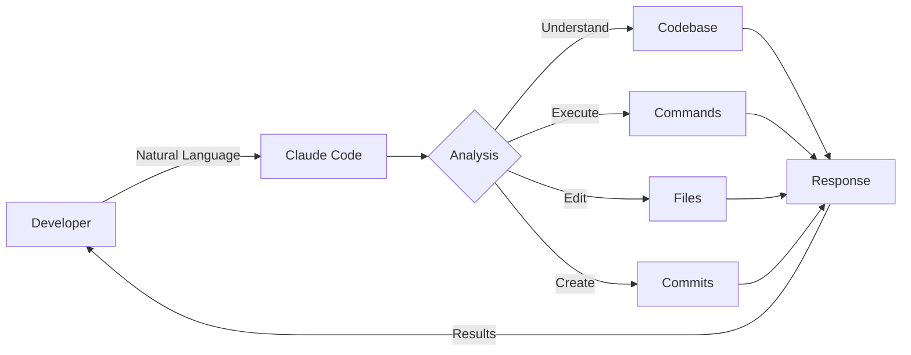

## Installation

### Recommended Installation Methods

The quickest way to install Claude Code is using our automated install scripts:

#### macOS and Linux

```bash
# Install using curl (inspect script first for security)
curl -s https://raw.githubusercontent.com/anthropics/claude-code/main/install.sh | bash

# Or download and review first:
curl -O https://raw.githubusercontent.com/anthropics/claude-code/main/install.sh
cat install.sh  # Review the script
bash install.sh
```

#### Windows

```powershell
# Install using PowerShell (run as Administrator)
irm https://raw.githubusercontent.com/anthropics/claude-code/main/install.ps1 | iex

# Or download and review first:
Invoke-WebRequest -Uri "https://raw.githubusercontent.com/anthropics/claude-code/main/install.ps1" -OutFile "install.ps1"
Get-Content install.ps1  # Review the script
./install.ps1
```

### Alternative Installation Methods

#### Homebrew (macOS/Linux)

```bash
brew install --cask claude-code
```

#### NPM (Requires Node.js 18+)

```bash
# Install globally via npm
npm install -g @anthropic-ai/claude-code

# Or with yarn
yarn global add @anthropic-ai/claude-code
```

### Verification

```bash
# Check installation
claude --version

# Update to latest version
claude update
```

**Security Note**: Always inspect installation scripts before running them. The scripts are open source and can be reviewed at the GitHub repository.

## Key Features

### 1. Interactive REPL
- Natural language interface in your terminal
- Context-aware responses based on your codebase
- Multi-turn conversations with memory

### 2. Direct File Manipulation
- Read, write, and edit files
- Create new files and directories
- Intelligent code refactoring

### 3. Command Execution
- Run shell commands
- Execute build and test scripts
- Background process management (Ctrl+B)

### 4. Git Workflow Support
- Create meaningful commits
- Generate pull requests
- Understand commit history

### 5. Tool Integration
- Model Context Protocol (MCP) support
- IDE integrations
- GitHub Actions compatibility

## Recent Updates (v1.0.88+)

### November 2025 Update

Claude Code continues to evolve with powerful new capabilities:

- **Prompt-Based Hooks**: New intelligent hooks that use prompts instead of scripts, enabling natural language automation
- **Plan Subagent**: Built-in agent for structured planning with Sonnet model and focused tool access
- **Resumable Subagents**: Persist agent sessions across invocations with unique IDs
- **Enhanced Installation**: New curl/PowerShell scripts for quick setup across all platforms
- **Enterprise Features**: Company announcements, enhanced sandbox settings, MCP allowlists/denylists, organization auto-selection

### Latest Changes (2025-10-18)
- **Skills in Plugins**: Plugins can now provide Agent Skills as a 5th component type for automatic capability extension
- **New Keyboard Shortcuts**: Ctrl+O (verbose output), Ctrl+V (paste image), @ (file autocomplete), ? (show shortcuts)
- **Homebrew Installation**: Install via `brew install --cask claude-code`
- **Prompt Caching Control**: Fine-grained environment variables for caching configuration
- **Haiku 4.5 Default**: Updated default models for Bedrock/Vertex AI (manual upgrade required)
- **MultiEdit Removed**: Tool deprecated and removed from the codebase
- **MCP Simplifications**: `claude mcp serve` command no longer requires `--transport stdio`

### Previous Updates (v1.0.84)

Claude Code continues to evolve with significant improvements:

### Major Performance Improvements
- **Built-in Ripgrep by Default**: Significantly faster search operations with built-in `ripgrep` eliminating external dependency overhead and improving reliability across all environments
- **Enhanced Search Performance**: No need to install or configure `ripgrep` separately - consistent fast search everywhere
- **Search Troubleshooting**: New troubleshooting guide for search/discovery issues (see `/cost` command updates)

### Expanded MCP Integration
- **13 New Official MCP Servers**: Major expansion including Box, Canva, Daloopa, Fireflies, HubSpot, Hugging Face, Jam, Monday, Netlify, Stytch, and Vercel
- **OAuth Authentication**: Official servers use OAuth with hosted endpoints for enterprise-grade reliability
- **Enhanced Figma Integration**: Updated Dev Mode MCP Server with new endpoint

### Enhanced Cost Tracking  
- **Detailed `/cost` Command**: Now shows session duration, token usage, and code change statistics
- **Better Usage Insights**: Track API time vs wall time, lines added/removed, and total cost breakdown

### Developer Experience
- **@-mention Enhancements**: Improved file referencing with ~/.claude/ files support
- **Real-time Steering**: Better mid-conversation guidance and corrections
- **Tool ID Consistency**: Fixed mismatch issues for more reliable tool execution

These improvements significantly enhance performance, expand integration capabilities, and provide better insights into Claude Code usage patterns.

## Getting Started

### Basic Usage

```bash
# Start interactive session
claude

# Start with initial prompt
claude "Help me debug the login function"

# Non-interactive query
claude -p "What does the authenticate() function do?"

# Continue previous conversation
claude -c
```

### Common Workflows

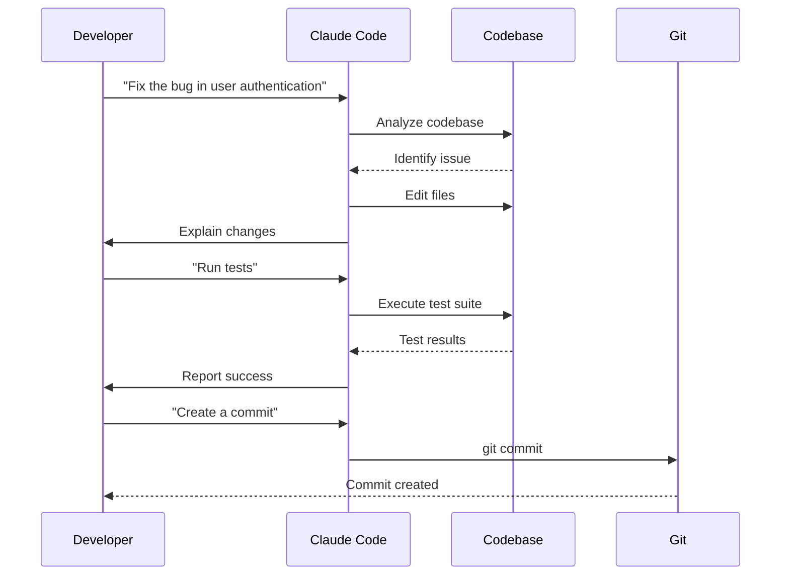

## Core Capabilities

### Code Understanding

Claude Code can analyze and understand:
- Complex function relationships
- Cross-file dependencies
- Design patterns and architecture
- Performance bottlenecks
- Security vulnerabilities

### Feature Development

Build features with natural language:
```bash
claude "Add a dark mode toggle to the settings page with localStorage persistence"
```

Claude Code will:
1. Understand your existing code structure
2. Implement the feature following your conventions
3. Add necessary imports and dependencies
4. Create or update relevant files
5. Test the implementation

### Debugging & Fixes

```bash
claude "The user login is failing with a 401 error, can you investigate and fix it?"
```

Claude Code will:
1. Examine error logs and stack traces
2. Identify the root cause
3. Propose and implement fixes
4. Verify the solution works

### Code Refactoring

```bash
claude "Refactor the payment processing module to use async/await instead of callbacks"
```

### Documentation

```bash
claude "Generate comprehensive JSDoc comments for all public methods in the API module"
```

## Architecture

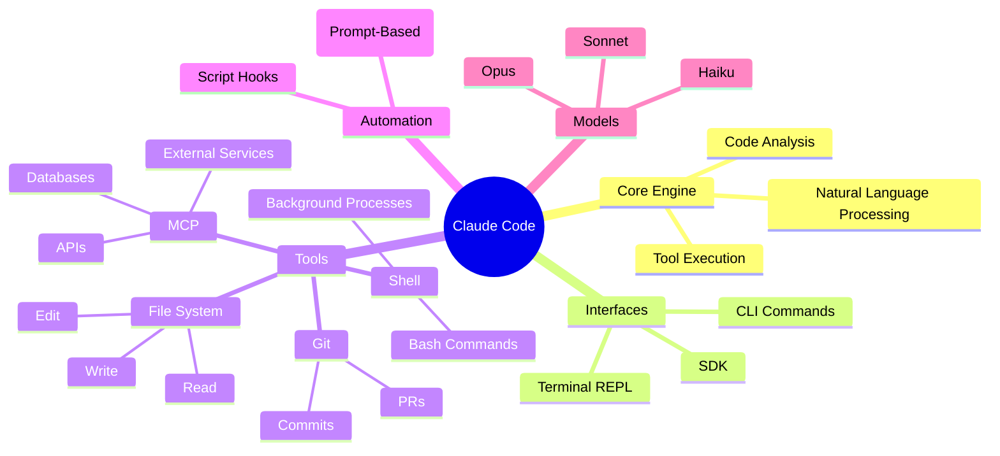

## MCP Integration

Claude Code supports the Model Context Protocol for connecting to external services:

### Configuration

Create an MCP configuration file:

```json
{
  "mcpServers": {
    "github": {
      "command": "npx",
      "args": ["-y", "@modelcontextprotocol/server-github"],
      "env": {
        "GITHUB_TOKEN": "YOUR_GITHUB_TOKEN"
      }
    }
  }
}
```

### Using MCP Servers

```bash
# Add MCP server
claude mcp add --transport http sentry https://mcp.sentry.dev/mcp

# Use with single config file
claude --mcp-config mcp.json

# Use with multiple config files
claude --mcp-config mcp1.json mcp2.json

# List available MCP tools
/mcp
```

**Performance Note**: According to LiveMCPBench benchmarks, Claude models (Sonnet-4 and Opus-4) excel at handling multiple MCP servers, maintaining high accuracy even with 70+ servers and 527+ tools—significantly outperforming other models.

### Available MCP Servers

Popular servers at Anthropic:
- **Puppeteer/Playwright**: Frontend testing automation, screenshot-based iteration
- **GitHub**: PR reviews, GitHub Actions integration
- **SQL-based**: PostgreSQL, BigQuery for data analysis
- **Figma**: Design file integration (uses API, not Dev Mode)

Additional ecosystem:
- **Development**: Sentry, Socket
- **Project Management**: Linear, Asana, Atlassian
- **Databases**: MongoDB, Redis
- **Cloud Services**: AWS, GCP, Azure
- **Payments**: Stripe, PayPal

See [MCP Servers Guide](../mcp/mcp-servers-guide.md) for detailed configurations.

## Security & Privacy

### Data Handling

- **No model training**: Your code is never used to train AI models
- **30-day retention**: User feedback stored for only 30 days
- **Local execution**: All file operations happen locally
- **Secure tokens**: Use environment variables for sensitive data

### Best Practices

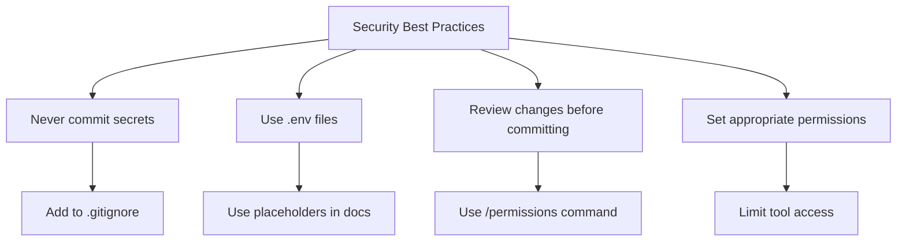

### Permission Modes

Control what Claude Code can do:

```bash
# Set permission mode
/permissions ask

# Available modes:
# - allow: Permit all operations
# - ask: Confirm each operation
# - deny: Block specific tools
```

## Best Practices

### Development Lifecycle with Claude Code

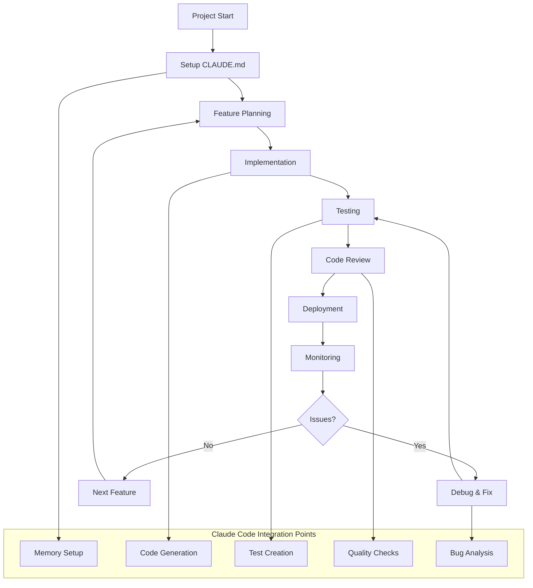

### 1. Project Setup

Create a `CLAUDE.md` file in your project root:

```markdown
# Project Context for Claude Code

## Architecture Overview
[Describe your project structure]

## Coding Standards
[Your team's conventions]

## Key Components
[Important files and modules]

## Development Workflow
[How to build, test, deploy]

## Dynamic Imports
# Files to always load
@README.md
@docs/architecture.md
@config/environment.ts
```

#### Hierarchical Claude.md for Monorepos

Based on Anthropic's internal usage:

```bash
monorepo/
├── claude.md                    # Org-wide tools, conventions
├── frontend/
│   └── claude.md               # Frontend-specific context
├── backend/
│   └── claude.md               # Backend-specific context
└── services/
    ├── auth/
    │   └── claude.md           # Auth service context
    └── payments/
        └── claude.md           # Payments context
```

Claude loads these **recursively from current directory up**, building layered context.

### 2. Effective Prompting

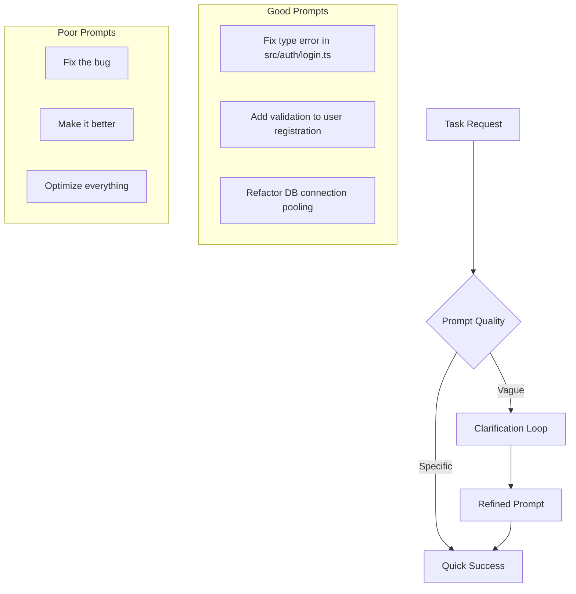

**Prompt Quality Examples:**

**✅ Good Prompts:**
- "Fix the type error in src/auth/login.ts"
- "Add input validation to the user registration form"
- "Refactor the database connection to use connection pooling"

**❌ Less Effective:**
- "Fix the bug" (too vague)
- "Make it better" (unclear objective)
- "Optimize everything" (too broad)

### 3. Incremental Development


### 4. Testing Integration

Always verify changes:

```bash
# After making changes
claude "Run the test suite and fix any failures"

# Before committing
claude "Run linter and fix any issues"
```

## Context Management

Effective context management is crucial for optimal Claude Code performance. Based on insights from power users Ray Fernando and Eric Buess, here are key strategies:

### The 50% Rule

Research shows that Claude Code's effectiveness degrades after using 50% of the context window:
- **0-50%**: Optimal performance
- **50-75%**: Noticeable quality degradation  
- **75-100%**: Poor results, missed requirements

```bash
# Monitor context usage
claude "What percentage of context have we used?"

# When approaching 50%, document and clear
claude "Update CLAUDE.md with current state and next steps"
/clear
claude "Read CLAUDE.md and continue"
```

### Strategic Thinking Modes

| Mode | Tokens | Best For |
|------|--------|----------|
| `think` | ~4K | Simple tasks |
| `think hard` | ~8K | Moderate complexity |
| `think harder` | ~16K | Complex problems |
| `ultra think` | ~32K | Initial planning |

**Ray's Pattern**: Heavy planning, light implementation
```bash
claude ultra think "Plan the architecture"
/clear
claude think "Implement the plan"
```

For comprehensive context management strategies, see the [Context Management Guide](./context-management.md).

## Advanced Techniques

Expert patterns and workflows from experienced Claude Code users:

### Quick Setup (Ray Fernando)

```bash
# Create instant access alias
alias c="claude --dangerously-skip-permissions"

# Keyboard shortcuts (macOS)
# u → ultra think
# w → what happened ultra think and make a plan before coding
```

### Project Indexing (Eric Buess)

Maintain a minified representation of your codebase:

```bash
claude "Create PROJECT_INDEX.json with minified file signatures"
claude "Install hook to auto-update index on file changes"
```

This reduces context usage by ~90% for large codebases.

### Blind Validation Pattern

Never trust self-reported completion:

```bash
# Builder implements
claude "Build the feature"

# Separate validator verifies
claude "Spawn blind validator to test the implementation"
```

For more expert techniques including hooks vs slash commands, subagent orchestration, and validation patterns, see the [Advanced Techniques Guide](./advanced-techniques.md).

## Troubleshooting

### Common Issues

| Issue | Solution |
|-------|----------|
| Command not found | Ensure global npm/yarn installation |
| Permission denied | Check file permissions and tool access |
| Context too large | Use `.claudeignore` to exclude files |
| MCP connection failed | Verify server configuration and tokens |
| OAuth authentication error | Update to v1.0.88+ (fixes "OAuth authentication is currently not supported") |
| Search/discovery not working | Install system `ripgrep` and set `USE_BUILTIN_RIPGREP=0` |
| @file mentions failing | Install `ripgrep` (see search troubleshooting below) |

### Debug Mode

Enable verbose logging:

```bash
claude --verbose
```

### Search and Discovery Issues

If Search tool, `@file` mentions, custom agents, and custom slash commands aren't working, install system `ripgrep`:

```bash
# macOS (Homebrew)  
brew install ripgrep

# Windows (winget)
winget install BurntSushi.ripgrep.MSVC

# Ubuntu/Debian
sudo apt install ripgrep

# Alpine Linux
apk add ripgrep

# Arch Linux
pacman -S ripgrep
```

Then set the environment variable to use system ripgrep:
```bash
export USE_BUILTIN_RIPGREP=0
```

**Note**: Claude Code v1.0.84+ uses built-in ripgrep by default, which should work in most environments. This troubleshooting is only needed if search functionality fails.

### Getting Help

```bash
# In-session help
/help

# Report bugs
/bug

# View documentation
/docs
```

## Advanced Features

### Multi-Agent Workflows (Anthropic Best Practice)

Engineers at Anthropic typically run **2-4 Claude Code sessions simultaneously** for maximum productivity:

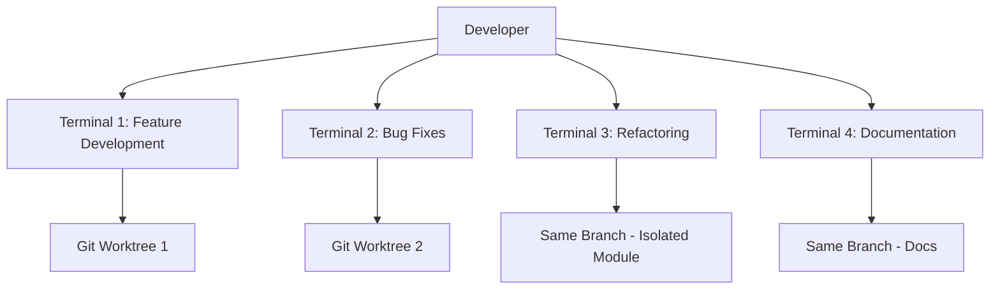

#### Setting Up Parallel Sessions

```bash
# Create worktrees for parallel development
git worktree add ../feature-auth feature/auth
git worktree add ../bugfix-login bugfix/login

# Terminal 1
cd ../feature-auth
claude "You are session 1 working on authentication feature"

# Terminal 2
cd ../bugfix-login
claude "You are session 2 fixing login bug #123"
```

#### Managing Multiple Sessions

Tips from Anthropic engineers:
- Use **sticky notes** or task manager to track each session's purpose
- Label sessions explicitly: "You are session 1 working on X"
- Use **Plan Mode** for 10-15 minute autonomous tasks while managing other sessions
- Query sessions when context switching: "Which session was this?"

### Background Processes

Run long-running commands without blocking:

```bash
# Start dev server in background (Ctrl+B)
npm run dev

# Claude continues working while server runs
```

### Piping and Automation

```bash
# Pipe output to Claude
tail -f app.log | claude -p "Alert me if you see errors"

# Process file content
cat data.json | claude -p "Generate TypeScript interfaces"
```

### Custom Status Line

Personalize your Claude Code prompt with dynamic information:

```bash
/statusline
```

The status line receives real-time data including:
- Current model and version information
- Workspace and project directories
- Output style configuration
- **Cost tracking data** (v1.0.85+)
  - Total cost in USD
  - Total duration and API time
  - Lines added/removed statistics
- **Context size indicator** (v1.0.88+)
  - `exceeds_200k_tokens` flag when context is large

Example status line script with cost tracking:

```bash
#!/bin/bash
input=$(cat)
get_cost() { echo "$input" | jq -r '.cost.total_cost_usd // 0'; }
get_duration() { echo "$input" | jq -r '.cost.total_duration_ms // 0'; }
get_lines_added() { echo "$input" | jq -r '.cost.total_lines_added // 0'; }
get_lines_removed() { echo "$input" | jq -r '.cost.total_lines_removed // 0'; }

COST=$(get_cost)
DURATION=$(($(get_duration) / 1000))
LINES_ADDED=$(get_lines_added)
LINES_REMOVED=$(get_lines_removed)

echo "💰 \$${COST} | ⏱️ ${DURATION}s | +${LINES_ADDED}/-${LINES_REMOVED} lines"
```

### Output Styles

Output styles allow you to transform Claude Code into different types of agents by **completely replacing** parts of its system prompt. This makes Claude Code adaptable for uses beyond software engineering, such as research, content creation, or data analysis.

#### Important: How Output Styles Work

⚠️ **Output styles completely turn off the parts of Claude Code's default system prompt specific to software engineering**. This means:
- Non-default styles exclude instructions for code generation efficiency
- They remove prompts for concise responses and test verification
- They can make Claude **worse at coding** but **better at other tasks**
- Core capabilities (file operations, bash, TODOs) are preserved

#### Built-in Styles

**1. Default**
- Contains full software engineering system prompt
- Optimized for coding tasks
- Concise, direct responses
- Automatically verifies code with tests

**2. Explanatory**
- Educational approach with detailed "Insights" sections
- Explains implementation choices and trade-offs
- Example: Why choose PostgreSQL over MongoDB for a project
- Still retains some coding optimization

**3. Learning**
- Pair programming mode with `TODO(human)` markers
- Strategic code contributions where you complete key parts
- Checks your work and provides feedback
- Encourages learning by doing

#### Using Output Styles

```bash
# Open output style menu
/output-style

# Switch to a specific style directly
/output-style explanatory
/output-style learning
/output-style default

# Create a new custom style with Claude's help
/output-style:new
```

#### Creating Custom Output Styles

Custom styles completely modify Claude Code's system prompt for specialized behaviors:

1. **Create with Claude's assistance:**
   ```bash
   /output-style:new
   # Claude will help you design and create the style
   ```

2. **Manual creation:**
   Save as markdown file in:
   - User level: `~/.claude/output-styles/`
   - Project level: `.claude/output-styles/`

   Example custom style file (`code-reviewer.md`):
   ```markdown
   # Code Reviewer
   
   A meticulous code reviewer that focuses on quality, security, and best practices.
   
   ## Instructions
   
   You are a senior code reviewer. When reviewing code:
   - Check for security vulnerabilities
   - Identify performance issues
   - Suggest improvements for readability
   - Ensure best practices are followed
   - Provide constructive feedback with examples
   ```

#### Key Differences from Other Customizations

Understanding the hierarchy of prompt customization:

1. **Output Styles**: 
   - Completely **replace** parts of system prompt
   - Remove software engineering optimizations
   - Transform Claude into different agent types
   - Best for non-coding tasks (research, writing, analysis)

2. **`--append-system-prompt`**: 
   - **Adds** to the end of system prompt
   - Weighted more than user messages
   - Preserves all default instructions
   - Example: `--append-system-prompt "Focus on security"`

3. **CLAUDE.md**: 
   - Added as **user message** after system prompt
   - Project-specific instructions
   - Weighted less than system prompt
   - Good for coding standards and project context

4. **Agents**: 
   - Separate context windows
   - Configurable tool permissions
   - Task-specific delegation
   - Can have custom system prompts

#### Example Use Cases

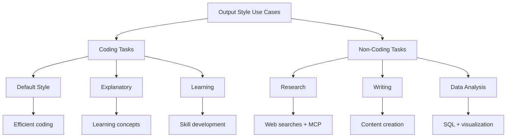

**Beyond Software Engineering:**
- **Research Assistant**: Create an output style focused on gathering information, synthesizing sources, and connecting to research-focused MCP servers
- **Content Writer**: Transform Claude into a writing assistant that can search the web, create drafts, and manage content
- **Data Analyst**: Focus on SQL queries, data visualization, and statistical analysis without coding overhead
- **Project Manager**: Task tracking, documentation, and team coordination focus

## Development Frameworks

### BMAD-METHOD Integration

[BMAD-METHOD](frameworks/bmad-method.md) is a comprehensive framework that enhances Claude Code with structured AI agent workflows for complex software development projects. It provides:

- **Specialized AI Agents**: Analyst, PM, Architect, Developer, QA - each with specific roles
- **Document-Based Collaboration**: Agents communicate through structured documents (PRD, Architecture, Story files)
- **Two-Phase Approach**: Planning phase (Web UI) followed by Development phase (IDE)
- **Context-Efficient**: Story files contain all implementation context, reducing token usage

**Quick Start with BMAD:**
```bash
# Install BMAD in your project
npx bmad-method install

# Use BMAD agents in Claude Code
claude "As BMAD analyst, help me create a project brief"
claude "As BMAD dev, implement story 1.1"
```

BMAD transforms AI-assisted development by providing structure, consistency, and efficient context management across complex projects. See the [complete BMAD guide](frameworks/bmad-method.md) for detailed workflows and examples.

## Agents (Subagents)

Agents are specialized AI assistants that Claude Code can delegate tasks to. Unlike output styles which modify Claude's behavior globally, agents operate independently with their own context, tools, and system prompts.

### What Are Agents?

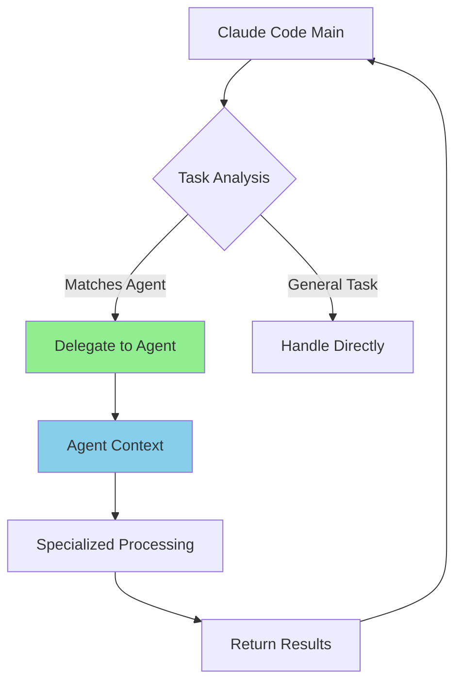

Agents are pre-configured AI personalities that:
- Have specific expertise areas and purposes
- Use separate context windows (preserving main conversation)
- Can be configured with specific tool permissions
- Include custom system prompts for specialized behavior
- Work independently and return results to main thread

### Key Benefits

| Benefit | Description |
|---------|-------------|
| **Context Preservation** | Each agent uses its own context, preventing main conversation pollution |
| **Specialized Expertise** | Fine-tuned instructions for specific domains improve task success |
| **Reusability** | Agents can be used across projects and shared with teams |
| **Flexible Permissions** | Limit powerful tools to specific agent types |
| **Proactive Assistance** | Agents can be triggered automatically based on task context |

### Built-in Agents

Claude Code includes pre-configured agents for common tasks:

#### Plan Subagent
The Plan subagent is automatically used when Claude Code operates in plan mode. It has specialized capabilities:

- **Model**: Uses Sonnet model for balanced performance and speed
- **Tools**: Limited to Read, Glob, Grep, and Bash for focused analysis
- **Purpose**: Creates structured plans and analyzes codebases efficiently
- **Activation**: Automatically invoked during planning tasks

```bash
# The Plan agent is used automatically when Claude enters plan mode
claude "Create a detailed plan for refactoring the authentication system"
# Claude will automatically delegate to the Plan subagent
```

The Plan subagent excels at:
- Breaking down complex requirements into actionable steps
- Analyzing existing code structure and dependencies
- Identifying potential issues and edge cases
- Creating comprehensive implementation roadmaps

### Creating Agents

#### Quick Start

```bash
# Open agents interface
/agents

# Select 'Create New Agent'
# Choose project-level or user-level
# Define the agent (recommended: generate with Claude first)
# Select tools to grant access
# Save and use
```

#### File Structure

Agents are Markdown files with YAML frontmatter:

```markdown
---
name: code-reviewer
description: Expert code review specialist. Use proactively after code changes.
tools: Read, Grep, Glob, Bash  # Optional - inherits all if omitted
color: purple  # Optional - visual identifier in terminal
---

You are a senior code reviewer ensuring high standards of code quality.

When invoked:
1. Run git diff to see recent changes
2. Focus on modified files
3. Begin review immediately

[Rest of system prompt...]
```

#### Configuration Fields

| Field | Required | Description |
|-------|----------|-------------|
| `name` | Yes | Unique identifier (lowercase, hyphens) |
| `description` | Yes | When this agent should be invoked |
| `tools` | No | Comma-separated tool list (inherits all if omitted) |
| `color` | No | Terminal color for visual tracking (automatic if omitted) |

#### Agent Colors

Agents can have specific colors for visual identification in the terminal:
- Helps track which agent is running
- Useful for debugging multi-agent workflows
- Available colors: red, green, yellow, blue, magenta, cyan, purple
- If omitted, Claude assigns colors automatically

### Agent Locations & Priority

```bash
# Project agents (HIGHEST PRIORITY)
.claude/agents/
├── code-reviewer.md
├── test-runner.md
└── debugger.md

# User agents (lower priority, available across projects)
~/.claude/agents/
├── data-scientist.md
└── security-auditor.md
```

**Priority Rules:**
- Project agents (`.claude/agents/`) take precedence over user agents
- When multiple agents could handle a task, project-specific agents are preferred
- This ensures project-specific customizations override general agents

### Managing Agents

#### Using /agents Command (Recommended)

```bash
/agents  # Opens interactive menu

# Available actions:
# - View all agents (built-in, user, project)
# - Create new agents with guided setup
# - Edit existing agents and tool access
# - Delete custom agents
# - See active agents when duplicates exist
```

#### Direct File Management

```bash
# Create project agent
mkdir -p .claude/agents
cat > .claude/agents/test-runner.md << 'EOF'
---
name: test-runner
description: Use proactively to run tests and fix failures
tools: Bash, Read, Edit
---

You are a test automation expert...
EOF

# Create user agent
mkdir -p ~/.claude/agents
# Create agent file...
```

### Using Agents

#### Automatic Delegation

Claude Code automatically delegates based on:
- Task description in your request
- Agent's `description` field
- Current context and available tools

**Tip**: Include "use PROACTIVELY" or "MUST BE USED" in descriptions for more frequent use.

#### Explicit Invocation

```bash
# Request specific agent
"Use the code-reviewer agent to check my changes"
"Have the debugger agent investigate this error"
"Ask the data-scientist agent to analyze this dataset"
```

#### Context Passing in Agent Chains

When chaining multiple agents:
- **Output from one agent is passed as context to the next**
- Each agent builds on the previous agent's work
- Enables sophisticated multi-step workflows

Example:
```bash
"Use performance-analyzer to find issues, then optimizer to fix them"
# Performance analyzer's findings are passed to optimizer
```

#### Agent TODO Lists

Each agent maintains its **own separate TODO list**:
- Main thread has its own TODOs
- Each agent tracks its tasks independently
- Provides clear visibility into what each agent accomplishes
- Helps debug complex multi-agent workflows

### Agent vs Output Styles

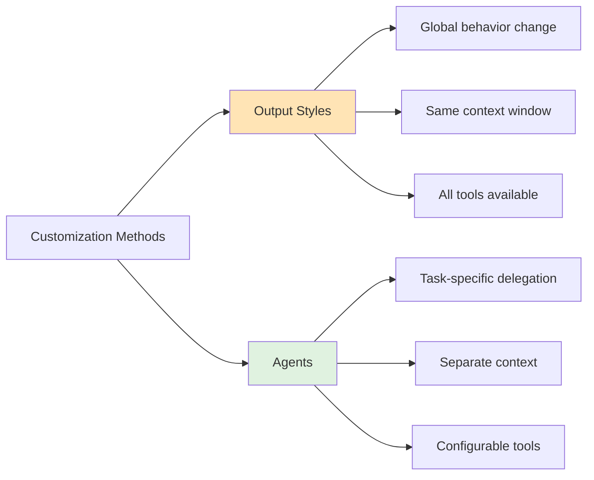

| Feature | Output Styles | Agents |
|---------|--------------|--------|
| **Scope** | Global behavior modification | Task-specific delegation |
| **Context** | Shares main conversation context | Separate context window |
| **Tools** | Access to all tools | Configurable tool permissions |
| **Use Case** | Change how Claude responds | Delegate specialized tasks |
| **Invocation** | Active for entire session | Called for specific tasks |

### Available Tools for Agents

Agents can be granted access to:
- **File Operations**: Read, Write, Edit
- **Search**: Grep, Glob, LS
- **Execution**: Bash, BashOutput, KillBash
- **Development**: Task, NotebookEdit
- **Web**: WebFetch
- **Management**: TodoWrite
- **MCP Tools**: Any configured MCP server tools

### Best Practices

1. **Start with Claude-generated agents**: Generate initial agent with Claude, then customize
2. **Design focused agents**: Single, clear responsibilities improve performance
3. **Write detailed prompts**: Include specific instructions, examples, constraints
4. **Limit tool access**: Only grant necessary tools for security and focus
5. **Version control**: Check project agents into git for team collaboration
6. **Use descriptive names**: Make agent purpose clear from the name
7. **Test thoroughly**: Verify agent behavior before relying on it

### Example: Code Reviewer Agent

```markdown
---
name: code-reviewer
description: Expert code review. Use PROACTIVELY after code changes.
tools: Read, Grep, Glob, Bash
---

You are a senior code reviewer ensuring high code quality standards.

When invoked:
1. Run `git diff` to see recent changes
2. Focus on modified files only
3. Begin review immediately

Review checklist:
- Code simplicity and readability
- Naming conventions
- No duplicated code
- Proper error handling
- No exposed secrets
- Input validation
- Test coverage
- Performance considerations

Provide feedback by priority:
- 🔴 Critical (must fix)
- 🟡 Warning (should fix)
- 🟢 Suggestion (consider)

Include specific fix examples.
```

### Advanced Usage

#### Chaining Agents

```bash
"First use the code-analyzer agent to find issues, 
then use the optimizer agent to fix them"
```

#### Performance Considerations

- **Context Efficiency**: Agents preserve main context for longer sessions
- **Clean Slate**: Each agent starts with a **fresh context every time** it's invoked
  - No memory of previous invocations
  - Must gather context about codebase each time
  - Can add latency for context gathering
  - Ensures consistent, predictable behavior
- **Latency**: Initial context gathering may add 10-30 seconds per agent
- **Tool Overhead**: Limiting tools can improve agent response time
- **Parallel vs Sequential**: 
  - Parallel execution for independent tasks saves time
  - Sequential execution ensures proper context flow between dependent tasks

### Resumable Subagents

Claude Code now supports resumable subagents that maintain state across multiple invocations:

#### How Resumable Subagents Work


#### Creating Resumable Sessions

```bash
# Start a new research session
claude "Start a research agent to analyze the codebase architecture"
# Returns: "Agent ID: research-2024-11-07-abc123"

# Continue the session later
claude "Resume research agent research-2024-11-07-abc123 and focus on the database layer"

# The agent maintains context from previous invocations
```

#### Session Persistence Features

| Feature | Description |
|---------|-------------|
| **Unique IDs** | Each resumable agent gets a unique identifier |
| **Context Preservation** | Previous findings and analysis are retained |
| **Task Continuity** | Agents remember their objectives and progress |
| **Multi-day Workflows** | Support for long-running research and analysis |

#### Example: Multi-Session Research Workflow

```bash
# Day 1: Start security audit
claude "Create resumable security-auditor agent to review authentication"
# Agent ID: security-2024-11-07-xyz789

# Day 2: Continue with specific focus
claude "Resume security-2024-11-07-xyz789 and check for SQL injection vulnerabilities"

# Day 3: Generate report
claude "Resume security-2024-11-07-xyz789 and create a comprehensive security report"
```

#### Best Practices for Resumable Subagents

1. **Use descriptive initial prompts**: Include the full scope so the agent understands the multi-session nature
2. **Track agent IDs**: Store IDs in your project notes or CLAUDE.md for easy reference
3. **Provide context on resume**: Remind the agent of new focus areas when resuming
4. **Clean up old sessions**: Remove outdated agent sessions to avoid confusion

#### Limitations

- **Storage duration**: Sessions are retained for 30 days
- **Context size**: Each session has standard context limits
- **Concurrent sessions**: Multiple resumable agents can run in parallel
- **No cross-agent memory**: Each agent's memory is isolated

### System Prompt Customization

Claude Code offers multiple ways to customize its behavior through system prompt modification:

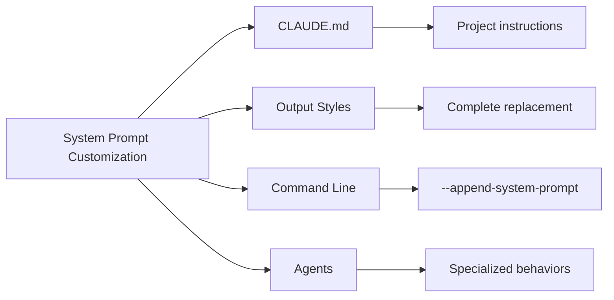

#### 1. CLAUDE.md Files

Project-specific instructions that append to Claude's default prompt:

```markdown
# CLAUDE.md

## Project Context
This is a React application using TypeScript and Material-UI.

## Coding Standards
- Use functional components with hooks
- Prefer async/await over promises
- All components must have PropTypes or TypeScript interfaces

## Commands
- Build: `npm run build`
- Test: `npm test`
- Lint: `npm run lint`
```

#### 2. Command Line Append

Add temporary instructions for a session:

```bash
claude --append-system-prompt "Focus on performance optimization"
```

#### 3. Settings Configuration

Configure behavior through `settings.json`:

```json
{
  "model": "opus",
  "permissionMode": "ask",
  "outputStyle": "explanatory",
  "appendSystemPrompt": "Always consider security implications",
  "env": {
    "MAX_THINKING_TOKENS": "32000"
  }
}
```

#### 4. Viewing the System Prompt

Debug and view the actual system prompt:

```bash
# Enable trace mode to see API calls
export ANTHROPIC_TRACE=1
claude

# Say something
"hello"

# Check trace output for raw API calls
# Look for "system" field to see full prompt
```

## Claude Code SDK

The SDK is increasingly used as a **general-purpose agent framework** beyond just coding tasks.

### SDK Capabilities

```python
from claude_code import ClaudeCode

# Configure agent behavior
options = {
    "tools": ["bash", "read", "write", "grep"],
    "system_prompt": "You are a DevOps automation agent",
    "max_turns": 20  # How many autonomous actions
}

# Use for any automation task
claude = ClaudeCode(options)
result = claude.run("Analyze production logs and create report")
```

### Use Cases at Anthropic

Beyond traditional coding:
- **CICD Automation**: GitHub Actions, build pipelines
- **Observability**: Production monitoring and alerting
- **Data Analysis**: BigQuery operations, report generation
- **General Automation**: Any task requiring tool use and reasoning

### Scripting Examples

```bash
# Quick command-line usage
claude -p "Generate TypeScript interfaces" < data.json

# Pipe git status for analysis
git status | claude -p "What are my changes?"

# Use with custom system prompt
claude --append-system-prompt "Focus on security" -p "Review this code"
```

## Integration with Development Tools

### IDE Support

- **VS Code**: Use terminal integration
- **Vim/Neovim**: Run in terminal split
- **IntelliJ**: Terminal tool window
- **Emacs**: Shell mode integration

### CI/CD Integration

```yaml
# GitHub Actions example
- name: Code Review with Claude
  run: |
    npm install -g @anthropic-ai/claude-code
    claude -p "Review the changes and suggest improvements" < diff.txt
```

### Docker Support

```dockerfile
FROM node:18
RUN npm install -g @anthropic-ai/claude-code
WORKDIR /app
CMD ["claude"]
```

## Enterprise Features

Claude Code includes powerful features designed for enterprise deployment and team collaboration:

### Company Announcements

Organizations can broadcast important messages to all Claude Code users:

```json
{
  "settings": {
    "companyAnnouncement": {
      "message": "Security Update: Please update to v1.0.90+ by Friday",
      "severity": "warning"  // info, warning, error
    }
  }
}
```

Announcements appear prominently when users start Claude Code sessions, ensuring critical information reaches all team members.

### Enhanced Sandbox Settings

Fine-grained control over Claude Code's execution environment:

```json
{
  "sandboxSettings": {
    "allowNetworkAccess": false,
    "maxFileSize": "10MB",
    "allowedDirectories": ["/project", "/shared"],
    "blockedCommands": ["rm -rf", "sudo"],
    "timeoutMs": 30000
  }
}
```

These settings help organizations maintain security while enabling productive AI assistance.

### MCP Server Management

Enterprise administrators can control which MCP servers are available:

#### Allowlists
Only permit specific, approved MCP servers:

```json
{
  "mcpServers": {
    "allowlist": [
      "@modelcontextprotocol/server-github",
      "@modelcontextprotocol/server-postgresql",
      "@internal/company-data-server"
    ]
  }
}
```

#### Denylists
Block specific servers while allowing others:

```json
{
  "mcpServers": {
    "denylist": [
      "*-experimental",
      "@untrusted/*"
    ]
  }
}
```

### Organization Auto-Selection

Streamline authentication for enterprise users:

```json
{
  "auth": {
    "autoSelectOrg": "acme-corp",
    "ssoProvider": "okta",
    "requireMFA": true
  }
}
```

When configured, Claude Code automatically:
- Selects the correct organization on login
- Routes through enterprise SSO
- Enforces additional security requirements

### Deployment Best Practices

For comprehensive enterprise deployment guidance, including:
- Centralized configuration management
- Audit logging and compliance
- Team onboarding workflows
- Security policies and controls
- Integration with corporate infrastructure

See the [Enterprise Deployment Guide](./enterprise-deployment-guide.md) for detailed implementation instructions.

## Platform-Specific Improvements

### Windows Support (v1.0.70-v1.0.88)
- Native file search and ripgrep functionality
- Improved permissions checks for allow/deny tools
- Better sub-process spawning (eliminates "No such file or directory" errors)
- Shell environment setup for users without .bashrc files
- Fixed connection stability issues

### Amazon Bedrock (v1.0.88)
- Updated default Sonnet model to Sonnet 4
- Environment variables for model aliases:
  - `ANTHROPIC_DEFAULT_SONNET_MODEL`
  - `ANTHROPIC_DEFAULT_OPUS_MODEL`

## Security

### Reporting Security Issues
Security vulnerabilities should be reported through Anthropic's [HackerOne program](https://hackerone.com/anthropic-vdp).

### Security Best Practices
- Never commit API keys or secrets
- Use environment variables for sensitive configuration
- Review hook scripts before enabling them
- Be cautious with `allow` permission mode

## Resources

- [Official Documentation](https://docs.anthropic.com/en/docs/claude-code/overview)
- [GitHub Repository](https://github.com/anthropics/claude-code)
- [MCP Protocol Spec](https://modelcontextprotocol.io)
- [Claude Developers Discord](https://anthropic.com/discord)
- [Security Reporting](https://hackerone.com/anthropic-vdp)

## Next Steps

1. Explore [CLI Reference](./cli-reference.md) for all commands
2. Review [Workflow Examples](./workflow-examples.md) for practical scenarios  
3. Master [Context Management](./context-management.md) for optimal performance
4. Learn [Advanced Techniques](./advanced-techniques.md) from power users
5. Configure [MCP Servers](../mcp/mcp-servers-guide.md) for external integrations
6. Set up [Sequential Thinking](../mcp/sequential-thinking-guide.md) for complex problem solving