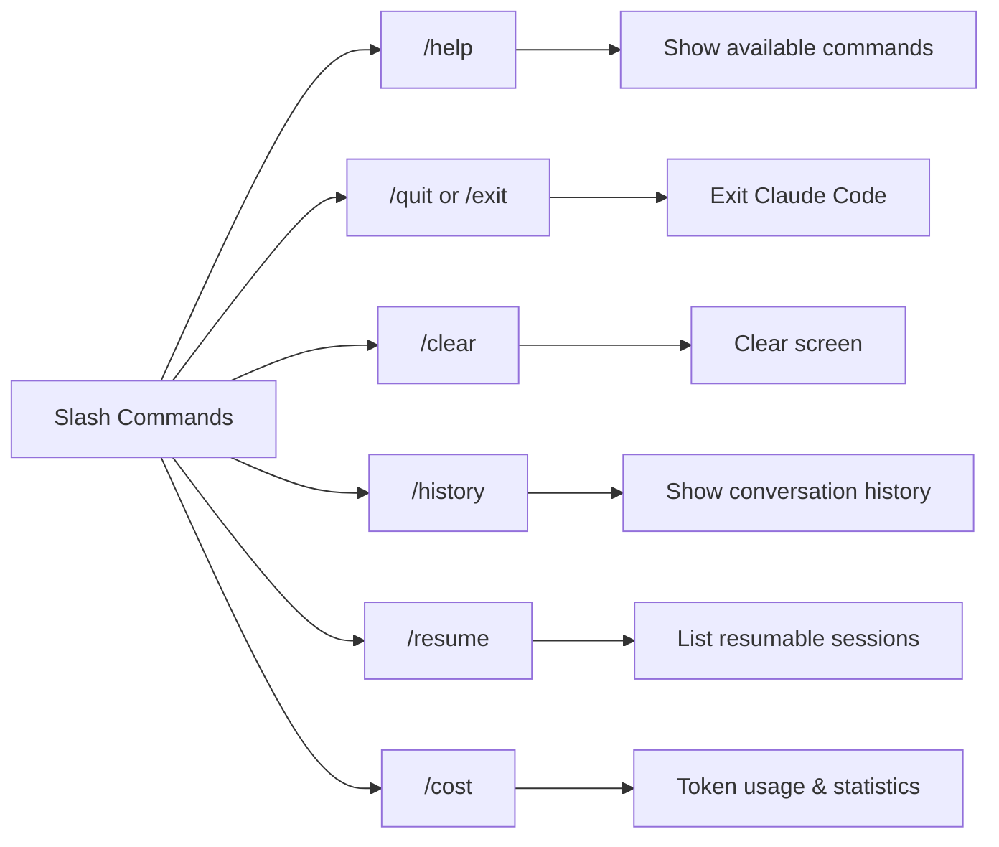
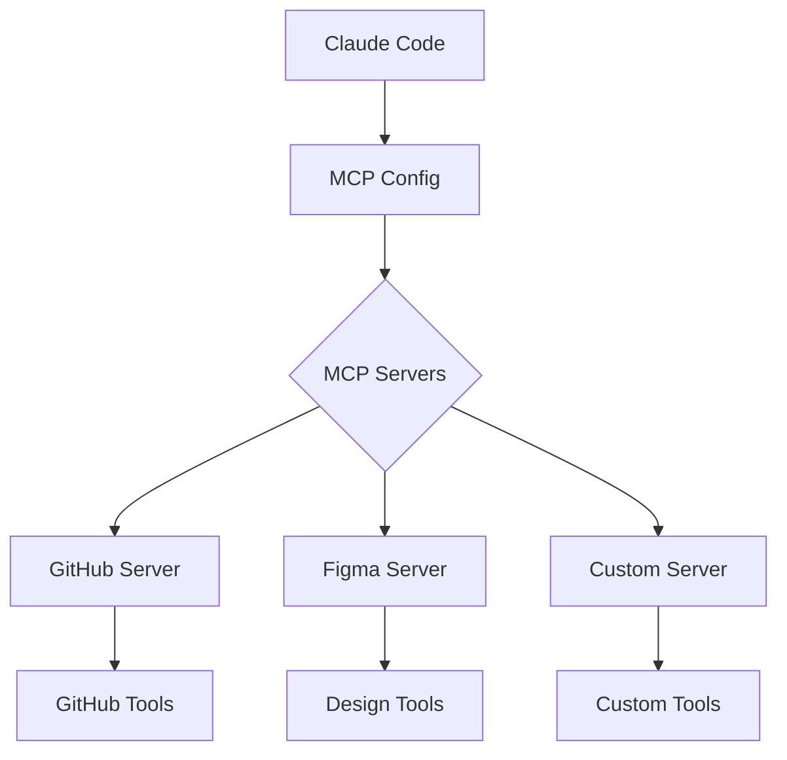
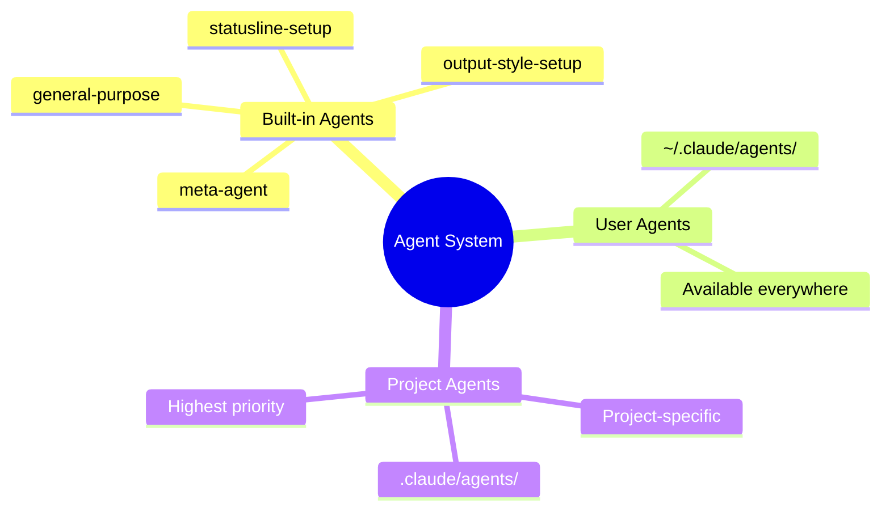
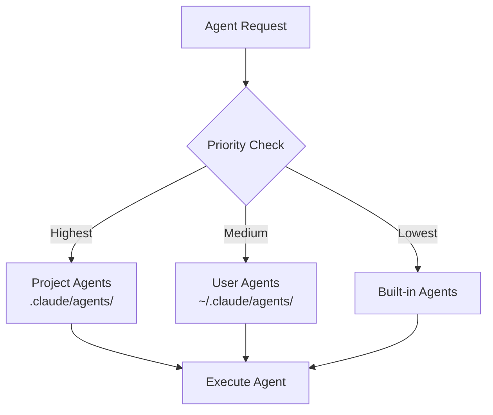
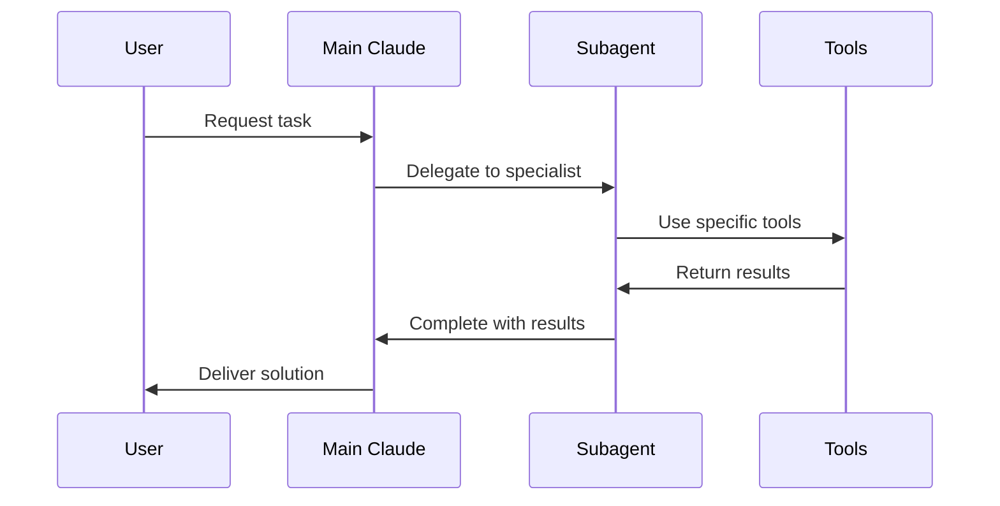
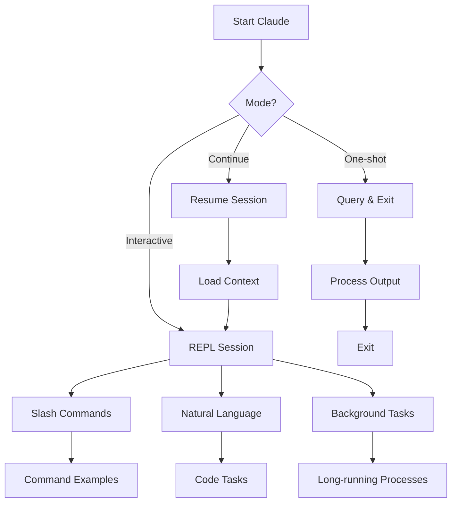

# Claude Code CLI Reference

Complete reference for Claude Code command-line interface, including all commands, flags, options, and interactive features.

## Table of Contents

- [Installation Methods](#installation-methods)
- [Basic Commands](#basic-commands)
- [Command Line Flags](#command-line-flags)
- [Slash Commands](#slash-commands)
- [Keyboard Shortcuts](#keyboard-shortcuts)
- [Environment Variables](#environment-variables)
- [Configuration Files](#configuration-files)
- [Hooks Configuration](#hooks-configuration)
- [Advanced Usage](#advanced-usage)

## Installation Methods

Claude Code can be installed through multiple methods depending on your platform and preferences:

### Native Installers (Recommended)

#### macOS and Linux
```bash
# Install via curl (automatic platform detection)
curl -fsSL https://s3.amazonaws.com/upload.tabnine.com/claudecode/install.sh | sh

# The installer will:
# - Detect your platform (macOS/Linux, x64/arm64)
# - Download the appropriate binary
# - Install to ~/.local/bin/claude
# - Add to PATH if needed
```

#### Windows
```powershell
# Install via PowerShell (Run as Administrator)
Invoke-WebRequest -Uri https://s3.amazonaws.com/upload.tabnine.com/claudecode/install.ps1 -OutFile install.ps1
Set-ExecutionPolicy -Scope Process -ExecutionPolicy Bypass
.\install.ps1

# The installer will:
# - Download the Windows executable
# - Install to %LOCALAPPDATA%\Programs\claude
# - Add to system PATH
```

### Homebrew Installation

For macOS and Linux users with Homebrew:

```bash
# Install Claude Code via Homebrew Cask
brew install --cask claude-code

# Verify installation
claude --version

# Note: Auto-updates occur outside brew directory
# To disable auto-updates (not recommended):
export DISABLE_AUTOUPDATER=1
```

### NPM Installation

For Node.js developers (requires Node.js 18 or higher):

```bash
# Install globally via npm
npm install -g @anthropic-ai/claude-code

# Or with yarn
yarn global add @anthropic-ai/claude-code

# Or with pnpm
pnpm add -g @anthropic-ai/claude-code

# Verify Node.js version
node --version  # Should be v18.0.0 or higher
```

### Platform-Specific Notes

#### macOS
- **Apple Silicon (M1/M2/M3)**: Native arm64 binary available
- **Intel Macs**: x64 binary available
- **Code signing**: Binary is signed and notarized by Apple
- **Gatekeeper**: First run may require approval in System Settings > Privacy & Security

#### Linux
- **Architectures**: x64 and arm64 binaries available
- **Dependencies**: Requires glibc 2.31+ (Ubuntu 20.04+, Debian 11+, RHEL 8+)
- **Installation path**: Default is `~/.local/bin/claude`
- **Shell integration**: Automatically adds to `.bashrc`, `.zshrc`, or `.config/fish/config.fish`

#### Windows
- **Architectures**: x64 and arm64 binaries available
- **Windows version**: Windows 10 version 1809+ or Windows 11
- **Terminal**: Works with Windows Terminal, PowerShell, Command Prompt
- **Path**: Automatically added to user PATH environment variable

### Verification Commands

After installation, verify Claude Code is working:

```bash
# Check version
claude --version
claude -v

# Run diagnostic checks
claude doctor

# The doctor command checks:
# - Binary installation and permissions
# - PATH configuration
# - API key configuration
# - Network connectivity
# - File system permissions
# - MCP server availability (if configured)

# Test with simple command
claude -p "Hello, Claude!"
```

### Updating Claude Code

```bash
# Check for updates (built-in auto-updater)
claude update

# Force update check
claude update --force

# Via package managers
brew upgrade claude-code     # Homebrew
npm update -g @anthropic-ai/claude-code  # NPM
```

### Uninstallation

```bash
# macOS/Linux (native installer)
rm ~/.local/bin/claude
rm -rf ~/.claude

# Windows (native installer)
# Use Add/Remove Programs or:
del %LOCALAPPDATA%\Programs\claude\claude.exe
rmdir /s %APPDATA%\claude

# Homebrew
brew uninstall --cask claude-code

# NPM
npm uninstall -g @anthropic-ai/claude-code
```

## Basic Commands

### Starting Claude Code

```bash
# Start interactive REPL
claude

# Start with initial prompt
claude "Help me understand this codebase"

# Query and exit (non-interactive)
claude -p "What does the main() function do?"
claude --print "Explain the authentication flow"

# Continue previous conversation
claude -c
claude --continue

# Resume specific conversation
claude --resume <conversation-id>
```

### Update and Version

```bash
# Check version
claude --version
claude -v

# Update to latest version
claude update

# Help
claude --help
claude -h
```

## Command Line Flags

### Core Options

| Flag | Long Form | Description | Example |
|------|-----------|-------------|---------|
| `-p` | `--print` | Print response without interactive mode | `claude -p "Fix the bug"` |
| `-c` | `--continue` | Continue most recent conversation | `claude -c` |
| `-v` | `--version` | Display version information | `claude -v` |
| `-h` | `--help` | Show help information | `claude -h` |

### Model Selection

| Flag | Description | Example |
|------|-------------|---------|
| `--model <name>` | Set model for session | `claude --model opus` |
| `--opus` | Use Opus model | `claude --opus` |
| `--sonnet` | Use Sonnet model | `claude --sonnet` |
| `--haiku` | Use Haiku model | `claude --haiku` |

### Directory Management

| Flag | Description | Example |
|------|-------------|---------|
| `--add-dir <path>` | Add additional working directory | `claude --add-dir ../lib` |
| `--dir <path>` | Set working directory | `claude --dir /project` |

### Permission Control

### Permission Control

| Flag | Description | Example |
|------|-------------|---------|
| `--permission-mode <mode>` | Set permission mode (allow/ask/deny) | `claude --permission-mode ask` |
| `--no-tools` | Disable all tools | `claude --no-tools` |
| `--dangerously-skip-permissions` | Skip permission checks (⚠️ can be disabled by enterprise policy) | `claude --dangerously-skip-permissions` |

**Note**: Enterprise-managed policies can disable certain flags. The `disableBypassPermissionsMode` setting prevents both the `--dangerously-skip-permissions` flag and bypass permission mode from being used.

### MCP Configuration

| Flag | Description | Example |
|------|-------------|---------|
| `--mcp-config <file>` | Load MCP configuration | `claude --mcp-config mcp.json` |
| `--mcp-config <f1> <f2>` | Load multiple MCP configs | `claude --mcp-config mcp1.json mcp2.json` |

Note: Claude Code handles multiple MCP servers well. Benchmarks show Claude models excel at managing 70+ MCP servers with 500+ tools.

### Output Control

| Flag | Description | Example |
|------|-------------|---------|
| `--format <type>` | Output format (text/json/stream) | `claude --format json` |
| `--max-turns <n>` | Limit number of agentic turns | `claude --max-turns 5` |
| `--verbose` | Enable detailed logging | `claude --verbose` |
| `--quiet` | Suppress non-essential output | `claude --quiet` |

### System Prompt Modification

| Flag | Description | Example |
|------|-------------|---------|
| `--append-system-prompt <text>` | Append to system prompt | `claude --append-system-prompt "Focus on security"` |
| `--output-style <style>` | Set output style | `claude --output-style explanatory` |

### Advanced Options

| Flag | Description | Example |
|------|-------------|---------|
| `--api-key <key>` | Override API key | `claude --api-key sk-...` |
| `--base-url <url>` | Override API base URL | `claude --base-url https://...` |
| `--resume <id>` | Resume specific conversation | `claude --resume abc123` |
| `--no-history` | Disable conversation history | `claude --no-history` |

## Slash Commands

Interactive commands available within Claude Code sessions:

### Session Management



| Command | Description |
|---------|-------------|
| `/help` | Display help for slash commands |
| `/quit` or `/exit` | Exit Claude Code |
| `/clear` | Clear the terminal screen |
| `/history` | Show conversation history |
| `/resume` | List resumable conversations |
| `/reset` | Reset current conversation |
| `/cost` | Show detailed token usage and session statistics (v1.0.84+) |
| `/context` | Debug context issues and check what's being included (v1.0.86+) |
| `/doctor` | Run diagnostic checks for Claude Code |

### Model Control

| Command | Description | Example |
|---------|-------------|---------|
| `/model` | Show/change current model | `/model opus` |
| `/model list` | List available models | `/model list` |
| `/model opus-plan` | Use Opus for planning, Sonnet otherwise | `/model opus-plan` |
| `/model sonnet [1m]` | Use Sonnet with 1M token context (API pricing only) | `/model sonnet [1m]` |

#### Model Options

- **Sonnet**: Default model (Claude 3.5 Sonnet)
- **Opus**: Most capable model (Claude 3 Opus)
- **Haiku**: Fast, efficient model (Claude 3 Haiku)
- **Opus-plan**: Uses Opus 4.1 for planning, Sonnet 4 for execution
- **Sonnet [1m]**: 1 million token context (requires API billing, not subscription)

### Permission Management

| Command | Description | Example |
|---------|-------------|---------|
| `/permissions` | Open permissions management interface | `/permissions` |
| `/permissions ask` | Set to ask mode | `/permissions ask` |
| `/permissions allow` | Set to allow mode | `/permissions allow` |
| `/permissions deny <tool>` | Deny specific tool | `/permissions deny bash` |

#### Permission Interface Options

When using `/permissions`, you can:
1. **Always allow** - Add commands that never need permission
2. **Always ask** - Add commands that always require confirmation
3. **Always deny** - Block specific commands entirely
4. **Additional directories** - Add directories Claude can read

#### Default Mode Accept Edits

Claude Code can remember your file edit preferences:
- When prompted to edit files, choose "Yes and always allow modifying files in this project"
- This adds `"defaultModeAcceptEdits": true` to `.claude/settings.local.json`
- Remove this line to re-enable edit confirmations

#### Permission Configuration in settings.local.json

```json
{
  "defaultModeAcceptEdits": true,
  "permissions": {
    "alwaysAllow": ["npm run install", "npm run lint"],
    "alwaysAsk": ["supabase"],
    "alwaysDeny": ["rm -rf"],
    "additionalReadDirs": ["/path/to/docs"]
  }
}

### MCP Integration



| Command | Description | Example |
|---------|-------------|---------|
| `/mcp` | List MCP connections | `/mcp` |
| `/mcp connect <server>` | Connect to MCP server | `/mcp connect github` |
| `/mcp disconnect <server>` | Disconnect from server | `/mcp disconnect github` |
| `/mcp tools` | List available MCP tools | `/mcp tools` |

**MCP Workflow Example:**
```bash
# Check MCP status
/mcp

# Connect to GitHub MCP server
/mcp connect github

# List available tools
/mcp tools

# Use MCP tools naturally in conversation
claude "Search GitHub issues for authentication bugs"
```

### UI Customization & Output Styles

| Command | Description | Example |
|---------|-------------|---------|
| `/statusline` | Configure status line | `/statusline` |
| `/output-style` | Open output style menu | `/output-style` |
| `/output-style <name>` | Switch to specific style | `/output-style explanatory` |
| `/output-style:new` | Create custom style with Claude's help | `/output-style:new` |
| `/output-style:list` | List available styles | `/output-style:list` |
| `/theme` | Change color theme | `/theme` |

#### Output Style Details

**Built-in Styles:**
- `default` - Standard software engineering focus
- `explanatory` - Educational with detailed insights
- `learning` - Collaborative with TODO(human) markers

**Custom Styles:**
- Stored in `~/.claude/output-styles/` (user) or `.claude/output-styles/` (project)
- Written as markdown files with instructions
- Completely replace the system prompt

### Debugging & Feedback

| Command | Description |
|---------|-------------|
| `/bug` | Report a bug |
| `/feedback` | Send feedback |
| `/debug` | Toggle debug mode |
| `/logs` | Show session logs |

### File Management

| Command | Description | Example |
|---------|-------------|---------|
| `/add <path>` | Add file to context | `/add src/main.js` |
| `/remove <path>` | Remove file from context | `/remove src/test.js` |
| `/files` | List files in context | `/files` |

**@-Mentions in Commands** (v1.0.70+):
- Use @-mentions in slash command arguments for file references
- Supports files with spaces in paths (v1.0.83+)
- Works with `~/.claude/*` files for agents, output styles, and commands (v1.0.84+)
- Example: `/add @main.js` or `/custom-command @config.json`

### Task Management

| Command | Description |
|---------|-------------|
| `/todo` | Show current todo list |
| `/todo add <task>` | Add task to todo list |
| `/todo complete <id>` | Mark task as complete |

### Agent Management



| Command | Description | Example |
|---------|-------------|---------|
| `/agents` | Open agent management interface | `/agents` |
| `/agents create` | Create new agent | `/agents create` |
| `/agents edit <name>` | Edit existing agent | `/agents edit code-reviewer` |
| `/agents delete <name>` | Delete custom agent | `/agents delete test-runner` |
| `/agents list` | List all available agents | `/agents list` |

#### Agent Details

**Agent Hierarchy:**


**Agent Types:**
- **Built-in agents**: Pre-configured by Claude Code (general-purpose)
- **User agents**: Stored in `~/.claude/agents/` (available across projects)
- **Project agents**: Stored in `.claude/agents/` (highest priority)

**Agent Configuration:**
- **Name**: Unique identifier (lowercase with hyphens)
- **Description**: When to use the agent (include "PROACTIVELY" for auto-triggering)
- **Tools**: Specific tools or inherit all (optional)
- **Color**: Visual identifier in terminal (optional)

**Creating Agents via /agents:**
1. Choose location (project or user)
2. Generate with Claude (recommended) or manual
3. Select tools (read-only, edit, execution, MCP, or all)
4. Choose color for visual tracking
5. Edit system prompt if needed (press 'e' in interface)

**Agent Execution:**
- **Sequential**: Default for chained tasks, context passes between agents
- **Parallel**: For independent tasks, speeds up workflows
- **Clean slate**: Each agent starts fresh without memory of previous runs
- **Separate TODOs**: Each agent maintains its own TODO list

**Agent Workflow:**


**Invoking Agents:**
```bash
# Automatic delegation based on task
"Debug this error"  # May trigger debugger agent

# Explicit invocation
"Use the code-reviewer agent to check my changes"

# Chaining agents (sequential)
"Analyze performance, then optimize, then write release notes"

# Parallel execution
"Run security audit and documentation review simultaneously"
```

## Keyboard Shortcuts

### During Input

| Shortcut | Action |
|----------|--------|
| `Ctrl+C` | Cancel current operation |
| `Ctrl+D` | Exit Claude Code (on empty line) |
| `Ctrl+L` | Clear screen |
| `Ctrl+O` | Toggle verbose output (shows detailed tool usage) |
| `Ctrl+R` | Search command history |
| `Ctrl+V` (macOS/Linux) / `Alt+V` (Windows) | Paste image from clipboard |
| `Tab` | Autocomplete |
| `↑/↓` | Navigate command history |
| `@` | Trigger file path autocomplete |
| `?` | Show available keyboard shortcuts |

### Special Features

| Shortcut | Action |
|----------|--------|
| `Ctrl+B` | Run command in background |
| `Ctrl+Z` | Suspend current process |
| `Esc` | Cancel OAuth flow or dialog |

**Note**: Keyboard shortcuts may vary by platform and terminal. Press `?` to see shortcuts for your specific environment.

## Environment Variables

Configure Claude Code behavior through environment variables:

### API Configuration

```bash
# API Key
export ANTHROPIC_API_KEY="sk-ant-..."

# Custom API endpoint
export ANTHROPIC_BASE_URL="https://custom-api.example.com"

# API version
export ANTHROPIC_API_VERSION="2024-01-01"

# Default model aliases (v1.0.88+)
export ANTHROPIC_DEFAULT_SONNET_MODEL="claude-3-5-sonnet-20241022"
export ANTHROPIC_DEFAULT_OPUS_MODEL="claude-3-opus-20240229"
```

### Behavior Settings

```bash
# Default model
export CLAUDE_MODEL="opus"

# Default permission mode
export CLAUDE_PERMISSION_MODE="ask"

# Disable telemetry
export CLAUDE_TELEMETRY_DISABLED="1"

# Custom config directory
export CLAUDE_CONFIG_DIR="~/.config/claude-code"

# Use built-in ripgrep (v1.0.84+, enabled by default)
export USE_BUILTIN_RIPGREP="0"  # Set to 0 to use system ripgrep

# Prompt caching control (v1.0.88+)
export DISABLE_PROMPT_CACHING="1"         # Disable for all models (takes precedence)
export DISABLE_PROMPT_CACHING_HAIKU="1"   # Disable for Haiku models only
export DISABLE_PROMPT_CACHING_SONNET="1"  # Disable for Sonnet models only
export DISABLE_PROMPT_CACHING_OPUS="1"    # Disable for Opus models only
```

### Debug & Logging

```bash
# Enable debug logging
export CLAUDE_DEBUG="1"

# Set log level
export CLAUDE_LOG_LEVEL="debug"  # debug, info, warn, error

# Log file location
export CLAUDE_LOG_FILE="/tmp/claude.log"
```


## Configuration Files

### Settings Location

```bash
# User settings
~/.claude/settings.json

# Project settings
./.claude/settings.json

# Enterprise managed settings (read-only)
# macOS/Linux:
/etc/claude/managed-settings.json

# Windows:
%ProgramData%\Claude\managed-settings.json

# MCP configuration
~/.claude/mcp.json
./.claude/mcp.json
```

### Settings File Format

```json
{
  "model": "opus",
  "permissionMode": "ask",
  "outputStyle": "default",
  "statusLine": {
    "enabled": true,
    "format": "[{model}] {cwd}"
  },
  "tools": {
    "bash": {
      "enabled": true,
      "timeout": 30000
    },
    "file": {
      "enabled": true,
      "maxSize": 1048576
    }
  },
  "mcp": {
    "autoConnect": ["github", "linear"]
  }
}
```

### Enterprise Settings

Enterprise organizations can deploy managed settings that take precedence over user preferences. These settings are typically deployed via MDM (Mobile Device Management) or GPO (Group Policy).

#### Managed Settings Location

Platform-specific locations for enterprise-managed settings:

**macOS/Linux:**
```bash
/etc/claude/managed-settings.json
```

**Windows:**
```bash
%ProgramData%\Claude\managed-settings.json
```

#### Company Announcements

Display custom messages to users on startup:

```json
{
  "companyAnnouncements": [
    {
      "id": "security-reminder-2024",
      "message": "Remember: Do not share proprietary code or customer data",
      "showOnce": false,
      "priority": "high"
    },
    {
      "id": "new-guidelines",
      "message": "Updated AI usage guidelines available at https://internal.company.com/ai-policy",
      "showOnce": true,
      "priority": "medium"
    }
  ]
}
```

Announcement properties:
- `id`: Unique identifier for tracking display status
- `message`: Text to display (supports markdown)
- `showOnce`: If true, only shows once per user
- `priority`: Display ordering (high, medium, low)

#### Enhanced Sandbox Settings

Control code execution sandboxing for security:

```json
{
  "sandbox": {
    "enabled": true,
    "autoAllowBashIfSandboxed": false,
    "excludedCommands": [
      "rm -rf",
      "format",
      "dd",
      "curl | sh"
    ],
    "allowUnsandboxedCommands": [
      "git status",
      "npm test",
      "yarn build"
    ]
  }
}
```

Sandbox configuration options:
- `enabled`: Enable/disable sandboxing globally
- `autoAllowBashIfSandboxed`: Auto-approve commands when sandboxed
- `excludedCommands`: Commands that are always blocked
- `allowUnsandboxedCommands`: Commands that bypass sandbox

#### MCP Server Allowlist/Denylist

Control which MCP servers users can connect to:

```json
{
  "mcp": {
    "allowedMcpServers": [
      "github",
      "gitlab",
      "jira",
      "confluence"
    ],
    "deniedMcpServers": [
      "personal-server",
      "external-api"
    ]
  }
}
```

**Precedence Rules:**
1. If `allowedMcpServers` is defined, only listed servers can be used
2. If `deniedMcpServers` is defined, listed servers are blocked
3. If both are defined, `allowedMcpServers` takes precedence
4. Empty arrays or undefined means no restrictions

#### Organization Authentication Settings

Force specific authentication methods and organizations:

```json
{
  "auth": {
    "forceLoginMethod": "sso",
    "forceLoginOrgUUID": "12345678-1234-1234-1234-123456789abc",
    "allowedAuthMethods": ["sso", "api_key"],
    "ssoProvider": "okta",
    "ssoTenant": "company.okta.com"
  }
}
```

Authentication settings:
- `forceLoginMethod`: Required authentication method (sso, api_key, console)
- `forceLoginOrgUUID`: Organization UUID for SSO
- `allowedAuthMethods`: List of permitted auth methods
- `ssoProvider`: SSO provider name
- `ssoTenant`: SSO tenant/domain

#### Permission Policy Enforcement

Enforce specific permission modes and disable overrides:

```json
{
  "permissions": {
    "defaultMode": "ask",
    "allowModeChange": false,
    "disableBypassPermissionsMode": true,
    "requiredPermissions": {
      "bash": "ask",
      "write": "ask",
      "edit": "allow",
      "read": "allow"
    }
  }
}
```

Permission enforcement:
- `defaultMode`: Default permission mode (allow, ask, deny)
- `allowModeChange`: Whether users can change permission mode
- `disableBypassPermissionsMode`: Disable --dangerously-skip-permissions flag
- `requiredPermissions`: Tool-specific permission requirements

#### Complete Enterprise Settings Example

```json
{
  "companyAnnouncements": [
    {
      "id": "q4-2024-update",
      "message": "## Important Update\n\nClaude Code usage now requires manager approval for production deployments.",
      "showOnce": true,
      "priority": "high"
    }
  ],
  "sandbox": {
    "enabled": true,
    "autoAllowBashIfSandboxed": false,
    "excludedCommands": ["rm -rf", "sudo"],
    "allowUnsandboxedCommands": ["git", "npm", "yarn"]
  },
  "mcp": {
    "allowedMcpServers": ["github", "gitlab", "jira"],
    "deniedMcpServers": []
  },
  "auth": {
    "forceLoginMethod": "sso",
    "forceLoginOrgUUID": "abc-123-def",
    "ssoProvider": "azure",
    "ssoTenant": "company.microsoft.com"
  },
  "permissions": {
    "defaultMode": "ask",
    "allowModeChange": false,
    "disableBypassPermissionsMode": true
  },
  "telemetry": {
    "enabled": true,
    "endpoint": "https://telemetry.company.internal",
    "includeUsageStats": true
  },
  "models": {
    "allowedModels": ["sonnet", "haiku"],
    "defaultModel": "sonnet",
    "blockOpusForCost": true
  }
}
```

### Project Configuration (CLAUDE.md)

Create a `CLAUDE.md` file in your project root:

```markdown
# Project Configuration for Claude Code

## Commands
- Build: `npm run build`
- Test: `npm test`
- Lint: `npm run lint`

## Architecture
[Project structure description]

## Conventions
[Coding standards]
```

### Ignore File (.claudeignore)

Exclude files from Claude Code's context:

```gitignore
# Dependencies
node_modules/
vendor/

# Build outputs
dist/
build/
*.min.js

# Large files
*.log
*.sql
data/

# Sensitive files
.env
secrets/
```

## Advanced Configuration

### Increasing Thinking Tokens

Add to `.claude/settings.local.json` to increase Claude's thinking capacity:

```json
{
  "env": {
    "MAX_THINKING_TOKENS": "32000"
  }
}
```

This allows Claude to think through complex problems more thoroughly before responding.

### 1 Million Token Context Window

Available only with API pricing (not subscription):

```bash
# Log out of subscription
claude logout

# Reconnect with API billing
claude
# Choose "Anthropic console account (API usage billing)"

# Enable 1M context
/model sonnet [1m]
```

### Settings Hierarchy

Settings are loaded in order of precedence:
1. Command-line arguments (highest priority)
2. `.claude/settings.local.json` (project-specific)
3. `~/.claude/settings.json` (user-level)
4. Default settings (lowest priority)

### Debugging System Prompt

View the actual system prompt being used:

```bash
# Enable trace mode
export ANTHROPIC_TRACE=1
claude

# Check raw API calls in trace output
# Look for "system" field in the JSON
```

### SDK Enhancements

Claude Code's programmatic interface has been enhanced with several new capabilities:

#### UUID Support (v1.0.86)
All SDK messages now include UUID support for better message tracking and correlation.

#### User Message Replay (v1.0.86)
```bash
# Replay user messages back to stdout
claude --replay-user-messages

## Hooks Configuration

Claude Code supports event-driven automation through hooks, including prompt-based hooks for custom logic.

### Hook Types

Claude Code supports two types of hooks:

1. **Command Hooks**: Execute shell commands or scripts
2. **Prompt Hooks**: Send prompts to Claude for intelligent processing

### Prompt-Based Hooks

Prompt-based hooks allow Claude to intelligently process events and generate contextual responses.

#### Configuration Format

```json
{
  "hooks": [
    {
      "type": "prompt",
      "event": "Stop",
      "prompt": "Analyze the session and provide three key takeaways. Session arguments: $ARGUMENTS",
      "enabled": true
    }
  ]
}
```

#### Supported Fields

- `type`: Must be `"prompt"` for prompt-based hooks
- `event`: The event that triggers the hook (see supported events below)
- `prompt`: The prompt template sent to Claude
- `enabled`: Whether the hook is active (optional, defaults to true)

#### Placeholder Variables

The `$ARGUMENTS` placeholder is replaced with event-specific data:

```json
{
  "type": "prompt",
  "event": "Stop",
  "prompt": "The user just stopped working. Context: $ARGUMENTS\n\nSuggest next steps."
}
```

#### Expected Response Schema

Prompt hooks should return structured responses:

```json
{
  "success": true,
  "message": "Analysis complete",
  "data": {
    "summary": "Session involved refactoring authentication flow",
    "nextSteps": ["Write tests", "Update documentation", "Deploy to staging"]
  }
}
```

### Supported Hook Events

#### Stable Events

These events are fully supported for prompt-based hooks:

| Event | Description | Arguments Provided |
|-------|-------------|-------------------|
| `Stop` | User stops Claude Code session | Session duration, tokens used, files modified |
| `SubagentStop` | Subagent completes task | Subagent name, result, duration |

#### Experimental Events

These events support prompt hooks experimentally (may change):

| Event | Description | Arguments Provided |
|-------|-------------|-------------------|
| `Start` | Claude Code session begins | Working directory, model, timestamp |
| `ToolUse` | Before tool execution | Tool name, parameters |
| `PostToolUse` | After tool execution | Tool name, result, execution time |
| `UserPromptSubmit` | User submits prompt | Prompt text, context size |
| `BeforeResponse` | Before Claude responds | Response preview, tokens to be used |
| `AfterResponse` | After Claude responds | Full response, tokens used |

### Example Hook Configurations

#### Session Summary Hook

Generate a summary when the session ends:

```json
{
  "hooks": [
    {
      "type": "prompt",
      "event": "Stop",
      "prompt": "Generate a brief session summary. Include:\n1. Main tasks completed\n2. Files changed\n3. Potential issues to address\n\nSession data: $ARGUMENTS"
    }
  ]
}
```

#### Subagent Result Analyzer

Analyze subagent outputs for quality:

```json
{
  "hooks": [
    {
      "type": "prompt",
      "event": "SubagentStop",
      "prompt": "Review this subagent's work:\n$ARGUMENTS\n\nRate quality 1-10 and suggest improvements."
    }
  ]
}
```

#### Code Review Trigger

Automatic code review on file changes:

```json
{
  "hooks": [
    {
      "type": "prompt",
      "event": "PostToolUse",
      "matcher": {
        "tool": "Edit"
      },
      "prompt": "Review this code change for:\n- Security issues\n- Performance concerns\n- Best practices\n\nChange details: $ARGUMENTS"
    }
  ]
}
```

### Command-Based Hooks

Traditional command hooks for system integration:

```json
{
  "hooks": [
    {
      "type": "command",
      "event": "PostToolUse",
      "command": "npm run lint",
      "matcher": {
        "tool": "Edit",
        "path": "*.js"
      }
    }
  ]
}
```

### Hook Matchers

Use matchers to conditionally trigger hooks:

```json
{
  "hooks": [
    {
      "type": "prompt",
      "event": "PostToolUse",
      "matcher": {
        "tool": "Edit",
        "path": "*.py",
        "content_regex": "def .*\\(.*\\):"
      },
      "prompt": "A Python function was modified. Check for: $ARGUMENTS"
    }
  ]
}
```

Matcher options:
- `tool`: Tool name to match
- `path`: File path pattern (glob)
- `content_regex`: Content pattern (regex)
- `exit_code`: Command exit code (for command hooks)

### Hook Precedence and Execution Order

1. **Project hooks** (`.claude/hooks.json`) execute first
2. **User hooks** (`~/.claude/hooks.json`) execute second
3. **Multiple matching hooks** execute in definition order
4. **Async execution**: Hooks run asynchronously unless `wait: true`

### Performance Considerations

```json
{
  "hooks": [
    {
      "type": "prompt",
      "event": "PostToolUse",
      "prompt": "Quick analysis: $ARGUMENTS",
      "timeout": 5000,
      "maxTokens": 500,
      "model": "haiku"
    }
  ]
}
```

Performance options:
- `timeout`: Maximum execution time in ms
- `maxTokens`: Limit response tokens
- `model`: Use faster model for hooks (haiku)
- `wait`: Whether to block on hook completion

### Debugging Hooks

```bash
# Enable hook debugging
export CLAUDE_HOOK_DEBUG=1
claude

# View hook execution logs
cat ~/.claude/logs/hooks.log

# Test specific hook
claude test-hook .claude/hooks.json Stop

# Dry run without execution
claude --hooks-dry-run
```

```

#### Request Cancellation (v1.0.82)
The SDK now supports canceling long-running operations:
```bash
# Operations can be cancelled mid-execution
# Useful for complex searches or large file operations
```

#### Additional Directories Configuration
Configure custom search paths beyond the default project structure:
```bash
# Add multiple directories for enhanced code discovery
claude --add-dir ../shared-lib --add-dir ../config-files
```

This is particularly useful for:
- Monorepo configurations with shared libraries
- Projects with external dependencies
- Custom tooling and configuration directories

#### Settings Validation
Enhanced validation prevents configuration errors:
- Invalid fields in `.claude/settings.json` are automatically detected
- Clear error messages help resolve configuration issues
- Improved stability when loading project settings

## Advanced Usage

### Piping and Redirection

```bash
# Pipe input to Claude
echo "Explain this error" | claude -p

# Process file content
cat error.log | claude -p "Identify the root cause"

# Redirect output
claude -p "Generate a README" > README.md

# Chain commands
git diff | claude -p "Explain these changes" | tee review.md
```

### Scripting with Claude

```bash
#!/bin/bash
# claude-review.sh

# Get git changes
CHANGES=$(git diff --staged)

# Review with Claude
REVIEW=$(echo "$CHANGES" | claude -p "Review these changes for issues")

# Display review
echo "$REVIEW"

# Ask for confirmation
read -p "Proceed with commit? (y/n) " -n 1 -r
if [[ $REPLY =~ ^[Yy]$ ]]; then
    git commit
fi
```

### Background Processes

```bash
# Start dev server in background (use Ctrl+B in interactive mode)
claude "Start the dev server in the background and continue working"

# Monitor logs
tail -f app.log | claude -p "Alert me if you see errors"
```

### Batch Processing

```bash
# Process multiple files
for file in src/*.js; do
  claude -p "Add JSDoc comments to $file"
done

# Parallel processing
find . -name "*.py" | xargs -P 4 -I {} claude -p "Check {} for security issues"
```

### Integration Examples

```bash
# Git hooks (.git/hooks/pre-commit)
#!/bin/bash
claude -p "Review staged changes for issues" || exit 1

# Continuous monitoring
while true; do
  claude -p "Check system health" < /proc/loadavg
  sleep 60
done

# Automated documentation
claude -p "Generate API docs from src/" > docs/api.md
```

### Working with Different File Types

```bash
# JSON processing
cat config.json | claude -p "Validate and format this JSON"

# SQL queries
claude -p "Optimize this query: SELECT * FROM users WHERE..."

# Docker
claude -p "Create a Dockerfile for this Node.js app"

# Kubernetes
claude -p "Generate k8s manifests for this service"
```

## Workflow Patterns



## Performance Tips

### Context Management

```bash
# Limit context size
claude --max-context 50000

# Clear unnecessary context
/clear

# Use .claudeignore effectively
echo "node_modules/" >> .claudeignore
```

### Efficient Queries

```bash
# Be specific
claude -p "Fix the type error in src/auth/login.ts line 42"

# Batch related tasks
claude "1. Run tests 2. Fix failures 3. Create commit"

# Use appropriate models
claude --haiku -p "Format this JSON"  # Simple task
claude --opus -p "Refactor the architecture"  # Complex task
```

## Troubleshooting Commands

```bash
# Check installation
which claude
claude --version

# Test API connection
claude -p "Hello" --verbose

# Debug mode
CLAUDE_DEBUG=1 claude

# Check configuration
cat ~/.claude/settings.json

# Clear cache
rm -rf ~/.claude/cache

# Reset configuration
rm ~/.claude/settings.json
claude  # Will recreate with defaults
```

## See Also

- [Claude Code Guide](./claude-code-guide.md) - Comprehensive overview
- [Workflow Examples](./workflow-examples.md) - Practical scenarios
- [MCP Servers Guide](../mcp/mcp-servers-guide.md) - External integrations
- [Official Documentation](https://docs.anthropic.com/en/docs/claude-code)