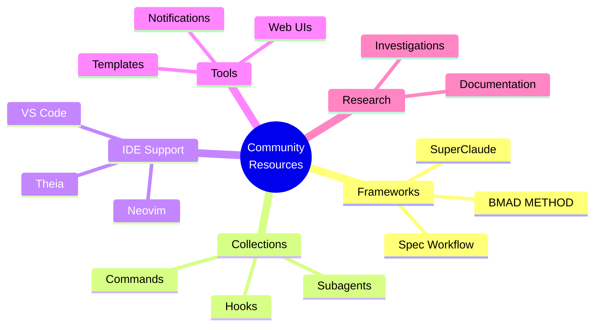

# Claude Code Community Resources

A curated catalog of community-built frameworks, tools, subagent collections, IDE integrations, and utilities that extend Claude Code's capabilities.

## Table of Contents
- [Overview](#overview)
- [Frameworks & Methodologies](#frameworks--methodologies)
- [Command & Agent Collections](#command--agent-collections)
- [IDE Integrations](#ide-integrations)
- [Automation Tools](#automation-tools)
- [Web Interfaces](#web-interfaces)
- [Development Templates](#development-templates)
- [Notification Systems](#notification-systems)
- [Research & Documentation](#research--documentation)
- [Contributing](#contributing)

## Overview

The Claude Code ecosystem has grown significantly with community contributions. This guide catalogs the best tools, frameworks, and resources to enhance your Claude Code experience.



---

## Frameworks & Methodologies

### SuperClaude Framework
**The most comprehensive Claude Code framework with 14 agents, 21 commands, and 6 modes**

- **Repository**: [github.com/SuperClaude-Org/SuperClaude_Framework](https://github.com/SuperClaude-Org/SuperClaude_Framework)
- **License**: MIT
- **Maturity**: Production-ready

**Features**:
- 🤖 **14 Specialized Agents**: Domain experts for different development tasks
- ⚡ **21 Custom Commands**: Comprehensive command library
- 🎨 **6 Working Modes**: Different workflows for various scenarios
- 🧪 **Testing Suite**: Automated validation and diagnostics
- 📊 **Diagnostic Tools**: Performance monitoring and troubleshooting

**Contents**:
```
~/.claude/
├── agents/       # 14 specialized agents
├── commands/     # 21 custom commands
└── modes/        # 6 working modes
```

**Installation**:
```bash
git clone https://github.com/SuperClaude-Org/SuperClaude_Framework.git
cd SuperClaude_Framework
./install.sh  # Follow installation script

# Verify installation
ls ~/.claude/agents/*.md | wc -l  # Should output 14
ls ~/.claude/commands/*.md | wc -l  # Should output 21
```

**Use Cases**:
- ✅ Complete development workflow setup
- ✅ Team standardization
- ✅ Enterprise Claude Code deployment
- ✅ Learning Claude Code best practices

---

### Claude Code Spec Workflow
**Automated spec-driven development and bug fix workflows**

- **Repository**: [github.com/Pimzino/claude-code-spec-workflow](https://github.com/Pimzino/claude-code-spec-workflow)
- **NPM Package**: `@pimzino/claude-code-spec-workflow`
- **License**: MIT
- **Version**: 1.5.9+

**Features**:
- 📋 **Spec-Driven Development**: Requirements → Design → Tasks → Implementation
- 🐛 **Bug Fix Workflow**: Report → Analyze → Fix → Verify
- 🎯 **Task Execution**: Intelligent task management with steering documents
- 📊 **Real-Time Dashboard**: Monitor specs and tasks (optional)

**Installation**:
```bash
npm install -g @pimzino/claude-code-spec-workflow

# Setup in your project
claude-code-spec-workflow init

# Start dashboard (optional)
claude-spec-dashboard
```

**Workflow Example**:
```bash
# Create spec
claude-spec-setup create "User Authentication System"

# Generate design documents
claude-spec-setup design

# Execute implementation tasks
claude-spec-setup execute
```

**Use Cases**:
- ✅ Structured development workflows
- ✅ Bug tracking and resolution
- ✅ Team coordination with steering documents
- ✅ Progress monitoring and reporting

---

## Command & Agent Collections

### Claude Code Subagents Collection
**Comprehensive collection of specialized AI subagents**

- **Repository**: [github.com/davepoon/claude-code-subagents-collection](https://github.com/davepoon/claude-code-subagents-collection)
- **License**: MIT

**Features**:
- 🎯 **Domain-Specific Agents**: Specialized expertise for different tasks
- 📁 **Organized Structure**: Categorized by domain
- 📚 **Well-Documented**: Each agent includes usage examples
- 🔄 **Registry System**: Automated agent discovery

**Installation**:
```bash
# Clone repository
git clone https://github.com/davepoon/claude-code-subagents-collection.git

# Install all subagents
find claude-code-subagents-collection/subagents -name "*.md" -exec cp {} ~/.claude/agents/ \;

# Install all commands
find claude-code-subagents-collection/commands -name "*.md" -exec cp {} ~/.claude/commands/ \;

# Restart Claude Code
claude
```

**Agent Categories**:
- 🔐 Security & Compliance
- 🎨 Frontend & Design
- ⚙️ Backend & Infrastructure
- 🧪 Testing & QA
- 📊 Data & Analytics
- 📝 Documentation

---

### Claude Code Templates
**CLI tool for rapid Claude Code configuration setup**

- **Repository**: [github.com/davila7/claude-code-templates](https://github.com/davila7/claude-code-templates)
- **NPM Package**: `claude-code-templates`
- **License**: MIT
- **Version**: 1.21.13+

**Features**:
- 🚀 **Framework-Specific Templates**: React, Vue, Node.js, etc.
- ⚡ **Quick Setup**: Configure Claude Code in seconds
- 🔗 **MCP Server Integration**: Pre-configured servers
- 🎯 **Automation Hooks**: Built-in hook configurations

**Installation & Usage**:
```bash
# Install globally
npm install -g claude-code-templates

# Initialize in your project (multiple aliases available)
create-claude-config
# or
claude-init
# or
cct

# Interactive setup
? Select your framework: React
? Enable MCP servers? Yes
? Add automation hooks? Yes
```

**Aliases**:
- `create-claude-config`
- `claude-code-templates`
- `claude-code-template`
- `claude-init`
- `cctemplates`
- `cct`
- `claude-setup`
- `claude-config`

---

## IDE Integrations

### Neovim Plugin
**Native Claude Code integration for Neovim**

- **Repository**: [github.com/greggh/claude-code.nvim](https://github.com/greggh/claude-code.nvim)
- **License**: MIT

**Features**:
- ⚡ Fast Neovim integration
- 🔌 Plugin initialization and setup
- 📝 Command registration
- 🔄 Version management

**Installation (lazy.nvim)**:
```lua
{
  'greggh/claude-code.nvim',
  config = function()
    require('claude-code').setup({
      -- Configuration options
    })
  end
}
```

---

### VS Code Extensions

#### 1. Claude Code Chat
**Beautiful chat interface for VS Code**

- **Repository**: [github.com/andrepimenta/claude-code-chat](https://github.com/andrepimenta/claude-code-chat)
- **Publisher**: AndrePimenta
- **Version**: 1.0.7+

**Features**:
- 💬 Beautiful chat interface
- 🎨 VS Code native styling
- ⚡ Real-time responses
- 📝 Code highlighting

**Installation**:
```bash
# Via VS Code Marketplace
code --install-extension AndrePimenta.claude-code-chat
```

#### 2. Kodu Claude Coder
**AI-powered coding assistant for VS Code**

- **Repository**: [github.com/kodu-ai/claude-coder](https://github.com/kodu-ai/claude-coder)
- **Publisher**: kodu-ai
- **License**: AGPL-3.0

**Features**:
- 🤖 AI pair programming
- 🎯 Context-aware suggestions
- 📊 Activity bar integration
- 🔄 Real-time code generation

---

### Theia IDE Integration
**Claude Code integration for Eclipse Theia**

- **Repository**: [github.com/eclipse-theia/theia](https://github.com/eclipse-theia/theia/tree/master/packages/ai-claude-code)
- **Package**: `@theia/ai-claude-code`
- **License**: EPL-2.0
- **Version**: 1.65.0+

**Installation**:
```bash
npm install @theia/ai-claude-code
```

---

## Automation Tools

### Claude Code Remote
**Smart notification system for Claude Code**

- **Repository**: [github.com/JessyTsui/Claude-Code-Remote](https://github.com/JessyTsui/Claude-Code-Remote)
- **License**: MIT

**Features**:
- 🔔 **Desktop Notifications**: Get notified when Claude completes tasks
- ⏰ **Task Monitoring**: Track long-running operations
- 🎯 **Input Alerts**: Know when Claude needs your input
- 🔗 **Hook Integration**: Uses Claude Code hooks system

**Installation**:
```bash
npm install -g claude-code-remote

# Configure
claude-remote-config
```

**Hook Configuration**:
```json
{
  "Stop": {
    "command": "node /path/to/hook-notify.js",
    "description": "Send notification when Claude stops"
  },
  "Notification": {
    "command": "node /path/to/hook-notify.js",
    "description": "Forward Claude notifications to desktop"
  }
}
```

---

### Claude Notify
**Advanced notification system with multiple hooks**

- **Repository**: [github.com/jamez01/claude-notify](https://github.com/jamez01/claude-notify)
- **License**: MIT

**Features**:
- 🎯 **Multi-Hook Support**: PreToolUse, PostToolUse, Stop, SubagentStop
- 🔍 **Project Path Extraction**: Context-aware notifications
- 🧪 **Testing Tools**: Sample data for hook testing
- 📊 **Rich Notifications**: Detailed information in alerts

**Supported Hooks**:
- `PreToolUse`: Before Claude uses a tool
- `PostToolUse`: After tool completion
- `Notification`: Claude sends notification
- `Stop`: Claude finishes responding
- `SubagentStop`: Subagent completes

---

### Claude Hooks Collection
**Comprehensive hook patterns and examples**

- **Repository**: [github.com/gabriel-dehan/claude_hooks](https://github.com/gabriel-dehan/claude_hooks)

**Features**:
- 📚 Extensive hook documentation
- 🧪 Real-world examples
- 🔐 Security patterns
- ⚡ Performance optimization hooks

---

## Web Interfaces

### Claude Code WebUI
**Web-based interface for Claude Code CLI**

- **Repository**: [github.com/sugyan/claude-code-webui](https://github.com/sugyan/claude-code-webui)
- **NPM Package**: `claude-code-webui`
- **License**: MIT
- **Version**: 0.1.56+

**Features**:
- 🌐 **Web Interface**: Access Claude Code from browser
- 💬 **Streaming Chat**: Real-time chat interface
- 📱 **Responsive Design**: Works on mobile and desktop
- 🔄 **Session Management**: Multiple sessions support

**Installation**:
```bash
# Install backend
npm install -g claude-code-webui

# Start server
claude-code-webui

# Access at http://localhost:3000
```

---

## Development Templates

### Claude Code Template Repository
**Ready-to-use Claude Code configuration templates**

- **Repository**: [github.com/alvinycheung/claude-code-template](https://github.com/alvinycheung/claude-code-template)

**Features**:
- 📋 Pre-built CLAUDE.md templates
- 🎯 Framework-specific configurations
- 🔗 MCP server examples (Supabase, etc.)
- 📚 AI documentation snippets

**Contents**:
```
ai_docs/
├── supabase.md      # Supabase integration docs
├── nextjs.md        # Next.js configurations
└── ...
```

---

## Research & Documentation

### Claude Investigations
**Deep research into Claude Code internals**

- **Repository**: [github.com/shcv/claude-investigations](https://github.com/shcv/claude-investigations)

**Features**:
- 📊 **Detailed Plugin Documentation**: `features/plugins.org`
- 📜 **Changelog Archive**: Version history and feature tracking
- 🔍 **Internal Analysis**: Deep dives into Claude Code behavior
- 🧪 **Experimental Features**: Beta feature documentation

**Highlights**:
```
features/
├── plugins.org              # Comprehensive plugin system docs
└── ...

archive/changelog/
├── changelog-v1.0.81.md     # Plugin system introduction
├── changelog-v1.0.103.md    # NPM plugin support
└── ...
```

**Key Resources**:
- Plugin system architecture documentation
- Version-by-version changelog analysis
- Feature availability tracking
- Internal implementation details

---

### Claude Code Documentation Hub
**Community-maintained documentation**

- **Repository**: [github.com/ericbuess/claude-code-docs](https://github.com/ericbuess/claude-code-docs)

**Features**:
- 📚 Comprehensive guides
- 🎯 Practical examples
- 🔄 Community contributions
- 📖 Tutorials and walkthroughs

---

## Workflow Tools

### Claude Flow
**Advanced workflow management for Claude Code**

- **Repository**: [github.com/ruvnet/claude-flow](https://github.com/ruvnet/claude-flow)
- **License**: MIT

**Features**:
- 🔄 Complex workflow orchestration
- 🎯 Task automation
- 📊 Progress tracking
- 🔗 Integration patterns

---

### Conclaude
**Configuration management and visualization**

- **Repository**: [github.com/connix-io/conclaude](https://github.com/connix-io/conclaude)

**Features**:
- ⚙️ **Configuration Management**: Manage Claude Code settings
- 📊 **Visualization**: Visualize rules and configurations
- 🎯 **Hook Management**: Manage all hooks in one place
- 🔍 **Rule Inspection**: Inspect and debug hook rules

**Commands**:
```bash
# List hooks
conclaude PostToolUse
conclaude Stop
conclaude SessionStart
conclaude SubagentStop

# Visualize configuration
conclaude visualize [--rule <rule-name>] [--show-matches]
```

---

## Learning Resources

### CC-SDD (Claude Code Spec-Driven Development)
**Educational resource for spec-driven workflows**

- **Repository**: [github.com/gotalab/cc-sdd](https://github.com/gotalab/cc-sdd)

**Features**:
- 📚 Documentation on spec-driven development
- 🎓 Learning materials
- 🧪 Examples and patterns
- 📖 Best practices

---

### Claude Code Hooks Mastery
**Master the hooks system**

- **Repository**: [github.com/disler/claude-code-hooks-mastery](https://github.com/disler/claude-code-hooks-mastery)

**Features**:
- 📚 Comprehensive hooks documentation
- 🎯 Real-world patterns
- 🧪 Testing strategies
- ⚡ Performance optimization

---

## Specialized Tools

### Roundtable AI
**Multi-agent collaboration for complex problems**

- **Repository**: [github.com/askbudi/roundtable](https://github.com/askbudi/roundtable)

**Features**:
- 🤝 **Multi-Agent Coordination**: Use multiple AI models together
- 🎯 **Task Distribution**: Assign tasks to best-suited agents
- 📊 **Aggregate Analysis**: Combine insights from multiple sources
- 🔄 **Complex Problem Solving**: Tackle issues requiring multiple perspectives

**Example Use Case**:
```
Use Gemini SubAgent for frontend performance analysis
Use Codex SubAgent for backend API optimization
Use Claude SubAgent for infrastructure review
Aggregate findings into comprehensive report
```

---

### Cyrus (Ceedar Agents)
**MCP and Claude SDK testing tools**

- **Repository**: [github.com/ceedaragents/cyrus](https://github.com/ceedaragents/cyrus/tree/main/packages/claude-runner)
- **License**: GPL-3.0

**Features**:
- 🧪 Subagent functionality testing
- 🔍 MCP configuration validation
- 📊 SDK integration testing
- 🎯 Comprehensive test scripts

---

## Comparison Matrix

| Resource | Type | Complexity | Setup Time | Best For |
|----------|------|------------|------------|----------|
| **SuperClaude Framework** | Framework | High | 10-15 min | Complete workflow setup |
| **Spec Workflow** | Framework | Medium | 5 min | Spec-driven development |
| **Subagents Collection** | Collection | Low | 2 min | Adding specialized agents |
| **Claude Templates** | CLI Tool | Low | 1 min | Quick project setup |
| **Claude Code WebUI** | Web Interface | Medium | 5 min | Browser-based access |
| **Claude Notify** | Automation | Low | 3 min | Desktop notifications |
| **Neovim Plugin** | IDE | Medium | 5 min | Neovim users |
| **VS Code Extensions** | IDE | Low | 2 min | VS Code users |

---

## Quick Start Recommendations

### For Beginners
1. Start with **Claude Code Templates** for quick setup
2. Add **Subagents Collection** for specialized help
3. Install **Claude Notify** for task tracking

### For Teams
1. Deploy **SuperClaude Framework** for standardization
2. Use **Spec Workflow** for project management
3. Set up **Web UI** for collaborative access

### For Power Users
1. Customize **SuperClaude Framework** to your needs
2. Build custom hooks with **Claude Hooks Mastery**
3. Integrate **Conclaude** for configuration management
4. Explore **Claude Investigations** for advanced features

---

## Contributing

Have you built a Claude Code tool or resource? Submit a PR to add it to this guide!

**Criteria for inclusion**:
- ✅ Open source (public repository)
- ✅ Documented (README with setup instructions)
- ✅ Maintained (recent commits or stable release)
- ✅ Adds value (unique functionality or significant improvement)

**Submission format**:
```markdown
### Tool Name
**Brief description**

- **Repository**: [github.com/username/repo](https://github.com/username/repo)
- **License**: MIT
- **Version**: 1.0.0+ (if applicable)

**Features**:
- Feature 1
- Feature 2

**Installation**:
```bash
# Installation commands
```
```

---

## Stay Updated

The Claude Code ecosystem is rapidly evolving. For the latest updates:

- 📢 **Follow Releases**: Watch repositories for new versions
- 🌟 **Star Projects**: Show support and track favorites
- 💬 **Join Discussions**: Participate in GitHub Discussions
- 🐛 **Report Issues**: Help improve community tools

---

*Last Updated: October 2025 | Community-maintained resource*
