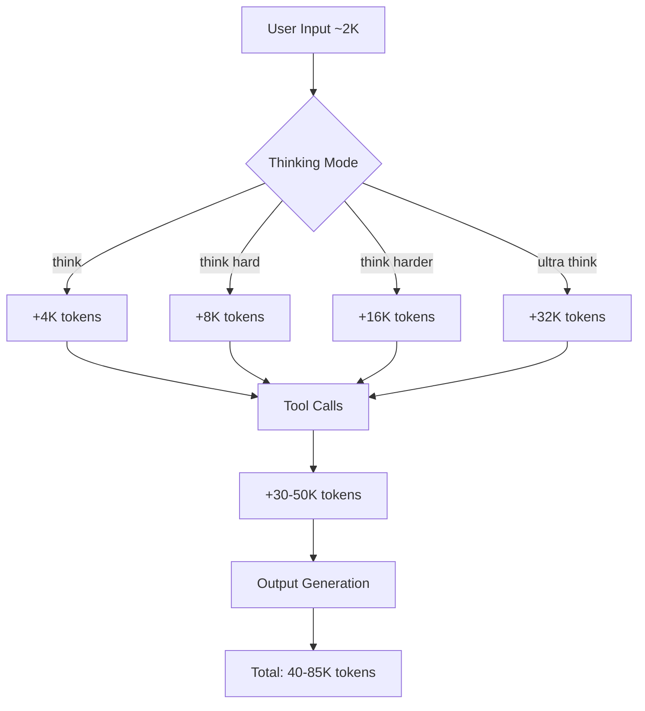
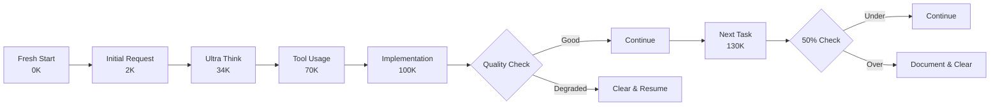
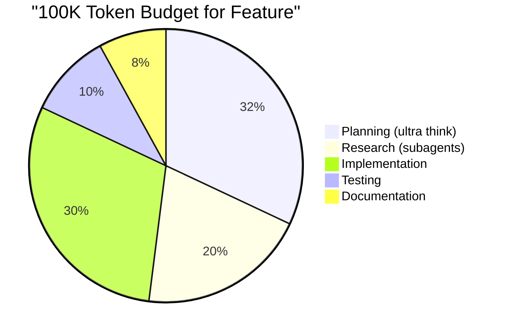
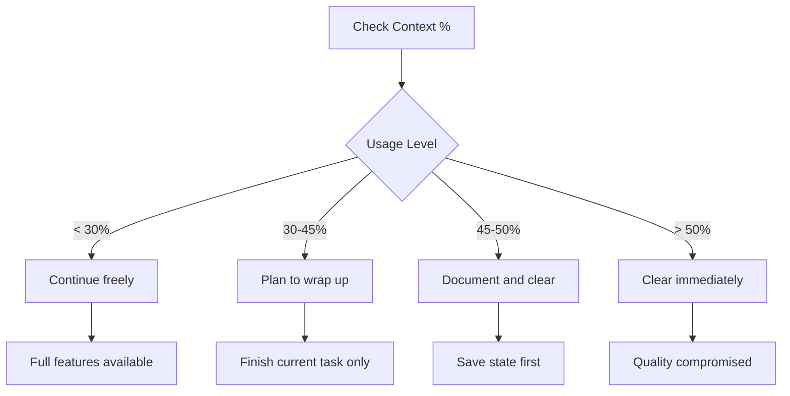

# Claude Code Context Management Guide

> Expert strategies for managing context windows effectively based on insights from Ray Fernando and Eric Buess

## The Context Window Challenge

Claude Code provides a 200K token context window, but effective usage degrades significantly as you approach capacity. Research from Chroma DB and practical experience shows that quality drops after 50% usage.

## Key Principles

### 1. The 50% Rule
- **0-50% capacity**: Optimal performance and accuracy
- **50-75% capacity**: Noticeable quality degradation
- **75-100% capacity**: Poor results, missed requirements, errors

### 2. Context Rot
Context becomes "stale" when:
- Multiple unrelated problems are mixed
- Too many tool outputs accumulate
- Conversation spans many different topics
- Instructions contradict or overlap

### 3. Less is More
Focused sessions with clear objectives outperform long, meandering conversations.

## Token Consumption Patterns

### Thinking Modes Impact



### Typical Session Progression



## Context Management Strategies

### Strategy 1: Document-Clear-Resume Pattern

```bash
# Step 1: Work until ~40% context usage
claude "Implement authentication system"

# Step 2: Document state before clearing
claude "Update CLAUDE.md with:
- Completed: [list what's done]
- In Progress: [current state]
- Next Steps: [what to do next]
- Important Context: [key decisions, issues]"

# Step 3: Clear session
/clear

# Step 4: Resume with fresh context
claude "Read CLAUDE.md and continue implementation"
```

### Strategy 2: Subagent Isolation Pattern

```bash
# Main agent maintains high-level view
claude "I need to implement user management, billing, and notifications"

# Spawn focused subagents for each component
claude "Create subagent to research and design user management"
claude "Create subagent to research and design billing system"
claude "Create subagent to research and design notifications"

# Each subagent has fresh 200K context
# Main agent only receives summaries
```

### Strategy 3: Project Index Pattern (Eric Buess)

```bash
# Maintain minified project representation
PROJECT_INDEX.json  # ~5-10K tokens for large projects

# Instead of Claude reading all files
claude "Read all files in src/"  # Could be 100K+ tokens

# Use index for navigation
claude "Read PROJECT_INDEX.json and identify auth files"
claude "Now read only src/auth/login.ts"  # Only 2K tokens
```

### Strategy 4: Phased Thinking Pattern (Ray Fernando)

```bash
# Phase 1: Heavy thinking for planning
claude ultra think "Design complete architecture"
# Uses 35K tokens

# Clear before implementation
/clear

# Phase 2: Light thinking for execution
claude think "Implement the architecture from docs"
# Uses only 5K tokens per step
```

## Context Preservation Techniques

### 1. The CLAUDE.md Pattern

```markdown
# CLAUDE.md

## Current Sprint: Authentication Implementation

### Completed ✅
- User model with bcrypt hashing
- JWT token generation
- Login/logout endpoints
- Session management

### In Progress 🔄
- OAuth integration (Google strategy done, GitHub pending)
- Working on file: src/auth/oauth.ts
- Issue: Callback URL mismatch in development

### Next Steps 📋
1. Complete GitHub OAuth strategy
2. Implement password reset flow
3. Add rate limiting
4. Write integration tests

### Decisions & Context 📝
- Using Passport.js for auth strategies
- JWT tokens expire in 15 minutes (security requirement)
- Refresh tokens stored in httpOnly cookies
- Rate limit: 5 attempts per 15 minutes

### Known Issues ⚠️
- OAuth redirect fails in Docker environment
- Need to handle expired refresh tokens
```

### 2. The Hook-Based Index

```javascript
// .claude/hooks/update-index.js
const updateProjectIndex = () => {
  // Scan all project files
  // Extract signatures, imports, exports
  // Update PROJECT_INDEX.json
  // Runs automatically on file changes
};
```

### 3. Slash Command Workflows

```bash
# Eric's cleanup command
/cleanup  # Updates docs and prepares for next phase

# Ray's fresh command
/fresh    # Reads all docs and project index

# Custom context commands
/save-context    # Saves current state
/restore-context # Restores saved state
```

## Context Budget Planning

### Per-Feature Budget Allocation



### Optimal Session Patterns

#### Pattern A: Single Feature Focus
```
Start → Ultra Think (32K) → Implement (30K) → Test (10K) → Clear
Total: ~72K tokens (36% usage) ✅
```

#### Pattern B: Multi-Step with Clears
```
Step 1: Plan (32K) → Clear
Step 2: Build Part A (40K) → Clear  
Step 3: Build Part B (40K) → Clear
Step 4: Integration (30K) → Clear
Each step under 50% ✅
```

#### Anti-Pattern: Everything at Once
```
Plan (32K) → Build All (60K) → Test (20K) → Debug (30K) → Fix (20K)
Total: 162K tokens (81% usage) ❌
```

## Monitoring Context Usage

### Visual Indicators

```bash
# Check current usage
claude "What percentage of context have we used?"

# Custom monitoring (if using hooks)
# Shows in terminal: [Context: 45%] ⚠️ Approaching limit
```

### Decision Points



## Advanced Context Techniques

### Technique 1: Context Sharding

```bash
# Split large tasks into context shards
claude "Break this feature into 5 independent parts that each use <40K context"

# Execute each shard in fresh session
for shard in 1 2 3 4 5; do
  claude --new "Implement shard $shard from plan.md"
done
```

### Technique 2: Progressive Enhancement

```bash
# Start with minimal context
claude --no-memory "Build basic version"

# Add context progressively
claude --add-context "Add error handling"
claude --add-context "Add logging"
claude --add-context "Add tests"
```

### Technique 3: Context Recycling

```bash
# Reuse context across similar tasks
claude "Create reusable context for all CRUD operations"

# Apply to multiple resources
claude "Use CRUD context for users"
/clear
claude "Use CRUD context for products"
/clear
claude "Use CRUD context for orders"
```

## Common Context Mistakes

### ❌ Mistake 1: Context Stuffing
```bash
# Bad: Loading everything upfront
claude "Read all files in the project and understand everything"
```

### ✅ Better: Lazy Loading
```bash
# Good: Load only what's needed
claude "What files are related to authentication?"
claude "Read only those authentication files"
```

### ❌ Mistake 2: Never Clearing
```bash
# Bad: One session for entire day
claude # Morning
# ... 6 hours of work ...
claude # Afternoon - degraded quality
```

### ✅ Better: Regular Resets
```bash
# Good: Fresh sessions for each major task
claude # Feature A
/clear
claude # Feature B
/clear
claude # Feature C
```

### ❌ Mistake 3: Losing Context on Clear
```bash
# Bad: Clear without preservation
/clear  # All context lost!
```

### ✅ Better: Document Before Clearing
```bash
# Good: Preserve important context
claude "Update CLAUDE.md with current state"
/clear
claude "Continue from CLAUDE.md"
```

## Context Management Checklist

Before starting a session:
- [ ] Define clear, focused objective
- [ ] Choose appropriate thinking mode
- [ ] Estimate token budget
- [ ] Plan clearing points

During the session:
- [ ] Monitor context usage
- [ ] Document decisions and state
- [ ] Clear before 50% if possible
- [ ] Use subagents for research

Before clearing:
- [ ] Update CLAUDE.md
- [ ] Document incomplete tasks
- [ ] Save important context
- [ ] Note any issues discovered

After clearing:
- [ ] Read preserved context
- [ ] Verify understanding
- [ ] Continue from saved state
- [ ] Maintain momentum

## Expert Tips

### Ray Fernando's Approach
> "Protect your context window like your firstborn child"

- Spend 60-70% time on planning (heavy thinking)
- Use subagents as code reviewers
- Clear between major phases
- Fresh sessions for architecture changes

### Eric Buess's Strategy
> "Every failure is a learning opportunity"

- Project index reduces context by 90%
- Hooks preserve context without pollution
- Blind validation prevents false completions
- Multiple small sessions beat one large session

## Measuring Context Efficiency

### Metrics to Track

1. **Tokens per Feature**: Aim for <50K
2. **Clears per Day**: 5-10 is healthy
3. **Context at Clear**: Should be <50%
4. **Rework Rate**: Lower with better context management

### Success Indicators

- ✅ Consistent code quality throughout session
- ✅ Claude remembers all requirements
- ✅ No repeated questions or forgotten context
- ✅ Accurate file modifications
- ✅ Tests pass on first run

### Warning Signs

- ⚠️ Claude forgets earlier instructions
- ⚠️ Suggestions become generic
- ⚠️ Repeated failed attempts
- ⚠️ Asking for clarification on discussed topics
- ⚠️ Code quality degradation

## Conclusion

Effective context management is the difference between frustration and flow state with Claude Code. By following these patterns and principles, you can maintain high-quality output throughout your development sessions.

Remember: **Less context, more clears, better results.**