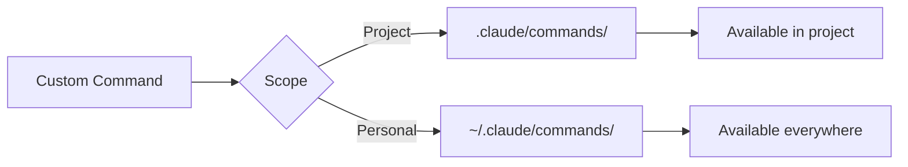

# Custom Commands Library

A curated collection of custom slash commands for Claude Code that enhance your development workflow. Copy these commands to your `.claude/commands/` or `~/.claude/commands/` directory to use them.

## Table of Contents

- [Setup Guide](#setup-guide)
- [Code Quality Commands](#code-quality-commands)
- [Development Workflow](#development-workflow)
- [Documentation Commands](#documentation-commands)
- [Testing Commands](#testing-commands)
- [Refactoring Commands](#refactoring-commands)
- [Security & Audit](#security--audit)
- [Performance Commands](#performance-commands)
- [Git Workflow](#git-workflow)
- [Project Management](#project-management)
- [AI Enhancement Commands](#ai-enhancement-commands)

## Setup Guide

### Installing Custom Commands



### Quick Installation

```bash
# Create directories
mkdir -p .claude/commands          # Project commands
mkdir -p ~/.claude/commands         # Personal commands

# Add a command (example)
echo "Review this code for performance issues:" > .claude/commands/perf-review.md

# Use the command
claude
> /perf-review
```

### Naming Conventions

- Use kebab-case: `security-audit.md`
- Be descriptive: `refactor-to-hooks.md` not `rth.md`
- Group with prefixes: `test-unit.md`, `test-e2e.md`

## Code Quality Commands

### /code-review
**File**: `.claude/commands/code-review.md`
```markdown
Perform a comprehensive code review on the recent changes:

1. Check for bugs and logic errors
2. Evaluate code clarity and readability
3. Assess performance implications
4. Review security considerations
5. Verify error handling
6. Check test coverage
7. Suggest improvements

Focus on actionable feedback with specific examples.
```

### /clean-code
**File**: `.claude/commands/clean-code.md`
```markdown
Apply clean code principles to improve code quality:

1. Simplify complex functions (max 20 lines)
2. Extract magic numbers to constants
3. Improve variable and function names
4. Remove dead code and comments
5. Reduce nesting levels (max 3)
6. Apply DRY principle
7. Add missing type annotations

Explain each change and its benefit.
```

### /smell-detector
**File**: `.claude/commands/smell-detector.md`
```markdown
Identify and fix code smells in the current codebase:

Common smells to check:
- Long methods (>30 lines)
- Large classes (>300 lines)
- Too many parameters (>4)
- Duplicate code blocks
- Feature envy
- Inappropriate intimacy
- God objects
- Primitive obsession

Provide specific locations and suggested fixes.
```

### /solid-check
**File**: `.claude/commands/solid-check.md`
```markdown
Evaluate code against SOLID principles:

1. **Single Responsibility**: Each class/function has one job
2. **Open/Closed**: Open for extension, closed for modification
3. **Liskov Substitution**: Subtypes must be substitutable
4. **Interface Segregation**: No forced implementation of unused methods
5. **Dependency Inversion**: Depend on abstractions, not concretions

Identify violations and suggest refactoring.
```

## Development Workflow

### /feature-start
**File**: `.claude/commands/feature-start.md`
```markdown
Start implementing a new feature with this structured approach:

1. Understand requirements and constraints
2. Design the solution architecture
3. Identify affected components
4. Plan the implementation steps
5. Consider edge cases and error handling
6. Design the testing strategy
7. Start with the core functionality

Create a TODO list and begin implementation.
```

### /debug-this
**File**: `.claude/commands/debug-this.md`
```markdown
Debug the current issue systematically:

1. Reproduce the problem
2. Identify the error message/symptoms
3. Locate the relevant code
4. Add logging/debugging statements
5. Trace the execution flow
6. Identify root cause
7. Implement and test the fix
8. Clean up debugging code

Explain your debugging process as you go.
```

### /optimize
**File**: `.claude/commands/optimize.md`
```markdown
Optimize the specified code for better performance:

1. Profile current performance
2. Identify bottlenecks
3. Consider algorithmic improvements
4. Optimize database queries
5. Implement caching where appropriate
6. Reduce unnecessary computations
7. Parallelize when possible
8. Measure improvements

Provide before/after comparisons.
```

### /modernize
**File**: `.claude/commands/modernize.md`
```markdown
Modernize legacy code to use current best practices:

1. Update deprecated APIs
2. Use modern language features
3. Apply current design patterns
4. Improve type safety
5. Update dependencies
6. Enhance error handling
7. Add proper logging
8. Improve configuration management

Maintain backward compatibility where needed.
```

## Documentation Commands

### /doc-api
**File**: `.claude/commands/doc-api.md`
```markdown
Generate comprehensive API documentation:

1. Document all endpoints with descriptions
2. Include request/response examples
3. List all parameters and their types
4. Document error responses
5. Add authentication requirements
6. Include rate limiting information
7. Provide curl examples
8. Generate OpenAPI/Swagger spec if applicable

Use clear, concise language with practical examples.
```

### /doc-functions
**File**: `.claude/commands/doc-functions.md`
```markdown
Add comprehensive documentation to functions:

For each function, add:
1. Brief description
2. Parameter descriptions with types
3. Return value description
4. Example usage
5. Possible exceptions
6. Side effects (if any)
7. Complexity notes (if relevant)

Use JSDoc, docstrings, or appropriate format for the language.
```

### /readme-gen
**File**: `.claude/commands/readme-gen.md`
```markdown
Create or update a comprehensive README.md:

Include:
1. Project title and description
2. Key features
3. Installation instructions
4. Quick start guide
5. Usage examples
6. API documentation (if applicable)
7. Configuration options
8. Contributing guidelines
9. License information
10. Contact/support information

Make it clear, well-structured, and helpful for new users.
```

### /changelog
**File**: `.claude/commands/changelog.md`
```markdown
Generate a changelog entry for recent changes:

Format:
## [Version] - YYYY-MM-DD

### Added
- New features

### Changed
- Modified functionality

### Fixed
- Bug fixes

### Deprecated
- Features to be removed

### Removed
- Deleted features

### Security
- Security updates

Review git history and create appropriate entries.
```

## Testing Commands

### /test-gen
**File**: `.claude/commands/test-gen.md`
```markdown
Generate comprehensive tests for the specified code:

1. Unit tests for all public methods
2. Edge case testing
3. Error condition testing
4. Integration tests where appropriate
5. Mock external dependencies
6. Achieve >80% code coverage
7. Use descriptive test names
8. Follow AAA pattern (Arrange, Act, Assert)

Include both positive and negative test cases.
```

### /test-missing
**File**: `.claude/commands/test-missing.md`
```markdown
Identify untested code and create missing tests:

1. Find functions without test coverage
2. Identify untested edge cases
3. Look for untested error paths
4. Check for missing integration tests
5. Generate tests for uncovered code
6. Focus on critical business logic first

Report current coverage and target coverage.
```

### /test-e2e
**File**: `.claude/commands/test-e2e.md`
```markdown
Create end-to-end tests for user workflows:

1. Identify critical user journeys
2. Set up test environment
3. Write tests for happy paths
4. Add tests for error scenarios
5. Include data validation tests
6. Test cross-browser compatibility (if web)
7. Add performance assertions
8. Create test data fixtures

Use appropriate E2E framework (Cypress, Playwright, etc.).
```

### /test-perf
**File**: `.claude/commands/test-perf.md`
```markdown
Create performance tests and benchmarks:

1. Identify performance-critical code
2. Create benchmark tests
3. Test with various data sizes
4. Measure memory usage
5. Test concurrent operations
6. Check for memory leaks
7. Compare with baseline metrics
8. Generate performance report

Include recommendations for improvements.
```

## Refactoring Commands

### /extract-component
**File**: `.claude/commands/extract-component.md`
```markdown
Extract reusable components from existing code:

1. Identify duplicated UI/logic
2. Extract to separate component/module
3. Define clear interfaces/props
4. Update all usage locations
5. Add proper typing
6. Document the component
7. Add tests for the component
8. Ensure backward compatibility

Follow component best practices for the framework.
```

### /split-function
**File**: `.claude/commands/split-function.md`
```markdown
Split large functions into smaller, focused ones:

1. Identify functions >30 lines
2. Find logical boundaries
3. Extract helper functions
4. Ensure single responsibility
5. Improve naming
6. Maintain original behavior
7. Add unit tests for new functions
8. Update documentation

Keep functions under 20 lines when possible.
```

### /design-pattern
**File**: `.claude/commands/design-pattern.md`
```markdown
Apply appropriate design patterns to improve code structure:

Consider patterns like:
- Singleton (single instance)
- Factory (object creation)
- Observer (event handling)
- Strategy (algorithm selection)
- Decorator (behavior extension)
- Repository (data access)
- Dependency Injection

Analyze the code and apply the most suitable pattern.
```

### /async-refactor
**File**: `.claude/commands/async-refactor.md`
```markdown
Refactor synchronous code to use async/await:

1. Identify blocking operations
2. Convert callbacks to promises
3. Use async/await syntax
4. Handle errors properly
5. Prevent race conditions
6. Add loading states (if UI)
7. Test async behavior
8. Update documentation

Ensure proper error handling and cancellation.
```

## Security & Audit

### /security-audit
**File**: `.claude/commands/security-audit.md`
```markdown
Perform a comprehensive security audit:

Check for:
1. SQL injection vulnerabilities
2. XSS (Cross-site scripting) risks
3. CSRF vulnerabilities
4. Insecure authentication
5. Exposed sensitive data
6. Insecure dependencies
7. Missing input validation
8. Improper error handling
9. Insecure file operations
10. Missing rate limiting

Provide specific fixes for each issue found.
```

### /secret-scan
**File**: `.claude/commands/secret-scan.md`
```markdown
Scan for exposed secrets and sensitive data:

1. Check for hardcoded passwords
2. Look for API keys in code
3. Find exposed tokens
4. Identify sensitive configuration
5. Check for committed .env files
6. Look for private keys
7. Find debugging information
8. Check for personal data

Move secrets to environment variables or secret management.
```

### /dependency-audit
**File**: `.claude/commands/dependency-audit.md`
```markdown
Audit and update project dependencies:

1. Check for known vulnerabilities
2. Identify outdated packages
3. Find unused dependencies
4. Check license compatibility
5. Update to latest stable versions
6. Test after updates
7. Document breaking changes
8. Update lock files

Provide a report with recommendations.
```

### /auth-review
**File**: `.claude/commands/auth-review.md`
```markdown
Review authentication and authorization implementation:

1. Check password policies
2. Review session management
3. Verify token expiration
4. Check role-based access
5. Review OAuth implementation
6. Verify rate limiting
7. Check for privilege escalation
8. Review password reset flow
9. Check MFA implementation
10. Verify secure communication

Suggest security improvements.
```

## Performance Commands

### /perf-analyze
**File**: `.claude/commands/perf-analyze.md`
```markdown
Analyze code for performance issues:

1. Identify expensive operations
2. Find N+1 query problems
3. Detect memory leaks
4. Check for inefficient algorithms
5. Find unnecessary re-renders (if UI)
6. Identify blocking operations
7. Check cache effectiveness
8. Review database indexes
9. Analyze bundle size (if applicable)

Provide specific optimization suggestions.
```

### /db-optimize
**File**: `.claude/commands/db-optimize.md`
```markdown
Optimize database queries and schema:

1. Analyze slow queries
2. Add appropriate indexes
3. Optimize JOIN operations
4. Review query patterns
5. Implement query caching
6. Consider denormalization where appropriate
7. Add database constraints
8. Optimize data types
9. Review connection pooling

Include query execution plans and improvements.
```

### /cache-strategy
**File**: `.claude/commands/cache-strategy.md`
```markdown
Implement effective caching strategies:

1. Identify cacheable data
2. Choose appropriate cache levels
3. Implement cache invalidation
4. Add Redis/Memcached if needed
5. Use HTTP caching headers
6. Implement client-side caching
7. Add CDN caching rules
8. Monitor cache hit rates

Provide specific implementation details.
```

## Git Workflow

### /pr-review
**File**: `.claude/commands/pr-review.md`
```markdown
Review the current pull request:

1. Check code changes for issues
2. Verify tests are included
3. Review documentation updates
4. Check for breaking changes
5. Verify coding standards
6. Test the changes locally
7. Check performance impact
8. Review security implications

Provide constructive feedback with specific suggestions.
```

### /commit-smart
**File**: `.claude/commands/commit-smart.md`
```markdown
Create smart, atomic commits from current changes:

1. Review all changes
2. Group related changes
3. Create atomic commits
4. Write descriptive messages
5. Follow conventional commits
6. Include issue references
7. Separate refactoring from features
8. Keep commits small and focused

Use interactive staging when needed.
```

### /branch-cleanup
**File**: `.claude/commands/branch-cleanup.md`
```markdown
Clean up git branches and history:

1. List all local branches
2. Identify merged branches
3. Delete merged branches
4. Identify stale branches
5. Clean up remote tracking
6. Prune deleted remote branches
7. Archive old feature branches

Keep the repository organized and clean.
```

## Project Management

### /tech-debt
**File**: `.claude/commands/tech-debt.md`
```markdown
Identify and document technical debt:

1. Find code that needs refactoring
2. Identify outdated dependencies
3. List missing documentation
4. Find inadequate test coverage
5. Identify performance bottlenecks
6. List security concerns
7. Find inconsistent patterns
8. Prioritize by impact/effort

Create a technical debt register with action items.
```

### /milestone-check
**File**: `.claude/commands/milestone-check.md`
```markdown
Review progress toward project milestone:

1. List completed features
2. Identify remaining tasks
3. Check test coverage
4. Review documentation status
5. Identify blockers
6. Assess timeline
7. Review quality metrics
8. Prepare status summary

Provide actionable next steps.
```

### /architecture-review
**File**: `.claude/commands/architecture-review.md`
```markdown
Review and document system architecture:

1. Analyze current architecture
2. Identify architectural patterns
3. Document component interactions
4. Review data flow
5. Check for bottlenecks
6. Identify scaling concerns
7. Review security boundaries
8. Document API contracts
9. Create architecture diagrams

Suggest improvements where needed.
```

## AI Enhancement Commands

### /ai-improve
**File**: `.claude/commands/ai-improve.md`
```markdown
Use AI best practices to enhance this code:

1. Add intelligent error recovery
2. Implement smart defaults
3. Add predictive features
4. Improve user experience with AI
5. Add natural language interfaces
6. Implement smart suggestions
7. Add anomaly detection
8. Improve search with AI

Focus on practical, valuable enhancements.
```

### /prompt-optimize
**File**: `.claude/commands/prompt-optimize.md`
```markdown
Optimize prompts for better AI interactions:

1. Make prompts clear and specific
2. Add context and examples
3. Structure for clarity
4. Remove ambiguity
5. Add validation criteria
6. Include edge cases
7. Optimize token usage
8. Test with variations

Improve prompt engineering for better results.
```

### /ai-test-gen
**File**: `.claude/commands/ai-test-gen.md`
```markdown
Generate intelligent test cases using AI techniques:

1. Generate edge cases automatically
2. Create property-based tests
3. Generate fuzzing inputs
4. Create mutation tests
5. Generate performance scenarios
6. Create security test cases
7. Generate user behavior tests

Use AI to find testing gaps and generate comprehensive tests.
```

## Advanced Command Patterns

### Namespaced Commands

Organize related commands in subdirectories:

```bash
.claude/commands/
├── test/
│   ├── unit.md
│   ├── integration.md
│   └── e2e.md
├── refactor/
│   ├── extract.md
│   ├── simplify.md
│   └── modernize.md
└── review/
    ├── security.md
    ├── performance.md
    └── code.md
```

Use as: `/test/unit`, `/refactor/extract`, etc.

### Parameterized Commands

Commands can accept arguments:

**File**: `.claude/commands/generate.md`
```markdown
Generate code based on the type specified:

Types:
- component: React/Vue component
- api: REST API endpoint
- model: Database model
- test: Test file
- service: Service class

Generate a $1 with proper structure, typing, and tests.
```

Usage: `/generate component UserProfile`

### Composite Commands

Combine multiple operations:

**File**: `.claude/commands/full-review.md`
```markdown
Perform a complete code review:

1. Run /code-review
2. Run /security-audit
3. Run /perf-analyze
4. Run /test-missing
5. Generate summary report

Provide prioritized recommendations.
```

## Best Practices

### Command Design

1. **Be Specific**: Clear, actionable instructions
2. **Add Context**: Include why and when to use
3. **Provide Structure**: Use numbered lists or sections
4. **Include Examples**: Show expected outcomes
5. **Set Standards**: Reference style guides

### Organization

```bash
# Personal commands (available everywhere)
~/.claude/commands/
├── daily/           # Daily workflow commands
├── review/          # Review commands
└── utility/         # General utilities

# Project commands (project-specific)
.claude/commands/
├── setup/           # Project setup
├── deploy/          # Deployment commands
└── project/         # Project-specific tasks
```

### Maintenance

- Review and update commands regularly
- Remove unused commands
- Share useful commands with team
- Version control project commands
- Document complex commands

---

*Start with a few essential commands and build your library over time. The best commands are those that solve your specific, recurring needs.*