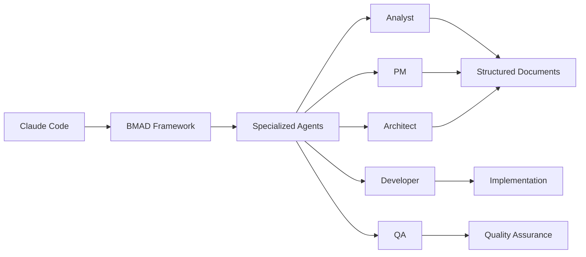
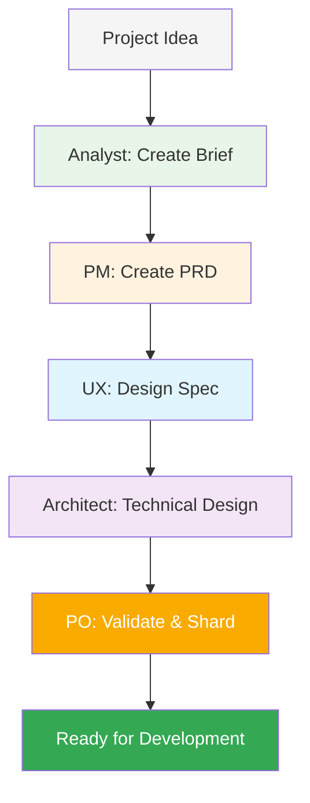
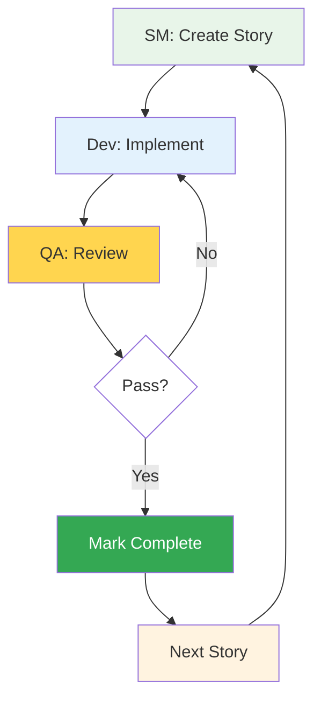
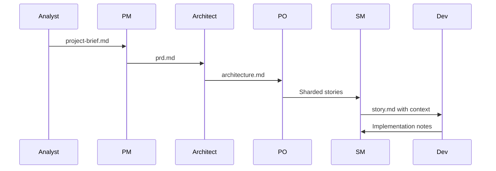

# BMAD-METHOD Integration with Claude Code

BMAD-METHOD (Breakthrough Method of Agile AI-Driven Development) is a comprehensive framework that enhances Claude Code with structured AI agent workflows for complex software development projects. It provides a systematic approach to planning and development through specialized AI agents that collaborate via structured documents.

## Table of Contents

- [Overview](#overview)
- [Key Concepts](#key-concepts)
- [Installation & Setup](#installation--setup)
- [Agent Roles & Responsibilities](#agent-roles--responsibilities)
- [Workflow Phases](#workflow-phases)
- [Agent Collaboration Mechanisms](#agent-collaboration-mechanisms)
- [Using BMAD with Claude Code](#using-bmad-with-claude-code)
- [Directory Structure](#directory-structure)
- [Practical Examples](#practical-examples)
- [Expansion Packs](#expansion-packs)
- [Uninstallation](#uninstallation)
- [Best Practices](#best-practices)

## Overview

BMAD-METHOD transforms AI-assisted development by providing:
- **Structured agent workflows** for consistent, high-quality output
- **Document-based collaboration** between specialized AI agents
- **Context-efficient development** through story files with embedded implementation details
- **Two-phase approach**: Planning (Web UI) → Development (IDE)

### How BMAD Enhances Claude Code



## Key Concepts

### Core Philosophy: Collaborative Elevation

**"The BMAD method is all about elevating yourself, learning, and also elevating the LLM. As a whole, you are both better collectively than each one on its own. That is the special sauce of the BMAD method."** - Brian (Creator)

BMAD is NOT about:
- ❌ Checking your brain at the door
- ❌ Having AI do all the thinking for you
- ❌ Replacing human creativity and judgment

BMAD IS about:
- ✅ Working together with AI as a coach and partner
- ✅ Pushing both yourself and the LLM to be better
- ✅ Learning through interaction and questioning
- ✅ Creating better outcomes through collaboration

### Document-Based Collaboration
Agents don't communicate directly - they pass structured documents with specific sections, statuses, and ownership rules:
- **Project Brief** → **PRD** → **Architecture** → **Story Files**
- Each document builds upon previous outputs
- Maintains consistency and context throughout the project

### Story Files as Communication Hub
Story files contain everything a developer needs:
- User story in standard format
- Acceptance criteria from PRD
- Tasks/subtasks breakdown
- **Dev Notes** with ALL technical context
- Status tracking (Draft → Approved → InProgress → Review → Done)

### Context Engineering
The Scrum Master agent embeds complete context in story files, so the Dev agent never needs to read full architecture documents - reducing token usage and improving focus.

## Installation & Setup

BMAD installs **per-project**, not globally. Each project needs its own BMAD installation.

### Quick Installation

```bash
# Navigate to your project directory
cd your-project

# Install BMAD (creates .bmad-core and IDE configurations)
npx bmad-method install

# Or if you already have BMAD installed elsewhere:
git pull
npm run install:bmad
```

### What Gets Installed

```
your-project/
├── .bmad-core/           # Main BMAD framework files
│   ├── agents/           # Agent definitions
│   ├── tasks/            # Task templates
│   ├── templates/        # Document templates
│   └── workflows/        # Workflow configurations
├── core-config.yaml      # BMAD configuration
└── .{ide}/              # IDE-specific configurations
    └── commands/BMad/    # Claude Code, Cursor, Windsurf, etc.
```

### IDE Integration

BMAD automatically configures for your IDE:
- **Claude Code**: `.claude/commands/BMad/`
- **Cursor**: `.cursor/rules/bmad/`
- **Windsurf**: `.windsurf/workflows/`
- **GitHub Copilot**: `.github/chatmodes/`

## Agent Roles & Responsibilities

### Planning Phase Agents (Web UI)

| Agent | Role | Creates | Persona Name |
|-------|------|---------|--------------|
| **Analyst** | Research & requirements gathering | `project-brief.md` | Mary |
| **PM** | Product requirements definition | `prd.md` with epics/stories | - |
| **UX Expert** | UI/UX specification | `front-end-spec.md` | - |
| **Architect** | Technical design | `architecture.md` | - |
| **PO** | Document validation & sharding | Sharded epics/stories | - |

### Development Phase Agents (IDE)

| Agent | Role | Updates | Persona Name |
|-------|------|---------|
| **Scrum Master** | Story creation with full context | Creates `story.md` files | - |
| **Developer** | Implementation | Executes story tasks | James |
| **QA** | Testing & quality assurance | Adds test results to stories | Quinn |

## Workflow Phases

### Phase 1: Planning (Web UI Recommended)



### Phase 2: Development (IDE)



## Advanced Features

### Brainstorming Techniques (Analyst Agent)

The Analyst agent (Mary) includes 20+ brainstorming techniques for creative ideation:

#### Core Techniques
1. **What-if Scenarios** - Explore hypothetical situations and possibilities
2. **Analogical Thinking** - Draw parallels from other domains
3. **Reversal/Inversion** - Challenge assumptions by reversing them
4. **First Principles Thinking** - Break down to fundamental truths
5. **Six Thinking Hats** - Explore different perspectives (white/facts, yellow/optimistic, black/critical, red/emotional, green/creative, blue/process)
6. **Five W's** - Deep root cause analysis (Why? → Why? → Why? → Why? → Why?)

#### Structured Frameworks
7. **SCAMPER Method** - Substitute, Combine, Adapt, Modify, Put to other uses, Eliminate, Reverse
8. **Mind Mapping** - Visual organization of ideas and connections
9. **Morphological Analysis** - Systematic exploration of parameter combinations

#### Collaborative Techniques
10. **Yes-And** - Build on ideas without judgment (from improv)
11. **Brainwriting** - Silent idea generation and sharing
12. **Round-Robin** - Sequential contribution of ideas

#### Creative Stimulation
13. **Random Stimulation** - Use random inputs to trigger new ideas
14. **Forced Relationships** - Connect unrelated concepts
15. **Assumption Reversal** - Challenge core assumptions
16. **Role-Playing** - Explore different user personas and scenarios
17. **Timeshifting** - Consider past/future perspectives
18. **Resource Constraints** - Innovate within limitations
19. **Metaphor Mapping** - Use metaphors to generate insights
20. **Questionstorming** - Generate questions instead of answers

#### Brainstorming Modes
- **Technique Selection** - Choose specific techniques manually
- **Agent Recommendation** - Let the agent suggest based on your project
- **Random Creative Chaos** - Mix of unexpected techniques
- **Progressive Creative Journey** - Start broad, gradually focus (5 stages)

### Advanced Elicitation Methods

These methods push the LLM to deliver higher-quality outputs:

#### Core Elicitation Techniques
1. **Explain Reasoning** - Detailed justification of decisions
2. **Critique and Refine** - Self-assessment and improvement
3. **Analyze Logical Flow** - Verify reasoning consistency
4. **Assess Alignment** - Check against overall goals
5. **Identify Potential Risks** - Proactive risk assessment
6. **Challenge from Critical Perspective** - Devil's advocate approach

#### Advanced 2025 Techniques
7. **Tree of Thought** - Explore multiple reasoning paths
8. **Deep Dives** - Exhaustive exploration of specific aspects
9. **Hindsight is 20/20** - Imagine future retrospective ("If only we had...")
10. **Agile Team Perspective Shift** - View from different agent roles
11. **Stakeholder Roundtable** - Multiple stakeholder viewpoints
12. **Meta-Prompting Analysis** - Analyze the prompting strategy itself

#### Innovative Methods
13. **Self-Consistency Validations** - Cross-check multiple outputs
14. **REwOO (Reasoning without Observation)** - Pure reasoning approach
15. **Persona Pattern Hybrid** - Combine multiple personas
16. **Emerging Collaborative Discovery** - Co-creation with the LLM
17. **Red Team vs Blue Team** - Adversarial testing
18. **Innovation Tournament** - Compete multiple solutions
19. **Escape Room Challenge** - Solve constraints creatively
20. **Proceed/No Further Action** - Decision point analysis

### Mid-Project Course Correction

The **Scrum Master** agent includes a powerful "correct course" feature for handling mid-project pivots:

```bash
# When you need to change direction mid-project
claude "/bmad-sm correct course"

# The agent will:
# 1. Analyze current progress
# 2. Understand requested changes
# 3. Determine optimal pivot strategy:
#    - Revert to earlier stage with new stories
#    - Generate new future stories from current point
#    - Recommend complete restart (rare)
# 4. Update epics, stories, and architecture as needed
```

This feature handles:
- Forgotten requirements
- Major scope changes
- New API/library adoptions
- Technology stack updates
- Architecture pivots

### Product Owner Checklist

The PO agent includes a validation command to ensure alignment:

```bash
# Run before starting development
claude "/bmad-po run checklist"

# Validates:
# - Story/architecture alignment
# - No missing requirements
# - Consistent technology choices
# - Complete acceptance criteria
# - Proper story sequencing
```

### Document Sharding with md-tree

BMAD uses `md-tree` for efficient document management:

```bash
# Shard large documents into smaller, focused files
claude "/shard doc"

# Or manually:
md-tree explode docs/prd.md --output docs/prd/
md-tree explode docs/architecture.md --output docs/architecture/

# Creates:
# - prd/epic-1.md, prd/epic-2.md, etc.
# - architecture/tech-stack.md
# - architecture/coding-standards.md
# - architecture/source-tree.md
```

Benefits:
- Reduces context per agent interaction
- Improves token efficiency
- Enables selective loading
- Maintains document organization

### Developer Configuration

The Dev agent automatically loads specific files via `core-config.yaml`:

```yaml
# .bmad-core/agents/dev/core-config.yaml
dev_load_always_files:
  - architecture/coding-standards.md
  - architecture/tech-stack.md
  - architecture/source-tree.md
  - current-story.md
```

Customize by editing the configuration to include project-specific files.

### Unsafe Mode for Development

For faster development with trusted code:

```bash
# Enable unsafe mode in Claude Code
claude --unsafe

# Or toggle within session
/unsafe on

# Allows:
# - Automatic file operations
# - Continuous execution without prompts
# - Batch operations
# 
# Use with caution!
```

## Agent Collaboration Mechanisms

### 1. Document Handoffs


### 2. Story File Structure
```yaml
Status: Draft → Approved → InProgress → Review → Done
Story: As a [role], I want [action], so that [benefit]
Acceptance Criteria:
  1. [Criteria from PRD]
  2. [Additional criteria]
Tasks/Subtasks:
  - [ ] Task 1 (AC: #1)
    - [ ] Subtask 1.1
  - [ ] Task 2 (AC: #2)
Dev Notes:
  [Complete technical context from architecture]
  [Previous story insights]
  [Implementation guidance]
```

### 3. Context Embedding
The SM agent ensures the Dev agent has everything needed:
- Relevant tech stack details
- API specifications
- Database schemas
- Component structures
- Testing requirements

## Using BMAD with Claude Code

### 1. Planning Phase (Optional Web UI)
```bash
# For web-based planning with Claude/Gemini:
# 1. Navigate to dist/teams/
# 2. Copy team-fullstack.txt
# 3. Upload to Claude/Gemini with instructions
# 4. Use *analyst, *pm, *architect commands
```

### 2. Development Phase in Claude Code
```bash
# Start Claude Code in your project
claude

# Access BMAD agents (after installation)
/bmad-dev      # Developer agent
/bmad-sm       # Scrum Master agent
/bmad-qa       # QA agent

# Or use the master agent
/bmad-master   # Can perform any non-dev task
```

### 3. Story-Driven Development
```bash
# Create next story
claude "/bmad-sm create next story from sharded epics"

# Implement story
claude "/bmad-dev implement story 1.1"

# QA review
claude "/bmad-qa review and test story 1.1"
```

## Directory Structure

### Project Structure After BMAD Installation
```
your-project/
├── .bmad-core/              # BMAD framework
├── core-config.yaml         # Configuration
├── docs/
│   ├── prd.md              # Product requirements
│   ├── architecture.md     # Technical design
│   ├── prd/                # Sharded PRD
│   │   └── epic-1.md
│   ├── architecture/       # Sharded architecture
│   └── stories/            # Story files
│       └── 1.1.user-auth.md
└── .claude/commands/BMad/   # Claude Code integration
```

### Story File Locations
- **Default**: `docs/stories/{epic}.{story}.{title}.md`
- **Configurable** via `core-config.yaml`

## Practical Examples

### Example 1: Starting a New Project
```bash
# 1. Initialize project and install BMAD
mkdir my-app && cd my-app
npx bmad-method install

# 2. In Claude Code, create project brief
claude "As BMAD analyst, help me create a project brief for a task management app with real-time collaboration"

# 3. Generate PRD from brief
claude "As BMAD PM, create a PRD from the project brief"

# 4. Create architecture
claude "As BMAD architect, design the technical architecture based on the PRD"

# 5. Start development
claude "As BMAD SM, create the first story from the sharded epics"
```

### Example 2: Complete Workflow from Video Tutorial

```bash
# 1. Install BMAD (5 seconds!)
npx bmad-method install
# Enter: ./simple-todo
# Select: BMAD core
# Accept: Shard PRD and Architecture
# Select: Claude Code (spacebar to select!)
# Create directory and continue

# 2. Start brainstorming with Analyst (Mary)
claude
/bmad-analyst
*brainstorm

# Answer 4 questions about your project
# Select brainstorming techniques:
#   - Six Thinking Hats
#   - Five W's
#   - Role-Playing
# Work through exercises (~15 mins each)
# Receive brainstorming-session.md

# 3. Create Project Brief
/clear  # Start fresh chat
/bmad-analyst
*create project brief
# Drop in brainstorming-session.md
# Work through sections with advanced elicitations

# 4. Generate PRD with PM
/clear
/bmad-pm
*create prd
# Provide project-brief.md
# Use "Hindsight is 20/20" elicitation
# Apply insights to refine requirements

# 5. Design Architecture
/clear
/bmad-architect
*create backend architecture
# Provide prd.md
# Review technology choices
# Add coding standards (e.g., JSDoc comments)

# 6. Shard Documents
/shard doc
# Drag in prd.md → creates prd/ folder
# Drag in architecture.md → creates architecture/ folder

# 7. Create First Story with Scrum Master
/clear
/bmad-sm
*draft 1.1
# Reviews sharded docs
# Creates story-1.1-project-setup.md
# Change status from Draft to Approved

# 8. Implement with Developer (James)
/clear
/bmad-dev
*develop story
# Drag in story-1.1-project-setup.md
# Watch implementation
# Status changes to Review

# 9. QA Review (Quinn)
/clear
/bmad-qa
*review
# Drag in story-1.1-project-setup.md
# Receive compliance report
# Status changes to Done

# 10. Continue with next story...
```

### Example 3: Brainstorming Output Document

After brainstorming, the Analyst produces a comprehensive document:

```markdown
# Brainstorming Session - [Project Name]

## Technique 1: Six Thinking Hats
### White Hat (Facts)
- [Data points and metrics identified]
### Yellow Hat (Optimistic)
- [Benefits and positive outcomes]
### Black Hat (Critical)
- [Risks and concerns]
### Red Hat (Emotional)
- [User feelings and reactions]
### Green Hat (Creative)
- [Innovative features and approaches]
### Blue Hat (Process)
- [Implementation strategy]

## Technique 2: Five W's Deep Dive
### Level 1: Why build this?
[Answer]
### Level 2: Why is that important?
[Deeper answer]
### Level 3-5: [Continued exploration]

## Technique 3: Role-Playing Scenarios
### Persona 1: [e.g., Overwhelmed Freelancer]
- Pain points: [Specific challenges]
- Needed features: [Solutions]
### Persona 2-4: [Additional personas]

## Executive Summary
### Key Insights
1. [Major discovery from brainstorming]
2. [Behavioral patterns identified]
3. [Innovation opportunities]

### Implementation Priorities
#### Now (MVP)
- [Core features for immediate build]
#### Next (Post-MVP)
- [Features for second phase]
#### Later (Moonshots)
- [Ambitious future features]
```

## Expansion Packs

BMAD supports domain-specific expansion packs:

### Available Packs
- **Creative Writing**: Fiction, screenwriting, narrative design
- **Game Development**: Unity 2D, Phaser frameworks
- **Infrastructure/DevOps**: Platform automation, CI/CD

### Installing Expansion Packs
```bash
# During initial installation
npx bmad-method install
# Select expansion packs from the menu

# Or add to package.json and reinstall
"bmad-creative-writing": "^1.0.0"
npm run install:bmad
```

## Uninstallation

BMAD is installed per-project. To remove it completely:

```bash
# Remove all BMAD files and folders
rm -rf .bmad-core/ core-config.yaml \
  .cursor/rules/bmad/ .claude/commands/BMad/ \
  .windsurf/workflows/ .github/chatmodes/ \
  docs/prd/ docs/epics/ docs/stories/ docs/architecture/

# Or use this one-liner
rm -rf .bmad-core/ core-config.yaml .cursor/rules/bmad/ .claude/commands/BMad/ .crush/commands/BMad/ .windsurf/workflows/ .trae/rules/ .clinerules/ .gemini/bmad-method/ .github/chatmodes/ .qwen/bmad-method/ .roomodes .kilocodemodes
```

## Best Practices

### 1. Planning Phase
- ✅ Use Web UI for planning (cost-effective with powerful models)
- ✅ Ensure PO validates all documents before development
- ✅ Create comprehensive PRD with clear acceptance criteria
- ✅ Use brainstorming for complex or creative projects
- ✅ Challenge assumptions with advanced elicitations

### 2. Development Phase
- ✅ Let SM create detailed story files with full context
- ✅ Follow the story structure and complete all tasks
- ✅ Update story status as you progress
- ✅ Add implementation notes for future stories
- ✅ Review each story implementation with QA agent

### 3. Context Management
- ✅ **Start new chat after each major document** (Brian's method)
- ✅ Keep stories focused on single features
- ✅ Use document sharding for large projects
- ✅ Rely on Dev Notes instead of reading full docs
- ✅ Preserve previous story insights
- ✅ Clear context between agents: `/clear` or `/resume`
- ✅ Watch for compaction warnings and switch chats

### 4. Agent Usage
- ✅ Use specialized agents for their intended roles
- ✅ Switch to bmad-master for non-dev tasks
- ✅ Create new chat for each story to minimize context
- ✅ Compact conversations regularly
- ✅ Use `*help` to see available commands for each agent
- ✅ Talk to agents as if they were the actual role

### 5. Workflow Tips from Brian (Creator)

#### Quick Installation Flow
```bash
# 5-second installation
npx bmad-method install
# Select project directory
# Select BMAD core
# Accept sharding defaults
# Select IDE (spacebar to select!)
# Done!
```

#### Agent Selection Tips
- Use fuzzy matching: Type partial agent names
- Use numbers from help menu for quick selection
- Use arrow keys to browse available agents

#### Document Production Strategy
1. Generate documents section by section in IDE
2. Save after each major section
3. Start fresh chat for next agent
4. Keep documents in version control

#### Learning Through Interaction
- Ask agents "why" questions about their decisions
- Use "Five W's" technique with any agent
- Request explanations for technical choices
- Don't be embarrassed to ask "dumb" questions

#### Project Organization
```
project/
├── docs/           # Active documents
├── ignore/         # Archived documents (in .gitignore)
└── .bmad-core/     # BMAD framework
```

Move completed planning docs to `ignore/` folder to prevent context pollution.

#### Model Selection Strategy
- **Sonnet**: Most tasks, brainstorming, planning
- **Opus**: Architecture design, QA review
- **Haiku**: Simple edits, status updates
- Develop intuition through practice

#### Story Validation Checklist
- ✅ First story should be project setup/scaffolding
- ✅ Stories should be independent
- ✅ No forward dependencies
- ✅ Clear acceptance criteria
- ✅ Proper sequencing

#### Advanced Techniques
- Use `*draft 1.1` to specify exact story
- Use `*correct course` for mid-project pivots
- Use `*run checklist` before development
- Review sharded documents before starting

### 6. Common Pitfalls to Avoid
- ❌ Don't skip planning for complex projects
- ❌ Don't let context grow too large
- ❌ Don't ignore compaction warnings
- ❌ Don't forget to shard large documents
- ❌ Don't check your brain at the door - stay engaged!

### 7. When to Use Each Workflow

#### Full BMAD Flow
Best for:
- New greenfield projects
- Complex applications
- Team collaborations
- Learning projects

#### Direct to Development
Best for:
- Simple utilities
- Quick prototypes
- Well-understood requirements
- Solo projects

#### Brownfield Workflow
Best for:
- Existing codebases
- Legacy modernization
- Feature additions
- Bug fixes in complex systems

## Troubleshooting

### Common Issues

**Q: BMAD commands not working in Claude Code**
- Ensure BMAD is installed: Check for `.bmad-core/` directory
- Verify IDE configuration: Check `.claude/commands/BMad/`
- Reinstall if needed: `npx bmad-method install`

**Q: Context too large errors**
- Use document sharding via PO agent
- Start new chat for each story
- Use bmad-master's compact feature

**Q: Story creation fails**
- Ensure `core-config.yaml` exists and is configured
- Verify sharded documents exist in `docs/prd/`
- Check previous story completion status

## Additional Resources

- **GitHub Repository**: [BMAD-METHOD](https://github.com/bmadcode/BMAD-METHOD)
- **Discord Community**: [Join Discussion](https://discord.gg/gk8jAdXWmj)
- **NPM Package**: [@bmad-method](https://www.npmjs.com/package/bmad-method)
- **Version**: 4.39.1 (Latest as of January 2025)

## Summary

BMAD-METHOD brings structure and consistency to AI-assisted development through:
- **Specialized agents** with clear responsibilities
- **Document-based collaboration** maintaining context
- **Story-driven development** with embedded implementation details
- **Per-project installation** for flexibility
- **IDE integration** with Claude Code and others

By combining BMAD's structured approach with Claude Code's powerful capabilities, you get a comprehensive AI development environment that scales from simple features to complex enterprise applications.