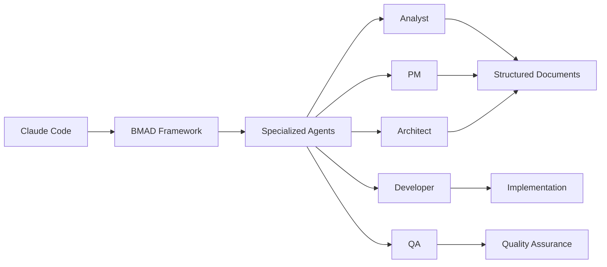
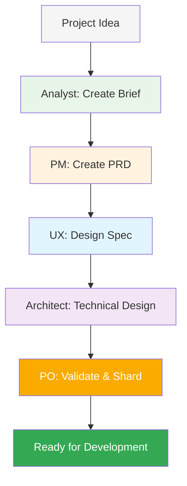
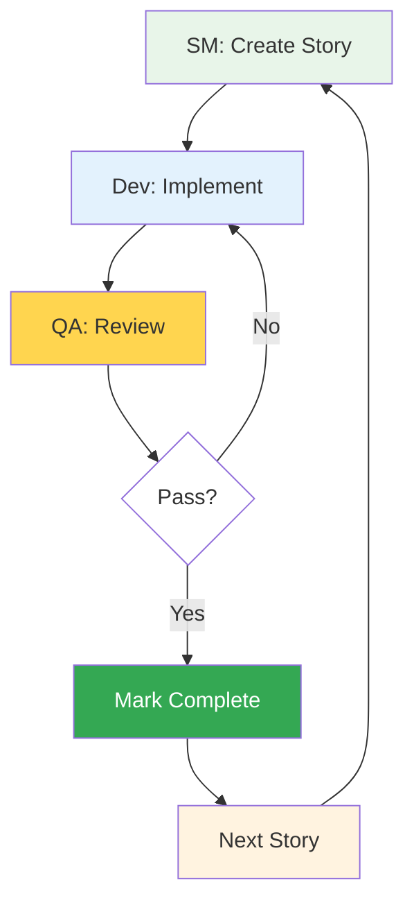
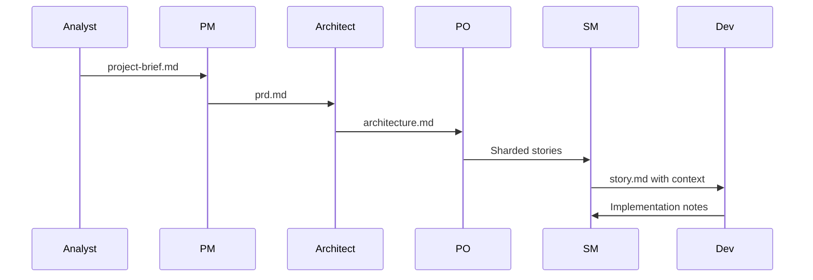

# BMAD-METHOD Integration with Claude Code

BMAD-METHOD (Breakthrough Method of Agile AI-Driven Development) is a comprehensive framework that enhances Claude Code with structured AI agent workflows for complex software development projects. It provides a systematic approach to planning and development through specialized AI agents that collaborate via structured documents.

## Table of Contents

- [Overview](#overview)
- [Key Concepts](#key-concepts)
- [Installation & Setup](#installation--setup)
- [Agent Roles & Responsibilities](#agent-roles--responsibilities)
- [Workflow Phases](#workflow-phases)
- [Agent Collaboration Mechanisms](#agent-collaboration-mechanisms)
- [Using BMAD with Claude Code](#using-bmad-with-claude-code)
- [Directory Structure](#directory-structure)
- [Practical Examples](#practical-examples)
- [Expansion Packs](#expansion-packs)
- [Uninstallation](#uninstallation)
- [Best Practices](#best-practices)

## Overview

BMAD-METHOD transforms AI-assisted development by providing:
- **Structured agent workflows** for consistent, high-quality output
- **Document-based collaboration** between specialized AI agents
- **Context-efficient development** through story files with embedded implementation details
- **Two-phase approach**: Planning (Web UI) → Development (IDE)

### How BMAD Enhances Claude Code



## Key Concepts

### Document-Based Collaboration
Agents don't communicate directly - they pass structured documents with specific sections, statuses, and ownership rules:
- **Project Brief** → **PRD** → **Architecture** → **Story Files**
- Each document builds upon previous outputs
- Maintains consistency and context throughout the project

### Story Files as Communication Hub
Story files contain everything a developer needs:
- User story in standard format
- Acceptance criteria from PRD
- Tasks/subtasks breakdown
- **Dev Notes** with ALL technical context
- Status tracking (Draft → Approved → InProgress → Review → Done)

### Context Engineering
The Scrum Master agent embeds complete context in story files, so the Dev agent never needs to read full architecture documents - reducing token usage and improving focus.

## Installation & Setup

BMAD installs **per-project**, not globally. Each project needs its own BMAD installation.

### Quick Installation

```bash
# Navigate to your project directory
cd your-project

# Install BMAD (creates .bmad-core and IDE configurations)
npx bmad-method install

# Or if you already have BMAD installed elsewhere:
git pull
npm run install:bmad
```

### What Gets Installed

```
your-project/
├── .bmad-core/           # Main BMAD framework files
│   ├── agents/           # Agent definitions
│   ├── tasks/            # Task templates
│   ├── templates/        # Document templates
│   └── workflows/        # Workflow configurations
├── core-config.yaml      # BMAD configuration
└── .{ide}/              # IDE-specific configurations
    └── commands/BMad/    # Claude Code, Cursor, Windsurf, etc.
```

### IDE Integration

BMAD automatically configures for your IDE:
- **Claude Code**: `.claude/commands/BMad/`
- **Cursor**: `.cursor/rules/bmad/`
- **Windsurf**: `.windsurf/workflows/`
- **GitHub Copilot**: `.github/chatmodes/`

## Agent Roles & Responsibilities

### Planning Phase Agents (Web UI)

| Agent | Role | Creates |
|-------|------|---------|
| **Analyst** | Research & requirements gathering | `project-brief.md` |
| **PM** | Product requirements definition | `prd.md` with epics/stories |
| **UX Expert** | UI/UX specification | `front-end-spec.md` |
| **Architect** | Technical design | `architecture.md` |
| **PO** | Document validation & sharding | Sharded epics/stories |

### Development Phase Agents (IDE)

| Agent | Role | Updates |
|-------|------|---------|
| **Scrum Master** | Story creation with full context | Creates `story.md` files |
| **Developer** | Implementation | Executes story tasks |
| **QA** | Testing & quality assurance | Adds test results to stories |

## Workflow Phases

### Phase 1: Planning (Web UI Recommended)



### Phase 2: Development (IDE)



## Agent Collaboration Mechanisms

### 1. Document Handoffs


### 2. Story File Structure
```yaml
Status: Draft → Approved → InProgress → Review → Done
Story: As a [role], I want [action], so that [benefit]
Acceptance Criteria:
  1. [Criteria from PRD]
  2. [Additional criteria]
Tasks/Subtasks:
  - [ ] Task 1 (AC: #1)
    - [ ] Subtask 1.1
  - [ ] Task 2 (AC: #2)
Dev Notes:
  [Complete technical context from architecture]
  [Previous story insights]
  [Implementation guidance]
```

### 3. Context Embedding
The SM agent ensures the Dev agent has everything needed:
- Relevant tech stack details
- API specifications
- Database schemas
- Component structures
- Testing requirements

## Using BMAD with Claude Code

### 1. Planning Phase (Optional Web UI)
```bash
# For web-based planning with Claude/Gemini:
# 1. Navigate to dist/teams/
# 2. Copy team-fullstack.txt
# 3. Upload to Claude/Gemini with instructions
# 4. Use *analyst, *pm, *architect commands
```

### 2. Development Phase in Claude Code
```bash
# Start Claude Code in your project
claude

# Access BMAD agents (after installation)
/bmad-dev      # Developer agent
/bmad-sm       # Scrum Master agent
/bmad-qa       # QA agent

# Or use the master agent
/bmad-master   # Can perform any non-dev task
```

### 3. Story-Driven Development
```bash
# Create next story
claude "/bmad-sm create next story from sharded epics"

# Implement story
claude "/bmad-dev implement story 1.1"

# QA review
claude "/bmad-qa review and test story 1.1"
```

## Directory Structure

### Project Structure After BMAD Installation
```
your-project/
├── .bmad-core/              # BMAD framework
├── core-config.yaml         # Configuration
├── docs/
│   ├── prd.md              # Product requirements
│   ├── architecture.md     # Technical design
│   ├── prd/                # Sharded PRD
│   │   └── epic-1.md
│   ├── architecture/       # Sharded architecture
│   └── stories/            # Story files
│       └── 1.1.user-auth.md
└── .claude/commands/BMad/   # Claude Code integration
```

### Story File Locations
- **Default**: `docs/stories/{epic}.{story}.{title}.md`
- **Configurable** via `core-config.yaml`

## Practical Examples

### Example 1: Starting a New Project
```bash
# 1. Initialize project and install BMAD
mkdir my-app && cd my-app
npx bmad-method install

# 2. In Claude Code, create project brief
claude "As BMAD analyst, help me create a project brief for a task management app with real-time collaboration"

# 3. Generate PRD from brief
claude "As BMAD PM, create a PRD from the project brief"

# 4. Create architecture
claude "As BMAD architect, design the technical architecture based on the PRD"

# 5. Start development
claude "As BMAD SM, create the first story from the sharded epics"
```

### Example 2: Implementing a Story
```bash
# View current story status
claude "Show me the current story in docs/stories/"

# Implement with full context
claude "As BMAD dev, implement story 1.1 following the tasks and dev notes"

# Run tests and validations
claude "Run the test suite and fix any issues"

# Mark story complete
claude "Update story 1.1 status to Done and add completion notes"
```

## Expansion Packs

BMAD supports domain-specific expansion packs:

### Available Packs
- **Creative Writing**: Fiction, screenwriting, narrative design
- **Game Development**: Unity 2D, Phaser frameworks
- **Infrastructure/DevOps**: Platform automation, CI/CD

### Installing Expansion Packs
```bash
# During initial installation
npx bmad-method install
# Select expansion packs from the menu

# Or add to package.json and reinstall
"bmad-creative-writing": "^1.0.0"
npm run install:bmad
```

## Uninstallation

BMAD is installed per-project. To remove it completely:

```bash
# Remove all BMAD files and folders
rm -rf .bmad-core/ core-config.yaml \
  .cursor/rules/bmad/ .claude/commands/BMad/ \
  .windsurf/workflows/ .github/chatmodes/ \
  docs/prd/ docs/epics/ docs/stories/ docs/architecture/

# Or use this one-liner
rm -rf .bmad-core/ core-config.yaml .cursor/rules/bmad/ .claude/commands/BMad/ .crush/commands/BMad/ .windsurf/workflows/ .trae/rules/ .clinerules/ .gemini/bmad-method/ .github/chatmodes/ .qwen/bmad-method/ .roomodes .kilocodemodes
```

## Best Practices

### 1. Planning Phase
- ✅ Use Web UI for planning (cost-effective with powerful models)
- ✅ Ensure PO validates all documents before development
- ✅ Create comprehensive PRD with clear acceptance criteria

### 2. Development Phase
- ✅ Let SM create detailed story files with full context
- ✅ Follow the story structure and complete all tasks
- ✅ Update story status as you progress
- ✅ Add implementation notes for future stories

### 3. Context Management
- ✅ Keep stories focused on single features
- ✅ Use document sharding for large projects
- ✅ Rely on Dev Notes instead of reading full docs
- ✅ Preserve previous story insights

### 4. Agent Usage
- ✅ Use specialized agents for their intended roles
- ✅ Switch to bmad-master for non-dev tasks
- ✅ Create new chat for each story to minimize context
- ✅ Compact conversations regularly

## Troubleshooting

### Common Issues

**Q: BMAD commands not working in Claude Code**
- Ensure BMAD is installed: Check for `.bmad-core/` directory
- Verify IDE configuration: Check `.claude/commands/BMad/`
- Reinstall if needed: `npx bmad-method install`

**Q: Context too large errors**
- Use document sharding via PO agent
- Start new chat for each story
- Use bmad-master's compact feature

**Q: Story creation fails**
- Ensure `core-config.yaml` exists and is configured
- Verify sharded documents exist in `docs/prd/`
- Check previous story completion status

## Additional Resources

- **GitHub Repository**: [BMAD-METHOD](https://github.com/bmadcode/BMAD-METHOD)
- **Discord Community**: [Join Discussion](https://discord.gg/gk8jAdXWmj)
- **NPM Package**: [@bmad-method](https://www.npmjs.com/package/bmad-method)
- **Version**: 4.39.1 (Latest as of January 2025)

## Summary

BMAD-METHOD brings structure and consistency to AI-assisted development through:
- **Specialized agents** with clear responsibilities
- **Document-based collaboration** maintaining context
- **Story-driven development** with embedded implementation details
- **Per-project installation** for flexibility
- **IDE integration** with Claude Code and others

By combining BMAD's structured approach with Claude Code's powerful capabilities, you get a comprehensive AI development environment that scales from simple features to complex enterprise applications.