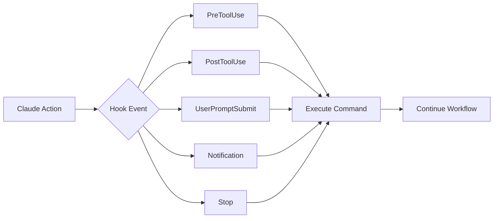

# Claude Code Hooks Cookbook

A comprehensive collection of hook patterns and recipes for automating your Claude Code workflows. Learn how to leverage hooks for formatting, validation, notifications, security, and more.

## Table of Contents

- [Introduction](#introduction)
- [Hook Events Overview](#hook-events-overview)
- [Auto-Formatting Recipes](#auto-formatting-recipes)
- [Validation & Linting](#validation--linting)
- [Notification Systems](#notification-systems)
- [Security & Compliance](#security--compliance)
- [Git Workflow Automation](#git-workflow-automation)
- [Testing Integration](#testing-integration)
- [Custom Workflows](#custom-workflows)
- [Advanced Patterns](#advanced-patterns)
- [Troubleshooting](#troubleshooting)

## Introduction

Hooks are deterministic automation points in Claude Code that execute shell commands at specific events. Unlike prompts, hooks always execute, ensuring consistent behavior.



## Hook Events Overview

| Event | Trigger | Use Cases | Can Block? |
|-------|---------|-----------|------------|
| **PreToolUse** | Before tool execution | Validation, permissions | ✅ Yes |
| **PostToolUse** | After tool execution | Formatting, logging | ❌ No |
| **UserPromptSubmit** | User submits prompt | Input validation, context | ✅ Yes |
| **Notification** | Claude sends notification | Custom alerts, sounds | ❌ No |
| **Stop** | Claude finishes response | Cleanup, summaries | ❌ No |
| **SessionStart** | Session begins/resumes | Setup, environment check | ❌ No |
| **PreCompact** | Before compacting | Save state, backup | ❌ No |

## Auto-Formatting Recipes

### Multi-Language Formatter

Automatically format code based on file type:

```json
{
  "hooks": {
    "PostToolUse": [
      {
        "matcher": "Edit|Write",
        "hooks": [
          {
            "type": "command",
            "command": "#!/bin/bash\nif [ -f \"$CLAUDE_TOOL_PARAMS_FILE_PATH\" ]; then\n  ext=\"${CLAUDE_TOOL_PARAMS_FILE_PATH##*.}\"\n  case \"$ext\" in\n    js|jsx|ts|tsx)\n      npx prettier --write \"$CLAUDE_TOOL_PARAMS_FILE_PATH\" 2>/dev/null\n      ;;\n    py)\n      black \"$CLAUDE_TOOL_PARAMS_FILE_PATH\" 2>/dev/null\n      ;;\n    go)\n      gofmt -w \"$CLAUDE_TOOL_PARAMS_FILE_PATH\" 2>/dev/null\n      ;;\n    rs)\n      rustfmt \"$CLAUDE_TOOL_PARAMS_FILE_PATH\" 2>/dev/null\n      ;;\n    rb)\n      rubocop -a \"$CLAUDE_TOOL_PARAMS_FILE_PATH\" 2>/dev/null\n      ;;\n  esac\nfi"
          }
        ]
      }
    ]
  }
}
```

### Import Sorter

Keep imports organized:

```json
{
  "hooks": {
    "PostToolUse": [
      {
        "matcher": "Edit|Write",
        "hooks": [
          {
            "type": "command",
            "command": "#!/bin/bash\nif [[ \"$CLAUDE_TOOL_PARAMS_FILE_PATH\" =~ \\.(js|jsx|ts|tsx)$ ]]; then\n  npx eslint --fix --rule 'import/order: error' \"$CLAUDE_TOOL_PARAMS_FILE_PATH\" 2>/dev/null\nfi"
          }
        ]
      }
    ]
  }
}
```

### Markdown Formatter

Format and lint markdown files:

```json
{
  "hooks": {
    "PostToolUse": [
      {
        "matcher": "Edit|Write",
        "hooks": [
          {
            "type": "command",
            "command": "#!/bin/bash\nif [[ \"$CLAUDE_TOOL_PARAMS_FILE_PATH\" =~ \\.md$ ]]; then\n  npx markdownlint-cli --fix \"$CLAUDE_TOOL_PARAMS_FILE_PATH\" 2>/dev/null\n  npx prettier --write \"$CLAUDE_TOOL_PARAMS_FILE_PATH\" 2>/dev/null\nfi"
          }
        ]
      }
    ]
  }
}
```

## Validation & Linting

### TypeScript Type Checking

Validate TypeScript changes:

```json
{
  "hooks": {
    "PostToolUse": [
      {
        "matcher": "Edit|Write",
        "hooks": [
          {
            "type": "command",
            "command": "#!/bin/bash\nif [[ \"$CLAUDE_TOOL_PARAMS_FILE_PATH\" =~ \\.(ts|tsx)$ ]]; then\n  npx tsc --noEmit --skipLibCheck \"$CLAUDE_TOOL_PARAMS_FILE_PATH\" 2>&1 | head -20\n  if [ ${PIPESTATUS[0]} -ne 0 ]; then\n    echo \"⚠️  TypeScript errors detected in $CLAUDE_TOOL_PARAMS_FILE_PATH\"\n  fi\nfi"
          }
        ]
      }
    ]
  }
}
```

### Python Linting

Run flake8 and mypy:

```json
{
  "hooks": {
    "PostToolUse": [
      {
        "matcher": "Edit|Write",
        "hooks": [
          {
            "type": "command",
            "command": "#!/bin/bash\nif [[ \"$CLAUDE_TOOL_PARAMS_FILE_PATH\" =~ \\.py$ ]]; then\n  flake8 \"$CLAUDE_TOOL_PARAMS_FILE_PATH\" 2>&1 | head -10\n  mypy \"$CLAUDE_TOOL_PARAMS_FILE_PATH\" 2>&1 | head -10\nfi"
          }
        ]
      }
    ]
  }
}
```

### Security Scanning

Check for security issues:

```json
{
  "hooks": {
    "PostToolUse": [
      {
        "matcher": "Edit|Write",
        "hooks": [
          {
            "type": "command",
            "command": "#!/bin/bash\n# Check for hardcoded secrets\nif grep -qE '(api_key|password|secret|token)\\s*=\\s*[\"'\\x27][^\"'\\x27]+[\"'\\x27]' \"$CLAUDE_TOOL_PARAMS_FILE_PATH\" 2>/dev/null; then\n  echo \"⚠️  WARNING: Possible hardcoded secret detected in $CLAUDE_TOOL_PARAMS_FILE_PATH\"\n  exit 1\nfi\n# Run security scanner\nif command -v semgrep &> /dev/null; then\n  semgrep --config=auto \"$CLAUDE_TOOL_PARAMS_FILE_PATH\" 2>/dev/null\nfi"
          }
        ]
      }
    ]
  }
}
```

## Notification Systems

### macOS Notifications

System notifications with sound:

```json
{
  "hooks": {
    "Notification": [
      {
        "matcher": "*",
        "hooks": [
          {
            "type": "command",
            "command": "osascript -e 'display notification \"Claude Code needs your attention\" with title \"Claude Code\" sound name \"Glass\"'"
          }
        ]
      }
    ],
    "Stop": [
      {
        "matcher": "*",
        "hooks": [
          {
            "type": "command",
            "command": "osascript -e 'display notification \"Task completed\" with title \"Claude Code\" sound name \"Hero\"'"
          }
        ]
      }
    ]
  }
}
```

### Slack Integration

Send notifications to Slack:

```json
{
  "hooks": {
    "Stop": [
      {
        "matcher": "*",
        "hooks": [
          {
            "type": "command",
            "command": "#!/bin/bash\nWEBHOOK_URL=\"YOUR_SLACK_WEBHOOK_URL\"\nMESSAGE=\"Claude Code completed task in $CLAUDE_PROJECT_DIR\"\ncurl -X POST -H 'Content-type: application/json' \\\n  --data \"{\\\"text\\\":\\\"$MESSAGE\\\"}\" \\\n  \"$WEBHOOK_URL\" 2>/dev/null"
          }
        ]
      }
    ]
  }
}
```

### Terminal Bell

Simple audio notification:

```json
{
  "hooks": {
    "Notification": [
      {
        "matcher": "*",
        "hooks": [
          {
            "type": "command",
            "command": "printf '\\a'"
          }
        ]
      }
    ]
  }
}
```

## Security & Compliance

### Protected Files

Prevent editing sensitive files:

```json
{
  "hooks": {
    "PreToolUse": [
      {
        "matcher": "Edit|Write",
        "hooks": [
          {
            "type": "command",
            "command": "#!/bin/bash\nPROTECTED_PATTERNS=(\n  \"production.env\"\n  \"secrets.yml\"\n  \".env.production\"\n  \"**/credentials/*\"\n)\nfor pattern in \"${PROTECTED_PATTERNS[@]}\"; do\n  if [[ \"$CLAUDE_TOOL_PARAMS_FILE_PATH\" == *\"$pattern\"* ]]; then\n    echo \"❌ BLOCKED: Cannot edit protected file: $CLAUDE_TOOL_PARAMS_FILE_PATH\"\n    exit 1\n  fi\ndone"
          }
        ]
      }
    ]
  }
}
```

### Audit Logging

Log all Claude Code actions:

```json
{
  "hooks": {
    "PreToolUse": [
      {
        "matcher": "*",
        "hooks": [
          {
            "type": "command",
            "command": "#!/bin/bash\nLOG_FILE=\"$HOME/.claude/audit.log\"\necho \"$(date '+%Y-%m-%d %H:%M:%S') | Tool: $CLAUDE_TOOL_NAME | Params: $(cat $CLAUDE_TOOL_PARAMS_PATH 2>/dev/null | jq -c . 2>/dev/null)\" >> \"$LOG_FILE\""
          }
        ]
      }
    ]
  }
}
```

### Compliance Checker

Ensure code meets compliance standards:

```json
{
  "hooks": {
    "PostToolUse": [
      {
        "matcher": "Edit|Write",
        "hooks": [
          {
            "type": "command",
            "command": "#!/bin/bash\n# Check for required headers\nif [[ \"$CLAUDE_TOOL_PARAMS_FILE_PATH\" =~ \\.(js|ts|py)$ ]]; then\n  if ! head -10 \"$CLAUDE_TOOL_PARAMS_FILE_PATH\" | grep -q \"Copyright\"; then\n    echo \"⚠️  Missing copyright header in $CLAUDE_TOOL_PARAMS_FILE_PATH\"\n  fi\nfi\n# Check for required documentation\nif [[ \"$CLAUDE_TOOL_PARAMS_FILE_PATH\" =~ \\.(py)$ ]]; then\n  if ! grep -q '\"\"\"' \"$CLAUDE_TOOL_PARAMS_FILE_PATH\"; then\n    echo \"⚠️  Missing docstrings in $CLAUDE_TOOL_PARAMS_FILE_PATH\"\n  fi\nfi"
          }
        ]
      }
    ]
  }
}
```

## Git Workflow Automation

### Auto-Stage Formatted Files

Stage files after formatting:

```json
{
  "hooks": {
    "PostToolUse": [
      {
        "matcher": "Edit|Write",
        "hooks": [
          {
            "type": "command",
            "command": "#!/bin/bash\nif [ -f \"$CLAUDE_TOOL_PARAMS_FILE_PATH\" ]; then\n  # Format first\n  npx prettier --write \"$CLAUDE_TOOL_PARAMS_FILE_PATH\" 2>/dev/null\n  # Then stage\n  git add \"$CLAUDE_TOOL_PARAMS_FILE_PATH\" 2>/dev/null\n  echo \"✅ Formatted and staged: $CLAUDE_TOOL_PARAMS_FILE_PATH\"\nfi"
          }
        ]
      }
    ]
  }
}
```

### Branch Protection

Prevent changes to main/master:

```json
{
  "hooks": {
    "PreToolUse": [
      {
        "matcher": "Edit|Write|Bash",
        "hooks": [
          {
            "type": "command",
            "command": "#!/bin/bash\nCURRENT_BRANCH=$(git branch --show-current 2>/dev/null)\nif [[ \"$CURRENT_BRANCH\" == \"main\" || \"$CURRENT_BRANCH\" == \"master\" ]]; then\n  echo \"❌ BLOCKED: Cannot make changes directly to $CURRENT_BRANCH branch\"\n  echo \"Please create a feature branch first\"\n  exit 1\nfi"
          }
        ]
      }
    ]
  }
}
```

### Commit Message Validator

Ensure conventional commits:

```json
{
  "hooks": {
    "UserPromptSubmit": [
      {
        "matcher": "*",
        "hooks": [
          {
            "type": "command",
            "command": "#!/bin/bash\nif echo \"$CLAUDE_USER_PROMPT\" | grep -qi \"commit\"; then\n  echo \"📝 Reminder: Use conventional commit format:\"\n  echo \"  - feat: new feature\"\n  echo \"  - fix: bug fix\"\n  echo \"  - docs: documentation\"\n  echo \"  - style: formatting\"\n  echo \"  - refactor: code restructuring\"\n  echo \"  - test: adding tests\"\n  echo \"  - chore: maintenance\"\nfi"
          }
        ]
      }
    ]
  }
}
```

## Testing Integration

### Auto-Run Tests

Run tests after code changes:

```json
{
  "hooks": {
    "PostToolUse": [
      {
        "matcher": "Edit|Write",
        "hooks": [
          {
            "type": "command",
            "command": "#!/bin/bash\nif [[ \"$CLAUDE_TOOL_PARAMS_FILE_PATH\" =~ \\.(js|jsx|ts|tsx)$ ]] && [[ ! \"$CLAUDE_TOOL_PARAMS_FILE_PATH\" =~ \\.test\\. ]]; then\n  # Find and run corresponding test file\n  TEST_FILE=\"${CLAUDE_TOOL_PARAMS_FILE_PATH%.js}.test.js\"\n  if [ -f \"$TEST_FILE\" ]; then\n    npm test -- \"$TEST_FILE\" --watchAll=false 2>&1 | tail -20\n  fi\nfi"
          }
        ]
      }
    ]
  }
}
```

### Coverage Check

Monitor test coverage:

```json
{
  "hooks": {
    "Stop": [
      {
        "matcher": "*",
        "hooks": [
          {
            "type": "command",
            "command": "#!/bin/bash\nif [ -f \"package.json\" ] && grep -q \"jest\" package.json; then\n  echo \"📊 Test Coverage Summary:\"\n  npx jest --coverage --coverageReporters=text-summary 2>/dev/null | tail -10\nfi"
          }
        ]
      }
    ]
  }
}
```

## Custom Workflows

### Documentation Generator

Auto-generate docs for new functions:

```json
{
  "hooks": {
    "PostToolUse": [
      {
        "matcher": "Edit|Write",
        "hooks": [
          {
            "type": "command",
            "command": "#!/bin/bash\nif [[ \"$CLAUDE_TOOL_PARAMS_FILE_PATH\" =~ \\.(js|ts)$ ]]; then\n  # Check for new functions without JSDoc\n  if grep -E '^(export )?(async )?function|^(export )?const \\w+ = (async )?\\(' \"$CLAUDE_TOOL_PARAMS_FILE_PATH\" | grep -v -B1 '/\\*\\*'; then\n    echo \"💡 Tip: Consider adding JSDoc comments to new functions\"\n    echo \"   Run: claude 'Add JSDoc comments to $CLAUDE_TOOL_PARAMS_FILE_PATH'\"\n  fi\nfi"
          }
        ]
      }
    ]
  }
}
```

### Dependency Checker

Alert on new dependencies:

```json
{
  "hooks": {
    "PostToolUse": [
      {
        "matcher": "Edit",
        "hooks": [
          {
            "type": "command",
            "command": "#!/bin/bash\nif [[ \"$CLAUDE_TOOL_PARAMS_FILE_PATH\" == \"package.json\" ]]; then\n  echo \"📦 Package.json modified. Running dependency audit...\"\n  npm audit --audit-level=moderate 2>&1 | head -20\n  echo \"💡 Run 'npm install' to update dependencies\"\nfi"
          }
        ]
      }
    ]
  }
}
```

### Environment Validator

Check for missing environment variables:

```json
{
  "hooks": {
    "SessionStart": [
      {
        "matcher": "*",
        "hooks": [
          {
            "type": "command",
            "command": "#!/bin/bash\nif [ -f \".env.example\" ]; then\n  echo \"🔍 Checking environment variables...\"\n  while IFS= read -r line; do\n    if [[ \"$line\" =~ ^([A-Z_]+)= ]]; then\n      VAR_NAME=\"${BASH_REMATCH[1]}\"\n      if [ -z \"${!VAR_NAME}\" ]; then\n        echo \"⚠️  Missing environment variable: $VAR_NAME\"\n      fi\n    fi\n  done < .env.example\nfi"
          }
        ]
      }
    ]
  }
}
```

## Advanced Patterns

### Contextual Hooks

Different hooks based on project type:

```json
{
  "hooks": {
    "PostToolUse": [
      {
        "matcher": "Edit|Write",
        "hooks": [
          {
            "type": "command",
            "command": "#!/bin/bash\n# Detect project type and apply appropriate formatting\nif [ -f \"package.json\" ]; then\n  # Node.js project\n  npx prettier --write \"$CLAUDE_TOOL_PARAMS_FILE_PATH\" 2>/dev/null\nelif [ -f \"Cargo.toml\" ]; then\n  # Rust project\n  cargo fmt -- \"$CLAUDE_TOOL_PARAMS_FILE_PATH\" 2>/dev/null\nelif [ -f \"go.mod\" ]; then\n  # Go project\n  gofmt -w \"$CLAUDE_TOOL_PARAMS_FILE_PATH\" 2>/dev/null\nelif [ -f \"requirements.txt\" ] || [ -f \"setup.py\" ]; then\n  # Python project\n  black \"$CLAUDE_TOOL_PARAMS_FILE_PATH\" 2>/dev/null\nfi"
          }
        ]
      }
    ]
  }
}
```

### Performance Monitoring

Track Claude Code performance:

```json
{
  "hooks": {
    "PreToolUse": [
      {
        "matcher": "*",
        "hooks": [
          {
            "type": "command",
            "command": "echo \"$(date +%s)\" > /tmp/claude_tool_start_time"
          }
        ]
      }
    ],
    "PostToolUse": [
      {
        "matcher": "*",
        "hooks": [
          {
            "type": "command",
            "command": "#!/bin/bash\nif [ -f /tmp/claude_tool_start_time ]; then\n  START=$(cat /tmp/claude_tool_start_time)\n  END=$(date +%s)\n  DURATION=$((END - START))\n  echo \"⏱️  Tool execution time: ${DURATION}s\"\n  rm /tmp/claude_tool_start_time\nfi"
          }
        ]
      }
    ]
  }
}
```

### Intelligent Suggestions

Provide contextual suggestions:

```json
{
  "hooks": {
    "PostToolUse": [
      {
        "matcher": "Edit|Write",
        "hooks": [
          {
            "type": "command",
            "command": "#!/bin/bash\nFILE=\"$CLAUDE_TOOL_PARAMS_FILE_PATH\"\n# Suggest tests for new code\nif [[ \"$FILE\" =~ /src/ ]] && [[ ! \"$FILE\" =~ \\.test\\. ]]; then\n  TEST_FILE=\"${FILE/\\/src\\//\\/tests\\/}\"\n  TEST_FILE=\"${TEST_FILE%.js}.test.js\"\n  if [ ! -f \"$TEST_FILE\" ]; then\n    echo \"💡 Consider creating tests: $TEST_FILE\"\n  fi\nfi\n# Suggest documentation\nif [[ \"$FILE\" =~ \\.(js|ts|py)$ ]]; then\n  if ! grep -q \"@param\\|Args:\\|Parameters:\" \"$FILE\" 2>/dev/null; then\n    echo \"📝 Consider adding parameter documentation\"\n  fi\nfi"
          }
        ]
      }
    ]
  }
}
```

## Troubleshooting

### Debug Hooks

Enable verbose logging:

```json
{
  "hooks": {
    "PreToolUse": [
      {
        "matcher": "*",
        "hooks": [
          {
            "type": "command",
            "command": "#!/bin/bash\nif [ \"$DEBUG_HOOKS\" = \"true\" ]; then\n  echo \"🔍 [DEBUG] Tool: $CLAUDE_TOOL_NAME\"\n  echo \"🔍 [DEBUG] Params: $(cat $CLAUDE_TOOL_PARAMS_PATH | jq -c .)\"\n  echo \"🔍 [DEBUG] Project: $CLAUDE_PROJECT_DIR\"\nfi"
          }
        ]
      }
    ]
  }
}
```

### Error Handling

Graceful error handling:

```json
{
  "hooks": {
    "PostToolUse": [
      {
        "matcher": "Edit|Write",
        "hooks": [
          {
            "type": "command",
            "command": "#!/bin/bash\nset -e\ntrap 'echo \"⚠️  Hook error: $?\"' ERR\n# Your hook commands here\nprettier --write \"$CLAUDE_TOOL_PARAMS_FILE_PATH\" || echo \"Prettier not available\"\neslint --fix \"$CLAUDE_TOOL_PARAMS_FILE_PATH\" || echo \"ESLint not available\""
          }
        ]
      }
    ]
  }
}
```

### Hook Testing

Test hooks before deployment:

```bash
# Test hook manually
export CLAUDE_TOOL_NAME="Edit"
export CLAUDE_TOOL_PARAMS_FILE_PATH="test.js"
export CLAUDE_PROJECT_DIR="$PWD"

# Run your hook command
bash -c 'your-hook-command-here'
```

## Best Practices

### 1. Keep Hooks Fast

- Use background processes for long operations
- Set timeouts to prevent blocking
- Cache results when possible

### 2. Handle Errors Gracefully

- Always check if commands exist
- Use `|| true` to prevent blocking on failures
- Log errors for debugging

### 3. Use Environment Variables

Available variables:
- `$CLAUDE_TOOL_NAME` - Tool being executed
- `$CLAUDE_TOOL_PARAMS_PATH` - Path to parameters JSON
- `$CLAUDE_TOOL_PARAMS_FILE_PATH` - File being edited
- `$CLAUDE_PROJECT_DIR` - Project directory
- `$CLAUDE_USER_PROMPT` - User's prompt

### 4. Security Considerations

- Never execute untrusted code
- Validate inputs before processing
- Use absolute paths to prevent injection
- Review hooks before adding them

### 5. Organization

```bash
# Organize hooks by type
~/.claude/hooks/
├── formatting/
│   ├── prettier.json
│   └── black.json
├── validation/
│   ├── eslint.json
│   └── mypy.json
├── notifications/
│   └── slack.json
└── security/
    └── audit.json
```

## Complete Example Configuration

Here's a comprehensive hooks configuration:

```json
{
  "hooks": {
    "SessionStart": [
      {
        "matcher": "*",
        "hooks": [
          {
            "type": "command",
            "command": "echo \"🚀 Claude Code session started in $CLAUDE_PROJECT_DIR\""
          }
        ]
      }
    ],
    "PreToolUse": [
      {
        "matcher": "Edit|Write",
        "hooks": [
          {
            "type": "command",
            "command": "#!/bin/bash\n# Check branch protection\nif [[ $(git branch --show-current) == \"main\" ]]; then\n  echo \"❌ Cannot edit on main branch\"\n  exit 1\nfi"
          }
        ]
      }
    ],
    "PostToolUse": [
      {
        "matcher": "Edit|Write",
        "hooks": [
          {
            "type": "command",
            "command": "#!/bin/bash\n# Format based on file type\next=\"${CLAUDE_TOOL_PARAMS_FILE_PATH##*.}\"\ncase \"$ext\" in\n  js|jsx|ts|tsx) npx prettier --write \"$CLAUDE_TOOL_PARAMS_FILE_PATH\" ;;\n  py) black \"$CLAUDE_TOOL_PARAMS_FILE_PATH\" ;;\n  go) gofmt -w \"$CLAUDE_TOOL_PARAMS_FILE_PATH\" ;;\nesac"
          }
        ]
      }
    ],
    "Notification": [
      {
        "matcher": "*",
        "hooks": [
          {
            "type": "command",
            "command": "osascript -e 'display notification \"Needs attention\" with title \"Claude Code\"'"
          }
        ]
      }
    ],
    "Stop": [
      {
        "matcher": "*",
        "hooks": [
          {
            "type": "command",
            "command": "echo \"✅ Task completed\""
          }
        ]
      }
    ]
  }
}
```

---

*Remember: Hooks are powerful automation tools. Start simple, test thoroughly, and gradually build your automation suite.*