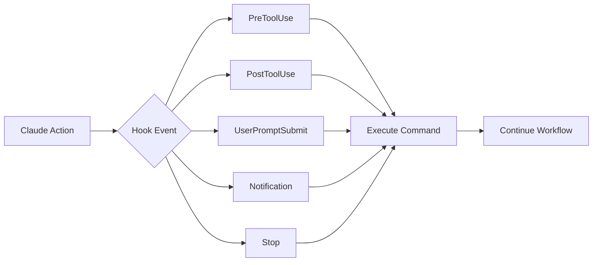
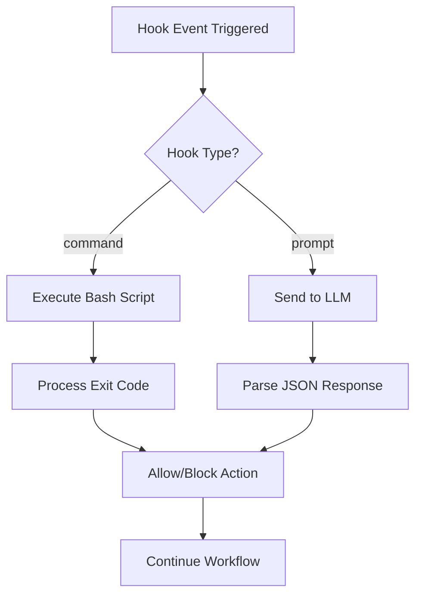

# Claude Code Hooks Cookbook

A comprehensive collection of hook patterns and recipes for automating your Claude Code workflows. Learn how to leverage hooks for formatting, validation, notifications, security, and more.

## Table of Contents

- [Introduction](#introduction)
- [Hook Events Overview](#hook-events-overview)
- [Prompt-Based Hooks (New)](#prompt-based-hooks-new)
- [Auto-Formatting Recipes](#auto-formatting-recipes)
- [Validation & Linting](#validation--linting)
- [Notification Systems](#notification-systems)
- [Security & Compliance](#security--compliance)
- [Git Workflow Automation](#git-workflow-automation)
- [Testing Integration](#testing-integration)
- [Custom Workflows](#custom-workflows)
- [Advanced Patterns](#advanced-patterns)
- [Troubleshooting](#troubleshooting)

## Introduction

Hooks are deterministic automation points in Claude Code that execute shell commands at specific events. Unlike prompts, hooks always execute, ensuring consistent behavior.



## Hook Events Overview

| Event | Trigger | Use Cases | Can Block? | Prompt Support? |
|-------|---------|-----------|------------|-----------------|
| **PreToolUse** | Before tool execution | Validation, permissions | ✅ Yes | 🧪 Experimental |
| **PostToolUse** | After tool execution | Formatting, logging | ❌ No | ❌ No |
| **UserPromptSubmit** | User submits prompt | Input validation, context | ✅ Yes | 🧪 Experimental |
| **Notification** | Claude sends notification | Custom alerts, sounds | ❌ No | ❌ No |
| **Stop** | Claude finishes response | Cleanup, summaries | ❌ No | ✅ **Yes** |
| **SessionStart** | Session begins/resumes | Setup, environment check | ❌ No | ❌ No |
| **SessionEnd** | Session ends | Cleanup, logging, state saving | ❌ No | ❌ No |
| **SubagentStop** | Subagent finishes | Subagent cleanup | ✅ Yes | ✅ **Yes** |
| **PreCompact** | Before compacting | Save state, backup | ❌ No | ❌ No |


## Prompt-Based Hooks (New)

Claude Code now supports **prompt-based hooks** that use LLM evaluation instead of bash commands. This enables intelligent, context-aware decisions for complex scenarios where deterministic rules aren't sufficient.



### Overview

Prompt-based hooks revolutionize hook automation by leveraging Claude's intelligence to make nuanced decisions. Instead of writing complex bash scripts with rigid rules, you can describe your requirements in natural language and let the LLM evaluate each situation contextually.

**Key Benefits:**
- 🧠 **Context-Aware**: Understands the full conversation and project state
- 🎯 **Flexible Logic**: Handles edge cases and exceptions naturally
- 📝 **Easy Setup**: Configure with natural language prompts, no scripting required
- 🔄 **Adaptive**: Can learn from patterns and adjust decisions
- ⚡ **Fast Evaluation**: Uses Haiku model for quick responses (typically < 2 seconds)

### When to Use Command vs Prompt Hooks

| Scenario | Command Hooks | Prompt Hooks |
|----------|--------------|--------------|
| **File formatting** | ✅ Best choice | ❌ Overkill |
| **Running linters** | ✅ Best choice | ❌ Unnecessary |
| **Security validation** | ✅ For fixed rules | ✅ For contextual decisions |
| **Task completion check** | ❌ Too rigid | ✅ Best choice |
| **Quality assessment** | ❌ Limited | ✅ Best choice |
| **Error recovery** | ❌ Basic only | ✅ Intelligent handling |
| **Workflow decisions** | ❌ Simple rules only | ✅ Complex logic |
| **Content validation** | ✅ For patterns | ✅ For meaning |

### Configuration Format

Prompt-based hooks use `type: "prompt"` and include a `prompt` field:

```json
{
  "hooks": {
    "Stop": [
      {
        "hooks": [
          {
            "type": "prompt",
            "prompt": "Your evaluation prompt here with $ARGUMENTS placeholder",
            "timeout": 30
          }
        ]
      }
    ]
  }
}
```

**Configuration Fields:**
- `type`: Must be `"prompt"` (not `"command"`)
- `prompt`: Natural language instructions for the LLM
  - Use `$ARGUMENTS` to inject the hook input JSON
  - If omitted, input is automatically appended
- `timeout`: Optional timeout in seconds (default: 30)

### Response Schema

The LLM must return valid JSON with specific fields:

```json
{
  "decision": "approve" | "block",
  "reason": "Explanation for the decision",
  "continue": true | false,  // Optional: controls execution flow
  "stopReason": "User-facing message",  // Optional: shown when stopping
  "systemMessage": "Additional context"  // Optional: informational message
}
```

**Response Fields Explained:**
- `decision`: Primary verdict - `"approve"` allows continuation, `"block"` prevents it
- `reason`: Internal explanation (shown to Claude, helps with debugging)
- `continue`: When `false`, completely stops Claude's execution
- `stopReason`: User-friendly message explaining why execution stopped
- `systemMessage`: Informational message shown to user (warnings, tips, context)

### Practical Examples

#### Example 1: Intelligent Stop Hook (Prevent Premature Stopping)

This hook ensures Claude doesn't stop while tasks are incomplete:

```json
{
  "hooks": {
    "Stop": [
      {
        "hooks": [
          {
            "type": "prompt",
            "prompt": "You are a task completion evaluator for Claude Code. Analyze the conversation context provided in $ARGUMENTS.\n\nEVALUATION CRITERIA:\n1. Check if all explicitly requested tasks are complete\n2. Look for unresolved errors or failing tests\n3. Identify any TODO comments or unfinished implementations\n4. Check for user questions that haven't been answered\n5. Verify if Claude mentioned 'next steps' that haven't been done\n\nDECISION RULES:\n- APPROVE stopping if: All tasks complete, no errors, questions answered\n- BLOCK stopping if: Tasks incomplete, errors present, or follow-up needed\n\nRespond with JSON:\n{\n  \"decision\": \"approve\" or \"block\",\n  \"reason\": \"Detailed explanation\",\n  \"systemMessage\": \"Optional message to user if blocking\"\n}",
            "timeout": 30
          }
        ]
      }
    ]
  }
}
```

#### Example 2: Quality-Checking SubagentStop Hook

Ensure subagents complete their work to a high standard:

```json
{
  "hooks": {
    "SubagentStop": [
      {
        "hooks": [
          {
            "type": "prompt",
            "prompt": "Evaluate if this subagent should be allowed to stop.\n\nContext: $ARGUMENTS\n\nQUALITY CHECKLIST:\n- Did the subagent complete its assigned task?\n- Are there any error messages in the output?\n- Did it provide the expected deliverables?\n- Is the code/output properly formatted?\n- Are there any obvious issues or omissions?\n\nSPECIAL CASES:\n- If subagent is 'test-runner': Ensure all tests pass\n- If subagent is 'code-reviewer': Ensure feedback was provided\n- If subagent is 'documentation': Ensure docs are complete\n\nReturn JSON:\n{\n  \"decision\": \"approve\" or \"block\",\n  \"reason\": \"explanation\",\n  \"systemMessage\": \"message if blocking\"\n}"
          }
        ]
      }
    ]
  }
}
```

#### Example 3: Error Recovery Stop Hook

Intelligently handle errors and suggest fixes:

```json
{
  "hooks": {
    "Stop": [
      {
        "hooks": [
          {
            "type": "prompt",
            "prompt": "Analyze if Claude should stop or continue after potential errors.\n\nContext: $ARGUMENTS\n\nERROR DETECTION:\n1. Search for error messages, stack traces, or failed commands\n2. Check for unhandled exceptions or crashes\n3. Look for test failures or build errors\n4. Identify missing dependencies or configuration issues\n\nRECOVERY DECISION:\n- If errors are fixable (missing deps, syntax, config): BLOCK and suggest fix\n- If errors need user input (credentials, choices): APPROVE with message\n- If no errors: APPROVE normally\n- If errors are critical/unfixable: APPROVE with error summary\n\nResponse format:\n{\n  \"decision\": \"approve\" or \"block\",\n  \"reason\": \"detailed analysis\",\n  \"systemMessage\": \"user guidance or error summary\",\n  \"continue\": true/false\n}"
          }
        ]
      }
    ]
  }
}
```

#### Example 4: Preventing Infinite Loops

Use the `stop_hook_active` flag to prevent endless continuation:

```json
{
  "hooks": {
    "Stop": [
      {
        "hooks": [
          {
            "type": "prompt",
            "prompt": "Evaluate whether Claude should continue working.\n\nIMPORTANT: Check the 'stop_hook_active' flag in $ARGUMENTS:\n- If stop_hook_active is true, Claude is already continuing from a previous stop hook\n- To prevent infinite loops, be more conservative when stop_hook_active is true\n\nContext: $ARGUMENTS\n\nLOOP PREVENTION RULES:\n1. If stop_hook_active is false (first evaluation):\n   - Apply normal criteria for blocking/approving\n   \n2. If stop_hook_active is true (already continued once):\n   - Only BLOCK if there's a critical error or explicit new task\n   - Default to APPROVE to prevent endless loops\n   - Track how many times we've continued\n\n3. Never BLOCK more than 2 times in succession\n\nRespond with appropriate JSON based on the analysis."
          }
        ]
      }
    ]
  }
}
```

#### Example 5: Context-Aware UserPromptSubmit Validation

Validate and enhance user prompts intelligently:

```json
{
  "hooks": {
    "UserPromptSubmit": [
      {
        "hooks": [
          {
            "type": "prompt",
            "prompt": "Evaluate the user's prompt for safety and clarity.\n\nUser prompt: $ARGUMENTS\n\nVALIDATION CHECKS:\n1. Security: Check for dangerous operations (rm -rf /, credential exposure)\n2. Clarity: Is the request clear and actionable?\n3. Scope: Is this within Claude Code's capabilities?\n4. Context: Does it reference files/context that exists?\n\nENHANCEMENT:\n- If unclear, suggest clarification in systemMessage\n- If dangerous, block with clear explanation\n- If out of scope, provide alternatives\n\nResponse:\n{\n  \"decision\": \"approve\" or \"block\",\n  \"reason\": \"validation result\",\n  \"systemMessage\": \"clarification or warning if needed\"\n}"
          }
        ]
      }
    ]
  }
}
```

### Best Practices for Prompt-Based Hooks

#### 1. Writing Effective Prompts

```json
{
  "type": "prompt",
  "prompt": "ROLE: You are a [specific role]\n\nCONTEXT: [What you're evaluating]\n$ARGUMENTS\n\nCRITERIA: [Numbered list of evaluation points]\n1. [First criterion]\n2. [Second criterion]\n\nDECISION RULES: [Clear if/then logic]\n- APPROVE if: [conditions]\n- BLOCK if: [conditions]\n\nOUTPUT: [Exact JSON structure expected]"
}
```

#### 2. Include Specific Decision Criteria

❌ **Too Vague:**
```json
{
  "prompt": "Check if Claude should stop"
}
```

✅ **Specific and Clear:**
```json
{
  "prompt": "Evaluate stopping based on:\n1. All requested tasks completed\n2. No unresolved errors in last 3 responses\n3. No pending user questions\n4. No TODO/FIXME comments added\n\nAPPROVE if all criteria met, otherwise BLOCK with explanation."
}
```

#### 3. Handle Edge Cases Explicitly

```json
{
  "prompt": "...main evaluation logic...\n\nSPECIAL CASES:\n- If user said 'nevermind' or 'cancel': Always APPROVE\n- If critical security issue detected: BLOCK with security warning\n- If ambiguous task state: Default to BLOCK for safety\n- If stop_hook_active is true: Be conservative, prefer APPROVE"
}
```

#### 4. Use Structured Output Formats

```json
{
  "prompt": "...evaluation logic...\n\nReturn EXACTLY this JSON structure:\n{\n  \"decision\": \"approve\" or \"block\",\n  \"reason\": \"One sentence explanation\",\n  \"systemMessage\": \"User-facing message if blocking\",\n  \"continue\": false  // Only if completely stopping\n}"
}
```

#### 5. Test Your Hooks Thoroughly

Create a test configuration to validate behavior:

```bash
# Test configuration
cat > test-hooks.json << 'TEOF'
{
  "hooks": {
    "Stop": [
      {
        "hooks": [
          {
            "type": "prompt",
            "prompt": "TEST MODE: Always block with debug info.\n\nReturn: {\n  \"decision\": \"block\",\n  \"reason\": \"Test mode - inspecting context\",\n  \"systemMessage\": \"Hook test: Received input with X keys\"\n}"
          }
        ]
      }
    ]
  }
}
TEOF

# Apply temporarily for testing
cp ~/.claude/settings.json ~/.claude/settings.json.backup
jq '.hooks = $hooks' --slurpfile hooks test-hooks.json ~/.claude/settings.json > ~/.claude/settings.json.tmp
mv ~/.claude/settings.json.tmp ~/.claude/settings.json
```

### Combining Command and Prompt Hooks

You can use both types together for sophisticated workflows:

```json
{
  "hooks": {
    "Stop": [
      {
        "hooks": [
          {
            "type": "command",
            "command": "#!/bin/bash\n# Quick deterministic checks\nif [ -f .stop-required ]; then exit 0; fi\nif grep -q 'FATAL ERROR' ~/.claude/last-response.txt; then exit 1; fi"
          },
          {
            "type": "prompt",
            "prompt": "If the command hook didn't make a decision, evaluate based on task completion...\n$ARGUMENTS"
          }
        ]
      }
    ]
  }
}
```

**Execution Order:**
1. Command hooks run first (fast, deterministic)
2. Prompt hooks run if command hooks don't block
3. First blocking response stops the chain

### Advanced Patterns

#### Pattern 1: Multi-Stage Evaluation

```json
{
  "hooks": {
    "Stop": [
      {
        "hooks": [
          {
            "type": "prompt",
            "prompt": "STAGE 1: Check for critical issues only.\nLook for: crashes, data loss, security issues.\nIf found, return {\"decision\": \"block\", \"reason\": \"Critical issue detected\"}\nOtherwise, return {\"decision\": \"approve\"}"
          }
        ]
      },
      {
        "hooks": [
          {
            "type": "prompt",
            "prompt": "STAGE 2: Quality and completeness check.\nEvaluate: test coverage, documentation, code quality.\nBlock only if quality is severely lacking."
          }
        ]
      }
    ]
  }
}
```

#### Pattern 2: Role-Based Evaluation

```json
{
  "hooks": {
    "SubagentStop": [
      {
        "hooks": [
          {
            "type": "prompt",
            "prompt": "Detect the subagent type from $ARGUMENTS and apply appropriate criteria:\n\nROLE DETECTION:\n- Look for agent name/type in the context\n- Identify based on task description\n\nROLE-SPECIFIC CRITERIA:\n- 'test-writer': Must have created test files with >80% coverage\n- 'bug-fixer': Must have resolved the reported issue\n- 'documenter': Must have added comprehensive docs\n- 'reviewer': Must have provided actionable feedback\n\nApply the appropriate criteria and return decision."
          }
        ]
      }
    ]
  }
}
```

#### Pattern 3: Learning from History

```json
{
  "hooks": {
    "Stop": [
      {
        "hooks": [
          {
            "type": "prompt",
            "prompt": "Analyze conversation history to make intelligent stopping decisions.\n\nReview $ARGUMENTS for patterns:\n1. How many times has Claude attempted this task?\n2. Is progress being made or are we stuck?\n3. Are we repeating the same errors?\n4. Has the user expressed satisfaction?\n\nLEARNING RULES:\n- If 3+ attempts with no progress: APPROVE with suggestion to try different approach\n- If steady progress: BLOCK to continue\n- If user said 'good' or 'thanks': APPROVE\n- If repeating errors: APPROVE with error summary\n\nMake decision based on historical context."
          }
        ]
      }
    ]
  }
}
```

### Debugging Prompt-Based Hooks

#### Enable Verbose Logging

```json
{
  "hooks": {
    "Stop": [
      {
        "hooks": [
          {
            "type": "prompt",
            "prompt": "DEBUG MODE ENABLED\n\nLog all inputs for debugging:\n1. Print $ARGUMENTS structure\n2. Note any parsing issues\n3. Show decision reasoning\n\nALWAYS return valid JSON:\n{\n  \"decision\": \"approve\",\n  \"reason\": \"Debug: [show what was evaluated]\",\n  \"systemMessage\": \"Debug info: Input had X keys, Y conditions met\"\n}"
          }
        ]
      }
    ]
  }
}
```

#### Common Issues and Solutions

| Issue | Symptom | Solution |
|-------|---------|----------|
| **Invalid JSON** | Hook fails silently | Ensure prompt requests exact JSON format |
| **Timeout** | Hook takes too long | Simplify prompt, increase timeout |
| **Always blocks** | Can't complete tasks | Add explicit APPROVE conditions |
| **Always approves** | Doesn't catch issues | Make BLOCK conditions more specific |
| **Infinite loop** | Keeps continuing | Check `stop_hook_active` flag |
| **No effect** | Hook doesn't trigger | Verify event name and configuration |

### Performance Considerations

**Prompt Hook Overhead:**
- API call to Haiku: ~500-2000ms
- JSON parsing: ~10ms
- Total overhead: ~0.5-2 seconds per evaluation

**Optimization Tips:**
1. Use command hooks for simple checks
2. Combine related evaluations in one prompt
3. Cache results when possible
4. Set appropriate timeouts (not too short)
5. Avoid complex reasoning for frequent events

### Security Notes

⚠️ **Important Security Considerations:**

1. **Prompt Injection**: Prompts can be influenced by user input via `$ARGUMENTS`
   - Sanitize or validate context before evaluation
   - Use clear decision boundaries

2. **Information Disclosure**: Prompts may reveal system logic
   - Avoid including sensitive information in prompts
   - Use generic evaluation criteria

3. **Resource Consumption**: Each hook makes an API call
   - Monitor usage to avoid unexpected costs
   - Set reasonable timeouts

4. **Decision Integrity**: LLM decisions can vary
   - Test thoroughly with various inputs
   - Have fallback command hooks for critical operations

### Reference Documentation

For more technical details about prompt-based hooks, see:
- [Official Hooks Reference](gen/hooks.md#prompt-based-hooks)
- [Hooks Guide](gen/hooks-guide.md)
- [Settings Configuration](gen/settings.md)

The prompt-based hooks feature is actively evolving. Check the [CLAUDE-CODE-UPDATE-INFO.md](CLAUDE-CODE-UPDATE-INFO.md) for the latest updates.

## Auto-Formatting Recipes

### Multi-Language Formatter

Automatically format code based on file type:

```json
{
  "hooks": {
    "PostToolUse": [
      {
        "matcher": "Edit|Write",
        "hooks": [
          {
            "type": "command",
            "command": "#!/bin/bash\nif [ -f \"$CLAUDE_TOOL_PARAMS_FILE_PATH\" ]; then\n  ext=\"${CLAUDE_TOOL_PARAMS_FILE_PATH##*.}\"\n  case \"$ext\" in\n    js|jsx|ts|tsx)\n      npx prettier --write \"$CLAUDE_TOOL_PARAMS_FILE_PATH\" 2>/dev/null\n      ;;\n    py)\n      black \"$CLAUDE_TOOL_PARAMS_FILE_PATH\" 2>/dev/null\n      ;;\n    go)\n      gofmt -w \"$CLAUDE_TOOL_PARAMS_FILE_PATH\" 2>/dev/null\n      ;;\n    rs)\n      rustfmt \"$CLAUDE_TOOL_PARAMS_FILE_PATH\" 2>/dev/null\n      ;;\n    rb)\n      rubocop -a \"$CLAUDE_TOOL_PARAMS_FILE_PATH\" 2>/dev/null\n      ;;\n  esac\nfi"
          }
        ]
      }
    ]
  }
}
```

### Import Sorter

Keep imports organized:

```json
{
  "hooks": {
    "PostToolUse": [
      {
        "matcher": "Edit|Write",
        "hooks": [
          {
            "type": "command",
            "command": "#!/bin/bash\nif [[ \"$CLAUDE_TOOL_PARAMS_FILE_PATH\" =~ \\.(js|jsx|ts|tsx)$ ]]; then\n  npx eslint --fix --rule 'import/order: error' \"$CLAUDE_TOOL_PARAMS_FILE_PATH\" 2>/dev/null\nfi"
          }
        ]
      }
    ]
  }
}
```

### Markdown Formatter

Format and lint markdown files:

```json
{
  "hooks": {
    "PostToolUse": [
      {
        "matcher": "Edit|Write",
        "hooks": [
          {
            "type": "command",
            "command": "#!/bin/bash\nif [[ \"$CLAUDE_TOOL_PARAMS_FILE_PATH\" =~ \\.md$ ]]; then\n  npx markdownlint-cli --fix \"$CLAUDE_TOOL_PARAMS_FILE_PATH\" 2>/dev/null\n  npx prettier --write \"$CLAUDE_TOOL_PARAMS_FILE_PATH\" 2>/dev/null\nfi"
          }
        ]
      }
    ]
  }
}
```

## Validation & Linting

### TypeScript Type Checking

Validate TypeScript changes:

```json
{
  "hooks": {
    "PostToolUse": [
      {
        "matcher": "Edit|Write",
        "hooks": [
          {
            "type": "command",
            "command": "#!/bin/bash\nif [[ \"$CLAUDE_TOOL_PARAMS_FILE_PATH\" =~ \\.(ts|tsx)$ ]]; then\n  npx tsc --noEmit --skipLibCheck \"$CLAUDE_TOOL_PARAMS_FILE_PATH\" 2>&1 | head -20\n  if [ ${PIPESTATUS[0]} -ne 0 ]; then\n    echo \"⚠️  TypeScript errors detected in $CLAUDE_TOOL_PARAMS_FILE_PATH\"\n  fi\nfi"
          }
        ]
      }
    ]
  }
}
```

### Python Linting

Run flake8 and mypy:

```json
{
  "hooks": {
    "PostToolUse": [
      {
        "matcher": "Edit|Write",
        "hooks": [
          {
            "type": "command",
            "command": "#!/bin/bash\nif [[ \"$CLAUDE_TOOL_PARAMS_FILE_PATH\" =~ \\.py$ ]]; then\n  flake8 \"$CLAUDE_TOOL_PARAMS_FILE_PATH\" 2>&1 | head -10\n  mypy \"$CLAUDE_TOOL_PARAMS_FILE_PATH\" 2>&1 | head -10\nfi"
          }
        ]
      }
    ]
  }
}
```

### Bash Command Validator

Enforce best practices for bash commands (based on `examples/hooks/bash_command_validator_example.py`):

```python
#!/usr/bin/env python3
"""Force use of ripgrep over grep for better performance"""
import json, re, sys

VALIDATION_RULES = [
    (r"^grep\b(?!.*\|)", "Use 'rg' (ripgrep) instead of 'grep' for better performance"),
    (r"^find\s+\S+\s+-name\b", "Use 'rg --files -g pattern' instead of 'find -name'"),
]

input_data = json.loads(sys.stdin.read())
if input_data.get("tool_name") == "Bash":
    command = input_data.get("tool_input", {}).get("command", "")
    for pattern, message in VALIDATION_RULES:
        if re.search(pattern, command):
            print(f"• {message}", file=sys.stderr)
            sys.exit(2)  # Block and show to Claude
```

Configuration:
```json
{
  "hooks": {
    "PreToolUse": [
      {
        "matcher": "Bash",
        "hooks": [{
          "type": "command",
          "command": "python3 /path/to/validator.py"
        }]
      }
    ]
  }
}
```

### Security Scanning

Check for security issues:

```json
{
  "hooks": {
    "PostToolUse": [
      {
        "matcher": "Edit|Write",
        "hooks": [
          {
            "type": "command",
            "command": "#!/bin/bash\n# Check for hardcoded secrets\nif grep -qE '(api_key|password|secret|token)\\s*=\\s*[\"'\\x27][^\"'\\x27]+[\"'\\x27]' \"$CLAUDE_TOOL_PARAMS_FILE_PATH\" 2>/dev/null; then\n  echo \"⚠️  WARNING: Possible hardcoded secret detected in $CLAUDE_TOOL_PARAMS_FILE_PATH\"\n  exit 1\nfi\n# Run security scanner\nif command -v semgrep &> /dev/null; then\n  semgrep --config=auto \"$CLAUDE_TOOL_PARAMS_FILE_PATH\" 2>/dev/null\nfi"
          }
        ]
      }
    ]
  }
}
```

## Notification Systems

### macOS Notifications

System notifications with sound:

```json
{
  "hooks": {
    "Notification": [
      {
        "matcher": "*",
        "hooks": [
          {
            "type": "command",
            "command": "osascript -e 'display notification \"Claude Code needs your attention\" with title \"Claude Code\" sound name \"Glass\"'"
          }
        ]
      }
    ],
    "Stop": [
      {
        "matcher": "*",
        "hooks": [
          {
            "type": "command",
            "command": "osascript -e 'display notification \"Task completed\" with title \"Claude Code\" sound name \"Hero\"'"
          }
        ]
      }
    ]
  }
}
```

### Slack Integration

Send notifications to Slack:

```json
{
  "hooks": {
    "Stop": [
      {
        "matcher": "*",
        "hooks": [
          {
            "type": "command",
            "command": "#!/bin/bash\nWEBHOOK_URL=\"YOUR_SLACK_WEBHOOK_URL\"\nMESSAGE=\"Claude Code completed task in $CLAUDE_PROJECT_DIR\"\ncurl -X POST -H 'Content-type: application/json' \\\n  --data \"{\\\"text\\\":\\\"$MESSAGE\\\"}\" \\\n  \"$WEBHOOK_URL\" 2>/dev/null"
          }
        ]
      }
    ]
  }
}
```

### Terminal Bell

Simple audio notification:

```json
{
  "hooks": {
    "Notification": [
      {
        "matcher": "*",
        "hooks": [
          {
            "type": "command",
            "command": "printf '\\a'"
          }
        ]
      }
    ]
  }
}
```

## Security & Compliance

### Protected Files

Prevent editing sensitive files:

```json
{
  "hooks": {
    "PreToolUse": [
      {
        "matcher": "Edit|Write",
        "hooks": [
          {
            "type": "command",
            "command": "#!/bin/bash\nPROTECTED_PATTERNS=(\n  \"production.env\"\n  \"secrets.yml\"\n  \".env.production\"\n  \"**/credentials/*\"\n)\nfor pattern in \"${PROTECTED_PATTERNS[@]}\"; do\n  if [[ \"$CLAUDE_TOOL_PARAMS_FILE_PATH\" == *\"$pattern\"* ]]; then\n    echo \"❌ BLOCKED: Cannot edit protected file: $CLAUDE_TOOL_PARAMS_FILE_PATH\"\n    exit 1\n  fi\ndone"
          }
        ]
      }
    ]
  }
}
```

### Audit Logging

Log all Claude Code actions:

```json
{
  "hooks": {
    "PreToolUse": [
      {
        "matcher": "*",
        "hooks": [
          {
            "type": "command",
            "command": "#!/bin/bash\nLOG_FILE=\"$HOME/.claude/audit.log\"\necho \"$(date '+%Y-%m-%d %H:%M:%S') | Tool: $CLAUDE_TOOL_NAME | Params: $(cat $CLAUDE_TOOL_PARAMS_PATH 2>/dev/null | jq -c . 2>/dev/null)\" >> \"$LOG_FILE\""
          }
        ]
      }
    ]
  }
}
```

### Compliance Checker

Ensure code meets compliance standards:

```json
{
  "hooks": {
    "PostToolUse": [
      {
        "matcher": "Edit|Write",
        "hooks": [
          {
            "type": "command",
            "command": "#!/bin/bash\n# Check for required headers\nif [[ \"$CLAUDE_TOOL_PARAMS_FILE_PATH\" =~ \\.(js|ts|py)$ ]]; then\n  if ! head -10 \"$CLAUDE_TOOL_PARAMS_FILE_PATH\" | grep -q \"Copyright\"; then\n    echo \"⚠️  Missing copyright header in $CLAUDE_TOOL_PARAMS_FILE_PATH\"\n  fi\nfi\n# Check for required documentation\nif [[ \"$CLAUDE_TOOL_PARAMS_FILE_PATH\" =~ \\.(py)$ ]]; then\n  if ! grep -q '\"\"\"' \"$CLAUDE_TOOL_PARAMS_FILE_PATH\"; then\n    echo \"⚠️  Missing docstrings in $CLAUDE_TOOL_PARAMS_FILE_PATH\"\n  fi\nfi"
          }
        ]
      }
    ]
  }
}
```

## Git Workflow Automation

### Auto-Stage Formatted Files

Stage files after formatting:

```json
{
  "hooks": {
    "PostToolUse": [
      {
        "matcher": "Edit|Write",
        "hooks": [
          {
            "type": "command",
            "command": "#!/bin/bash\nif [ -f \"$CLAUDE_TOOL_PARAMS_FILE_PATH\" ]; then\n  # Format first\n  npx prettier --write \"$CLAUDE_TOOL_PARAMS_FILE_PATH\" 2>/dev/null\n  # Then stage\n  git add \"$CLAUDE_TOOL_PARAMS_FILE_PATH\" 2>/dev/null\n  echo \"✅ Formatted and staged: $CLAUDE_TOOL_PARAMS_FILE_PATH\"\nfi"
          }
        ]
      }
    ]
  }
}
```

### Branch Protection

Prevent changes to main/master:

```json
{
  "hooks": {
    "PreToolUse": [
      {
        "matcher": "Edit|Write|Bash",
        "hooks": [
          {
            "type": "command",
            "command": "#!/bin/bash\nCURRENT_BRANCH=$(git branch --show-current 2>/dev/null)\nif [[ \"$CURRENT_BRANCH\" == \"main\" || \"$CURRENT_BRANCH\" == \"master\" ]]; then\n  echo \"❌ BLOCKED: Cannot make changes directly to $CURRENT_BRANCH branch\"\n  echo \"Please create a feature branch first\"\n  exit 1\nfi"
          }
        ]
      }
    ]
  }
}
```

### Commit Message Validator

Ensure conventional commits:

```json
{
  "hooks": {
    "UserPromptSubmit": [
      {
        "matcher": "*",
        "hooks": [
          {
            "type": "command",
            "command": "#!/bin/bash\nif echo \"$CLAUDE_USER_PROMPT\" | grep -qi \"commit\"; then\n  echo \"📝 Reminder: Use conventional commit format:\"\n  echo \"  - feat: new feature\"\n  echo \"  - fix: bug fix\"\n  echo \"  - docs: documentation\"\n  echo \"  - style: formatting\"\n  echo \"  - refactor: code restructuring\"\n  echo \"  - test: adding tests\"\n  echo \"  - chore: maintenance\"\nfi"
          }
        ]
      }
    ]
  }
}
```

## Testing Integration

### Auto-Run Tests

Run tests after code changes:

```json
{
  "hooks": {
    "PostToolUse": [
      {
        "matcher": "Edit|Write",
        "hooks": [
          {
            "type": "command",
            "command": "#!/bin/bash\nif [[ \"$CLAUDE_TOOL_PARAMS_FILE_PATH\" =~ \\.(js|jsx|ts|tsx)$ ]] && [[ ! \"$CLAUDE_TOOL_PARAMS_FILE_PATH\" =~ \\.test\\. ]]; then\n  # Find and run corresponding test file\n  TEST_FILE=\"${CLAUDE_TOOL_PARAMS_FILE_PATH%.js}.test.js\"\n  if [ -f \"$TEST_FILE\" ]; then\n    npm test -- \"$TEST_FILE\" --watchAll=false 2>&1 | tail -20\n  fi\nfi"
          }
        ]
      }
    ]
  }
}
```

### Coverage Check

Monitor test coverage:

```json
{
  "hooks": {
    "Stop": [
      {
        "matcher": "*",
        "hooks": [
          {
            "type": "command",
            "command": "#!/bin/bash\nif [ -f \"package.json\" ] && grep -q \"jest\" package.json; then\n  echo \"📊 Test Coverage Summary:\"\n  npx jest --coverage --coverageReporters=text-summary 2>/dev/null | tail -10\nfi"
          }
        ]
      }
    ]
  }
}
```

## Custom Workflows

### Documentation Generator

Auto-generate docs for new functions:

```json
{
  "hooks": {
    "PostToolUse": [
      {
        "matcher": "Edit|Write",
        "hooks": [
          {
            "type": "command",
            "command": "#!/bin/bash\nif [[ \"$CLAUDE_TOOL_PARAMS_FILE_PATH\" =~ \\.(js|ts)$ ]]; then\n  # Check for new functions without JSDoc\n  if grep -E '^(export )?(async )?function|^(export )?const \\w+ = (async )?\\(' \"$CLAUDE_TOOL_PARAMS_FILE_PATH\" | grep -v -B1 '/\\*\\*'; then\n    echo \"💡 Tip: Consider adding JSDoc comments to new functions\"\n    echo \"   Run: claude 'Add JSDoc comments to $CLAUDE_TOOL_PARAMS_FILE_PATH'\"\n  fi\nfi"
          }
        ]
      }
    ]
  }
}
```

### Dependency Checker

Alert on new dependencies:

```json
{
  "hooks": {
    "PostToolUse": [
      {
        "matcher": "Edit",
        "hooks": [
          {
            "type": "command",
            "command": "#!/bin/bash\nif [[ \"$CLAUDE_TOOL_PARAMS_FILE_PATH\" == \"package.json\" ]]; then\n  echo \"📦 Package.json modified. Running dependency audit...\"\n  npm audit --audit-level=moderate 2>&1 | head -20\n  echo \"💡 Run 'npm install' to update dependencies\"\nfi"
          }
        ]
      }
    ]
  }
}
```

### Environment Validator

Check for missing environment variables:

```json
{
  "hooks": {
    "SessionStart": [
      {
        "matcher": "*",
        "hooks": [
          {
            "type": "command",
            "command": "#!/bin/bash\nif [ -f \".env.example\" ]; then\n  echo \"🔍 Checking environment variables...\"\n  while IFS= read -r line; do\n    if [[ \"$line\" =~ ^([A-Z_]+)= ]]; then\n      VAR_NAME=\"${BASH_REMATCH[1]}\"\n      if [ -z \"${!VAR_NAME}\" ]; then\n        echo \"⚠️  Missing environment variable: $VAR_NAME\"\n      fi\n    fi\n  done < .env.example\nfi"
          }
        ]
      }
    ]
  }
}
```

## Session Management

### Session Analytics

Track session statistics and duration:

```json
{
  "hooks": {
    "SessionEnd": [
      {
        "matcher": "*",
        "hooks": [
          {
            "type": "command",
            "command": "#!/bin/bash\nSESSION_FILE=\"~/.claude/sessions/${CLAUDE_SESSION_ID}.log\"\nmkdir -p \"$(dirname \"$SESSION_FILE\")\"\necho \"Session ended: $(date)\" >> \"$SESSION_FILE\"\necho \"Reason: $CLAUDE_SESSION_END_REASON\" >> \"$SESSION_FILE\"\necho \"Working directory: $CLAUDE_CWD\" >> \"$SESSION_FILE\"\necho \"Duration: $(($(date +%s) - ${CLAUDE_SESSION_START:-$(date +%s)})) seconds\" >> \"$SESSION_FILE\"\necho \"---\" >> \"$SESSION_FILE\""
          }
        ]
      }
    ]
  }
}
```

### Auto-Save Work

Save uncommitted changes when session ends:

```json
{
  "hooks": {
    "SessionEnd": [
      {
        "matcher": "*",
        "hooks": [
          {
            "type": "command",
            "command": "#!/bin/bash\nif [ -d \".git\" ]; then\n  CHANGES=$(git status --porcelain 2>/dev/null)\n  if [ -n \"$CHANGES\" ]; then\n    echo \"💾 Saving uncommitted changes...\"\n    git stash push -m \"Auto-save: Session ended at $(date)\" 2>&1\n    echo \"✅ Changes saved to git stash\"\n  fi\nfi"
          }
        ]
      }
    ]
  }
}
```

### Cleanup Temporary Files

Remove temporary files and cache when session ends:

```json
{
  "hooks": {
    "SessionEnd": [
      {
        "matcher": "*",
        "hooks": [
          {
            "type": "command",
            "command": "#!/bin/bash\n# Clean up temp files\nif [ -d \"./tmp\" ]; then\n  echo \"🧹 Cleaning up temporary files...\"\n  rm -rf ./tmp/* 2>/dev/null\nfi\n# Clear node_modules cache if needed\nif [ -f \".clear-cache-on-exit\" ]; then\n  npm cache clean --force 2>/dev/null\n  rm .clear-cache-on-exit\nfi"
          }
        ]
      }
    ]
  }
}
```

### Session Summary Report

Generate a summary of work done in the session:

```json
{
  "hooks": {
    "SessionEnd": [
      {
        "matcher": "*",
        "hooks": [
          {
            "type": "command",
            "command": "#!/bin/bash\nif [ -f \"$CLAUDE_TRANSCRIPT_PATH\" ]; then\n  echo \"📊 Session Summary:\"\n  echo \"-------------------\"\n  # Count tool uses\n  EDITS=$(grep -c '\"tool_name\":\"Edit\"' \"$CLAUDE_TRANSCRIPT_PATH\" 2>/dev/null || echo 0)\n  READS=$(grep -c '\"tool_name\":\"Read\"' \"$CLAUDE_TRANSCRIPT_PATH\" 2>/dev/null || echo 0)\n  BASH=$(grep -c '\"tool_name\":\"Bash\"' \"$CLAUDE_TRANSCRIPT_PATH\" 2>/dev/null || echo 0)\n  echo \"📝 Files edited: $EDITS\"\n  echo \"📖 Files read: $READS\"\n  echo \"⚡ Commands run: $BASH\"\n  echo \"⏱️ Session ended: $CLAUDE_SESSION_END_REASON\"\nfi"
          }
        ]
      }
    ]
  }
}
```

## Advanced Patterns

### Contextual Hooks

Different hooks based on project type:

```json
{
  "hooks": {
    "PostToolUse": [
      {
        "matcher": "Edit|Write",
        "hooks": [
          {
            "type": "command",
            "command": "#!/bin/bash\n# Detect project type and apply appropriate formatting\nif [ -f \"package.json\" ]; then\n  # Node.js project\n  npx prettier --write \"$CLAUDE_TOOL_PARAMS_FILE_PATH\" 2>/dev/null\nelif [ -f \"Cargo.toml\" ]; then\n  # Rust project\n  cargo fmt -- \"$CLAUDE_TOOL_PARAMS_FILE_PATH\" 2>/dev/null\nelif [ -f \"go.mod\" ]; then\n  # Go project\n  gofmt -w \"$CLAUDE_TOOL_PARAMS_FILE_PATH\" 2>/dev/null\nelif [ -f \"requirements.txt\" ] || [ -f \"setup.py\" ]; then\n  # Python project\n  black \"$CLAUDE_TOOL_PARAMS_FILE_PATH\" 2>/dev/null\nfi"
          }
        ]
      }
    ]
  }
}
```

### Performance Monitoring

Track Claude Code performance:

```json
{
  "hooks": {
    "PreToolUse": [
      {
        "matcher": "*",
        "hooks": [
          {
            "type": "command",
            "command": "echo \"$(date +%s)\" > /tmp/claude_tool_start_time"
          }
        ]
      }
    ],
    "PostToolUse": [
      {
        "matcher": "*",
        "hooks": [
          {
            "type": "command",
            "command": "#!/bin/bash\nif [ -f /tmp/claude_tool_start_time ]; then\n  START=$(cat /tmp/claude_tool_start_time)\n  END=$(date +%s)\n  DURATION=$((END - START))\n  echo \"⏱️  Tool execution time: ${DURATION}s\"\n  rm /tmp/claude_tool_start_time\nfi"
          }
        ]
      }
    ]
  }
}
```

### Intelligent Suggestions

Provide contextual suggestions:

```json
{
  "hooks": {
    "PostToolUse": [
      {
        "matcher": "Edit|Write",
        "hooks": [
          {
            "type": "command",
            "command": "#!/bin/bash\nFILE=\"$CLAUDE_TOOL_PARAMS_FILE_PATH\"\n# Suggest tests for new code\nif [[ \"$FILE\" =~ /src/ ]] && [[ ! \"$FILE\" =~ \\.test\\. ]]; then\n  TEST_FILE=\"${FILE/\\/src\\//\\/tests\\/}\"\n  TEST_FILE=\"${TEST_FILE%.js}.test.js\"\n  if [ ! -f \"$TEST_FILE\" ]; then\n    echo \"💡 Consider creating tests: $TEST_FILE\"\n  fi\nfi\n# Suggest documentation\nif [[ \"$FILE\" =~ \\.(js|ts|py)$ ]]; then\n  if ! grep -q \"@param\\|Args:\\|Parameters:\" \"$FILE\" 2>/dev/null; then\n    echo \"📝 Consider adding parameter documentation\"\n  fi\nfi"
          }
        ]
      }
    ]
  }
}
```

### Advanced Hook Output Control

Control hook behavior with JSON output:

```python
#!/usr/bin/env python3
import json
import sys

# Read hook input
input_data = json.loads(sys.stdin.read())

# Example: PreToolUse permission control
if input_data.get('hook_event_name') == 'PreToolUse':
    tool_name = input_data.get('tool_name', '')
    
    # Modern approach (recommended)
    output = {
        "hookSpecificOutput": {
            "hookEventName": "PreToolUse",
            "permissionDecision": "allow",  # or "deny", "ask"
            "permissionDecisionReason": "Tool approved by security policy"
        }
    }
    
    # Add system message if needed
    if tool_name == 'Bash':
        output["systemMessage"] = "⚠️ Remember: Bash commands are being monitored"
    
    print(json.dumps(output))
    sys.exit(0)

# Example: PostToolUse with additional context
if input_data.get('hook_event_name') == 'PostToolUse':
    output = {
        "hookSpecificOutput": {
            "hookEventName": "PostToolUse",
            "additionalContext": "File was automatically formatted"
        }
    }
    print(json.dumps(output))
    sys.exit(0)

# Example: Stop execution with reason
if input_data.get('hook_event_name') == 'UserPromptSubmit':
    prompt_text = input_data.get('prompt_text', '')
    
    if 'production' in prompt_text.lower():
        output = {
            "continue": False,
            "stopReason": "Production operations require manual approval",
            "systemMessage": "⚠️ Production keyword detected - manual review required"
        }
        print(json.dumps(output))
        sys.exit(1)  # Non-zero exit also blocks
```

**Note**: The `decision` and `reason` fields are deprecated for PreToolUse hooks. Use `hookSpecificOutput.permissionDecision` and `hookSpecificOutput.permissionDecisionReason` instead.

### Hook Deduplication

Claude Code automatically deduplicates identical hook commands for better performance:

```json
{
  "hooks": {
    "PostToolUse": [
      {
        "matcher": "Edit",
        "hooks": [
          {
            "type": "command",
            "command": "prettier --write $CLAUDE_TOOL_PARAMS_FILE_PATH"
          }
        ]
      },
      {
        "matcher": "Write",
        "hooks": [
          {
            "type": "command",
            "command": "prettier --write $CLAUDE_TOOL_PARAMS_FILE_PATH"
          }
        ]
      }
    ]
  }
}
```

In this example, if both matchers trigger, the prettier command only runs once.

## Troubleshooting

### Debug Hooks

Enable verbose logging:

```json
{
  "hooks": {
    "PreToolUse": [
      {
        "matcher": "*",
        "hooks": [
          {
            "type": "command",
            "command": "#!/bin/bash\nif [ \"$DEBUG_HOOKS\" = \"true\" ]; then\n  echo \"🔍 [DEBUG] Tool: $CLAUDE_TOOL_NAME\"\n  echo \"🔍 [DEBUG] Params: $(cat $CLAUDE_TOOL_PARAMS_PATH | jq -c .)\"\n  echo \"🔍 [DEBUG] Project: $CLAUDE_PROJECT_DIR\"\nfi"
          }
        ]
      }
    ]
  }
}
```

### Error Handling

Graceful error handling:

```json
{
  "hooks": {
    "PostToolUse": [
      {
        "matcher": "Edit|Write",
        "hooks": [
          {
            "type": "command",
            "command": "#!/bin/bash\nset -e\ntrap 'echo \"⚠️  Hook error: $?\"' ERR\n# Your hook commands here\nprettier --write \"$CLAUDE_TOOL_PARAMS_FILE_PATH\" || echo \"Prettier not available\"\neslint --fix \"$CLAUDE_TOOL_PARAMS_FILE_PATH\" || echo \"ESLint not available\""
          }
        ]
      }
    ]
  }
}
```

### Hook Testing

Test hooks before deployment:

```bash
# Test hook manually
export CLAUDE_TOOL_NAME="Edit"
export CLAUDE_TOOL_PARAMS_FILE_PATH="test.js"
export CLAUDE_PROJECT_DIR="$PWD"

# Run your hook command
bash -c 'your-hook-command-here'
```

## Best Practices

### 1. Keep Hooks Fast

- Use background processes for long operations
- Set timeouts to prevent blocking
- Cache results when possible

### 2. Handle Errors Gracefully

- Always check if commands exist
- Use `|| true` to prevent blocking on failures
- Log errors for debugging

### 3. Use Environment Variables

Available variables:
- `$CLAUDE_TOOL_NAME` - Tool being executed
- `$CLAUDE_TOOL_PARAMS_PATH` - Path to parameters JSON
- `$CLAUDE_TOOL_PARAMS_FILE_PATH` - File being edited
- `$CLAUDE_PROJECT_DIR` - Project directory
- `$CLAUDE_USER_PROMPT` - User's prompt

### 4. Security Considerations

- Never execute untrusted code
- Validate inputs before processing
- Use absolute paths to prevent injection
- Review hooks before adding them

### 5. Organization

```bash
# Organize hooks by type
~/.claude/hooks/
├── formatting/
│   ├── prettier.json
│   └── black.json
├── validation/
│   ├── eslint.json
│   └── mypy.json
├── notifications/
│   └── slack.json
└── security/
    └── audit.json
```

## Complete Example Configuration

Here's a comprehensive hooks configuration:

```json
{
  "hooks": {
    "SessionStart": [
      {
        "matcher": "*",
        "hooks": [
          {
            "type": "command",
            "command": "echo \"🚀 Claude Code session started in $CLAUDE_PROJECT_DIR\""
          }
        ]
      }
    ],
    "PreToolUse": [
      {
        "matcher": "Edit|Write",
        "hooks": [
          {
            "type": "command",
            "command": "#!/bin/bash\n# Check branch protection\nif [[ $(git branch --show-current) == \"main\" ]]; then\n  echo \"❌ Cannot edit on main branch\"\n  exit 1\nfi"
          }
        ]
      }
    ],
    "PostToolUse": [
      {
        "matcher": "Edit|Write",
        "hooks": [
          {
            "type": "command",
            "command": "#!/bin/bash\n# Format based on file type\next=\"${CLAUDE_TOOL_PARAMS_FILE_PATH##*.}\"\ncase \"$ext\" in\n  js|jsx|ts|tsx) npx prettier --write \"$CLAUDE_TOOL_PARAMS_FILE_PATH\" ;;\n  py) black \"$CLAUDE_TOOL_PARAMS_FILE_PATH\" ;;\n  go) gofmt -w \"$CLAUDE_TOOL_PARAMS_FILE_PATH\" ;;\nesac"
          }
        ]
      }
    ],
    "Notification": [
      {
        "matcher": "*",
        "hooks": [
          {
            "type": "command",
            "command": "osascript -e 'display notification \"Needs attention\" with title \"Claude Code\"'"
          }
        ]
      }
    ],
    "Stop": [
      {
        "matcher": "*",
        "hooks": [
          {
            "type": "command",
            "command": "echo \"✅ Task completed\""
          }
        ]
      }
    ]
  }
}
```

---

*Remember: Hooks are powerful automation tools. Start simple, test thoroughly, and gradually build your automation suite.*