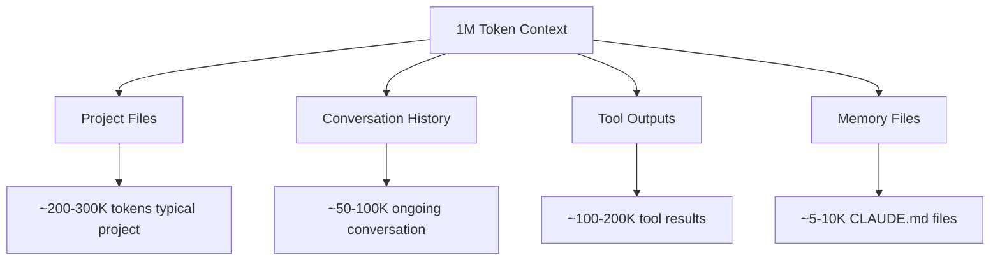
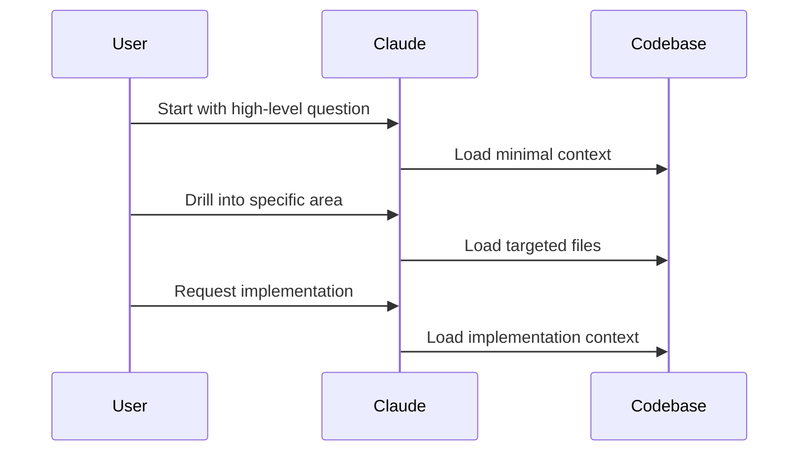
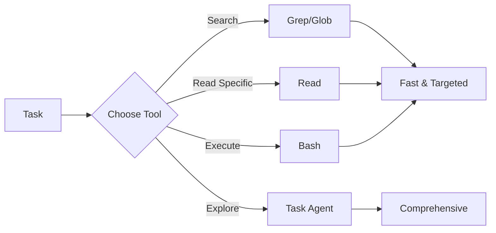
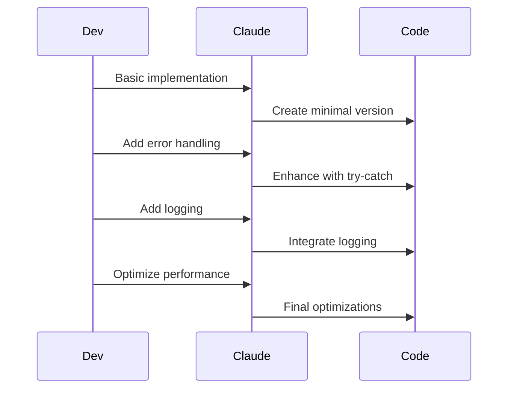

# Claude Code Performance & Optimization Guide

Master the art of working efficiently with Claude Code, especially in large codebases and complex projects. This guide covers performance best practices, optimization techniques, and strategies for handling the 1M context window effectively.

## Table of Contents

- [Context Window Management](#context-window-management)
- [Large Codebase Strategies](#large-codebase-strategies)
- [Performance Best Practices](#performance-best-practices)
- [Optimization Techniques](#optimization-techniques)
- [Monitoring & Debugging](#monitoring--debugging)
- [Advanced Patterns](#advanced-patterns)

## Context Window Management

### Understanding the 1M Token Context

Claude Code supports up to 1 million tokens of context, but efficient usage is key:



### Context Usage Strategies

#### 1. Smart File Selection

```bash
# Instead of loading entire project
claude --add-dir ./

# Load specific directories
claude --add-dir ./src --add-dir ./tests

# Use .claudeignore for large files
echo "node_modules/" >> .claudeignore
echo "*.log" >> .claudeignore
echo "dist/" >> .claudeignore
```

#### 2. Conversation Management

```bash
# Compact when context grows
/compact Focus on authentication refactoring

# Clear and restart for new tasks
/clear

# Use subagents for isolated tasks
/agents
```

#### 3. Progressive Loading



## Large Codebase Strategies

### Hierarchical Exploration

Start broad, then narrow:

```bash
# Level 1: Understand structure
claude "Give me an overview of this codebase architecture"

# Level 2: Explore subsystems
claude "Explain the authentication system"

# Level 3: Specific implementation
claude "Show me how JWT tokens are validated"
```

### Directory-Specific Sessions

```bash
# Frontend work
cd frontend && claude "Help me refactor the user dashboard"

# Backend work
cd backend && claude "Optimize the database queries"

# Full-stack feature
claude --add-dir frontend/src/components --add-dir backend/api
```

### Using .claudeignore Effectively

Create a comprehensive `.claudeignore`:

```gitignore
# Dependencies
node_modules/
vendor/
.venv/
packages/

# Build outputs
dist/
build/
out/
*.min.js
*.min.css

# Large assets
*.mp4
*.zip
*.tar.gz
images/
videos/

# Generated files
*.generated.*
coverage/
.next/
.nuxt/

# Logs and databases
*.log
*.sqlite
*.db

# IDE and OS files
.idea/
.vscode/
.DS_Store
Thumbs.db
```

## Performance Best Practices

### 1. Use Subagents for Specialized Tasks

```json
{
  "name": "test-runner",
  "description": "Runs tests and fixes failures",
  "instructions": "Focus only on test files and test execution",
  "tools": ["bash", "read", "edit"]
}
```

Benefits:
- Isolated context window
- Faster processing
- Specialized expertise
- Parallel task execution

### 2. Optimize Tool Usage



#### Tool Selection Guide

| Task | Recommended Tool | Why |
|------|------------------|-----|
| Find function definition | `Grep` | Fast pattern matching |
| Read known file | `Read` | Direct access |
| Explore unknown area | `Task` agent | Intelligent exploration |
| Search multiple patterns | Multiple `Grep` calls | Parallel execution |
| Complex investigation | Subagent | Isolated context |

#### Built-in Search Performance (v1.0.84+)

Claude Code now uses built-in ripgrep by default for significantly improved search performance:

- **Faster search operations**: Built-in ripgrep eliminates external dependency overhead
- **Better reliability**: No need to install or configure ripgrep separately
- **Consistent performance**: Same fast search across all environments

```bash
# To opt out of built-in ripgrep (if needed)
export USE_BUILTIN_RIPGREP=0
```

### 3. Batch Operations

```bash
# Instead of sequential commands
claude "Update the header"
claude "Fix the footer"
claude "Adjust the sidebar"

# Use single comprehensive request
claude "Update the UI components: 
1. Modernize header with new logo
2. Fix footer alignment issues
3. Make sidebar responsive"
```

### 4. Efficient Memory Files

Keep CLAUDE.md files focused:

```markdown
# Good: Concise and specific
Project uses TypeScript with strict mode.
Run `npm test` for testing.
Follow Airbnb style guide.

# Bad: Verbose and redundant
This project is built with TypeScript and we always
use strict mode because it helps catch errors...
[200 lines of explanation]
```

## Optimization Techniques

### 1. Context Recycling

```bash
# Resume sessions to preserve context
claude --resume <conversation-id>

# Continue recent conversation
claude -c
```

### 2. Strategic Compacting

```bash
# Before compacting
/cost  # Check token usage

# Compact with focus
/compact Keep authentication context, discard UI changes

# After major milestones
/compact Completed user management, starting payment integration
```

### 3. Parallel Processing

Use background processes for long operations:

```bash
# Start build in background
npm run build &

# Continue working while build runs
claude "While the build runs, let's review the test cases"

# Check build status
/bashes
```

### 4. Smart Caching

Leverage Claude Code's built-in caching:

- Recent file reads are cached
- Command outputs are retained
- Search results are remembered

```bash
# First search establishes cache
claude "Find all API endpoints"

# Subsequent related queries are faster
claude "Now show me the authentication endpoints"
```

## Monitoring & Debugging

### Performance Metrics

Monitor key indicators:

```bash
# Check token usage
/cost

# View memory consumption
/memory

# System status
/status
```

### Performance Profiling

```mermaid
flowchart TD
    A[Performance Issue] --> B{Diagnose}
    B -->|Slow Response| C[Check Context Size]
    B -->|Memory Issues| D[Review Loaded Files]
    B -->|Tool Delays| E[Optimize Commands]
    
    C --> F[/compact or /clear]
    D --> G[Update .claudeignore]
    E --> H[Use efficient tools]
```

### Debugging Slow Operations

1. **Large File Operations**
   ```bash
   # Instead of editing huge file
   claude "Edit the entire config.json"
   
   # Break into smaller edits
   claude "Update just the database section in config.json"
   ```

2. **Complex Searches**
   ```bash
   # Instead of broad search
   claude "Find all instances of user authentication"
   
   # Use specific patterns
   claude "Search for 'authenticate(' function calls"
   ```

3. **Multiple File Changes**
   ```bash
   # Use MultiEdit for bulk changes
   claude "Rename all occurrences of oldFunction to newFunction across multiple files"
   ```

## Advanced Patterns

### 1. Context Window Sharding

For massive codebases, work in shards:

```bash
# Shard 1: Core business logic
claude --dir src/core --dir src/services

# Shard 2: UI components  
claude --dir src/components --dir src/pages

# Shard 3: Tests and configuration
claude --dir tests --dir config
```

### 2. Progressive Enhancement



### 3. Semantic Chunking

Organize requests by semantic boundaries:

```bash
# Phase 1: Data layer
claude "Implement the User model with CRUD operations"

# Phase 2: Business logic
claude "Add user validation and business rules"

# Phase 3: API layer
claude "Create REST endpoints for user management"

# Phase 4: UI layer
claude "Build the user management interface"
```

### 4. Context Preloading

```bash
# Preload context for upcoming work
claude "I'm about to refactor the payment system. 
First, analyze the current payment implementation and identify areas for improvement"

# Then proceed with informed context
claude "Now implement the refactoring plan you identified"
```

## Performance Checklist

### Before Starting

- [ ] Configure `.claudeignore` for your project
- [ ] Set up project-specific CLAUDE.md
- [ ] Identify large files and directories
- [ ] Plan context window usage
- [ ] Create relevant subagents

### During Development

- [ ] Monitor token usage with `/cost`
- [ ] Compact conversation when switching tasks
- [ ] Use subagents for specialized work
- [ ] Batch related operations
- [ ] Choose efficient tools for each task

### For Large Projects

- [ ] Work in directory shards
- [ ] Use progressive loading
- [ ] Maintain focused memory files
- [ ] Clear context between major features
- [ ] Document patterns in CLAUDE.md

## Quick Reference

### Performance Commands

```bash
# Monitor usage
/cost                    # Token usage
/memory                  # Memory files
/status                  # System status

# Manage context
/compact [instructions]  # Compress conversation
/clear                   # Reset context
/agents                  # Use subagents

# Optimize workflow
claude -c                # Continue conversation
claude --resume <id>     # Resume specific
claude --add-dir <path>  # Selective loading
```

### Efficiency Ratios

| Operation | Tokens Used | Speed | Best For |
|-----------|------------|-------|----------|
| Grep search | Low | Fast | Known patterns |
| Read file | Medium | Fast | Specific files |
| Task agent | High | Slow | Exploration |
| Subagent | Isolated | Fast | Specialized tasks |
| MultiEdit | Medium | Fast | Bulk changes |

## Common Performance Issues

### Issue: "Response is slow"

**Solutions:**
1. Check context size with `/cost`
2. Compact conversation if >500K tokens
3. Use more specific requests
4. Consider using subagents

### Issue: "Claude seems confused about context"

**Solutions:**
1. Clear conversation with `/clear`
2. Restart with focused context
3. Update CLAUDE.md with clarifications
4. Use directory-specific sessions

### Issue: "Running out of context"

**Solutions:**
1. Improve `.claudeignore` coverage
2. Work in smaller directory scopes
3. Use subagents for isolated tasks
4. Compact more frequently

## Best Practices Summary

1. **Start Focused**: Begin with minimal context, expand as needed
2. **Use Subagents**: Delegate specialized tasks to preserve main context
3. **Batch Operations**: Group related changes in single requests
4. **Monitor Usage**: Regular `/cost` checks prevent context overflow
5. **Strategic Compacting**: Compact at natural transition points
6. **Efficient Tools**: Choose the right tool for each task
7. **Progressive Loading**: Load context incrementally as you explore
8. **Semantic Boundaries**: Organize work by logical components

---

*Remember: Claude Code's performance is about working smarter, not harder. Use these techniques to maintain speed and efficiency even in the largest codebases.*