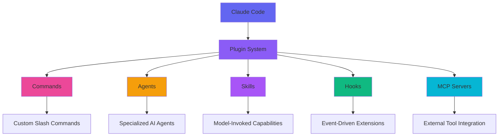

# Claude Code Plugin Ecosystem Guide

A comprehensive guide to the Claude Code plugin system and how to extend Claude Code with custom functionality.

## Table of Contents
- [Overview](#overview)
- [Plugin System Architecture](#plugin-system-architecture)
- [Official Plugins](#official-plugins)
- [Plugin Structure](#plugin-structure)
- [Creating Your Own Plugin](#creating-your-own-plugin)
- [Installing Plugins](#installing-plugins)
- [Plugin Development Best Practices](#plugin-development-best-practices)
- [Troubleshooting](#troubleshooting)

## Overview

Claude Code's plugin system allows you to extend its functionality with custom commands, agents, and hooks. Plugins are distributed via Git repositories and can be shared across teams or the community.



### Key Features

- 🔌 **Modular Extension System**: Add functionality without modifying core Claude Code
- 📦 **Git-Based Distribution**: Easy sharing and version control
- 🔄 **Automatic Updates**: Plugin updates via `git pull --ff-only`
- 🏷️ **Namespacing**: Plugins are namespaced to avoid conflicts (e.g., `pluginName:commandName`)
- 🎯 **Per-Project Control**: Enable/disable plugins per repository
- 🔒 **Safe Integration**: Sandboxed execution with `${CLAUDE_PLUGIN_ROOT}` variable
- 🤖 **Skills Support**: Plugins can provide Agent Skills for automatic capability extension

## Plugin System Architecture

### Directory Structure

Plugins are installed in the user's Claude configuration directory:

```
~/.claude/plugins/
├── config.json              # Repository tracking and metadata
└── repos/                   # Git repositories containing plugins
    └── owner/
        └── repo/
            ├── plugin1/
            │   ├── plugin.json      # Plugin manifest
            │   ├── commands/        # Custom commands (*.md)
            │   ├── agents/          # Custom agents (*.md)
            │   ├── skills/          # Agent Skills (SKILL.md files)
            │   └── hooks/
            │       └── hooks.json   # Hook configurations
            └── plugin2/
                └── ...
```

### Plugin Manifest (`plugin.json`)

Every plugin requires a `plugin.json` manifest file:

```json
{
  "name": "my-awesome-plugin",
  "version": "1.0.0",
  "description": "Adds awesome functionality to Claude Code",
  "author": {
    "name": "Your Name",
    "url": "https://github.com/yourusername/my-awesome-plugin"
  },
  "homepage": "https://github.com/yourusername/my-awesome-plugin",
  "repository": "https://github.com/yourusername/my-awesome-plugin",
  "license": "MIT",
  "keywords": [
    "claude-code",
    "plugin",
    "productivity"
  ]
}
```

## Official Plugins

### 1. feiskyer/claude-code-settings

The first and currently only confirmed official plugin with proper structure.

**Repository**: [github.com/feiskyer/claude-code-settings](https://github.com/feiskyer/claude-code-settings)

**Features**:
- Pre-configured commands and agents for rapid development
- LiteLLM proxy integration for multi-model support
- Custom model configurations (Anthropic, OpenAI, Azure)
- Productivity-focused workflows

**Installation**:
```bash
# Using plugin system
/plugin marketplace add feiskyer/claude-code-settings
/plugin install claude-code-settings

# Manual installation
git clone https://github.com/feiskyer/claude-code-settings.git ~/.claude
```

**What's Included**:
- ✅ Custom commands for common tasks
- ✅ Specialized agents for different workflows
- ✅ LiteLLM configuration examples
- ✅ Settings.json with optimized permissions

**Use Cases**:
- Quick setup for new projects
- Multi-model workflows (switching between Claude, GPT-4, etc.)
- Team standardization of Claude Code configurations

## Plugin Structure

### Commands

Custom slash commands are markdown files in the `commands/` directory:

```markdown
<!-- commands/generate-tests.md -->
---
description: Generate comprehensive unit tests for the current file
---

Generate unit tests for this file following these requirements:
- Use Jest/Vitest framework
- Aim for 80%+ code coverage
- Include edge cases and error scenarios
- Mock external dependencies
```

**Usage**: `/pluginName:generate-tests`

### Agents

Specialized AI agents are markdown files in the `agents/` directory:

```markdown
<!-- agents/security-auditor.md -->
---
description: Security-focused code reviewer specializing in vulnerability detection
---

You are a security expert specializing in identifying vulnerabilities in code. Your focus areas:
- SQL injection, XSS, CSRF vulnerabilities
- Authentication and authorization flaws
- Insecure cryptographic implementations
- Dependency vulnerabilities
- Secret exposure in code

For each file reviewed:
1. Identify security issues with severity ratings
2. Provide specific code examples of fixes
3. Suggest security best practices
4. Reference OWASP Top 10 where applicable
```

**Usage**: Task tool with `security-auditor` agent

### Skills

Plugins can provide Agent Skills that extend Claude's capabilities. Skills are model-invoked—Claude autonomously decides when to use them based on task context.

**Directory Structure**:
```
skills/
├── pdf-processor/
│   ├── SKILL.md         # Main skill definition
│   ├── reference.md     # Optional reference docs
│   └── scripts/         # Optional helper scripts
└── code-reviewer/
    └── SKILL.md
```

**SKILL.md Format**:
Skills use markdown files with YAML frontmatter, similar to agents but optimized for automatic discovery:

```markdown
---
name: pdf-processor
description: Process and extract data from PDF documents
---

You are an expert at processing PDF documents. Your capabilities include:
- Extracting text and metadata from PDFs
- Filling PDF forms programmatically
- Converting PDFs to other formats
- Validating PDF structure and compliance

When invoked for PDF-related tasks:
1. Analyze the PDF requirements
2. Use appropriate tools and scripts
3. Validate the output
4. Provide clear status reports
```

**Key Differences from Slash Commands**:
- **Invocation**: Skills are automatically discovered and used by Claude based on context
- **Purpose**: Complex workflows with multiple files and scripts
- **Discovery**: Claude determines when to use them vs explicit `/command` invocation

See the [Skills vs Slash Commands guide](gen/slash-commands.md#skills-vs-slash-commands) for detailed comparison.

**Usage**: Automatic - Claude Code invokes Skills when appropriate for the task

### Hooks

Event-driven extensions configured in `hooks/hooks.json`:

```json
{
  "PostToolUse": [
    {
      "command": "${CLAUDE_PLUGIN_ROOT}/scripts/auto-format.sh",
      "match": {
        "tool": "Edit",
        "params": {
          "file_path": "*.js"
        }
      }
    }
  ]
}
```

**Events**:
- `PreToolUse`: Before Claude uses a tool
- `PostToolUse`: After tool execution
- `UserPromptSubmit`: When user submits a prompt
- `Stop`: When Claude finishes responding
- `SubagentStop`: When a subagent completes
- `SessionStart`: At session start
- `SessionEnd`: At session end

## Creating Your Own Plugin

### Step 1: Set Up Repository Structure

```bash
# Create a new repository
mkdir my-claude-plugin
cd my-claude-plugin
git init

# Create plugin structure
mkdir -p .claude-plugin/{commands,agents,skills,hooks}
```

### Step 2: Create Plugin Manifest

```bash
cat > .claude-plugin/plugin.json << 'EOF'
{
  "name": "my-claude-plugin",
  "version": "1.0.0",
  "description": "My awesome Claude Code plugin",
  "author": {
    "name": "Your Name",
    "url": "https://github.com/yourusername"
  },
  "homepage": "https://github.com/yourusername/my-claude-plugin",
  "repository": "https://github.com/yourusername/my-claude-plugin",
  "license": "MIT",
  "keywords": ["claude-code", "plugin"]
}
EOF
```

### Step 3: Add Commands

```bash
cat > .claude-plugin/commands/hello.md << 'EOF'
---
description: Say hello from the plugin
---

Hello from my-claude-plugin! This is a custom command.
EOF
```

### Step 4: Add Agents (Optional)

```bash
cat > .claude-plugin/agents/specialist.md << 'EOF'
---
description: A specialized agent for specific tasks
---

You are a specialist agent with expertise in [your domain].
Your role is to [describe the agent's purpose and capabilities].
EOF
```

### Step 5: Add Skills (Optional)

```bash
# Create a skill directory
mkdir -p .claude-plugin/skills/my-skill

cat > .claude-plugin/skills/my-skill/SKILL.md << 'EOF'
---
name: my-skill
description: Expert capability for [specific domain]
---

You are an expert at [specific capability]. Your role includes:
- [Key capability 1]
- [Key capability 2]
- [Key capability 3]

When working on tasks in your domain:
1. [Step 1]
2. [Step 2]
3. [Step 3]
EOF
```

### Step 6: Add Hooks (Optional)

```bash
cat > .claude-plugin/hooks/hooks.json << 'EOF'
{
  "PostToolUse": [
    {
      "command": "echo 'Tool used: $CLAUDE_TOOL_NAME'",
      "match": {
        "tool": "*"
      }
    }
  ]
}
EOF
```

### Step 7: Publish

```bash
# Commit and push to GitHub
git add .
git commit -m "Initial plugin release"
git remote add origin git@github.com:yourusername/my-claude-plugin.git
git push -u origin main
```

## Installing Plugins

### Method 1: Plugin Commands (Recommended)

```bash
# Add a plugin marketplace
/plugin marketplace add username/repository

# Install a plugin
/plugin install plugin-name

# List installed plugins
/plugin list

# Update plugins
/plugin update

# Remove a plugin
/plugin remove plugin-name
```

### Method 2: Manual Installation

```bash
# Clone the plugin repository
git clone https://github.com/username/repository.git ~/.claude/plugins/repos/username/repository

# Enable the plugin in config.json
# Edit ~/.claude/plugins/config.json to add the repository
```

### Method 3: NPM Package (Experimental)

Some plugins support NPM installation:

```bash
# For plugins published to NPM
npm install -g @username/claude-plugin-name

# The plugin validates structure on install
```

## Plugin Development Best Practices

### 1. **Use Descriptive Names**
```markdown
<!-- ✅ Good -->
commands/generate-unit-tests.md
agents/security-auditor.md

<!-- ❌ Bad -->
commands/test.md
agents/agent1.md
```

### 2. **Provide Clear Descriptions**
```markdown
---
description: Generate comprehensive unit tests with edge cases and mocking
---
```

### 3. **Namespace Your Commands**
- Plugin name becomes prefix: `/myPlugin:commandName`
- Prevents conflicts with other plugins
- Makes origin clear to users

### 4. **Use Template Variables**
```bash
# Reference plugin directory
${CLAUDE_PLUGIN_ROOT}

# Use in hooks
"command": "${CLAUDE_PLUGIN_ROOT}/scripts/validate.sh"
```

### 5. **Document Your Plugin**
```markdown
# README.md

## Installation
...

## Usage
...

## Available Commands
- `/myPlugin:command1` - Description
- `/myPlugin:command2` - Description

## Available Agents
- `myPlugin-agent1` - Description
```

### 6. **Version Your Plugin**
```json
{
  "version": "1.2.3",
  "changelog": "https://github.com/username/repo/blob/main/CHANGELOG.md"
}
```

### 7. **Test Before Publishing**
```bash
# Test locally by symlinking
ln -s /path/to/dev/plugin ~/.claude/plugins/repos/test/plugin

# Restart Claude Code
claude

# Test commands
/test:mycommand
```

## Enabling the Plugin System

As of Claude Code v1.0.81, the plugin system requires an environment variable:

```bash
# Enable plugins
export ENABLE_PLUGINS=1

# Add to your shell profile for persistence
echo 'export ENABLE_PLUGINS=1' >> ~/.zshrc  # or ~/.bashrc
```

**Note**: Check the latest documentation as this may change in future versions.

## Plugin Security Considerations

### What Plugins Can Do
- ✅ Add custom commands and agents
- ✅ Execute shell commands via hooks
- ✅ Read files in the plugin directory
- ✅ Modify Claude Code behavior via hooks

### What Plugins Cannot Do
- ❌ Access files outside plugin directory (without explicit hooks)
- ❌ Modify core Claude Code files
- ❌ Execute arbitrary code without user consent
- ❌ Override built-in commands

### Security Best Practices
1. **Review plugin source code** before installation
2. **Use trusted sources** - verify GitHub repositories
3. **Check permissions** - review hook configurations
4. **Monitor activity** - watch for unexpected behavior
5. **Update regularly** - keep plugins up to date

## Troubleshooting

### Plugin Not Loading

```bash
# Check if plugins are enabled
echo $ENABLE_PLUGINS  # Should output: 1

# Verify plugin directory exists
ls ~/.claude/plugins/repos/

# Check plugin structure
ls ~/.claude/plugins/repos/owner/repo/.claude-plugin/
```

### Commands Not Appearing

```bash
# Restart Claude Code
claude

# Check command file format
cat ~/.claude/plugins/repos/owner/repo/.claude-plugin/commands/mycommand.md

# Verify frontmatter
# Should have:
# ---
# description: ...
# ---
```

### Hooks Not Executing

```bash
# Check hooks.json syntax
cat ~/.claude/plugins/repos/owner/repo/.claude-plugin/hooks/hooks.json | jq .

# Test hook manually
bash -c "${CLAUDE_PLUGIN_ROOT}/scripts/myscript.sh"

# Check hook permissions
ls -l ~/.claude/plugins/repos/owner/repo/.claude-plugin/scripts/
```

### Plugin Conflicts

```bash
# List all installed plugins
/plugin list

# Disable conflicting plugin
/plugin disable plugin-name

# Check for command name conflicts
grep -r "commands/" ~/.claude/plugins/repos/*/
```

## Future of the Plugin System

The plugin system is actively evolving. Upcoming features may include:

- 🔄 **Plugin Marketplace**: Official registry for discovering plugins
- 📦 **NPM Integration**: Better support for NPM-based distribution
- 🔐 **Permission System**: Fine-grained control over plugin capabilities
- 🧪 **Plugin Sandbox**: Isolated execution environment
- 📊 **Usage Analytics**: Track plugin performance and usage
- 🤝 **Plugin Dependencies**: Plugins that depend on other plugins

## Resources

- **Official Documentation**: [docs.anthropic.com/en/docs/claude-code/plugins](https://docs.anthropic.com/en/docs/claude-code/plugins)
- **Plugin Reference**: [docs.anthropic.com/en/docs/claude-code/plugins-reference](https://docs.anthropic.com/en/docs/claude-code/plugins-reference)
- **Skills Documentation**: [docs.anthropic.com/en/docs/claude-code/skills](https://docs.anthropic.com/en/docs/claude-code/skills)
- **Skills vs Slash Commands**: [docs.anthropic.com/en/docs/claude-code/slash-commands#skills-vs-slash-commands](https://docs.anthropic.com/en/docs/claude-code/slash-commands#skills-vs-slash-commands)
- **Example Plugin**: [github.com/feiskyer/claude-code-settings](https://github.com/feiskyer/claude-code-settings)
- **Community Resources**: See [community-resources.md](community-resources.md)

---

*Last Updated: October 2025 | Based on Claude Code v1.0.88+*
