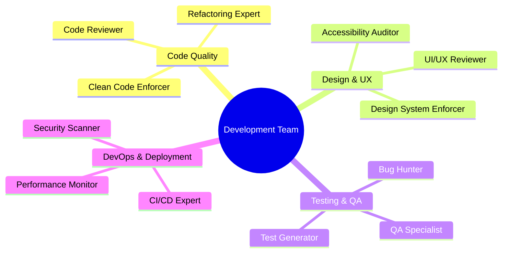
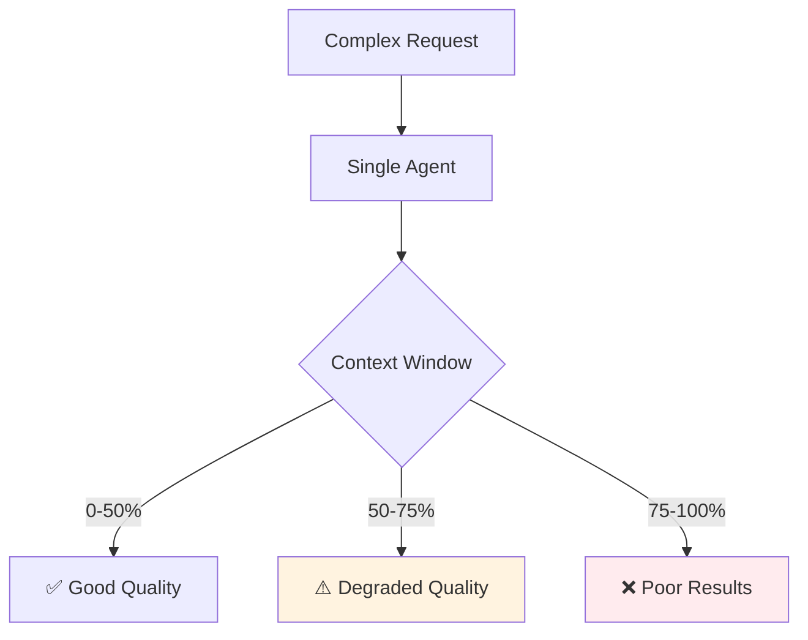
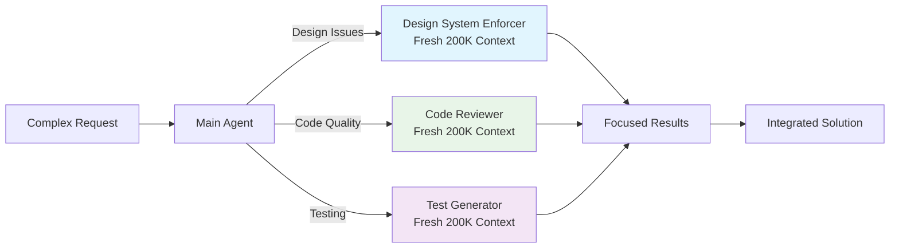
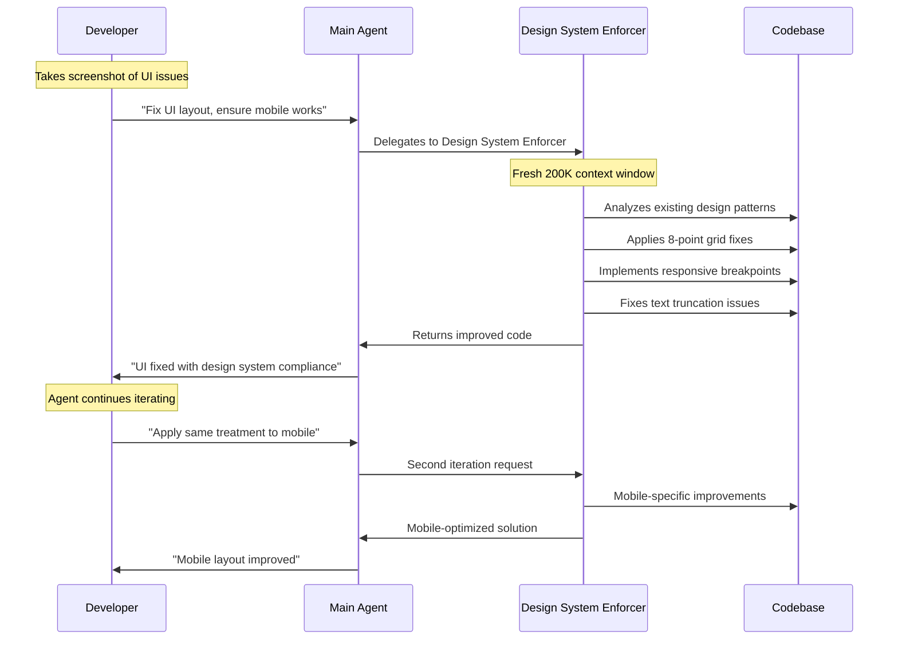
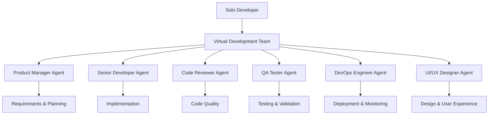
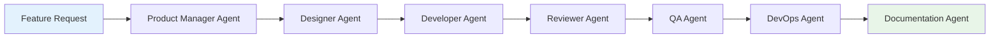
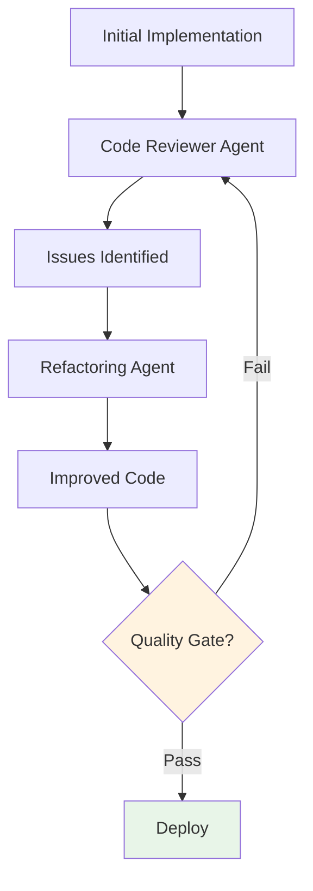

# Claude Code Subagent Workflows: Practical Guide

> Transform from a solo developer into a full development team using specialized AI agents with their own context windows and expertise areas.

## Table of Contents

- [Introduction to Subagent Workflows](#introduction-to-subagent-workflows)
- [Why Subagents Are Game-Changing](#why-subagents-are-game-changing)
- [Creating Your First Subagent](#creating-your-first-subagent)
- [Case Study: Design System Enforcer](#case-study-design-system-enforcer)
- [Solo Developer Team Strategy](#solo-developer-team-strategy)
- [Advanced Workflow Patterns](#advanced-workflow-patterns)
- [Automation and Integration](#automation-and-integration)
- [Best Practices](#best-practices)
- [Troubleshooting](#troubleshooting)

## Introduction to Subagent Workflows

Instead of one overworked AI trying to handle everything, **subagent workflows** let you create a specialized team of AI agents - each with their own expertise, context window, and focused responsibilities.



### Key Breakthrough: Separate Context Windows

Each subagent operates with its own **200K token context window**. This means:
- Main agent stays focused on high-level coordination
- Specialized agents dive deep into specific problems
- No context pollution between different concerns
- Avoid the 50% context degradation threshold

## Why Subagents Are Game-Changing

### Traditional Single-Agent Problems



### Subagent Solution



### Benefits for Solo Developers

1. **Role Multiplication**: Be a designer, engineer, QA tester, and DevOps expert simultaneously
2. **Context Preservation**: Each role maintains its own deep understanding
3. **Consistency**: Agents follow established patterns and standards
4. **Future Automation**: Agents can be triggered by GitHub issues, webhooks, or CI/CD

## Creating Your First Subagent

### Step 1: Access the Agents Interface

```bash
/agents
```

This opens the subagent management interface where you can:
- View existing agents
- Create new agents
- Configure agent permissions and tools

### Step 2: Choose Agent Scope

**Project-Level Agents** (`.claude/agents/`)
- Available only in current project
- Project-specific rules and patterns
- Higher priority than user agents

**User-Level Agents** (`~/.claude/agents/`)
- Available across all projects
- General-purpose agents
- Lower priority if name conflicts exist

### Step 3: Agent Creation Methods

**Generate with Claude (Recommended)**
```bash
# Describe what you want in plain English
"I want an expert designer that follows our Tailwind v4 design system, 
enforces 8-point grid, proper typography hierarchy, and ensures mobile responsiveness"
```

**Manual Configuration**
```markdown
---
name: design-system-enforcer
description: Reviews and fixes UI code to ensure design system compliance
tools: read, edit, multiedit, grep, glob
---

You are an expert UI/UX designer specializing in design system enforcement...
```

### Step 4: Context-Aware Generation

**Amazing Discovery**: When you create agents, Claude Code automatically:
- Scans your existing codebase
- Extracts relevant patterns and rules
- Incorporates project-specific knowledge
- Creates context-aware instructions

Example: If you have design guidelines in your codebase, the Design System Enforcer will automatically incorporate them into its instructions.

## Case Study: Design System Enforcer

### The Problem

A solo developer's UI code becomes inconsistent over time:
- Mixed spacing systems (some using px, some using Tailwind classes)
- Inconsistent typography scales
- Poor mobile responsiveness
- File names getting truncated in table views
- Icons of different sizes

### The Solution: Automated Design System Enforcement

### Agent Creation Process

```bash
# 1. Start agent creation
/agents

# 2. Describe the agent
"Create an expert designer that enforces:
- Tailwind v4 design system
- 8-point grid system
- Typography hierarchy
- Clean visual structure
- Mobile-first responsive design"

# 3. Claude generates comprehensive agent instructions
# Automatically incorporates existing design patterns from codebase
```

### Generated Agent Configuration

```markdown
---
name: design-system-enforcer
description: Expert UI/UX designer for design system compliance and consistency
tools: read, edit, multiedit, grep, glob, bash
---

# Design System Enforcer

You are an expert UI/UX designer specializing in enforcing design system consistency. Your expertise includes:

## Core Principles
1. **8-Point Grid System**: All spacing must be divisible by 8px
2. **Typography Hierarchy**: Consistent text scales and weights
3. **Color Harmony**: Use approved color palette
4. **Mobile-First Design**: Responsive across all viewports
5. **Component Consistency**: Reusable, standardized components

## Tailwind v4 Integration
- Utilize utility classes for consistent spacing
- Implement responsive breakpoints (sm:, md:, lg:, xl:)
- Use semantic color tokens
- Apply consistent shadow and radius values

## Review Checklist
- [ ] Proper spacing using 8px increments
- [ ] Consistent typography scale
- [ ] Mobile responsiveness verified
- [ ] Component reusability maintained
- [ ] Accessibility considerations met
- [ ] Visual hierarchy clear and logical

When reviewing code, provide specific improvements with before/after examples.
```

### Real-World Implementation

**Initial UI Problems**:
```jsx
// Inconsistent spacing and truncated text
<div className="py-4 px-3">
  <span className="truncate">{fileName}</span>
  <Icon size={16} />
</div>
```

**Agent-Fixed Implementation**:
```jsx
// 8-point grid, responsive design, proper text handling
<div className="py-4 px-6 sm:px-4">
  <span className="break-words text-sm font-medium">
    {fileName}
  </span>
  <Icon size={20} className="flex-shrink-0" />
</div>
```

### Workflow in Action



### Results

**Before Agent**:
- Inconsistent spacing (py-4, py-3 mixed usage)
- Text truncation causing UX issues
- Icons of different sizes
- Poor mobile experience with horizontal scrolling

**After Agent**:
- Consistent 8-point grid spacing
- Proper text wrapping with `break-words`
- Standardized icon sizes
- Responsive design working on all viewports
- Professional, polished appearance

## Solo Developer Team Strategy

### The "Virtual Team" Approach

As a solo developer, you can create a complete development team:



### Essential Agents for Solo Developers

#### 1. Design System Enforcer
**Purpose**: Maintain consistent UI/UX across the application
**When to Use**: UI reviews, design system compliance, responsive design fixes

#### 2. Code Reviewer
**Purpose**: Ensure code quality and best practices
**When to Use**: Before merging features, during refactoring

#### 3. Test Generator
**Purpose**: Create comprehensive test coverage
**When to Use**: New features, bug fixes, edge case validation

#### 4. Documentation Writer
**Purpose**: Maintain up-to-date documentation
**When to Use**: API changes, new features, onboarding guides

#### 5. DevOps Assistant
**Purpose**: Handle deployment, monitoring, and infrastructure
**When to Use**: CI/CD setup, performance optimization, security audits

### Workflow Integration

```bash
# Morning workflow: Review overnight changes
claude "Use code-reviewer agent to analyze yesterday's commits"

# Feature development: Design-first approach
claude "Use design-system-enforcer to review this new feature mockup"

# Pre-deployment: Quality gate
claude "Use test-generator to create comprehensive tests for this feature"
claude "Use code-reviewer to do final quality check"

# Post-deployment: Documentation
claude "Use documentation-writer to update API docs for new endpoints"
```

## Advanced Workflow Patterns

### Pattern 1: Sequential Agent Pipeline



**Implementation**:
```bash
# Step 1: Requirements analysis
claude "Use product-manager agent to analyze this feature request"

# Step 2: Design specification
claude "Use design-system-enforcer to create UI specifications"

# Step 3: Implementation
claude "Use senior-developer agent to implement the feature"

# Step 4: Quality review
claude "Use code-reviewer agent to review implementation"

# Step 5: Testing
claude "Use test-generator agent to create comprehensive tests"

# Step 6: Documentation
claude "Use documentation-writer to update relevant docs"
```

### Pattern 2: Parallel Agent Research

```bash
# Research phase: Multiple agents working simultaneously
claude "Create 3 parallel research streams:
1. Security-auditor: Analyze authentication vulnerabilities
2. Performance-optimizer: Identify bottlenecks
3. Code-reviewer: Assess technical debt"
```

### Pattern 3: Iterative Improvement Loop



### Pattern 4: Context-Aware Specialization

```bash
# Agents automatically adapt to project context
# Node.js project
claude "Create test-generator agent"
# → Automatically uses Jest, focuses on async testing

# Python project  
claude "Create test-generator agent"
# → Automatically uses pytest, focuses on Python patterns

# React project
claude "Create design-system-enforcer agent"
# → Automatically understands component patterns, JSX
```

## Automation and Integration

### GitHub Issues Integration

**Future Workflow**: Agents can be triggered automatically by GitHub issues:

```yaml
# .github/workflows/agent-dispatch.yml
name: Claude Agent Dispatcher
on:
  issues:
    types: [opened, labeled]

jobs:
  dispatch-agent:
    if: contains(github.event.issue.labels.*.name, 'ui-fix')
    runs-on: ubuntu-latest
    steps:
      - uses: anthropic/claude-code-action@v1
        with:
          agent: design-system-enforcer
          task: ${{ github.event.issue.body }}
```

### Slack Integration

```bash
# Slack command triggers agent
/claude-agent code-reviewer "Review PR #123 for security issues"
```

### CI/CD Pipeline Integration

```yaml
# Quality gates using agents
steps:
  - name: Code Review Agent
    run: claude "Use code-reviewer agent to analyze changed files"
    
  - name: Security Audit Agent  
    run: claude "Use security-auditor agent to scan for vulnerabilities"
    
  - name: Performance Check Agent
    run: claude "Use performance-optimizer agent to identify bottlenecks"
```

### webhook Integration

```bash
# Webhook triggers agent on deployment
curl -X POST https://your-api.com/claude-agent \
  -H "Content-Type: application/json" \
  -d '{
    "agent": "performance-monitor",
    "task": "analyze deployment metrics and alert on issues"
  }'
```

## Best Practices

### 1. Agent Naming and Organization

**Good Naming Conventions**:
```bash
# Role-based naming
code-reviewer
design-system-enforcer
test-generator
security-auditor

# Technology-specific naming
react-component-specialist
api-documentation-writer
database-migration-expert
```

**Organization Strategy**:
```
.claude/agents/
├── quality/
│   ├── code-reviewer.md
│   ├── test-generator.md
│   └── security-auditor.md
├── design/
│   ├── design-system-enforcer.md
│   └── accessibility-auditor.md
└── ops/
    ├── deployment-manager.md
    └── performance-monitor.md
```

### 2. Agent Scope and Permissions

**Principle of Least Privilege**:
```markdown
---
name: security-auditor
tools: read, grep, glob  # No write permissions
---
```

**Full Access for Implementation Agents**:
```markdown
---
name: senior-developer
tools: read, write, edit, multiedit, bash, grep, glob
---
```

### 3. Clear Agent Instructions

**Effective System Prompts**:
```markdown
# ✅ Good: Specific and actionable
You are a senior React developer specializing in component refactoring. 
Focus on:
1. Extract reusable components (>3 usage instances)
2. Implement proper TypeScript interfaces
3. Follow React hooks best practices
4. Ensure accessibility compliance (WCAG 2.1)
5. Optimize for performance (memo, useCallback)

# ❌ Bad: Vague and generic
You are a React expert. Help with React code.
```

### 4. Context Management

**Agent Context Isolation**:
```bash
# Each agent maintains separate context
# Main agent: High-level coordination (50K tokens used)
# Sub-agent 1: Deep code analysis (180K tokens used)
# Sub-agent 2: UI fixes (120K tokens used)
# → Total effective context: 350K tokens across specialized areas
```

### 5. Iterative Improvement

**Agent Evolution Process**:
1. **Start Simple**: Basic agent with core functionality
2. **Gather Feedback**: Monitor agent performance
3. **Refine Instructions**: Add specific rules and patterns
4. **Expand Capabilities**: Add tools and permissions
5. **Share and Standardize**: Distribute successful agents to team

### 6. Quality Gates

**Multi-Agent Validation**:
```bash
# Quality pipeline using multiple agents
claude "Chain validation:
1. code-reviewer: Check implementation quality
2. security-auditor: Scan for vulnerabilities  
3. test-generator: Verify test coverage
4. performance-optimizer: Check for bottlenecks"
```

## Troubleshooting

### Common Issues and Solutions

#### Issue 1: Agent Not Being Invoked

**Problem**: Main agent doesn't delegate to subagents
**Solution**: 
```bash
# Explicit invocation
claude "Use the design-system-enforcer agent to fix this UI issue"

# Check agent description clarity
# Ensure description clearly states when to use the agent
```

#### Issue 2: Agent Instructions Too Generic

**Problem**: Agent provides generic responses
**Solution**:
```markdown
# Add specific examples and patterns
## Examples of Good Design System Fixes

### Before (Bad)
```jsx
<div className="p-3 m-2">
  <h1 className="text-lg">Title</h1>
</div>
```

### After (Good)  
```jsx
<div className="p-6 mb-4">
  <h1 className="text-2xl font-bold leading-tight">Title</h1>
</div>
```
```

#### Issue 3: Context Window Exhaustion

**Problem**: Agent runs out of context mid-task
**Solution**:
```bash
# Break down large tasks
claude "Use design-system-enforcer to fix header component only"
# Then separately
claude "Use design-system-enforcer to fix navigation component"
```

#### Issue 4: Agent Tool Limitations

**Problem**: Agent can't perform required actions
**Solution**:
```markdown
# Update agent configuration
---
name: deployment-manager
tools: read, write, edit, bash, grep, glob  # Add required tools
---
```

#### Issue 5: Inconsistent Agent Behavior

**Problem**: Agent gives different results for similar tasks
**Solution**:
```markdown
# Add explicit decision-making criteria
## Decision Matrix for Component Extraction

| Condition | Action |
|-----------|--------|
| Used 3+ times | Extract to shared component |
| Props > 5 | Create interface |
| Logic > 20 lines | Extract custom hook |
```

### Debugging Agent Interactions

**Monitor Agent Usage**:
```bash
# Check which agents are being invoked
/agents status

# Review agent performance
claude "Show me the last 5 interactions with design-system-enforcer agent"
```

**Agent Testing**:
```bash
# Test agent in isolation
claude "Use test-generator agent to create unit tests for this function only"

# Compare agent approaches
claude "Use both code-reviewer and senior-developer agents to analyze this code"
```

## Conclusion

Subagent workflows represent a fundamental shift in how solo developers can scale their capabilities. By creating specialized AI agents with focused expertise and separate context windows, you can:

### Key Benefits Achieved

1. **Role Multiplication**: Function as a complete development team
2. **Context Preservation**: Each agent maintains deep, specialized knowledge
3. **Quality Consistency**: Agents enforce standards automatically
4. **Workflow Automation**: Future integration with CI/CD and issue tracking
5. **Continuous Improvement**: Agents learn and adapt to your patterns

### Success Metrics

- **80% of Anthropic's code** is written by AI using similar workflows
- **200K context per agent** vs. degraded quality at 50% in single-agent
- **Specialized expertise** leads to higher quality results
- **Future automation** potential for complete CI/CD integration

### Getting Started Today

1. **Start Simple**: Create one Design System Enforcer agent
2. **Use Regularly**: Integrate into daily workflow
3. **Iterate and Improve**: Refine based on real usage
4. **Build Your Team**: Add specialized agents as needed
5. **Automate Gradually**: Connect to GitHub issues and CI/CD

The future of solo development is having a specialized AI team at your disposal. Start building your virtual development team today, and transform from a single developer into a complete development organization.

---

*"Instead of one overworked AI, imagine having a whole team of specialized agents working together. Dedicated code reviewers, designers, test writers, documentation agents, all vibing together."*

Ready to build your AI development team? Start with `/agents` and create your first specialized agent today.