# Claude Code Subagent Workflows: Practical Guide

> Transform from a solo developer into a full development team using specialized AI agents with their own context windows and expertise areas.

## Table of Contents

- [Introduction to Subagent Workflows](#introduction-to-subagent-workflows)
- [Built-in vs Custom Subagents](#built-in-vs-custom-subagents)
- [Why Subagents Are Game-Changing](#why-subagents-are-game-changing)
- [Subagents + Skills Integration](#subagents--skills-integration)
- [Long-Running Research with Resumable Agents](#long-running-research-with-resumable-agents)
- [Creating Your First Subagent](#creating-your-first-subagent)
- [Case Study: Design System Enforcer](#case-study-design-system-enforcer)
- [Solo Developer Team Strategy](#solo-developer-team-strategy)
- [Advanced Workflow Patterns](#advanced-workflow-patterns)
- [Automation and Integration](#automation-and-integration)
- [Best Practices](#best-practices)
- [Troubleshooting](#troubleshooting)

## Introduction to Subagent Workflows

Instead of one overworked AI trying to handle everything, **subagent workflows** let you create a specialized team of AI agents - each with their own expertise, context window, and focused responsibilities.

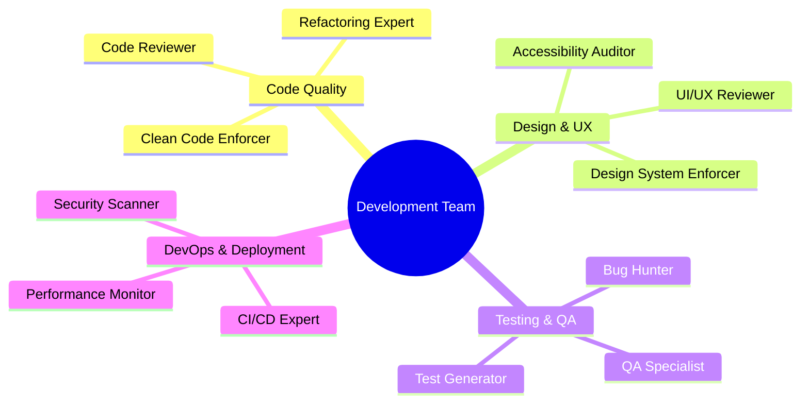

### Key Breakthrough: Separate Context Windows

Each subagent operates with its own **200K token context window**. This means:
- Main agent stays focused on high-level coordination
- Specialized agents dive deep into specific problems
- No context pollution between different concerns
- Avoid the 50% context degradation threshold

## Built-in vs Custom Subagents

Claude Code provides two types of subagents: **built-in subagents** that are automatically available, and **custom subagents** that you create for your specific needs.

### Understanding the Subagent Hierarchy

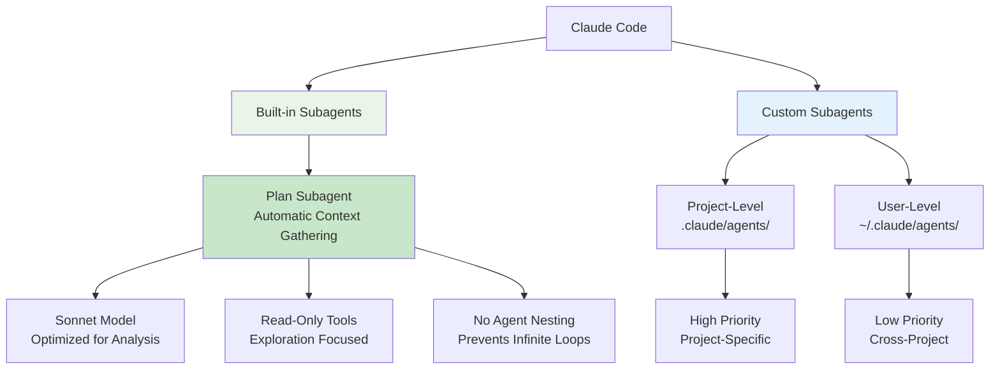

### The Built-in Plan Subagent

Claude Code includes a powerful **Plan subagent** that is automatically invoked during plan mode. This built-in agent is specifically designed for codebase exploration and context gathering.

#### Key Characteristics of the Plan Subagent

| Feature | Description |
|---------|------------|
| **Model** | Uses Sonnet model (capable, cost-effective for analysis) |
| **Purpose** | Codebase exploration and context gathering |
| **Invocation** | Automatic during plan mode |
| **Tools** | Read, Glob, Grep, Bash (read-only operations) |
| **Nesting** | Cannot spawn other subagents (prevents infinite loops) |
| **Context** | Fresh 200K window for deep exploration |
| **Output** | Structured analysis for main agent consumption |

#### Why the Plan Subagent Exists

The Plan subagent solves several critical problems:

1. **Context Preservation**: Main agent stays focused on task coordination
2. **Deep Exploration**: Can analyze large codebases without pollution
3. **Cost Optimization**: Sonnet model balances capability with efficiency
4. **Safety**: Read-only tools prevent accidental modifications during research
5. **Loop Prevention**: Cannot spawn subagents, avoiding infinite nesting

### Plan Mode Research Flow

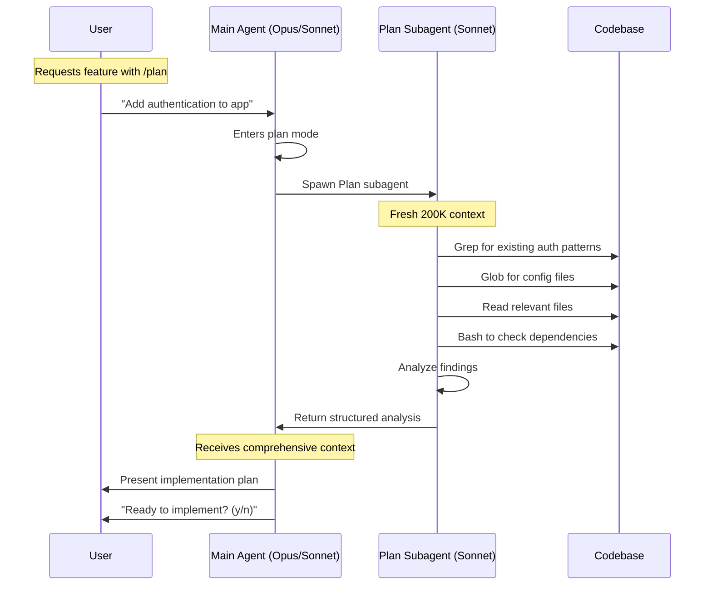

### Example Scenario: Plan Subagent in Action

**User Request**:
```bash
/plan "Add user authentication with JWT tokens"
```

**Behind the Scenes**:

1. **Main Agent** recognizes plan mode request
2. **Plan Subagent** automatically spawned with:
   - Sonnet model for efficient analysis
   - Read-only tools for safe exploration
   - Fresh 200K context window

3. **Plan Subagent Research**:
   ```bash
   # Searches for existing patterns
   Grep(pattern: "auth|login|jwt|token")
   
   # Finds configuration files
   Glob(pattern: "**/config.*")
   
   # Reads package.json for dependencies
   Read(file_path: "package.json")
   
   # Checks for auth libraries
   Bash(command: "npm list | grep -i auth")
   ```

4. **Structured Analysis Returned**:
   ```markdown
   ## Authentication Analysis
   
   ### Current State
   - No existing authentication system found
   - Express server at src/server.js
   - Database: PostgreSQL with users table
   
   ### Dependencies Needed
   - jsonwebtoken (JWT handling)
   - bcrypt (password hashing)
   - passport (optional, for strategies)
   
   ### Implementation Locations
   - Middleware: src/middleware/auth.js (new)
   - Routes: src/routes/auth.js (new)
   - User model: src/models/User.js (exists, needs update)
   ```

### Built-in vs Custom: When to Use Each

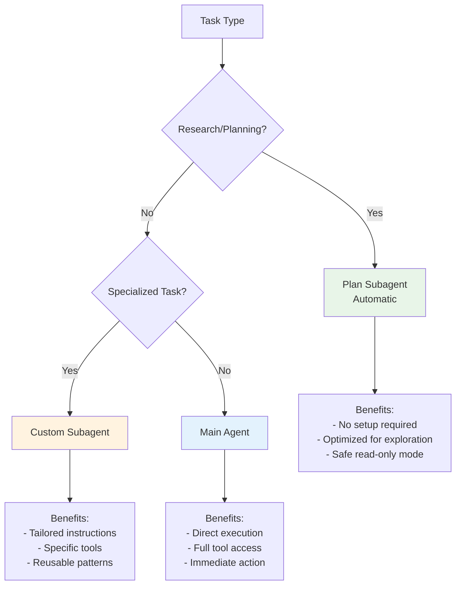

### Custom Subagents: Your Extended Team

While the Plan subagent handles research, custom subagents let you create specialized team members:

**Types of Custom Subagents**:

1. **Role-Based Agents**
   ```markdown
   - code-reviewer: Enforces quality standards
   - test-generator: Creates comprehensive tests
   - security-auditor: Scans for vulnerabilities
   ```

2. **Technology-Specific Agents**
   ```markdown
   - react-specialist: Component best practices
   - api-designer: RESTful patterns
   - database-optimizer: Query performance
   ```

3. **Process-Oriented Agents**
   ```markdown
   - documentation-writer: Maintains docs
   - refactoring-expert: Code improvements
   - performance-monitor: Bottleneck detection
   ```

### The Power of Combination

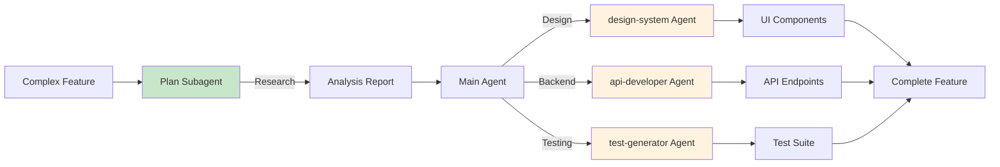

### Best Practices for Subagent Selection

1. **Let Plan Handle Research**
   ```bash
   # Good: Use plan mode for exploration
   /plan "Analyze codebase architecture"
   
   # Less optimal: Custom agent for one-time research
   "Create research-agent to analyze architecture"
   ```

2. **Custom Agents for Repeated Tasks**
   ```bash
   # Good: Reusable specialized agent
   "Use code-reviewer agent to check PR #123"
   
   # Less optimal: Plan mode for specific review
   /plan "Review code quality"
   ```

3. **Combine for Complex Workflows**
   ```bash
   # Optimal workflow
   /plan "Research payment integration options"
   # → Plan subagent explores codebase
   
   "Use api-developer agent to implement Stripe"
   # → Custom agent implements with specific patterns
   ```

### Technical Details: Plan Subagent Implementation

The Plan subagent is implemented with specific constraints to ensure safety and efficiency:

```yaml
# Internal configuration (simplified)
plan_subagent:
  model: sonnet  # Or configured default
  tools:
    - Read      # File reading
    - Glob      # Pattern matching
    - Grep      # Content search
    - Bash      # Command execution (read-only)
  restrictions:
    - no_write_operations
    - no_subagent_spawning
    - no_dangerous_commands
  context:
    - project_knowledge
    - git_status
    - environment_vars
    - NO conversation_history
```

### Understanding Context Isolation

Both built-in and custom subagents operate with isolated context:

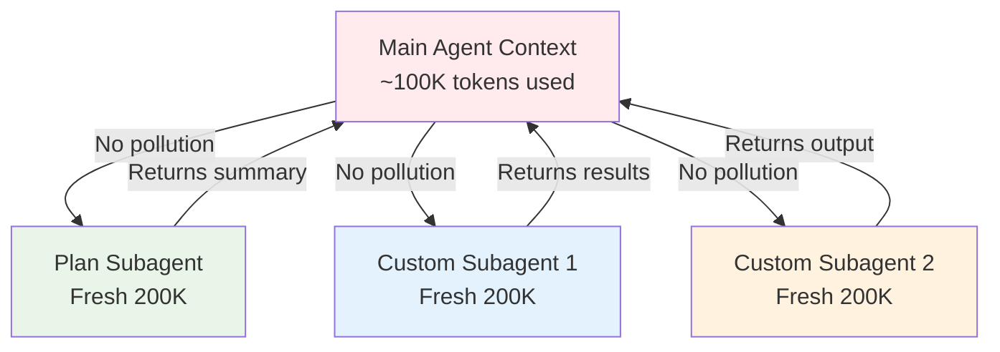

### Plan Subagent vs Custom Research Agents

| Aspect | Plan Subagent | Custom Research Agent |
|--------|---------------|----------------------|
| **Setup** | None required | Must create first |
| **Model** | Sonnet (automatic) | Configurable |
| **Tools** | Read-only preset | Fully configurable |
| **Nesting** | Cannot spawn agents | Can spawn if needed |
| **Best For** | One-time exploration | Repeated analysis patterns |
| **Context** | Clean, no history | Clean, no history |
| **Customization** | None | Full control |

### Common Patterns with Built-in Subagents

1. **Feature Planning**
   ```bash
   /plan "Add real-time notifications"
   # Plan subagent explores, then:
   "Implement using websockets"
   ```

2. **Architecture Review**
   ```bash
   /plan "Analyze for microservices split"
   # Plan subagent maps dependencies
   ```

3. **Migration Planning**
   ```bash
   /plan "Migrate from Express to Fastify"
   # Plan subagent identifies all touchpoints
   ```

### Key Takeaways

- **Plan subagent** is built-in and automatic during plan mode
- **Custom subagents** are created for specific, repeated tasks
- Both operate with **fresh 200K context windows**
- Plan subagent uses **Sonnet model** for cost-effective analysis
- Plan subagent has **read-only tools** for safe exploration
- Plan subagent **cannot spawn other agents** (prevents loops)
- Custom agents have **full flexibility** in configuration
- Combine both for **optimal workflows**: Plan researches, custom agents execute

## Why Subagents Are Game-Changing

### Traditional Single-Agent Problems

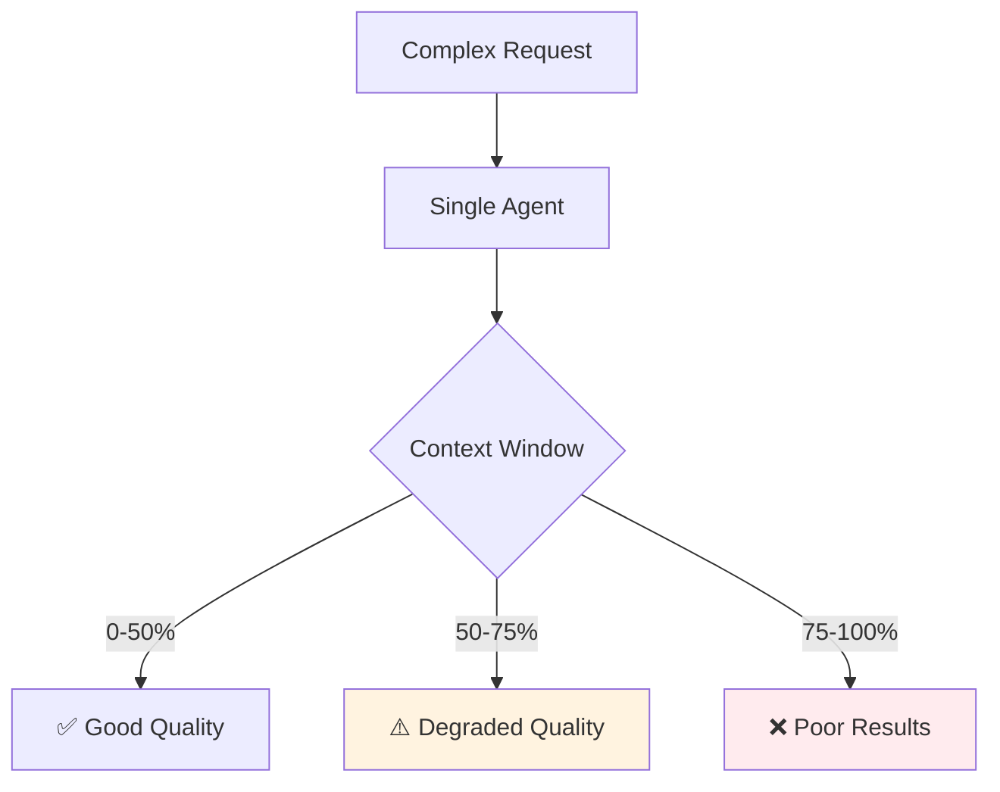

### Subagent Solution

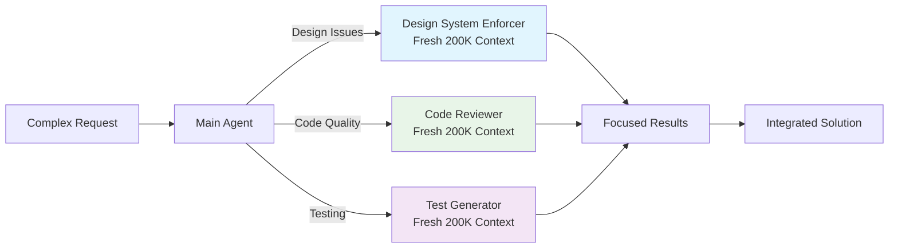

### Benefits for Solo Developers

1. **Role Multiplication**: Be a designer, engineer, QA tester, and DevOps expert simultaneously
2. **Context Preservation**: Each role maintains its own deep understanding
3. **Consistency**: Agents follow established patterns and standards
4. **Future Automation**: Agents can be triggered by GitHub issues, webhooks, or CI/CD

## Subagents + Skills Integration

**Verified Status**: ✅ Subagents CAN use Agent Skills

As of Claude Code v1.0.88+, subagents can leverage Agent Skills to extend their capabilities. This powerful combination allows specialized agents to use modular skill packages for enhanced functionality.

### How Subagents Access Skills

**Key Discovery** (verified through testing):

| Feature | Main Agent | Subagents |
|---------|------------|-----------|
| **Skill Discovery** | ✅ Automatic | ✅ Automatic (via system prompt) |
| **Skill Invocation** | ✅ Model-invoked (automatic) | ⚠️ Explicit via Skill tool |
| **Skill Availability** | All project skills | All project skills |
| **Context Impact** | Uses main context | Uses subagent context |

**Critical Difference**:
- **Main Agent**: Skills activate automatically based on task context
- **Subagents**: Must explicitly invoke skills using `Skill(command: "skill-name")`

### Subagent Context Model

When a subagent is launched, it receives a "fresh but informed" 200K context window:

**Baseline Context Usage: ~15-16% (~31K tokens)**

| Subagents HAVE ✅ | Subagents DON'T HAVE ❌ |
|-------------------|-------------------------|
| CLAUDE.md hierarchy | Conversation history |
| Environment variables | Previous user messages |
| Git status | Main agent's reasoning |
| File system access | Why they were invoked |
| All tools and skills | Task context from main agent |
| Project documentation | User's current goal |
| Skills metadata | Past exchanges |

**What This Means**:
- ✅ Subagents know about the *project*
- ❌ Subagents don't know about the *conversation*
- ✅ ~170K tokens remain for actual work
- ✅ No context pollution from main agent

### Practical Example: Subagent Using Skills

```bash
# Example 1: Automatic skill selection by subagent
User: "Use the code-analyzer agent to analyze this project"

code-analyzer thinks: "I need file statistics... I'll use file-counter skill"
→ Invokes: Skill(command: "file-counter")
→ Gets: File composition data
→ Uses data in analysis

# Example 2: Explicit skill specification
User: "Use skill-tester with the git-info skill"

skill-tester:
→ Invokes: Skill(command: "git-info")
→ Gets: Repository statistics
→ Reports findings
```

### Benefits of Subagent + Skills Combination

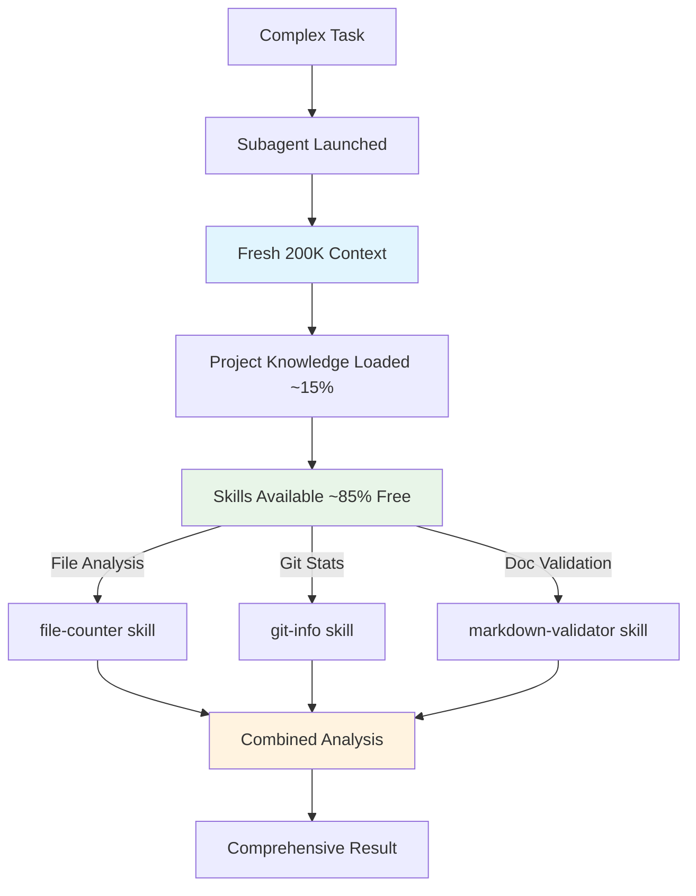

**Advantages**:

1. **Modularity**: Skills are reusable across all subagents
2. **Specialization**: Subagents choose which skills to invoke
3. **Isolation**: Skill execution happens in subagent's clean context
4. **Composition**: Multiple skills can be orchestrated in workflows
5. **Scalability**: Add new skills without modifying subagents

### Creating Skills for Subagents

Skills work identically whether used by main agent or subagents:

**Skill Structure**:
```
.claude/skills/my-skill/
├── SKILL.md              # Required: Instructions and metadata
├── scripts/              # Optional: Supporting scripts
│   └── helper.py
└── templates/            # Optional: Templates or data files
```

**SKILL.md Example**:
```markdown
---
name: File Counter
description: Counts and categorizes files by type. Use when analyzing codebase composition or getting project statistics.
---

# File Counter

[Skill instructions here...]
```

**Key Points for Subagent-Compatible Skills**:
- ✅ Clear descriptions help subagents choose when to use them
- ✅ Self-contained skills work best (minimal external dependencies)
- ✅ Can include scripts that subagents execute
- ✅ Results should be formatted for easy integration

### Real-World Test Results

From actual testing (2025-10-18):

**Test Setup**:
- 3 test subagents: skill-tester, documentation-writer, code-analyzer
- 3 test skills: markdown-validator, file-counter, git-info

**Results**:
```
✅ Skill Discovery: All 3 skills found by subagents
✅ Skill Execution: file-counter successfully invoked
✅ Context Isolation: Confirmed (no conversation history leaked)
✅ Context Usage: ~31.5K tokens baseline (~15-16%)
✅ Tool Restrictions: documentation-writer correctly limited to Read/Grep/Glob
✅ Multi-Skill: Subagents can invoke multiple skills in sequence
```

**Example Output from Test**:
```
$ code-analyzer: "Give me complete analysis using all skills"

→ Using file-counter skill...
  Result: 99 files, 90.9% Markdown, 1.2 MB total

→ Using git-info skill...
  Result: 29 commits, 1 contributor, active development

→ Using markdown-validator skill...
  Result: [would validate markdown files]

Final Analysis: [Comprehensive report combining all skill results]
```

### When to Use Subagents vs Skills

**Use Subagents When**:
- Task requires separate context (prevent pollution)
- Need specialized "personality" or instructions
- Want to restrict tool access
- Complex multi-step workflows
- Different model than main agent

**Use Skills When**:
- Adding modular capabilities
- Want automatic invocation by main agent
- Reusable across multiple agents/subagents
- Self-contained functionality
- Can be packaged for distribution

**Use Both (Subagent + Skills) When**:
- ⭐ Need isolation AND modularity
- ⭐ Specialized agent needs specific capabilities
- ⭐ Orchestrating multiple skills in clean context
- ⭐ Building complex analysis workflows
- ⭐ Tool restrictions + extended capabilities

### Best Practices

1. **Design Skills for Reusability**
   ```markdown
   ❌ Bad: "Analyze the user's project"
   ✅ Good: "Count files by type and size"
   ```

2. **Let Subagents Choose Skills**
   ```bash
   ❌ "Use skill X to do Y"
   ✅ "Analyze the codebase" (subagent picks appropriate skills)
   ```

3. **Combine with Tool Restrictions**
   ```yaml
   # Read-only subagent can still use skills
   tools: Read, Grep, Glob, Skill
   ```

4. **Document Skill Availability in Subagent Instructions**
   ```markdown
   ## Skills You Can Use
   - file-counter: For composition analysis
   - git-info: For development metrics
   ```

5. **Test in Isolation**
   ```bash
   # Always test that skills work correctly with subagents
   "Use [subagent] to invoke [skill] on [target]"
   ```

### Troubleshooting

**Problem**: Subagent doesn't use available skills

**Solutions**:
- Make task description match skill descriptions
- Explicitly mention skill name in request
- Check skill description is clear and relevant
- Verify skills are in `.claude/skills/` or `~/.claude/skills/`

**Problem**: Subagent context seems too full

**Explanation**:
- ~15-16% baseline is normal (skills metadata, CLAUDE.md, project context)
- Still leaves ~170K tokens for work
- This is "fresh but informed" - better than context pollution

**Problem**: Skill works with main agent but not subagent

**Check**:
- Tool restrictions on subagent (needs Skill tool access)
- Skill requires tools subagent doesn't have
- Subagent instructions may need to mention skills explicitly

## Long-Running Research with Resumable Agents

One of Claude Code's most powerful but underutilized features is **resumable agents** - the ability to pause and resume subagent sessions with their complete context intact. This is a game-changer for complex, iterative research tasks.

### Understanding Resumable Agents

Resumable agents allow you to:
- Start a research task with a subagent
- Let it run until context fills up or task pauses
- Resume later with the **exact same context and history**
- Continue iterating without starting over

```mermaid
flowchart LR
    A[Initial Session] -->|agentId: abc123| B[Research Phase 1]
    B -->|Pause/Exit| C[Context Saved]
    C -->|Resume abc123| D[Research Phase 2]
    D -->|All History Intact| E[Continue Work]
    E -->|Pause Again| F[Context Saved]
    F -->|Resume abc123| G[Research Phase 3]
    
    style C fill:#e8f5e8
    style F fill:#e8f5e8
```

### Key Features of Resumable Agents

| Feature | Description |
|---------|------------|
| **Unique Agent ID** | Each subagent gets a unique identifier (e.g., `abc123def456`) |
| **Persistent Storage** | Full transcript saved to disk |
| **Complete Context** | Entire conversation history preserved |
| **Tool Memory** | Previous file reads, searches cached |
| **State Restoration** | Picks up exactly where it left off |
| **Infinite Sessions** | Can resume days or weeks later |

### Use Cases for Resumable Agents

#### 1. Large Codebase Analysis
```bash
# Day 1: Start analysis
"Use code-analyzer agent to audit the entire backend"
# → agentId: analyzer_789xyz
# → Analyzes 50 files, context filling up

# Day 2: Resume where left off
"Resume agent analyzer_789xyz and continue with frontend"
# → Continues with all previous findings available
```

#### 2. Iterative Design Documentation
```bash
# Session 1: Document core components
"Use documentation-writer to document API"
# → agentId: docs_456abc

# Session 2: Add examples
"Resume docs_456abc and add code examples"

# Session 3: Add troubleshooting
"Resume docs_456abc and add troubleshooting section"
```

#### 3. Long-Running Research Projects
```bash
# Week 1: Research authentication options
"Research all authentication strategies"
# → agentId: research_123def

# Week 2: Deep dive into chosen option
"Resume research_123def and detail OAuth implementation"
```

### Technical Implementation

#### Where Transcripts Are Stored

Resumable agent transcripts are saved in your Claude Code config directory:

```bash
# Default locations by platform
macOS/Linux: ~/.config/claude-code/sessions/transcripts/
Windows: %APPDATA%\claude-code\sessions\transcripts\

# File format
{agentId}_{timestamp}.json
```

#### Transcript Structure

```json
{
  "agentId": "analyzer_789xyz",
  "agentName": "code-analyzer",
  "model": "claude-3-sonnet",
  "startTime": "2025-01-15T10:30:00Z",
  "messages": [
    {
      "role": "user",
      "content": "Analyze backend architecture"
    },
    {
      "role": "assistant",
      "content": "I'll analyze the backend...",
      "toolUse": [
        {
          "tool": "Grep",
          "params": {"pattern": "class.*Controller"},
          "result": "Found 15 controllers..."
        }
      ]
    }
  ],
  "context": {
    "fileReads": ["src/server.js", "src/controllers/..."],
    "projectPath": "/Users/dev/project",
    "environment": {}
  }
}
```

### How to Get Agent IDs

There are three ways to obtain an agent's ID for resumption:

#### Method 1: Initial Response
```bash
# When you first spawn a subagent, note the ID in the response
"Use code-analyzer to audit the codebase"
# Response includes: "Starting agent session: analyzer_789xyz"
```

#### Method 2: List Recent Sessions
```bash
# Check recent agent sessions
/agents sessions

# Output:
# Recent Agent Sessions:
# - analyzer_789xyz (code-analyzer) - 2 hours ago
# - docs_456abc (documentation-writer) - Yesterday
# - test_123def (test-generator) - 3 days ago
```

#### Method 3: Check Transcript Files
```bash
# List transcript files directly
ls ~/.config/claude-code/sessions/transcripts/

# Find specific agent transcripts
ls ~/.config/claude-code/sessions/transcripts/ | grep analyzer
```

### Resuming Agent Sessions

#### Basic Resume Command
```bash
# Resume by agent ID
"Resume agent analyzer_789xyz"

# Or with new instructions
"Resume agent analyzer_789xyz and focus on security issues"
```

#### Resume Patterns

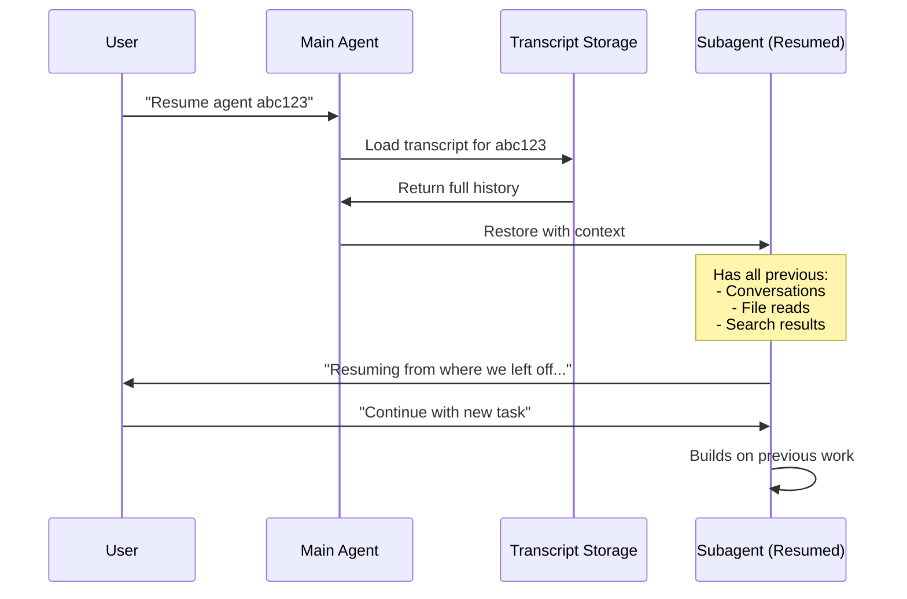

### Best Practices for Resumable Research

#### 1. Name Your Agents Meaningfully
```bash
# Good: Descriptive task-based naming
"Create migration-planner agent for database upgrade"
# → Easy to remember: migration-planner_abc123

# Less optimal: Generic naming
"Create agent1 to look at database"
# → Hard to remember purpose
```

#### 2. Document Progress Before Pausing
```bash
# Before stopping, ask for summary
"Summarize what we've discovered so far"

# Or create checkpoint
"Create a checkpoint summary of current findings"
```

#### 3. Use Resumable Agents for Iterative Work
```bash
# Perfect for resumable agents:
- Large refactoring projects
- Documentation writing
- Codebase audits
- Migration planning
- Architecture analysis

# Better as fresh agents:
- Quick bug fixes
- Simple queries
- One-off tasks
```

#### 4. Track Agent IDs in Your Workflow
```markdown
## Project: Authentication Rewrite

### Active Research Agents
- auth_researcher_789xyz - OAuth research (3 sessions)
- security_auditor_456abc - Vulnerability scan (2 sessions)
- test_planner_123def - Test strategy (1 session)

### Completed Agents
- ✅ requirements_gatherer_999zzz - Requirements done
```

### Context Management Benefits

Resumable agents solve the context window problem elegantly:

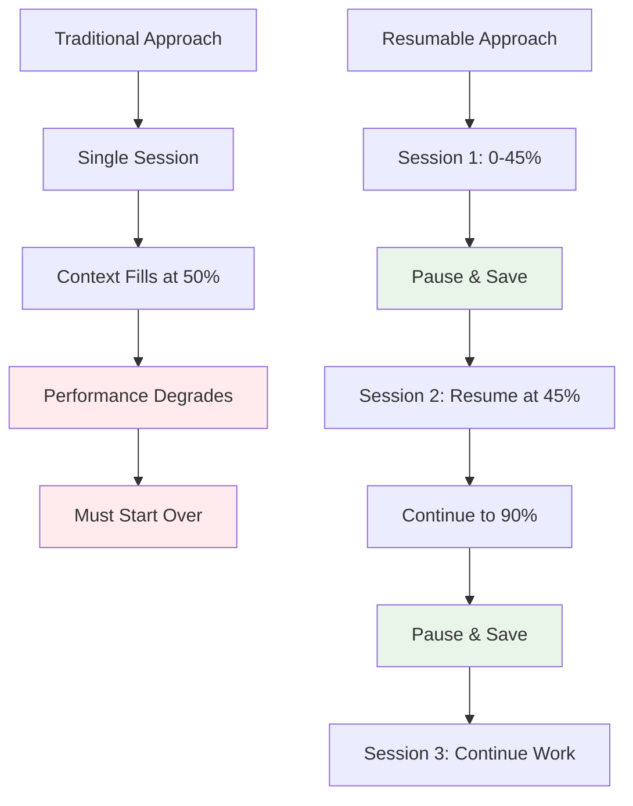

### Context Efficiency Comparison

| Approach | Context Usage | Quality | Continuity |
|----------|--------------|---------|------------|
| **Single Session** | Degrades after 50% | Drops significantly | N/A |
| **Multiple Fresh Agents** | Always fresh | Good | Lost between sessions |
| **Resumable Agents** | Accumulates wisely | Maintains high quality | Perfect continuity |

### Advanced Pattern: Research Pipeline

Create a sophisticated research pipeline using resumable agents:

```bash
# Phase 1: Broad Analysis (Week 1)
"Create architecture-analyst agent to map entire system"
# → ID: arch_abc123
# Runs for multiple sessions mapping dependencies

# Phase 2: Deep Dive (Week 2)
"Resume arch_abc123 and identify problem areas"
# Continues with full system knowledge

# Phase 3: Solution Design (Week 3)
"Resume arch_abc123 and design refactoring plan"
# Uses accumulated knowledge for solutions

# Phase 4: Implementation Planning (Week 4)
"Resume arch_abc123 and create implementation roadmap"
# Leverages entire research history
```

### Troubleshooting Resumable Agents

#### Issue: Can't Find Agent ID
```bash
# Solution 1: Check recent sessions
/agents sessions

# Solution 2: Search transcripts
find ~/.config/claude-code/sessions/transcripts -name "*.json" -mtime -7
# Files modified in last 7 days

# Solution 3: Grep for agent name
grep -l "code-analyzer" ~/.config/claude-code/sessions/transcripts/*.json
```

#### Issue: Session Won't Resume
```bash
# Check if transcript exists
ls ~/.config/claude-code/sessions/transcripts/*abc123*

# Verify transcript isn't corrupted
python -m json.tool ~/.config/claude-code/sessions/transcripts/abc123_*.json

# Try resuming with explicit path
"Resume agent using transcript /path/to/transcript.json"
```

#### Issue: Context Too Large to Resume
```bash
# If agent has too much context accumulated
# Option 1: Start fresh but reference old findings
"Create new analyzer agent, reference findings from analyzer_789xyz"

# Option 2: Create summary agent
"Create summary agent to digest analyzer_789xyz findings"
```

### Memory Management for Long-Running Agents

#### Automatic Cleanup
```bash
# Claude Code may clean old transcripts
# Default retention: 30 days (configurable)
# Large transcripts: May be compressed
```

#### Manual Management
```bash
# List transcript sizes
du -h ~/.config/claude-code/sessions/transcripts/*.json

# Archive old research
mkdir ~/claude-research-archive
mv ~/.config/claude-code/sessions/transcripts/old_project_*.json ~/claude-research-archive/

# Compress large transcripts
gzip ~/.config/claude-code/sessions/transcripts/large_analysis_*.json
```

### Real-World Example: Multi-Week Refactoring

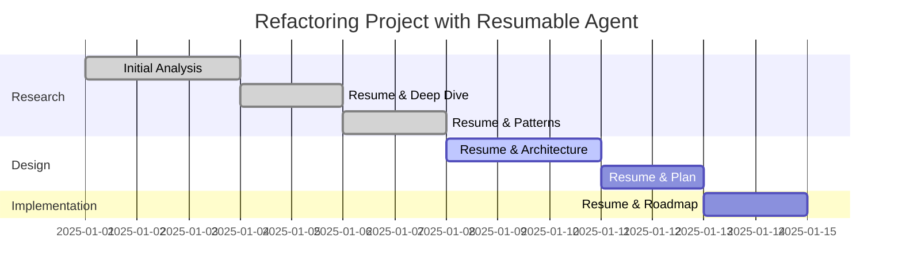

**Session Log**:
```bash
# Day 1-3: Initial Analysis
"Create refactoring-expert agent to analyze technical debt"
# → ID: refactor_xyz789
# Analyzes 200+ files, identifies 15 problem areas

# Day 4-5: Deep Dive (Resume)
"Resume refactor_xyz789 and detail the top 5 issues"
# Continues with all context, provides detailed analysis

# Day 6-7: Pattern Recognition (Resume)
"Resume refactor_xyz789 and identify common antipatterns"
# Builds on previous work, finds 3 systemic issues

# Day 8-10: Architecture Design (Resume)
"Resume refactor_xyz789 and design new architecture"
# Uses all accumulated knowledge for design

# Day 11-12: Planning (Resume)
"Resume refactor_xyz789 and create migration plan"
# Comprehensive plan based on weeks of analysis
```

### Integration with Team Workflows

Resumable agents can be shared (with caveats):

```bash
# Export transcript for team review
cp ~/.config/claude-code/sessions/transcripts/analyzer_789xyz_*.json ./research/

# Team member can import and continue
"Load and resume agent from ./research/analyzer_789xyz_*.json"

# Note: Requires same project context
```

### Future Possibilities

The resumable agent feature opens doors for:

1. **Persistent AI Assistants**: Long-lived agents that grow with your project
2. **Knowledge Accumulation**: Agents that learn your codebase over time
3. **Collaborative Research**: Multiple developers resuming shared agents
4. **Audit Trails**: Complete history of AI-assisted development
5. **Training Data**: Use transcripts to train specialized models

### Key Takeaways for Resumable Agents

- **Every subagent is resumable** via its unique ID
- **Transcripts persist** allowing continuation days/weeks later
- **Perfect for long research** that exceeds single context windows
- **Context accumulates** without degradation across sessions
- **IDs are trackable** via `/agents sessions` or file system
- **Combines with subagent benefits** (isolation, specialization)
- **Enables iterative workflows** impossible with single sessions
- **Game-changer for solo developers** doing complex analysis

## Creating Your First Subagent

### Step 1: Access the Agents Interface

```bash
/agents
```

This opens the subagent management interface where you can:
- View existing agents
- Create new agents
- Configure agent permissions and tools

### Step 2: Choose Agent Scope

**Project-Level Agents** (`.claude/agents/`)
- Available only in current project
- Project-specific rules and patterns
- Higher priority than user agents

**User-Level Agents** (`~/.claude/agents/`)
- Available across all projects
- General-purpose agents
- Lower priority if name conflicts exist

### Step 3: Agent Creation Methods

**Generate with Claude (Recommended)**
```bash
# Describe what you want in plain English
"I want an expert designer that follows our Tailwind v4 design system, 
enforces 8-point grid, proper typography hierarchy, and ensures mobile responsiveness"
```

**Manual Configuration**
```markdown
---
name: design-system-enforcer
description: Reviews and fixes UI code to ensure design system compliance
tools: read, edit, multiedit, grep, glob
---

You are an expert UI/UX designer specializing in design system enforcement...
```

### Step 4: Context-Aware Generation

**Amazing Discovery**: When you create agents, Claude Code automatically:
- Scans your existing codebase
- Extracts relevant patterns and rules
- Incorporates project-specific knowledge
- Creates context-aware instructions

Example: If you have design guidelines in your codebase, the Design System Enforcer will automatically incorporate them into its instructions.

## Case Study: Design System Enforcer

### The Problem

A solo developer's UI code becomes inconsistent over time:
- Mixed spacing systems (some using px, some using Tailwind classes)
- Inconsistent typography scales
- Poor mobile responsiveness
- File names getting truncated in table views
- Icons of different sizes

### The Solution: Automated Design System Enforcement

### Agent Creation Process

```bash
# 1. Start agent creation
/agents

# 2. Describe the agent
"Create an expert designer that enforces:
- Tailwind v4 design system
- 8-point grid system
- Typography hierarchy
- Clean visual structure
- Mobile-first responsive design"

# 3. Claude generates comprehensive agent instructions
# Automatically incorporates existing design patterns from codebase
```

### Generated Agent Configuration

```markdown
---
name: design-system-enforcer
description: Expert UI/UX designer for design system compliance and consistency
tools: read, edit, multiedit, grep, glob, bash
---

# Design System Enforcer

You are an expert UI/UX designer specializing in enforcing design system consistency. Your expertise includes:

## Core Principles
1. **8-Point Grid System**: All spacing must be divisible by 8px
2. **Typography Hierarchy**: Consistent text scales and weights
3. **Color Harmony**: Use approved color palette
4. **Mobile-First Design**: Responsive across all viewports
5. **Component Consistency**: Reusable, standardized components

## Tailwind v4 Integration
- Utilize utility classes for consistent spacing
- Implement responsive breakpoints (sm:, md:, lg:, xl:)
- Use semantic color tokens
- Apply consistent shadow and radius values

## Review Checklist
- [ ] Proper spacing using 8px increments
- [ ] Consistent typography scale
- [ ] Mobile responsiveness verified
- [ ] Component reusability maintained
- [ ] Accessibility considerations met
- [ ] Visual hierarchy clear and logical

When reviewing code, provide specific improvements with before/after examples.
```

### Real-World Implementation

**Initial UI Problems**:
```jsx
// Inconsistent spacing and truncated text
<div className="py-4 px-3">
  <span className="truncate">{fileName}</span>
  <Icon size={16} />
</div>
```

**Agent-Fixed Implementation**:
```jsx
// 8-point grid, responsive design, proper text handling
<div className="py-4 px-6 sm:px-4">
  <span className="break-words text-sm font-medium">
    {fileName}
  </span>
  <Icon size={20} className="flex-shrink-0" />
</div>
```

### Workflow in Action

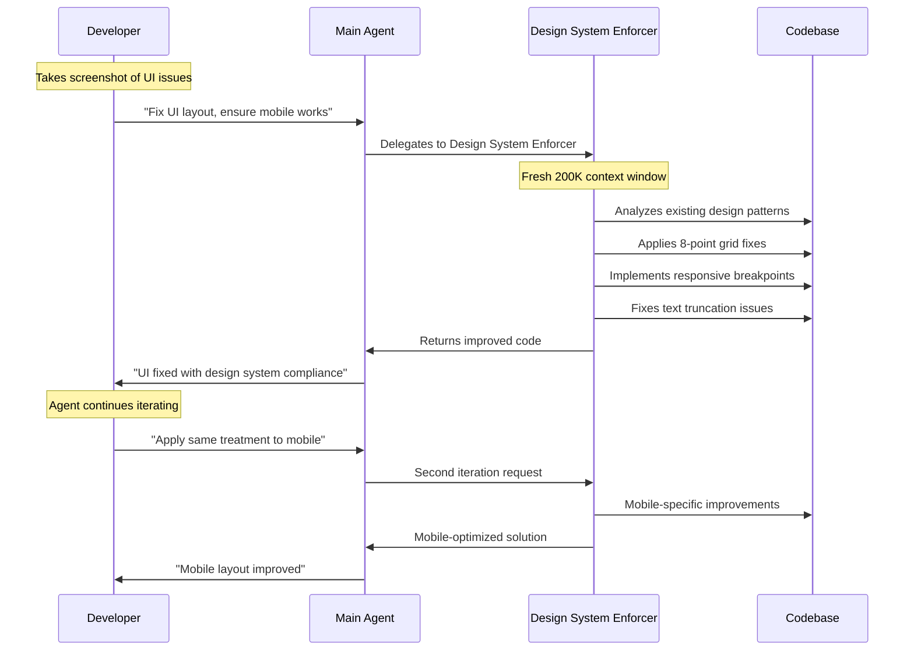

### Results

**Before Agent**:
- Inconsistent spacing (py-4, py-3 mixed usage)
- Text truncation causing UX issues
- Icons of different sizes
- Poor mobile experience with horizontal scrolling

**After Agent**:
- Consistent 8-point grid spacing
- Proper text wrapping with `break-words`
- Standardized icon sizes
- Responsive design working on all viewports
- Professional, polished appearance

## Solo Developer Team Strategy

### The "Virtual Team" Approach

As a solo developer, you can create a complete development team:

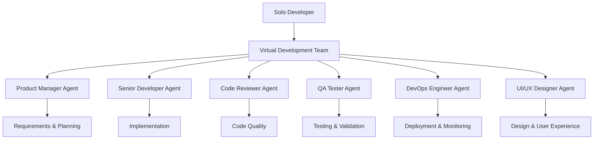

### Essential Agents for Solo Developers

#### 1. Design System Enforcer
**Purpose**: Maintain consistent UI/UX across the application
**When to Use**: UI reviews, design system compliance, responsive design fixes

#### 2. Code Reviewer
**Purpose**: Ensure code quality and best practices
**When to Use**: Before merging features, during refactoring

#### 3. Test Generator
**Purpose**: Create comprehensive test coverage
**When to Use**: New features, bug fixes, edge case validation

#### 4. Documentation Writer
**Purpose**: Maintain up-to-date documentation
**When to Use**: API changes, new features, onboarding guides

#### 5. DevOps Assistant
**Purpose**: Handle deployment, monitoring, and infrastructure
**When to Use**: CI/CD setup, performance optimization, security audits

### Workflow Integration

```bash
# Morning workflow: Review overnight changes
claude "Use code-reviewer agent to analyze yesterday's commits"

# Feature development: Design-first approach
claude "Use design-system-enforcer to review this new feature mockup"

# Pre-deployment: Quality gate
claude "Use test-generator to create comprehensive tests for this feature"
claude "Use code-reviewer to do final quality check"

# Post-deployment: Documentation
claude "Use documentation-writer to update API docs for new endpoints"
```

## Advanced Workflow Patterns

### Pattern 1: Sequential Agent Pipeline

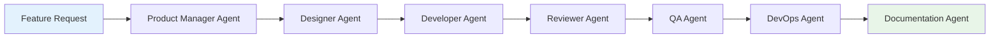

**Implementation**:
```bash
# Step 1: Requirements analysis
claude "Use product-manager agent to analyze this feature request"

# Step 2: Design specification
claude "Use design-system-enforcer to create UI specifications"

# Step 3: Implementation
claude "Use senior-developer agent to implement the feature"

# Step 4: Quality review
claude "Use code-reviewer agent to review implementation"

# Step 5: Testing
claude "Use test-generator agent to create comprehensive tests"

# Step 6: Documentation
claude "Use documentation-writer to update relevant docs"
```

### Pattern 2: Parallel Agent Research

```bash
# Research phase: Multiple agents working simultaneously
claude "Create 3 parallel research streams:
1. Security-auditor: Analyze authentication vulnerabilities
2. Performance-optimizer: Identify bottlenecks
3. Code-reviewer: Assess technical debt"
```

### Pattern 3: Iterative Improvement Loop

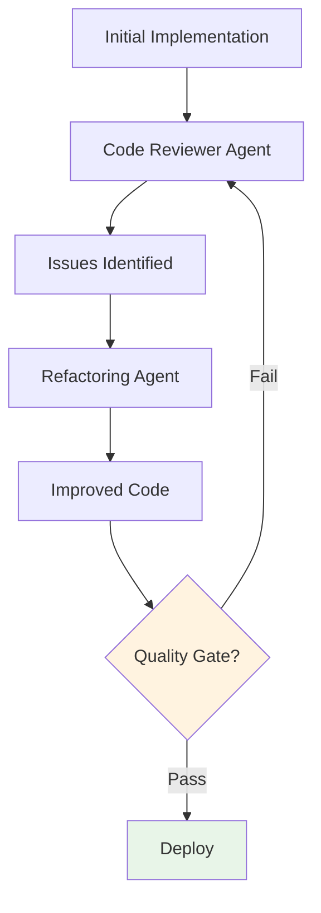

### Pattern 4: Context-Aware Specialization

```bash
# Agents automatically adapt to project context
# Node.js project
claude "Create test-generator agent"
# → Automatically uses Jest, focuses on async testing

# Python project  
claude "Create test-generator agent"
# → Automatically uses pytest, focuses on Python patterns

# React project
claude "Create design-system-enforcer agent"
# → Automatically understands component patterns, JSX
```

## Automation and Integration

### GitHub Issues Integration

**Future Workflow**: Agents can be triggered automatically by GitHub issues:

```yaml
# .github/workflows/agent-dispatch.yml
name: Claude Agent Dispatcher
on:
  issues:
    types: [opened, labeled]

jobs:
  dispatch-agent:
    if: contains(github.event.issue.labels.*.name, 'ui-fix')
    runs-on: ubuntu-latest
    steps:
      - uses: anthropic/claude-code-action@v1
        with:
          agent: design-system-enforcer
          task: ${{ github.event.issue.body }}
```

### Slack Integration

```bash
# Slack command triggers agent
/claude-agent code-reviewer "Review PR #123 for security issues"
```

### CI/CD Pipeline Integration

```yaml
# Quality gates using agents
steps:
  - name: Code Review Agent
    run: claude "Use code-reviewer agent to analyze changed files"
    
  - name: Security Audit Agent  
    run: claude "Use security-auditor agent to scan for vulnerabilities"
    
  - name: Performance Check Agent
    run: claude "Use performance-optimizer agent to identify bottlenecks"
```

### webhook Integration

```bash
# Webhook triggers agent on deployment
curl -X POST https://your-api.com/claude-agent \
  -H "Content-Type: application/json" \
  -d '{
    "agent": "performance-monitor",
    "task": "analyze deployment metrics and alert on issues"
  }'
```

## Best Practices

### 1. Agent Naming and Organization

**Good Naming Conventions**:
```bash
# Role-based naming
code-reviewer
design-system-enforcer
test-generator
security-auditor

# Technology-specific naming
react-component-specialist
api-documentation-writer
database-migration-expert
```

**Organization Strategy**:
```
.claude/agents/
├── quality/
│   ├── code-reviewer.md
│   ├── test-generator.md
│   └── security-auditor.md
├── design/
│   ├── design-system-enforcer.md
│   └── accessibility-auditor.md
└── ops/
    ├── deployment-manager.md
    └── performance-monitor.md
```

### 2. Agent Scope and Permissions

**Principle of Least Privilege**:
```markdown
---
name: security-auditor
tools: read, grep, glob  # No write permissions
---
```

**Full Access for Implementation Agents**:
```markdown
---
name: senior-developer
tools: read, write, edit, multiedit, bash, grep, glob
---
```

### 3. Clear Agent Instructions

**Effective System Prompts**:
```markdown
# ✅ Good: Specific and actionable
You are a senior React developer specializing in component refactoring. 
Focus on:
1. Extract reusable components (>3 usage instances)
2. Implement proper TypeScript interfaces
3. Follow React hooks best practices
4. Ensure accessibility compliance (WCAG 2.1)
5. Optimize for performance (memo, useCallback)

# ❌ Bad: Vague and generic
You are a React expert. Help with React code.
```

### 4. Context Management

**Agent Context Isolation**:
```bash
# Each agent maintains separate context
# Main agent: High-level coordination (50K tokens used)
# Sub-agent 1: Deep code analysis (180K tokens used)
# Sub-agent 2: UI fixes (120K tokens used)
# → Total effective context: 350K tokens across specialized areas
```

### 5. Iterative Improvement

**Agent Evolution Process**:
1. **Start Simple**: Basic agent with core functionality
2. **Gather Feedback**: Monitor agent performance
3. **Refine Instructions**: Add specific rules and patterns
4. **Expand Capabilities**: Add tools and permissions
5. **Share and Standardize**: Distribute successful agents to team

### 6. Quality Gates

**Multi-Agent Validation**:
```bash
# Quality pipeline using multiple agents
claude "Chain validation:
1. code-reviewer: Check implementation quality
2. security-auditor: Scan for vulnerabilities  
3. test-generator: Verify test coverage
4. performance-optimizer: Check for bottlenecks"
```

## Troubleshooting

### Common Issues and Solutions

#### Issue 1: Agent Not Being Invoked

**Problem**: Main agent doesn't delegate to subagents
**Solution**: 
```bash
# Explicit invocation
claude "Use the design-system-enforcer agent to fix this UI issue"

# Check agent description clarity
# Ensure description clearly states when to use the agent
```

#### Issue 2: Agent Instructions Too Generic

**Problem**: Agent provides generic responses
**Solution**:
```markdown
# Add specific examples and patterns
## Examples of Good Design System Fixes

### Before (Bad)
```jsx
<div className="p-3 m-2">
  <h1 className="text-lg">Title</h1>
</div>
```

### After (Good)  
```jsx
<div className="p-6 mb-4">
  <h1 className="text-2xl font-bold leading-tight">Title</h1>
</div>
```
```

#### Issue 3: Context Window Exhaustion

**Problem**: Agent runs out of context mid-task
**Solution**:
```bash
# Break down large tasks
claude "Use design-system-enforcer to fix header component only"
# Then separately
claude "Use design-system-enforcer to fix navigation component"
```

#### Issue 4: Agent Tool Limitations

**Problem**: Agent can't perform required actions
**Solution**:
```markdown
# Update agent configuration
---
name: deployment-manager
tools: read, write, edit, bash, grep, glob  # Add required tools
---
```

#### Issue 5: Inconsistent Agent Behavior

**Problem**: Agent gives different results for similar tasks
**Solution**:
```markdown
# Add explicit decision-making criteria
## Decision Matrix for Component Extraction

| Condition | Action |
|-----------|--------|
| Used 3+ times | Extract to shared component |
| Props > 5 | Create interface |
| Logic > 20 lines | Extract custom hook |
```

### Debugging Agent Interactions

**Monitor Agent Usage**:
```bash
# Check which agents are being invoked
/agents status

# Review agent performance
claude "Show me the last 5 interactions with design-system-enforcer agent"
```

**Agent Testing**:
```bash
# Test agent in isolation
claude "Use test-generator agent to create unit tests for this function only"

# Compare agent approaches
claude "Use both code-reviewer and senior-developer agents to analyze this code"
```

## Conclusion

Subagent workflows represent a fundamental shift in how solo developers can scale their capabilities. By creating specialized AI agents with focused expertise and separate context windows, you can:

### Key Benefits Achieved

1. **Role Multiplication**: Function as a complete development team
2. **Context Preservation**: Each agent maintains deep, specialized knowledge
3. **Quality Consistency**: Agents enforce standards automatically
4. **Workflow Automation**: Future integration with CI/CD and issue tracking
5. **Continuous Improvement**: Agents learn and adapt to your patterns

### Success Metrics

- **80% of Anthropic's code** is written by AI using similar workflows
- **200K context per agent** vs. degraded quality at 50% in single-agent
- **Specialized expertise** leads to higher quality results
- **Future automation** potential for complete CI/CD integration

### Getting Started Today

1. **Start Simple**: Create one Design System Enforcer agent
2. **Use Regularly**: Integrate into daily workflow
3. **Iterate and Improve**: Refine based on real usage
4. **Build Your Team**: Add specialized agents as needed
5. **Automate Gradually**: Connect to GitHub issues and CI/CD

The future of solo development is having a specialized AI team at your disposal. Start building your virtual development team today, and transform from a single developer into a complete development organization.

---

*"Instead of one overworked AI, imagine having a whole team of specialized agents working together. Dedicated code reviewers, designers, test writers, documentation agents, all vibing together."*

Ready to build your AI development team? Start with `/agents` and create your first specialized agent today.