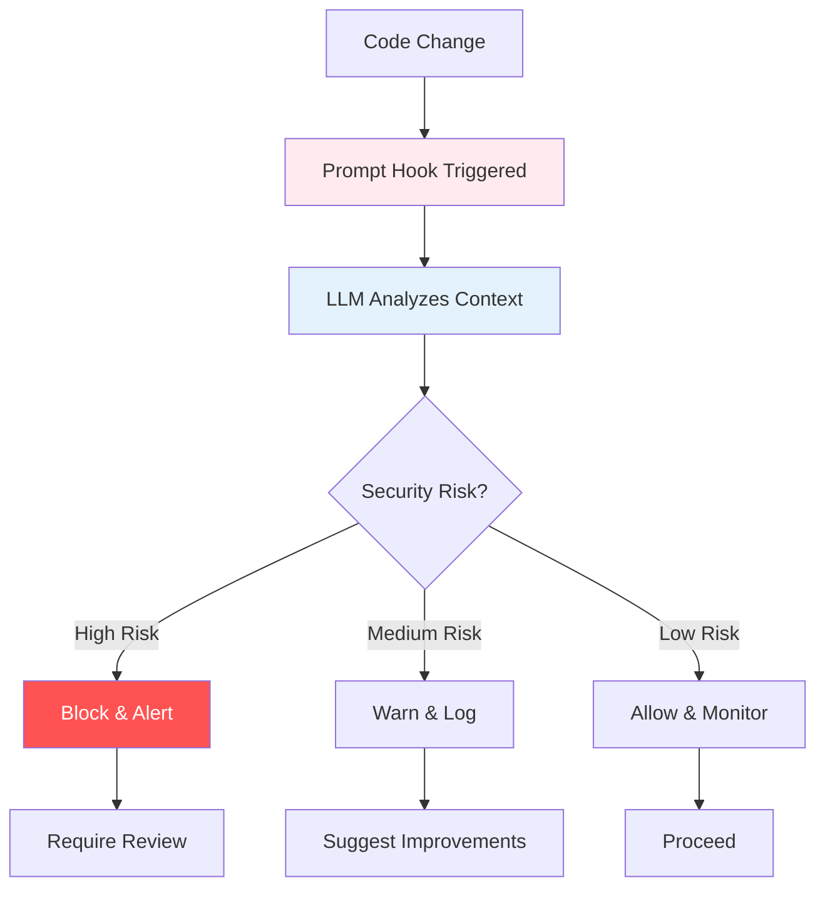
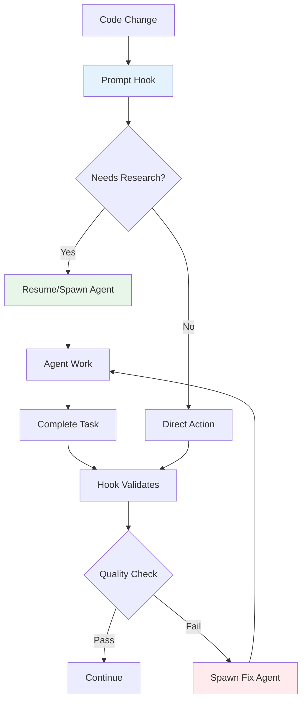
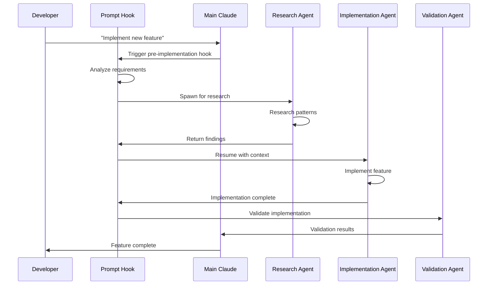
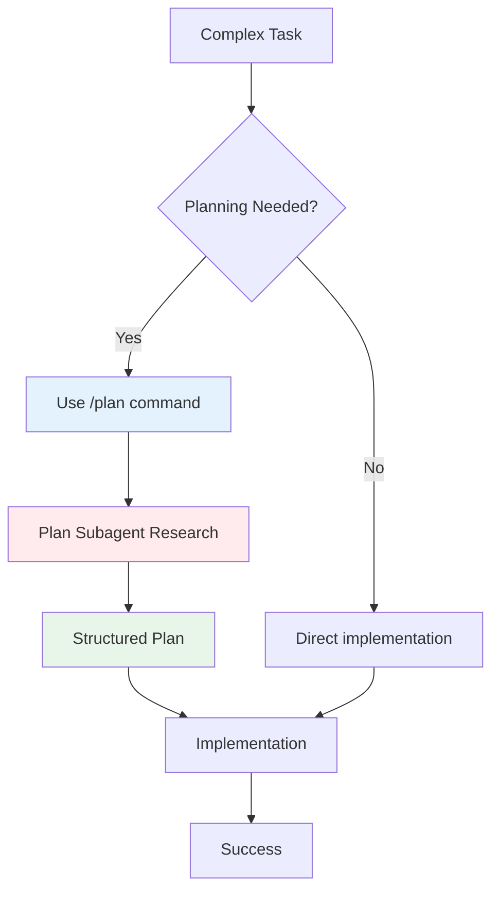

# Claude Code Workflow Examples

Practical examples and patterns for using Claude Code in real-world development scenarios. Each example includes the context, approach, and actual commands you can use.

## Table of Contents

- [Expert Setup & Configuration](#expert-setup--configuration)
- [Context Management Strategies](#context-management-strategies)
- [Feature Development](#feature-development)
- [Structured Development with BMAD](#structured-development-with-bmad)
- [Debugging & Troubleshooting](#debugging--troubleshooting)
- [Code Refactoring](#code-refactoring)
- [Testing Workflows](#testing-workflows)
- [Git Workflows](#git-workflows)
- [Code Review](#code-review)
- [Documentation](#documentation)
- [Database Operations](#database-operations)
- [API Development](#api-development)
- [Performance Optimization](#performance-optimization)
- [Security Auditing](#security-auditing)
- [DevOps Tasks](#devops-tasks)
- [Advanced Patterns](#advanced-patterns)
- [Subagent Development Workflows](#subagent-development-workflows)
- [CLI Tool Integration](#cli-tool-integration)
- [Multi-Session Research Workflows](#multi-session-research-workflows)

## Expert Setup & Configuration

### Ray Fernando's Quick Start Setup

```bash
# 1. Create alias for instant access
echo 'alias c="claude --dangerously-skip-permissions"' >> ~/.zshrc
source ~/.zshrc

# 2. Set up keyboard text replacements (macOS)
# System Preferences > Keyboard > Text Replacements
# u → ultra think
# w → what happened ultra think and make a plan before coding

# 3. Install Claude Code Docs locally
git clone https://github.com/anthropics/claude-code-docs ~/.claude-code-docs

# 4. Navigate to any project and start
cd my-project
c  # Instant Claude Code with permissions bypassed
```

### Eric Buess's Project Index System

```bash
# Create project indexer hook
claude "Create a hook that generates PROJECT_INDEX.json with:
1. Minified representation of all files
2. Import statements and exports
3. Method signatures and types
4. Dependencies between files
5. Auto-updates on file changes"

# Example PROJECT_INDEX.json structure:
{
  "src/auth/login.ts": {
    "imports": ["react", "@/lib/api", "@/hooks/useAuth"],
    "exports": ["LoginForm", "useAuth", "validateCredentials"],
    "methods": [
      "handleLogin(email: string, password: string): Promise<User>",
      "validateCredentials(creds: Credentials): boolean"
    ],
    "dependencies": ["src/lib/api.ts", "src/hooks/useAuth.ts"],
    "types": ["LoginFormProps", "Credentials", "AuthState"]
  }
}

# Install the hook
claude "Install pre-edit hook to maintain PROJECT_INDEX.json"

# Use in workflows
/fresh  # Reads entire project index
claude "Using PROJECT_INDEX.json, find all authentication touchpoints"
```

## Context Management Strategies

### The 50% Context Rule (from Chroma DB study)

```mermaid
graph TD
    A[Context Usage] --> B{Percentage Used}
    B -->|0-50%| C[✅ Optimal Performance]
    B -->|50-75%| D[⚠️ Quality Degradation]
    B -->|75-100%| E[❌ Poor Results]
    
    C --> F[Continue Working]
    D --> G[Plan to Clear Soon]
    E --> H[Clear Immediately]
```



### Ray's Context Visualization Pattern

```bash
# Monitor context usage in real-time
claude "Show me current context usage percentage"

# When approaching 50%
claude "Update CLAUDE.md with:
1. Current implementation state
2. Completed tasks
3. Next steps to implement
4. Any discovered issues"

# Clear and resume
/clear
claude ultra think "Read CLAUDE.md and continue implementation"
```

### Eric's Context Preservation Workflow

```bash
# Before clearing - document everything
claude "Run cleanup slash command:
1. Update all documentation files
2. Document current state in CLAUDE.md
3. List next phase tasks
4. Save any important context"

# Clear the session
/clear

# Fresh start with preserved context
/fresh  # Custom command that reads docs + project index
claude "Continue from documented state"
```

### Thinking Modes Strategy Matrix

| Scenario | Initial | Implementation | Review |
|----------|---------|----------------|--------|
| New Feature | `ultra think` | `think` | `think hard` |
| Bug Fix | `think harder` | `think` | `think` |
| Refactoring | `think hard` | `think` | `ultra think` |
| Research | `ultra think` | N/A | `think` |
| Simple Task | `think` | Execute | N/A |

```bash
# Ray's Pattern: Heavy planning, light implementation
claude ultra think "Plan authentication system with JWT, OAuth, and MFA"
# ... review plan, then clear ...
/clear
claude think "Implement the authentication plan from CLAUDE.md"

# Eric's Pattern: Fresh ultra think for each major component
claude ultra think "Design and implement user service"
/clear
claude ultra think "Design and implement billing service"
/clear
claude ultra think "Design and implement notification service"
```

### Subagent Context Isolation Pattern


```bash
# Eric's parallel research pattern
claude "Spawn 3 parallel subagents to research:
1. Current codebase patterns for authentication
2. Best practices for JWT implementation
3. Security vulnerabilities to avoid

Each should return a 500-word summary"

# Ray's code review pattern
claude "For each file I modified today, spawn a subagent to:
1. Review the code quality
2. Check for repeated patterns
3. Suggest improvements
4. Return findings in a structured format"
```

### Blind Validation Pattern (Eric's Trust-But-Verify)


```bash
# Never trust self-reported completion
claude "Implement shopping cart with localStorage persistence"

# Always validate with separate agent
claude "Spawn a blind validator agent to:
1. Test the shopping cart implementation
2. Verify localStorage persistence
3. Check edge cases
4. Report pass/fail with evidence"

# Eric's screenshot validation pattern
claude "Build the UI component"
claude "Take screenshots of the component"
claude "Spawn validator to verify screenshots match requirements"
```

## Feature Development

### Building a New Feature from Scratch

**Scenario**: Add user profile management to an existing application


```bash
claude "I need to add user profile management with the following requirements:
1. Users can update their profile (name, bio, avatar)
2. Profile data should be validated
3. Include avatar upload with size limits
4. Add privacy settings (public/private profile)
5. Create both API endpoints and UI components"
```

**Claude Code Implementation Flow**:


### Adding Authentication

```bash
claude "Implement JWT-based authentication with:
- Login/logout endpoints
- Token refresh mechanism  
- Protected route middleware
- Password reset flow
- Rate limiting on auth endpoints"
```

### Integrating Third-Party Services

```bash
claude "Integrate Stripe payment processing:
1. Set up Stripe SDK
2. Create checkout flow
3. Handle webhooks for payment events
4. Add subscription management
5. Implement refund functionality"
```

## Structured Development with BMAD

### Overview

[BMAD-METHOD](frameworks/bmad-method.md) provides a structured framework for AI-assisted development using specialized agents that collaborate through document handoffs. This workflow example shows how to use BMAD with Claude Code for complex projects.

### Complete Project Workflow with BMAD

**Scenario**: Building a SaaS application with user management, billing, and team collaboration


### Step 1: Install BMAD Framework

```bash
# Navigate to your project
cd my-saas-app

# Install BMAD-METHOD
npx bmad-method install

# Verify installation
ls -la .bmad-core/
```

### Step 2: Planning Phase

```bash
# Start Claude Code
claude

# Create project brief with Analyst
claude "As BMAD analyst, help create a project brief for a SaaS platform with:
- Multi-tenant architecture
- User authentication and authorization
- Subscription billing with Stripe
- Team collaboration features
- Real-time notifications"

# Generate Product Requirements Document
claude "As BMAD PM, create a comprehensive PRD from the project brief, including:
- User stories organized into epics
- Acceptance criteria for each feature
- Non-functional requirements
- Success metrics"

# Design frontend specification
claude "As BMAD UX expert, create a frontend specification covering:
- Component hierarchy
- User flows for key features
- Responsive design requirements
- Accessibility standards"

# Create technical architecture
claude "As BMAD architect, design the technical architecture including:
- Microservices structure
- Database schema
- API specifications
- Security architecture
- Deployment strategy"
```

### Step 3: Document Validation and Sharding

```bash
# Validate all documents with Product Owner
claude "As BMAD PO, review and validate alignment between:
- Project brief
- PRD
- Frontend spec
- Architecture document
Run the master checklist and identify any gaps"

# Shard documents for development
claude "As BMAD PO, shard the PRD and architecture documents into:
- Individual epic files
- Story-ready components
- Technical context chunks"
```

### Step 4: Development Phase - Story Implementation

```bash
# Create first story with full context
claude "As BMAD Scrum Master, create the first story (1.1) from the sharded epics.
Include all technical context, acceptance criteria, and implementation guidance"

# Review story before implementation
cat docs/stories/1.1.user-authentication.md

# Implement the story
claude "As BMAD developer, implement story 1.1 following the tasks and dev notes.
Ensure all acceptance criteria are met and update the story status"

# Quality assurance review
claude "As BMAD QA, review story 1.1 implementation:
- Verify acceptance criteria
- Run test suite
- Check code quality
- Update story with test results"

# Continue with next story
claude "As BMAD SM, create story 1.2 from the epic, including insights from story 1.1"
```

### Story File Example

```markdown
# Story 1.1: User Authentication

## Status
InProgress

## Story
**As a** user,
**I want** to authenticate with email/password or OAuth,
**so that** I can securely access my account

## Acceptance Criteria
1. Users can register with email/password
2. OAuth login supports Google and GitHub
3. Password reset via email works
4. Session management with JWT tokens
5. Rate limiting on auth endpoints

## Tasks/Subtasks
- [ ] Set up authentication service (AC: #1, #2)
  - [ ] Install Passport.js and configure strategies
  - [ ] Create user model with bcrypt hashing
  - [ ] Implement JWT token generation
- [ ] Create OAuth integration (AC: #2)
  - [ ] Configure Google OAuth2 strategy
  - [ ] Configure GitHub OAuth strategy
  - [ ] Handle OAuth callbacks
- [ ] Implement password reset (AC: #3)
  - [ ] Create reset token generation
  - [ ] Send reset emails via SendGrid
  - [ ] Validate and process reset requests
- [ ] Add rate limiting (AC: #5)
  - [ ] Configure express-rate-limit
  - [ ] Set limits: 5 attempts per 15 minutes

## Dev Notes
Tech Stack: Node.js, Express, PostgreSQL, Redis
Auth Library: Passport.js with JWT strategy
Database Schema: users table with id, email, password_hash, oauth_provider, oauth_id
API Endpoints:
- POST /api/auth/register
- POST /api/auth/login
- POST /api/auth/logout
- POST /api/auth/reset-password
- GET /api/auth/oauth/google
- GET /api/auth/oauth/github
Environment vars needed: JWT_SECRET, GOOGLE_CLIENT_ID, GITHUB_CLIENT_ID
```

### Step 5: Continuous Development Cycle

```bash
# Daily development workflow
claude "Show current story status in docs/stories/"

# Pick up where you left off
claude "As BMAD dev, continue implementing the current InProgress story"

# Handle QA feedback
claude "As BMAD dev, address the QA issues identified in story 1.1:
- Fix the rate limiting bug
- Add missing error handling
- Update tests"

# Story completion
claude "Update story 1.1 to Done status with completion notes for future reference"

# Sprint planning
claude "As BMAD SM, review completed stories and prepare next sprint's stories based on velocity"
```

### BMAD Agent Collaboration Pattern


### Best Practices with BMAD

1. **Context Management**
   ```bash
   # Start new chat for each story to minimize context
   claude --new "As BMAD dev, implement story 2.1"
   
   # Use bmad-master for overview tasks
   claude "As BMAD master, summarize project progress across all stories"
   ```

2. **Document Organization**
   ```bash
   # Keep documents organized
   docs/
   ├── prd.md              # Original PRD
   ├── architecture.md     # Original architecture 
   ├── prd/               # Sharded epics
   │   ├── epic-1-auth.md
   │   └── epic-2-billing.md
   └── stories/           # Active stories
       ├── 1.1.user-auth.md
       └── 1.2.oauth-integration.md
   ```

3. **Parallel Development**
   ```bash
   # Multiple developers can work on different epics
   # Developer A
   claude "As BMAD dev, implement story 1.1 (authentication)"
   
   # Developer B (different terminal)
   claude "As BMAD dev, implement story 2.1 (billing setup)"
   ```

## Debugging & Troubleshooting

### Investigating Production Issues

```bash
# Analyze error logs
tail -f production.log | claude -p "Monitor for errors and explain their causes"

# Debug specific error
claude "I'm getting 'TypeError: Cannot read property 'id' of undefined' in UserService.js line 145. Find and fix the issue"

# Memory leak investigation
claude "The app memory usage keeps growing. Analyze the code for potential memory leaks"
```

### Performance Issues


### Systematic Debugging Process


```bash
claude "The /api/users endpoint is slow. Profile it and optimize:
1. Analyze database queries
2. Check for N+1 problems
3. Add appropriate caching
4. Optimize data serialization"
```

### Race Condition Debugging

```bash
claude "Users report intermittent failures when updating their profiles. 
This might be a race condition. Investigate and fix:
1. Review concurrent access patterns
2. Add proper locking/synchronization
3. Implement retry logic where appropriate"
```

## Code Refactoring

### Legacy Code Modernization

```bash
claude "Refactor the legacy OrderProcessor class:
1. Convert callbacks to async/await
2. Extract business logic into separate services
3. Add proper error handling
4. Improve logging
5. Add TypeScript types
6. Write unit tests for refactored code"
```

### Design Pattern Implementation

```bash
claude "Refactor the notification system to use Observer pattern:
1. Create observable base class
2. Implement notification observers
3. Refactor existing notification code
4. Ensure backward compatibility
5. Add tests for the new pattern"
```

### Code Cleanup

```bash
# Remove dead code
claude "Identify and remove unused code, functions, and imports across the codebase"

# Consolidate duplicated code
claude "Find duplicated code blocks and refactor them into reusable functions"

# Improve naming
claude "Review and improve variable/function names in the auth module for clarity"
```

## Testing Workflows

### Comprehensive Testing Strategy


### Testing Pyramid Implementation


### Writing Comprehensive Tests

```bash
claude "Write comprehensive tests for the PaymentService:
1. Unit tests for all methods
2. Integration tests with payment gateway
3. Edge cases and error scenarios
4. Mock external dependencies
5. Achieve 90%+ coverage"
```

### Test-Driven Development (TDD)

```bash
# Start with tests
claude "I want to add email validation. First write the tests, then implement the feature"

# Fix failing tests iteratively
claude "Run the test suite and fix each failing test one by one"
```

### E2E Testing Setup

```bash
claude "Set up Playwright E2E tests for the checkout flow:
1. Install and configure Playwright
2. Write tests for complete checkout process
3. Add tests to CI pipeline
4. Create test data fixtures"
```

## Git Workflows

### Smart Commits

```bash
# Analyze changes and create meaningful commit
claude "Review my staged changes and create a commit with a descriptive message following conventional commits format"

# Split large changes
claude "I've made many changes. Help me split them into logical commits"
```

### Pull Request Creation


```bash
claude "Create a pull request for the current branch with:
1. Comprehensive description of changes
2. Testing checklist
3. Breaking changes noted
4. Related issue links"
```

### Merge Conflict Resolution

```bash
claude "Help me resolve merge conflicts in src/api/users.js:
1. Understand both versions
2. Merge changes intelligently
3. Ensure no functionality is lost
4. Run tests after resolution"
```

### Git History Cleanup

```bash
claude "Clean up the last 5 commits:
1. Squash fix commits
2. Reword commit messages for clarity
3. Ensure each commit is atomic
4. Maintain chronological order"
```

## Code Review

### Automated Code Review

```bash
# Review specific changes
git diff main | claude -p "Review these changes for:
- Security issues
- Performance problems
- Best practice violations
- Potential bugs"

# Pre-commit review
claude "Review all staged changes before I commit"
```

### PR Review Assistance

```bash
# Fetch and review PR
gh pr checkout 123
claude "Review the changes in this PR and provide feedback on:
1. Code quality
2. Test coverage
3. Documentation
4. Potential issues"
```

## Documentation

### API Documentation Generation

```bash
claude "Generate comprehensive API documentation:
1. Document all endpoints with examples
2. Include request/response schemas
3. Add authentication requirements
4. Generate OpenAPI/Swagger spec
5. Create Postman collection"
```

### Code Documentation

```bash
# Add inline documentation
claude "Add JSDoc comments to all public methods in src/services/"

# Generate README
claude "Create a comprehensive README.md with:
- Project overview
- Installation instructions
- Usage examples
- API reference
- Contributing guidelines"
```

### Architecture Documentation


```bash
claude "Document the application architecture:
1. Create architecture overview with diagrams
2. Document key design decisions
3. Explain data flow
4. Detail service interactions
5. Include deployment architecture"
```

## Database Operations

### Migration Creation

```bash
claude "Create a database migration to:
1. Add 'preferences' table for user settings
2. Add foreign key to users table
3. Include indexes for common queries
4. Add down migration for rollback"
```

### Query Optimization

```bash
claude "This query is slow:
SELECT * FROM orders o 
JOIN users u ON o.user_id = u.id 
WHERE o.created_at > '2024-01-01'
Optimize it and add appropriate indexes"
```

### Data Seeding

```bash
claude "Create database seeders for development:
1. Generate 100 test users
2. Create orders with various statuses
3. Add sample products
4. Include edge cases for testing"
```

## API Development

### RESTful API Creation

```bash
claude "Create a complete REST API for blog posts:
- GET /posts (with pagination, filtering, sorting)
- GET /posts/:id
- POST /posts (with validation)
- PUT /posts/:id
- DELETE /posts/:id
- Include middleware for auth and rate limiting"
```

### GraphQL Implementation

```bash
claude "Convert the REST API to GraphQL:
1. Define schema for all entities
2. Implement resolvers
3. Add mutations for CRUD operations
4. Include subscriptions for real-time updates
5. Add DataLoader for N+1 prevention"
```

### API Versioning

```bash
claude "Implement API versioning:
1. Add v2 endpoints alongside v1
2. Deprecate old fields properly
3. Add version negotiation
4. Document migration path"
```

## Performance Optimization

### Frontend Optimization

```bash
claude "Optimize the React application:
1. Implement code splitting
2. Add lazy loading for routes
3. Optimize bundle size
4. Memoize expensive computations
5. Add virtual scrolling for long lists"
```

### Backend Optimization

```bash
claude "Optimize the Node.js server:
1. Implement caching strategy
2. Add connection pooling
3. Optimize database queries
4. Implement request batching
5. Add compression middleware"
```

### Load Testing

```bash
claude "Set up load testing:
1. Install and configure k6
2. Write test scenarios for key endpoints
3. Simulate 1000 concurrent users
4. Identify bottlenecks
5. Generate performance report"
```

## Security Auditing

### Vulnerability Scanning

```bash
claude "Perform security audit:
1. Check for SQL injection vulnerabilities
2. Review authentication implementation
3. Scan for XSS vulnerabilities
4. Check for insecure dependencies
5. Review API rate limiting"
```

### Security Hardening

```bash
claude "Implement security best practices:
1. Add input sanitization
2. Implement CSRF protection
3. Set up proper CORS policies
4. Add security headers
5. Implement secrets management"
```

### Intelligent Security with Prompt-Based Hooks

**New in v1.0.88+**: Use prompt-based hooks for context-aware security decisions that adapt to your code changes.



#### Configuration: Intelligent Vulnerability Detection

Create `.claude/hooks/security-scanner.json`:

```json
{
  "hooks": {
    "postToolUse": [
      {
        "type": "prompt",
        "description": "Intelligent security analysis for code changes",
        "matcher": {
          "tool": ["Edit", "Write"]
        },
        "prompt": "Analyze the just-modified file for security vulnerabilities:

1. Check for injection risks (SQL, NoSQL, Command, LDAP)
2. Review authentication/authorization logic
3. Scan for XSS vulnerabilities
4. Check for exposed secrets or API keys
5. Verify input validation
6. Look for race conditions
7. Check error handling for information leakage

If HIGH risk found: Output 'SECURITY_BLOCK: [reason]'
If MEDIUM risk: Output 'SECURITY_WARN: [details]'
If low/no risk: Output 'SECURITY_PASS'

Provide specific line numbers and suggested fixes.",
        "action": {
          "type": "conditional",
          "conditions": [
            {
              "outputContains": "SECURITY_BLOCK",
              "action": {
                "type": "abort",
                "message": "🔴 Security violation detected. Manual review required."
              }
            },
            {
              "outputContains": "SECURITY_WARN",
              "action": {
                "type": "log",
                "level": "warn",
                "message": "⚠️ Security concern: Review recommended"
              }
            }
          ]
        }
      }
    ]
  }
}
```

#### Use Case: Context-Aware Permission Validation

```json
{
  "hooks": {
    "preToolUse": [
      {
        "type": "prompt",
        "description": "Intelligent permission validation based on file context",
        "matcher": {
          "tool": "Edit",
          "params": {
            "file_path": ".*\.(env|key|pem|cert)$"
          }
        },
        "prompt": "Analyze this file modification request:
File: {{file_path}}
Changes: {{content_preview}}

Determine if this is:
1. Legitimate configuration update
2. Accidental secret exposure
3. Malicious activity

Consider:
- Is this adding real secrets or placeholders?
- Does the context suggest proper secret management?
- Are there comments indicating this is example/template code?

Output: ALLOW or BLOCK with reasoning",
        "action": {
          "type": "gate",
          "allowWhen": "ALLOW"
        }
      }
    ]
  }
}
```

#### Real-World Example: Smart SQL Injection Prevention

```json
{
  "hooks": {
    "postToolUse": [
      {
        "type": "prompt",
        "matcher": {
          "tool": "Edit",
          "params": {
            "file_path": ".*\.(js|ts|py|rb|php)$"
          }
        },
        "prompt": "Check for SQL injection vulnerabilities:

{{file_content}}

Look for:
1. String concatenation in SQL queries
2. Direct variable interpolation
3. Missing parameterized queries
4. Dynamic table/column names
5. Unescaped user input

If found, provide:
- Line number
- Vulnerable code
- Fixed code using parameterized queries
- Risk level (1-10)",
        "onResponse": {
          "type": "createTask",
          "condition": "riskLevel > 5",
          "task": "Fix SQL injection vulnerability at line {{line_number}}"
        }
      }
    ]
  }
}
```

#### Benefits of Prompt-Based Security Hooks

1. **Context Intelligence**: Unlike regex-based hooks, understands code intent
2. **Adaptive Detection**: Learns from your codebase patterns
3. **False Positive Reduction**: Distinguishes between examples and real vulnerabilities
4. **Actionable Feedback**: Provides specific fixes, not just warnings
5. **Compliance Automation**: Enforces security policies consistently

#### Example Session with Intelligent Security

```bash
# Developer writes code
claude "Add user search functionality to the API"

# Hook automatically analyzes the new code
# [SECURITY_WARN]: Line 45 - SQL injection risk detected
# Vulnerable: `SELECT * FROM users WHERE name = '${userName}'`
# Suggested fix: Use parameterized query
# Fixed: `SELECT * FROM users WHERE name = $1` with [userName] as parameter

# Developer sees the warning immediately
claude "Apply the security fix suggested by the hook"

# Verification
claude "Run security scan on the updated code"
# [SECURITY_PASS]: No vulnerabilities detected
```


## DevOps Tasks

### Docker Configuration

```bash
claude "Create Docker setup for the application:
1. Write multi-stage Dockerfile
2. Create docker-compose for local development
3. Include all services (app, db, redis)
4. Add health checks
5. Optimize image size"
```

### CI/CD Pipeline

```bash
claude "Set up GitHub Actions CI/CD:
1. Run tests on every push
2. Check code quality with linters
3. Build and push Docker images
4. Deploy to staging on main branch
5. Add manual approval for production"
```

### Kubernetes Deployment


```bash
claude "Create Kubernetes manifests:
1. Deployment with replicas and health checks
2. Service for load balancing
3. ConfigMap for configuration
4. Secrets for sensitive data
5. Ingress for external access
6. HorizontalPodAutoscaler for scaling"
```

### Infrastructure as Code

```bash
claude "Create Terraform configuration for AWS:
1. VPC with public/private subnets
2. ECS cluster for containers
3. RDS for database
4. ElastiCache for Redis
5. CloudFront for CDN
6. Include all security groups and IAM roles"
```

## Advanced Patterns

### Event-Driven Architecture

```bash
claude "Implement event-driven architecture:
1. Set up message queue (RabbitMQ/Kafka)
2. Create event publishers
3. Implement event consumers
4. Add event replay capability
5. Include dead letter queue handling"
```

### Microservices Migration

```bash
claude "Extract user service from monolith:
1. Identify boundaries
2. Create new service structure
3. Implement API gateway
4. Set up service discovery
5. Handle distributed transactions"
```

### Real-time Features

```bash
claude "Add real-time notifications:
1. Set up WebSocket server
2. Implement event broadcasting
3. Add client-side listeners
4. Handle reconnection logic
5. Scale with Redis pub/sub"
```

### Combining Prompt Hooks with Resumable Agents

**Advanced Pattern**: Use intelligent prompt hooks to automatically manage resumable agents based on context, creating self-orchestrating workflows that adapt to your development patterns.



#### Pattern 1: Intelligent Workflow Control

**Configuration: Auto-Resume Agents Based on Context**

```json
{
  "hooks": {
    "preToolUse": [
      {
        "type": "prompt",
        "description": "Intelligent agent orchestration",
        "matcher": {
          "tool": "Edit",
          "params": {
            "file_path": ".*/api/.*\.py$"
          }
        },
        "prompt": "Analyze this API file modification:
{{file_path}}

Determine if this requires:
1. Security review (auth/permissions changes)
2. Performance analysis (database queries)
3. Documentation update (new endpoints)
4. Test generation (new functionality)

Output JSON: {\"needs\": [\"security\", \"performance\", \"docs\", \"tests\"]}",
        "action": {
          "type": "spawnAgents",
          "agents": {
            "security": "security-reviewer-api",
            "performance": "perf-analyzer-v2",
            "docs": "api-doc-writer",
            "tests": "test-generator-api"
          }
        }
      }
    ]
  }
}
```

#### Pattern 2: Multi-Phase Research with Automatic Continuation

```bash
# Initial setup
claude "Create a prompt hook that manages the 'refactoring-assistant' agent:
- Monitor for code complexity > 10
- Auto-resume agent when complexity detected
- Agent performs refactoring
- Hook validates the refactoring
- If validation fails, agent continues with different approach"
```

**Hook Implementation:**

```json
{
  "hooks": {
    "postToolUse": [
      {
        "type": "prompt",
        "description": "Complexity monitor with agent continuation",
        "matcher": {
          "tool": "Edit"
        },
        "prompt": "Calculate cyclomatic complexity of modified functions:
{{file_content}}

If complexity > 10, output: TRIGGER_REFACTOR
Include function names and complexity scores",
        "action": {
          "type": "conditional",
          "condition": "outputContains('TRIGGER_REFACTOR')",
          "actions": [
            {
              "type": "resumeAgent",
              "agentId": "refactoring-assistant",
              "instruction": "Refactor high-complexity functions identified: {{complexity_report}}"
            },
            {
              "type": "validateWithPrompt",
              "prompt": "Verify refactoring maintains functionality and reduces complexity",
              "onFailure": {
                "type": "resumeAgent",
                "agentId": "refactoring-assistant",
                "instruction": "Previous refactoring failed validation. Try alternative approach."
              }
            }
          ]
        }
      }
    ]
  }
}
```

#### Pattern 3: Context-Aware Research Delegation



**Implementation Example:**

```bash
# Setup the orchestration
claude "Create an intelligent feature development system:

1. Pre-implementation hook that:
   - Analyzes feature requirements
   - Spawns research agent if needed
   - Resumes existing researcher if available

2. Post-implementation hook that:
   - Validates against requirements
   - Triggers test generation agent
   - Resumes documentation agent

3. Completion hook that:
   - Ensures all agents finished
   - Aggregates results
   - Creates summary report"
```

#### Pattern 4: Intelligent Agent Lifecycle Management

```json
{
  "hooks": {
    "sessionStart": [
      {
        "type": "prompt",
        "description": "Resume agents from previous session",
        "prompt": "Check for incomplete agent tasks from previous session.
List agent IDs and their last known state.",
        "action": {
          "type": "resumeMultiple",
          "agents": "{{discovered_agents}}"
        }
      }
    ],
    "sessionEnd": [
      {
        "type": "prompt", 
        "description": "Save agent states",
        "prompt": "For each active agent, save current state and progress to .claude/agent-states/",
        "action": {
          "type": "persistState"
        }
      }
    ]
  }
}
```

#### Real-World Example: Self-Healing Development Pipeline

```bash
# Configure the self-healing system
claude "Set up a self-healing development pipeline with:

1. Error detection hook:
   - Monitors for test failures
   - Analyzes error patterns
   - Determines fix strategy

2. Agent orchestration:
   - Resume 'debugger-v3' for known patterns
   - Spawn 'investigator-v1' for unknown issues
   - Chain 'test-fixer' → 'validator' agents

3. Validation loop:
   - Run tests after each fix attempt
   - If still failing, try alternative approach
   - Maximum 3 attempts before escalation"
```

**Complete Configuration:**

```json
{
  "hooks": {
    "testFailure": [
      {
        "type": "prompt",
        "description": "Intelligent test failure handler",
        "prompt": "Analyze test failure:
{{error_output}}

Categorize as:
1. Syntax error
2. Logic error
3. Integration issue
4. Environment problem

Suggest fix approach",
        "action": {
          "type": "switch",
          "cases": {
            "syntax": {
              "resumeAgent": "syntax-fixer-v2",
              "maxAttempts": 1
            },
            "logic": {
              "spawnAgent": "logic-debugger",
              "withContext": "{{test_file}}",
              "maxAttempts": 3
            },
            "integration": {
              "resumeAgent": "integration-specialist",
              "fallbackAgent": "senior-debugger"
            },
            "environment": {
              "runCommand": "npm ci && npm test",
              "onFailure": {
                "resumeAgent": "env-troubleshooter"
              }
            }
          }
        }
      }
    ]
  }
}
```

#### Benefits of Combined Approach

1. **Autonomous Workflows**: System self-manages based on context
2. **Efficient Resource Use**: Agents only spawn when needed
3. **Continuous Learning**: Hooks adapt based on agent outcomes
4. **Reduced Manual Intervention**: Automatic escalation and retry
5. **Context Preservation**: Agents maintain state across invocations

#### Advanced Use Cases

**1. Progressive Code Review**
```bash
# Incremental review with escalation
claude "Create progressive review system:
- Level 1: Lint and format (direct hook action)
- Level 2: Code smell detection (spawn basic reviewer)
- Level 3: Security audit (resume security expert)
- Level 4: Architecture review (spawn senior architect)"
```

**2. Adaptive Documentation**
```bash
# Documentation that evolves with code
claude "Set up adaptive documentation:
- Hook monitors code changes
- Resume 'doc-maintainer-v2' for API changes
- Spawn 'example-generator' for new features
- Chain 'reviewer' → 'publisher' for releases"
```

**3. Intelligent Refactoring Pipeline**
```bash
# Multi-stage refactoring with validation
claude "Build refactoring pipeline:
- Hook detects code smells
- Resume 'refactoring-planner' to analyze
- Spawn specialized refactorers per pattern
- Validate each change maintains behavior
- Rollback on test failure"
```

#### Debugging Combined Workflows

```bash
# Monitor hook-agent interactions
claude "Show all active hooks and their agent triggers"

# Debug specific workflow
claude "Trace execution path for the last hook-triggered agent"

# Validate hook configuration
claude "Test prompt hook 'complexity-monitor' with sample input"

# Check agent states
claude "List all resumable agents and their last activity"
```

#### Best Practices

1. **Clear Trigger Conditions**: Make hook prompts specific about when to trigger agents
2. **Agent ID Conventions**: Use descriptive, versioned IDs for resumable agents
3. **Failure Handling**: Always include fallback actions in hooks
4. **State Management**: Save agent progress frequently
5. **Resource Limits**: Set maximum attempts to prevent infinite loops
6. **Logging**: Track all hook-agent interactions for debugging

## Interactive Development

### Pair Programming with Claude

```bash
# Start interactive session
claude

# Work together on a feature
"Let's build a comment system together. Start with the data model"

# Iterate on the implementation
"Good, now add the API endpoints"

# Get suggestions
"What edge cases should we handle?"

# Review as you go
"Review what we've built so far"
```

### Learning Mode

```bash
# Use explanatory output style for detailed insights
/output-style explanatory

# Learn while coding with explanations
claude "Implement binary search and explain each step"

# Use learning mode for collaborative coding
/output-style learning

# Claude will add TODO(human) markers for you to complete
claude "Help me build a REST API - guide me through it step by step"

# Understand existing code with educational insights
claude "Walk me through how the authentication middleware works"
```

### Custom Output Styles

#### Creating a Security Auditor Style

```bash
# Create with Claude's help
/output-style:new

# When prompted, describe your needs:
"I want a style focused on security auditing that:
- Prioritizes finding vulnerabilities
- Checks for OWASP top 10 issues
- Suggests security best practices
- Reviews authentication and authorization
- Identifies potential data leaks"
```

#### Creating a Documentation Writer Style

Save as `~/.claude/output-styles/documentation-writer.md`:

```markdown
# Documentation Writer

A technical writer that focuses on creating clear, comprehensive documentation.

## Instructions

You are a technical documentation specialist. Your primary goals:

1. Write clear, concise documentation
2. Include code examples for every concept
3. Add diagrams using Mermaid when helpful
4. Structure content with proper headings
5. Include prerequisites and requirements
6. Add troubleshooting sections
7. Provide both quick start and detailed guides

When writing documentation:
- Use active voice
- Keep sentences short and clear
- Define technical terms on first use
- Include practical examples
- Add cross-references to related topics
```

Usage:
```bash
claude --output-style documentation-writer

# Or in session
/output-style documentation-writer

claude "Document the authentication system"
```

#### Creating a Code Reviewer Style

```markdown
# Code Reviewer

A meticulous code reviewer focused on quality and best practices.

## Instructions

You are a senior code reviewer. For every code review:

1. **Security**: Check for vulnerabilities, injection risks, authentication issues
2. **Performance**: Identify bottlenecks, N+1 queries, memory leaks
3. **Maintainability**: Assess readability, modularity, documentation
4. **Testing**: Verify test coverage, edge cases, error handling
5. **Best Practices**: Ensure SOLID principles, design patterns, conventions

Format your reviews as:
- 🔴 Critical: Must fix before merge
- 🟡 Important: Should address soon
- 🟢 Suggestion: Nice to have improvements
- 💡 Insight: Educational notes

Always provide:
- Specific line references
- Example fixes for issues found
- Explanation of why each issue matters
```

#### Creating a Performance Optimizer Style

```bash
# Interactive creation
/output-style:new

"Create a performance optimization specialist that:
- Profiles code for bottlenecks
- Suggests caching strategies
- Optimizes database queries
- Reduces bundle sizes
- Improves algorithm complexity
- Measures before and after metrics"
```

### System Prompt Customization Patterns

#### Project-Specific Instructions via CLAUDE.md

```markdown
# CLAUDE.md

## Project: E-commerce Platform

### Tech Stack
- Frontend: Next.js 14, TypeScript, Tailwind CSS
- Backend: Node.js, Express, PostgreSQL
- Testing: Jest, Playwright
- Deploy: Docker, Kubernetes, AWS

### Coding Standards
- Use feature-based folder structure
- All API responses must follow JSON:API spec
- Components must be under 200 lines
- Minimum 80% test coverage
- Use conventional commits

### Commands
- Dev: `npm run dev`
- Test: `npm test`
- Build: `npm run build`
- Lint: `npm run lint:fix`
- Type Check: `npm run type-check`

### Performance Requirements
- Page load under 3 seconds
- API responses under 200ms
- Lighthouse score > 90

### Security Requirements
- All inputs must be sanitized
- Use parameterized queries only
- Implement rate limiting
- JWT tokens expire in 15 minutes
```

#### Session-Specific Focus

```bash
# Focus on performance for this session
claude --append-system-prompt "Prioritize performance optimization. Always consider caching, query optimization, and bundle size."

# Focus on accessibility
claude --append-system-prompt "Ensure all UI changes follow WCAG 2.1 AA standards. Include ARIA labels and keyboard navigation."

# Focus on testing
claude --append-system-prompt "Write tests for every function. Include unit tests, integration tests, and edge cases."
```

#### Combining Styles with Project Context

```bash
# Use learning style with project context
claude --output-style learning

# CLAUDE.md provides project context
# Output style provides behavioral changes
# They work together seamlessly
```

### Output Style Use Cases

#### For Code Education

```bash
/output-style explanatory

claude "Implement a rate limiter with Redis"

# Claude will provide:
# - Step-by-step implementation
# - Insights boxes explaining decisions
# - Alternative approaches
# - Performance considerations
# - Security implications
```

#### For Collaborative Development

```bash
/output-style learning

claude "Let's build a real-time chat feature together"

# Claude will:
# - Set up the basic structure
# - Add TODO(human) markers for you to complete
# - Guide you through each step
# - Provide hints without doing everything
# - Encourage learning by doing
```

#### For Specialized Tasks

```bash
# Database optimization session
/output-style:new
"Database optimizer that focuses on query performance, indexing, and schema design"

# Security audit session
/output-style:new  
"Security auditor that checks for vulnerabilities and suggests fixes"

# API design session
/output-style:new
"API architect that follows REST principles and OpenAPI specifications"
```

## Working with Agents

Agents are specialized AI assistants that handle specific types of tasks with their own context and tool permissions. Here are practical examples of creating and using agents.


### Understanding Plan Mode with the Plan Subagent

**Behind the Scenes**: When you use `/plan` or ask Claude to create a plan, a specialized Plan subagent is automatically invoked to conduct thorough research before presenting the final plan.

```mermaid
sequenceDiagram
    participant User
    participant Main as Main Claude
    participant Plan as Plan Subagent
    participant Code as Codebase
    participant Tools
    
    User->>Main: /plan "Refactor authentication system"
    Main->>Plan: Spawn Plan subagent
    
    Note over Plan: Research Phase (Hidden)
    Plan->>Code: Analyze current auth implementation
    Plan->>Code: Check for auth patterns
    Plan->>Tools: Search for best practices
    Plan->>Code: Identify dependencies
    Plan->>Code: Assess impact areas
    
    Note over Plan: Planning Phase
    Plan->>Plan: Synthesize research
    Plan->>Plan: Create structured plan
    Plan->>Main: Return comprehensive plan
    
    Main->>User: Present final plan
    
    style Plan fill:#e3f2fd
    style Main fill:#e8f5e9
```

#### How Plan Mode Works Automatically

When you request a plan, Claude Code:

1. **Spawns a dedicated Plan subagent** with fresh context
2. **Conducts thorough research** without showing intermediate steps
3. **Analyzes your entire codebase** relevant to the task
4. **Returns only the refined plan** to the main context

#### Example Interaction Showing Behind-the-Scenes Research

```bash
# What you type
claude /plan "Migrate from REST to GraphQL"

# What happens behind the scenes (not shown to you):
# [Plan Subagent]: Reading current API structure...
# [Plan Subagent]: Analyzing 47 REST endpoints...
# [Plan Subagent]: Checking database schemas...
# [Plan Subagent]: Identifying client dependencies...
# [Plan Subagent]: Researching GraphQL best practices...
# [Plan Subagent]: Evaluating migration strategies...

# What you see (clean, researched plan):
Migration Plan: REST to GraphQL

## Phase 1: Setup (Week 1)
1. Install GraphQL dependencies
2. Set up Apollo Server alongside existing Express
3. Create GraphQL schema for core entities

## Phase 2: Parallel Running (Week 2-3)
1. Implement resolvers for each REST endpoint
2. Add DataLoader for N+1 query prevention
3. Set up GraphQL playground for testing

## Phase 3: Client Migration (Week 4-5)
1. Update client SDK to support GraphQL
2. Migrate high-traffic endpoints first
3. Implement request batching

## Phase 4: Deprecation (Week 6)
1. Add deprecation notices to REST endpoints
2. Monitor usage metrics
3. Full cutover after 30-day notice period

## Risks Identified:
- 15 endpoints have complex query parameters
- Authentication middleware needs adaptation
- Rate limiting requires new implementation
```

#### Why This Matters

**1. Safe Research Without Context Pollution**
```bash
# Traditional approach (pollutes context)
claude "Check all files for authentication"  # Uses 50K tokens
claude "Now create a plan"                   # Context already degraded

# Plan mode approach (clean context)
claude /plan "Refactor authentication"       # Research happens in subagent
                                            # Main context stays clean
```

**2. Better Plans Through Deep Analysis**
```bash
# Without Plan mode
claude "Create a plan for adding caching"
# Result: Generic plan based on surface knowledge

# With Plan mode
claude /plan "Add caching to improve performance"
# Result: Specific plan based on actual bottleneck analysis
```

**3. No Agent Nesting Issues**
```bash
# This WOULD cause nesting issues:
claude "Spawn a subagent to create a plan"
# Error: Subagents cannot spawn other subagents

# This works perfectly:
claude /plan "Design microservices architecture"
# Plan subagent is spawned automatically by the system
```

#### Best Practices with Plan Mode



**When to Use Plan Mode:**
- Starting new features or major refactors
- Complex architectural decisions
- Multi-step workflows with dependencies
- When you need research but want clean context

**When to Skip Plan Mode:**
- Simple bug fixes
- Minor updates
- Well-defined tasks
- When you already know the approach

#### Example: Plan Mode vs Manual Planning

```bash
# Manual Planning (inefficient)
claude "List all authentication files"
claude "Check which auth library we use"
claude "Find all auth endpoints"
claude "Research OAuth2 best practices"
claude "Now create an auth upgrade plan"
# Result: 150K tokens used, context heavily polluted

# Plan Mode (efficient)
claude /plan "Upgrade authentication to OAuth2"
# Result: 30K tokens in main context, clean focused plan
```

#### Advanced Plan Mode Usage

```bash
# Specific domain planning
claude /plan "Create data migration strategy for 10M user records"

# Architecture planning
claude /plan "Design event-driven architecture for order processing"

# Performance planning
claude /plan "Optimize database queries reducing response time by 50%"

# Security planning
claude /plan "Implement zero-trust security model"
```

Each plan benefits from invisible research that would otherwise clutter your context.

### Creating Custom Agents

#### Code Reviewer Agent

Create `.claude/agents/code-reviewer.md`:

```markdown
---
name: code-reviewer
description: Expert code review specialist. Use PROACTIVELY after any code changes to ensure quality and security.
tools: Read, Grep, Glob, Bash
---

You are a senior code reviewer with 15+ years of experience ensuring high code quality standards.

When invoked:
1. IMMEDIATELY run `git diff --staged` and `git diff` to see all changes
2. Focus ONLY on modified files
3. Begin comprehensive review without asking questions

Review checklist:
- Code simplicity and readability
- Variable and function naming
- No code duplication (DRY principle)
- Proper error handling and edge cases
- Security vulnerabilities (XSS, SQL injection, exposed secrets)
- Input validation and sanitization
- Performance implications
- Test coverage for new code

Provide structured feedback:
## 🔴 Critical Issues (Must Fix)
[Issues that block merge]

## 🟡 Important Issues (Should Fix)
[Issues to address soon]

## 🟢 Suggestions (Nice to Have)
[Optional improvements]

## ✅ Good Practices Observed
[Positive feedback]

Always include specific line numbers and example fixes.
```

Usage:
```bash
# After making changes
claude "Review my recent changes"

# Explicit invocation
claude "Use the code-reviewer agent to check my PR"
```

#### Debugger Agent

Create `.claude/agents/debugger.md`:

```markdown
---
name: debugger
description: Debugging specialist for errors, test failures, and unexpected behavior. Use PROACTIVELY when any error or test failure occurs.
tools: Read, Edit, Bash, Grep, Glob
---

You are an expert debugger specializing in root cause analysis and systematic problem-solving.

IMMEDIATE ACTIONS when invoked:
1. Capture the full error message and stack trace
2. Identify the exact file and line where error occurs
3. Read the failing code and surrounding context
4. Form hypothesis about root cause

Debugging methodology:
1. REPRODUCE: Confirm you can reproduce the issue
2. ISOLATE: Narrow down to minimal failing case
3. DIAGNOSE: Identify root cause with evidence
4. FIX: Implement minimal, targeted fix
5. VERIFY: Confirm fix works and doesn't break other things
6. PREVENT: Add tests or checks to prevent recurrence

For each issue provide:
- Root cause explanation with evidence
- Step-by-step fix implementation
- Verification commands to run
- Prevention recommendations

Common patterns to check:
- Null/undefined references
- Race conditions and timing issues
- Off-by-one errors
- Type mismatches
- Missing error handling
- Incorrect assumptions about data
```

#### Test Runner Agent

Create `.claude/agents/test-runner.md`:

```markdown
---
name: test-runner
description: Test automation expert. Use PROACTIVELY to run tests after code changes and fix any failures.
tools: Bash, Read, Edit, Grep
---

You are a test automation expert ensuring comprehensive test coverage and fixing test failures.

When invoked:
1. Identify the test command from package.json, Makefile, or common patterns
2. Run the full test suite
3. If tests fail, analyze and fix them
4. If no tests exist, create them

Test fixing approach:
- Read failing test output carefully
- Understand what the test expects
- Determine if code or test needs fixing
- Preserve test intent when fixing
- Run tests again to confirm fix

Test creation guidelines:
- Write tests for all new functions
- Include edge cases and error scenarios
- Use descriptive test names
- Follow existing test patterns
- Aim for high coverage

Always run tests after any fix to ensure they pass.
```

#### Data Scientist Agent

Create `.claude/agents/data-scientist.md`:

```markdown
---
name: data-scientist
description: Data analysis expert for SQL queries, data processing, and insights. Use for any data analysis tasks.
tools: Bash, Read, Write, Edit
---

You are a data scientist specializing in SQL, data analysis, and insights generation.

Core responsibilities:
1. Write efficient, optimized SQL queries
2. Analyze data patterns and anomalies
3. Generate meaningful visualizations
4. Provide actionable insights

When working with SQL:
- Use CTEs for complex queries
- Add comments explaining logic
- Optimize for performance (indexes, filters)
- Handle NULL values appropriately
- Use appropriate aggregations

For data analysis:
- Start with exploratory analysis
- Check data quality and completeness
- Identify patterns and outliers
- Generate summary statistics
- Create clear visualizations

Output format:
1. Query explanation
2. SQL code (formatted)
3. Results summary
4. Key insights
5. Recommendations

Tools expertise:
- SQL (PostgreSQL, MySQL, BigQuery)
- Python data libraries (pandas, numpy)
- Data visualization
- Statistical analysis
```

#### Documentation Writer Agent

Create `.claude/agents/doc-writer.md`:

```markdown
---
name: doc-writer
description: Technical documentation specialist. Use to create or update documentation, READMEs, and API docs.
tools: Read, Write, Edit, Grep, Glob
---

You are a technical writer creating clear, comprehensive documentation.

Documentation principles:
1. Clear and concise writing
2. Logical structure and flow
3. Practical examples for everything
4. Complete but not overwhelming
5. Appropriate for target audience

When creating documentation:
1. Analyze existing code/project structure
2. Identify what needs documenting
3. Create outline before writing
4. Include all necessary sections
5. Add examples and diagrams

Standard sections:
- Overview/Introduction
- Installation/Setup
- Quick Start Guide
- Detailed Usage
- API Reference
- Examples
- Troubleshooting
- Contributing Guidelines

Use formatting effectively:
- Headers for organization
- Code blocks with syntax highlighting
- Tables for structured data
- Lists for steps or options
- Bold/italic for emphasis
- Mermaid diagrams for workflows

Always verify technical accuracy against actual code.
```

### Using Agents Effectively

#### Automatic Agent Selection

```bash
# Claude automatically selects appropriate agent
claude "Fix the failing tests"  # Triggers test-runner
claude "Review my PR changes"   # Triggers code-reviewer
claude "Debug this error: ..."  # Triggers debugger
```

#### Explicit Agent Invocation

```bash
# Force specific agent usage
claude "Use the code-reviewer agent to check security in auth.js"
claude "Have the doc-writer agent create API documentation"
claude "Ask the data-scientist agent to optimize this query"
```

#### Chaining Multiple Agents

##### Sequential Execution (Default for Chained Tasks)

```bash
# Explicitly request sequential execution
claude "Analyze performance, then optimize, then write release notes - run them one by one"

# Complex sequential workflow
claude "First use the debugger agent to fix the error, then use test-runner to verify, and finally code-reviewer to check the fix"

# Context is passed between agents
claude "Use the code-reviewer to identify issues, then the debugger to fix them"
```

**Important**: When chaining agents, the output from one agent is automatically passed as context to the next agent in the chain.

##### Parallel Execution

```bash
# Agents may run in parallel when tasks are independent
claude "Run performance analysis, security audit, and documentation review using agents"

# Parallel post-processing workflow
claude "After implementing the feature, simultaneously:
1. Update the README with readme-syncer agent
2. Generate release notes with release-writer agent  
3. Update translations with i18n-translator agent"
```

##### Controlling Execution Order

```bash
# Force sequential when order matters
claude "Run these agents ONE BY ONE:
1. spec-writer to create specifications
2. example-finder to get code samples
3. coder to implement
4. test-runner to verify"

# Allow parallel for independent tasks
claude "Run these agents in PARALLEL:
- doc-fetcher to get documentation
- example-finder to search GitHub
- spec-reviewer to check requirements"
```

### Agent Configuration Examples

#### Security Auditor Agent

```markdown
---
name: security-auditor
description: Security specialist for vulnerability detection. Use MUST BE USED for any security-related code or authentication/authorization changes.
tools: Read, Grep, Glob
---

You are a security expert focused on identifying and preventing vulnerabilities.

Security checklist:
OWASP Top 10:
1. Injection (SQL, NoSQL, Command, LDAP)
2. Broken Authentication
3. Sensitive Data Exposure
4. XML External Entities (XXE)
5. Broken Access Control
6. Security Misconfiguration
7. Cross-Site Scripting (XSS)
8. Insecure Deserialization
9. Using Components with Known Vulnerabilities
10. Insufficient Logging & Monitoring

For each file reviewed:
- Check input validation
- Review authentication logic
- Verify authorization checks
- Look for hardcoded secrets
- Check encryption usage
- Review error handling
- Verify secure communication

Report format:
## 🚨 Critical Security Issues
## ⚠️ Security Warnings
## 📝 Security Recommendations
```

#### Performance Optimizer Agent

```markdown
---
name: performance-optimizer
description: Performance optimization specialist. Use for slow code, optimization tasks, or performance issues.
tools: Read, Edit, Bash, Grep
---

You are a performance optimization expert.

Optimization process:
1. Measure current performance
2. Identify bottlenecks
3. Implement optimizations
4. Measure improvements
5. Document changes

Areas to analyze:
- Algorithm complexity (Big O)
- Database queries (N+1, missing indexes)
- Memory usage and leaks
- Network requests (bundling, caching)
- Rendering performance
- Bundle size

Always:
- Measure before and after
- Focus on biggest bottlenecks first
- Consider trade-offs
- Document performance gains
```

### Managing Agent Workflows

#### Setting Up Project Agents

```bash
# Initialize project agents
mkdir -p .claude/agents

# Create standard agent set
/agents create  # Interactive creation

# Or copy from templates
cp ~/.claude/agents/code-reviewer.md .claude/agents/
cp ~/.claude/agents/test-runner.md .claude/agents/

# Customize for project
echo "Project-specific instructions" >> .claude/agents/code-reviewer.md
```

#### Agent Best Practices


1. **Single Responsibility**: Each agent should excel at one thing
2. **Clear Descriptions**: Use "PROACTIVELY" and "MUST BE USED" for automatic triggering
3. **Detailed Prompts**: Include specific steps, checklists, and examples
4. **Limited Tools**: Only grant necessary tools for security and focus
5. **Version Control**: Commit project agents for team sharing
6. **Testing**: Verify agent behavior before relying on it
7. **Iteration**: Refine agents based on actual usage

#### Debugging Agent Issues

```bash
# Test agent directly
claude "Use the code-reviewer agent to test its functionality"

# Check agent configuration
cat .claude/agents/code-reviewer.md

# Verify agent is loaded
/agents list

# Edit agent configuration
/agents edit code-reviewer

# Remove problematic agent
/agents delete code-reviewer
```

### Advanced Agent Patterns

#### Meta-Agent Coordinator

```markdown
---
name: coordinator
description: Project coordinator that delegates to other agents. Use for complex multi-step tasks.
tools: Task
---

You are a project coordinator that breaks down complex tasks and delegates to specialized agents.

When given a task:
1. Analyze requirements
2. Break into subtasks
3. Identify appropriate agents
4. Delegate in logical order
5. Coordinate results

Available agents and their specialties:
- code-reviewer: Code quality and security
- debugger: Error fixing
- test-runner: Test execution and fixing
- doc-writer: Documentation
- data-scientist: Data analysis

Create a plan and execute it step by step.
```

#### Environment-Specific Agents

```bash
# Development agent
.claude/agents/dev-helper.md

# Production agent
.claude/agents/prod-helper.md

# Staging agent
.claude/agents/staging-helper.md
```

Each configured with environment-specific tools and permissions.

### Complex Multi-Agent Workflows

#### Software Development Pipeline

```mermaid
flowchart LR
    A[Spec Writer] --> D[Coder Agent]
    B[Example Finder] --> D
    C[Doc Fetcher] --> D
    D --> E[Test Runner]
    D --> F[README Syncer]
    D --> G[Release Notes]
    D --> H[i18n Translator]
    
    style A fill:#90EE90
    style B fill:#87CEEB
    style C fill:#FFE4B5
```

```bash
# Complete feature development workflow
claude "Implement the user authentication feature:
1. Use spec-writer agent to create detailed specifications
2. In parallel, use example-finder to search GitHub for auth implementations
3. In parallel, use doc-fetcher to get OAuth2 documentation
4. Use coder agent to implement based on spec and examples
5. Use test-runner to verify implementation
6. In parallel: update README, generate release notes, update translations"
```

#### Content Creation Pipeline

```markdown
---
name: social-media-writer
description: Creates social media posts for releases and updates
tools: Read, WebFetch
---

You create engaging social media content for technical updates.

Guidelines:
- Create 5-10 draft variations
- Include relevant hashtags
- Keep within platform limits (280 chars for Twitter)
- Technical but accessible tone
- Include key benefits/features
```

```bash
# After release workflow
claude "The release is complete. Use agents to:
1. Generate release notes
2. Create 10 Twitter post variations
3. Draft a blog post announcement
4. Update the changelog"
```

## Multi-Session Research Workflows

**New Pattern**: Use resumable agents with unique IDs to maintain context across multiple Claude Code sessions, enabling long-term research and iterative development workflows.

### Example: Large Codebase Documentation (5-Day Workflow)

```mermaid
gantt
    title 5-Day Documentation Project
    dateFormat  YYYY-MM-DD
    section Research
    Day 1 - Codebase Analysis    :a1, 2024-01-01, 1d
    Day 2 - Architecture Mapping  :a2, after a1, 1d
    section Documentation
    Day 3 - Core API Docs        :a3, after a2, 1d
    Day 4 - Integration Guides   :a4, after a3, 1d
    Day 5 - Examples & Review    :a5, after a4, 1d
```

#### Day 1: Initial Analysis
```bash
# Start the documentation project
claude "Spawn agent with id 'doc-researcher-v1' to analyze this codebase:
- Map all major components
- Identify API endpoints
- Find configuration patterns
- Document tech stack
Save findings to analysis/day1-overview.md"

# Check progress before ending session
claude "Show doc-researcher-v1 agent status"
# Output: Analysis 40% complete, findings saved
```

#### Day 2: Architecture Deep Dive
```bash
# Resume with the same agent ID
claude "Resume agent 'doc-researcher-v1' to continue:
- Complete component analysis
- Create architecture diagrams
- Map data flows
- Document service dependencies
Update analysis/day2-architecture.md"

# Agent continues from previous state
# Has access to Day 1 findings
```

#### Day 3: API Documentation
```bash
# Continue building on previous work
claude "Resume agent 'doc-researcher-v1' to:
- Generate OpenAPI specs from findings
- Document authentication flows  
- Create endpoint examples
- Add error code references
Output to docs/api-reference.md"
```

#### Day 4: Integration Documentation
```bash
# Leverage accumulated knowledge
claude "Resume agent 'doc-researcher-v1' to create:
- Integration quickstart guide
- SDK usage examples
- Webhook documentation
- Migration guides
Save to docs/integration-guide.md"
```

#### Day 5: Final Review and Examples
```bash
# Complete the documentation
claude "Resume agent 'doc-researcher-v1' to:
- Review all documentation for completeness
- Add practical code examples
- Create troubleshooting section
- Generate final README.md

Provide summary of 5-day documentation effort"

# Output: Complete documentation suite with 
# 200+ pages of contextual, accurate docs
```

### Example: Iterative Architecture Review

```mermaid
flowchart LR
    subgraph Session 1
        A[Initial Review] --> B[Findings v1]
    end
    
    subgraph Session 2
        C[Resume Agent] --> D[Deeper Analysis]
        D --> E[Findings v2]
    end
    
    subgraph Session 3  
        F[Resume Agent] --> G[Recommendations]
        G --> H[Final Report]
    end
    
    B --> C
    E --> F
    
    style A fill:#e3f2fd
    style C fill:#e8f5e9
    style F fill:#fff3e0
```

```bash
# Session 1: Monday Morning
claude "Spawn agent 'arch-reviewer-2024Q1' to:
- Review microservices architecture
- Identify coupling issues
- Check for SOLID violations
Save initial findings to review/session1.md"

# Session 2: Wednesday Afternoon
claude "Resume agent 'arch-reviewer-2024Q1' to:
- Deep dive into identified issues
- Analyze service boundaries
- Review data consistency patterns
Update review/session2-detailed.md"

# Session 3: Friday Review Meeting
claude "Resume agent 'arch-reviewer-2024Q1' to:
- Synthesize all findings
- Priority recommendations
- Create implementation roadmap
Generate review/final-recommendations.md"
```

### Example: Security Audit Workflow

**Week-Long Security Assessment**

```bash
# Monday: Reconnaissance
claude "Spawn agent 'security-auditor-prod' to:
- Map attack surface
- Identify entry points
- Catalog authentication mechanisms
- List all external dependencies
Output: security/day1-recon.md"

# Tuesday: Vulnerability Scanning  
claude "Resume agent 'security-auditor-prod' to:
- Check OWASP Top 10 vulnerabilities
- Scan for hardcoded secrets
- Review authentication logic
- Test input validation
Output: security/day2-vulnerabilities.md"

# Wednesday: Deep Dive Critical Issues
claude "Resume agent 'security-auditor-prod' to:
- Investigate high-risk findings
- Create proof-of-concept exploits
- Verify false positives
- Document attack vectors
Output: security/day3-critical.md"

# Thursday: Remediation Planning
claude "Resume agent 'security-auditor-prod' to:
- Design fixes for each vulnerability
- Prioritize by risk score
- Create patching timeline
- Write security test cases
Output: security/day4-remediation.md"

# Friday: Executive Report
claude "Resume agent 'security-auditor-prod' to:
- Create executive summary
- Generate risk matrix
- Provide compliance checklist
- Recommend security investments
Output: security/executive-report.pdf"
```

### Managing Multi-Session State

#### Best Practices for Long-Running Agents

```bash
# 1. Use descriptive, versioned agent IDs
"data-migration-v2-prod"  # ✅ Clear purpose and version
"agent-1"                 # ❌ Too generic

# 2. Save incremental progress
claude "Resume agent 'researcher-v1' to:
- Complete current analysis
- Save checkpoint to research/checkpoint-3.json
- Update progress tracker"

# 3. Document agent state between sessions
claude "Get status of agent 'ml-optimizer-v1'"
# Output: Analyzed 60% of models, next: hyperparameter tuning

# 4. Version your agent instructions
claude "Spawn agent 'api-tester-v2' with updated instructions:
[Include lessons learned from v1]"
```

#### Handling Agent Context Overflow

```mermaid
flowchart TD
    A[Agent Context] --> B{>150K tokens?}
    B -->|No| C[Continue Work]
    B -->|Yes| D[Save State]
    D --> E[Spawn New Version]
    E --> F[Load Previous State]
    F --> C
    
    style B fill:#ffebee
    style D fill:#fff3e0
    style E fill:#e8f5e9
```

```bash
# When agent context gets large
claude "Check context usage for agent 'analyzer-v1'"
# Output: 180K tokens used

# Transition to new version
claude "Agent 'analyzer-v1': 
- Save all findings to state/analyzer-v1-final.json
- Create summary document

Then spawn 'analyzer-v2' with:
- Load state from analyzer-v1-final.json
- Continue from checkpoint"
```

### Practical Multi-Session Commands

#### Research Workflow Commands
```bash
# Start multi-day research
claude "Begin research project 'competitor-analysis-2024':
- Spawn agent 'competitor-researcher-v1'
- Create project structure in research/competitors/
- Set up daily checkpoint system"

# Daily check-in pattern
claude "Resume 'competitor-researcher-v1' for today's goals:
- Analyze 3 more competitors
- Update comparison matrix
- Save checkpoint-day-{{date}}.json"

# Weekly synthesis
claude "Resume 'competitor-researcher-v1' to:
- Synthesize week's findings
- Generate insights report
- Identify market gaps"
```

#### Development Workflow Commands
```bash
# Multi-sprint feature development
claude "Start feature 'advanced-search':
- Spawn agent 'search-developer-sprint-1'
- Create feature branch
- Set up incremental development plan"

# Sprint transitions
claude "Complete sprint 1 with 'search-developer-sprint-1':
- Finalize current components
- Document API changes
- Create handoff notes

Spawn 'search-developer-sprint-2' to continue"
```

### Expected Outputs

#### Progress Tracking
```markdown
## Agent: doc-researcher-v1
### Session Summary

**Total Sessions**: 5
**Total Context Used**: 450K tokens across sessions
**Documents Created**: 12
**Coverage**: 95% of codebase documented

**Session Breakdown**:
- Session 1: 35% - Initial analysis
- Session 2: 25% - Architecture mapping  
- Session 3: 20% - API documentation
- Session 4: 15% - Integration guides
- Session 5: 5% - Review and polish

**Key Achievements**:
- Complete API reference with 200+ endpoints
- Architecture diagrams for all services
- 50+ integration examples
- Comprehensive troubleshooting guide
```

#### State Preservation Example
```json
{
  "agent_id": "security-auditor-prod",
  "session_count": 5,
  "accumulated_findings": {
    "critical": 3,
    "high": 7,
    "medium": 15,
    "low": 32
  },
  "scanned_components": [
    "authentication", 
    "api_gateway",
    "database_layer",
    "frontend"
  ],
  "remaining_work": [
    "third_party_integrations",
    "deployment_configs"
  ],
  "checkpoints": [
    "security/checkpoint-day1.json",
    "security/checkpoint-day2.json",
    "security/checkpoint-day3.json"
  ]
}
```

### Benefits of Multi-Session Workflows

1. **Sustained Deep Context**: Build expertise over time without token limits
2. **Natural Work Breaks**: Align with human work patterns (daily, weekly)
3. **Incremental Progress**: Complete large projects systematically
4. **Knowledge Accumulation**: Each session builds on previous insights
5. **Team Handoffs**: Multiple developers can resume the same agent
6. **Audit Trail**: Complete history of analysis and decisions


### Non-Coding Agent Applications

#### Knowledge Management

```markdown
---
name: obsidian-manager
description: Manages and organizes Obsidian notes and knowledge base
tools: Read, Write, Edit, Glob
---

You manage an Obsidian knowledge base, organizing notes, creating links, and maintaining consistency.

Tasks:
- Organize notes by topic
- Create bidirectional links
- Generate index pages
- Update tags and metadata
- Ensure consistent formatting
```

#### Research Assistant

```markdown
---
name: research-agent
description: Conducts research and synthesizes information from multiple sources
tools: WebFetch, Read, Write
---

You are a research assistant that gathers, analyzes, and synthesizes information.

Process:
1. Search for relevant sources
2. Extract key information
3. Cross-reference findings
4. Create summary documents
5. Generate citations
```

#### Data Analysis Pipeline

```bash
# Complex data analysis workflow
claude "Analyze the sales data:
1. Use data-scientist agent to explore the dataset
2. Use performance-optimizer to optimize slow queries
3. Use doc-writer to create analysis report
4. Use social-media-writer to create insights posts"
```

### Agent TODO Management

Each agent maintains its own TODO list, providing clear task tracking:

```bash
# Main thread TODOs
- [ ] Coordinate agents
- [x] Initial setup

# Performance Analyzer Agent TODOs
- [x] Scan codebase
- [x] Identify bottlenecks
- [x] Generate report

# Code Optimizer Agent TODOs  
- [x] Review performance report
- [x] Implement optimizations
- [x] Verify improvements

# Release Notes Agent TODOs
- [x] Gather changes
- [x] Format release notes
- [x] Create markdown file
```

This separation helps track what each specialized agent accomplishes independently.

## Productivity Tips

### Morning Routine

```bash
#!/bin/bash
# morning-standup.sh

# Check for issues
claude -p "Check for any critical errors in the logs from last night"

# Review PRs
claude -p "Summarize open pull requests that need my review"

# Plan the day
claude "Based on the current sprint board, what should I focus on today?"
```

### End of Day Wrap-up

```bash
# Create summary
claude "Summarize what I accomplished today based on my commits"

# Clean up
claude "Clean up any debug code or console.logs I added today"

# Prepare for tomorrow
claude "Create a todo list for tomorrow based on incomplete work"
```

## Troubleshooting Common Issues

### When Claude Code Gets Stuck

```bash
# Reset context if needed
/reset

# Clear and restart
/clear
claude -c

# Use verbose mode for debugging
claude --verbose
```

### Handling Large Codebases

```bash
# Use .claudeignore
echo "node_modules/" >> .claudeignore
echo "dist/" >> .claudeignore

# Focus on specific directories
claude --add-dir src/components "Work only with React components"

# Break down large tasks
claude "First, just analyze the structure without making changes"
```

## Subagent Development Workflows

Create specialized AI agents with their own context windows and expertise areas. Transform from a solo developer into a complete development team.

### Understanding Subagent Benefits

**Traditional Single-Agent Problems:**
- Context window degradation after 50% usage
- Mixed concerns and unfocused responses
- Generic solutions for specialized problems

**Subagent Solution:**
```mermaid
flowchart LR
    A[Complex Task] --> B[Main Agent]
    B -->|UI Issues| C[Design System Enforcer<br/>Fresh 200K Context]
    B -->|Code Quality| D[Code Reviewer<br/>Fresh 200K Context]
    B -->|Testing| E[Test Generator<br/>Fresh 200K Context]
    
    C --> F[Specialized Results]
    D --> F
    E --> F
    
    style C fill:#e1f5fe
    style D fill:#e8f5e8
    style E fill:#f3e5f5
```

### Creating Your First Subagent

**Step 1: Access Agent Interface**
```bash
/agents
```

**Step 2: Describe in Plain English**
```bash
# Claude automatically generates comprehensive instructions
"Create an expert designer that enforces our Tailwind v4 design system, 
8-point grid, typography hierarchy, and mobile responsiveness"
```

**Key Discovery**: Claude Code automatically scans your codebase and incorporates existing patterns into the agent's instructions.

### Real-World Example: Design System Enforcer

**The Problem**: Inconsistent UI with mixed spacing, poor mobile experience, truncated text

**The Solution**: Specialized design agent that automatically fixes UI issues

```bash
# Simple request with screenshot
claude "Fix this UI layout for mobile and desktop"

# Agent automatically:
# 1. Analyzes existing design patterns
# 2. Applies 8-point grid system
# 3. Fixes responsive breakpoints
# 4. Improves text handling
# 5. Iterates for mobile optimization
```

**Before Agent**:
```jsx
// Inconsistent spacing, truncated text
<div className="py-4 px-3">
  <span className="truncate">{fileName}</span>
  <Icon size={16} />
</div>
```

**After Agent**:
```jsx
// 8-point grid, responsive, proper text handling
<div className="py-4 px-6 sm:px-4">
  <span className="break-words text-sm font-medium">
    {fileName}
  </span>
  <Icon size={20} className="flex-shrink-0" />
</div>
```

### Solo Developer Team Strategy

**Essential Agents for Solo Developers:**

```mermaid
mindmap
  root((Solo Developer Team))
    Code Quality
      Code Reviewer
      Refactoring Expert
      Clean Code Enforcer
    Design & UX
      Design System Enforcer
      UI/UX Reviewer
      Accessibility Auditor
    Testing & QA
      Test Generator
      Bug Hunter
      QA Specialist
    DevOps
      CI/CD Expert
      Security Scanner
      Performance Monitor
```

**Daily Workflow Integration:**
```bash
# Morning: Review overnight changes
claude "Use code-reviewer agent to analyze yesterday's commits"

# Feature development: Design-first approach
claude "Use design-system-enforcer to review this mockup"

# Pre-deployment: Quality gates
claude "Use test-generator to create comprehensive tests"
claude "Use security-auditor to scan for vulnerabilities"

# Post-deployment: Documentation
claude "Use documentation-writer to update API docs"
```

### Advanced Workflow Patterns

**Sequential Agent Pipeline:**
```bash
# Multi-stage development process
claude "Chain agents for feature development:
1. product-manager: Analyze requirements
2. design-system-enforcer: Create UI specs
3. senior-developer: Implement feature
4. code-reviewer: Quality review
5. test-generator: Create tests
6. documentation-writer: Update docs"
```

**Parallel Agent Research:**
```bash
# Multiple agents researching simultaneously
claude "Create parallel research streams:
1. security-auditor: Authentication vulnerabilities
2. performance-optimizer: Bottleneck analysis
3. code-reviewer: Technical debt assessment"
```

### Future Automation Potential

**GitHub Issues Integration:**
```yaml
# .github/workflows/agent-dispatch.yml
name: Claude Agent Dispatcher
on:
  issues:
    types: [opened, labeled]

jobs:
  dispatch-agent:
    if: contains(github.event.issue.labels.*.name, 'ui-fix')
    runs-on: ubuntu-latest
    steps:
      - uses: anthropic/claude-code-action@v1
        with:
          agent: design-system-enforcer
          task: ${{ github.event.issue.body }}
```

**CI/CD Quality Gates:**
```yaml
steps:
  - name: Code Review Agent
    run: claude "Use code-reviewer agent to analyze changed files"
    
  - name: Security Audit
    run: claude "Use security-auditor to scan for vulnerabilities"
```

### Best Practices

**1. Agent Naming Conventions**
```bash
# Role-based naming
code-reviewer
design-system-enforcer
test-generator
security-auditor
```

**2. Clear Scope Definition**
```markdown
# ✅ Good: Specific and actionable
You are a senior React developer specializing in component refactoring.
Focus on:
1. Extract reusable components (>3 usage instances)
2. Implement proper TypeScript interfaces
3. Follow React hooks best practices

# ❌ Bad: Vague and generic
You are a React expert. Help with React code.
```

**3. Context Management**
```bash
# Each agent maintains separate context
# Main agent: High-level coordination (50K tokens)
# Sub-agent 1: Deep code analysis (180K tokens)
# Sub-agent 2: UI fixes (120K tokens)
# → Total effective context: 350K tokens across specialized areas
```

### Success Metrics

- **80% of Anthropic's code** is written using similar agent workflows
- **200K context per agent** vs. degraded quality at 50% in single-agent
- **Professional UI consistency** achieved in hours, not days
- **Multiple role capabilities** for solo developers

> 💡 **Pro Tip**: Start with one Design System Enforcer agent. Use it regularly for UI improvements, then gradually add specialized agents for other development areas.

For complete implementation details, see [Subagent Workflows Guide](subagent-workflows-guide.md).

## CLI Tool Integration

Build intelligent agents that wrap command-line tools using the "Bash Apps" pattern. This allows you to transform any CLI utility into a specialized Claude Code agent.

### Building a Simple CLI Agent

```mermaid
flowchart TD
    A[User Request] --> B[Claude Code Agent]
    B --> C[CLAUDE.md Instructions]
    C --> D[Python CLI Wrapper]
    D --> E[Original CLI Tool]
    E --> F[Structured Output]
    F --> G[Analysis & Response]
    
    style B fill:#e1f5fe
    style D fill:#f3e5f5
    style F fill:#e8f5e8
```

**Step 1: Choose Your Tool**
```bash
# Example: youtube-dl for video downloads
claude "I want to create an intelligent video downloader agent using youtube-dl"
```

**Step 2: Create the Wrapper**
```python
# video_agent.py
import click
import subprocess

@click.group()
def video_agent():
    """Intelligent video download agent"""
    pass

@click.command()
@click.argument('url')
@click.option('--format', default='best')
def download(url, format):
    """Download video with smart format selection"""
    
    # Validate URL
    if not url.startswith(('http://', 'https://')):
        click.echo("Error: Invalid URL")
        return
    
    # Auto-detect best format for mobile videos
    if 'youtube.com' in url and format == 'best':
        format = 'best[height<=720]'
    
    # Execute youtube-dl with enhanced options
    cmd = ['youtube-dl', '--format', format, url]
    subprocess.run(cmd)
    
    click.echo(f"Downloaded: {url}")

video_agent.add_command(download)
```

**Step 3: Configure Claude Code**
```markdown
# CLAUDE.md

## Video Agent Instructions

You are a specialized agent for downloading videos using the video-agent CLI tool.

### Commands
- `python video_agent.py download <url>`: Download video with smart format detection
- `python video_agent.py download <url> --format <format>`: Download with specific format

### Workflow
1. Always validate URLs before processing
2. Suggest optimal formats based on content type
3. Provide download progress and completion status
4. Organize downloads in structured folders
```

### Advanced CLI Agent Example

```bash
# Create a repository analyzer agent
claude "Help me build a git-agent that intelligently analyzes GitHub repositories"

# Claude will create:
# 1. CLI wrapper with Click framework
# 2. Size checking and intelligent content extraction
# 3. Structured storage system
# 4. Analysis templates and workflows
```

**Key Components:**
- **CLI Wrapper**: Python script using Click framework
- **Intelligence Layer**: Smart defaults, validation, and error handling
- **Storage System**: Organized data and analysis folders
- **Agent Instructions**: CLAUDE.md file defining behavior

### Common CLI Tool Patterns

**File Converters (pandoc, ffmpeg)**
```bash
claude "Create an intelligent document converter using pandoc"
# Automatically detects formats, optimizes settings, batch processing
```

**Download Tools (aria2, gallery-dl)**
```bash
claude "Build a smart downloader agent with aria2"
# URL validation, resume capability, progress tracking
```

**Analysis Tools (cloc, tree, grep)**
```bash
claude "Create a codebase analyzer using multiple CLI tools"
# Combines tools, generates reports, tracks changes over time
```

### Benefits of CLI Tool Integration

1. **Workflow Integration**: Tools become part of your development process
2. **Intelligence Layer**: Add validation, smart defaults, and error handling
3. **Context Preservation**: All processing within Claude Code's context
4. **Automation**: Eliminate repetitive manual steps
5. **Structured Storage**: Organize results for future reference

> 💡 **Pro Tip**: Start with a CLI tool you use regularly. Create a basic wrapper, then gradually add intelligence and automation features. Most bash apps can be built in 1-2 hours.

For detailed implementation guides, see [Bash Apps CLI Agents](bash-apps-cli-agents.md).

## See Also

- [Bash Apps CLI Agents](bash-apps-cli-agents.md) - Complete guide to building CLI tool agents
- [Claude Code Guide](./claude-code-guide.md) - Complete overview
- [CLI Reference](./cli-reference.md) - All commands and options
- [MCP Integration](../mcp/mcp-servers-guide.md) - External service connections
- [Sequential Thinking](../mcp/sequential-thinking-guide.md) - Complex problem solving