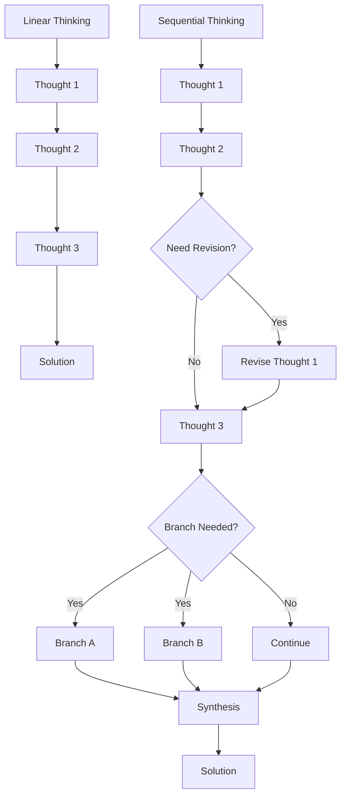
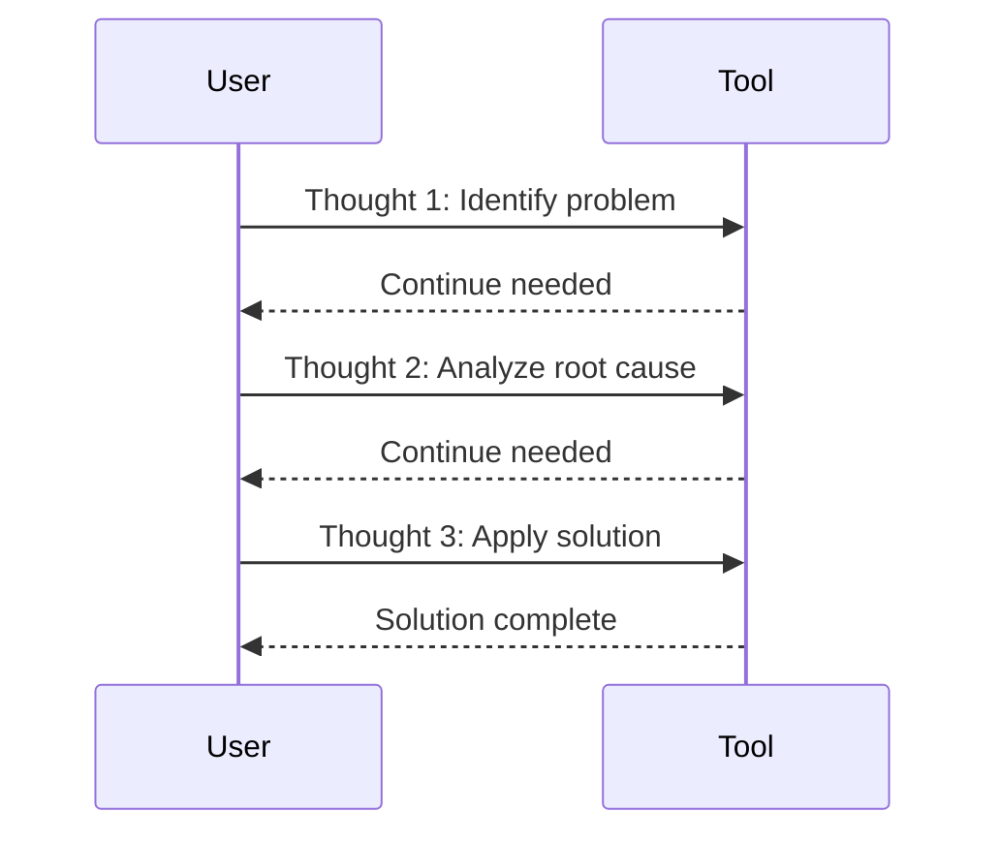
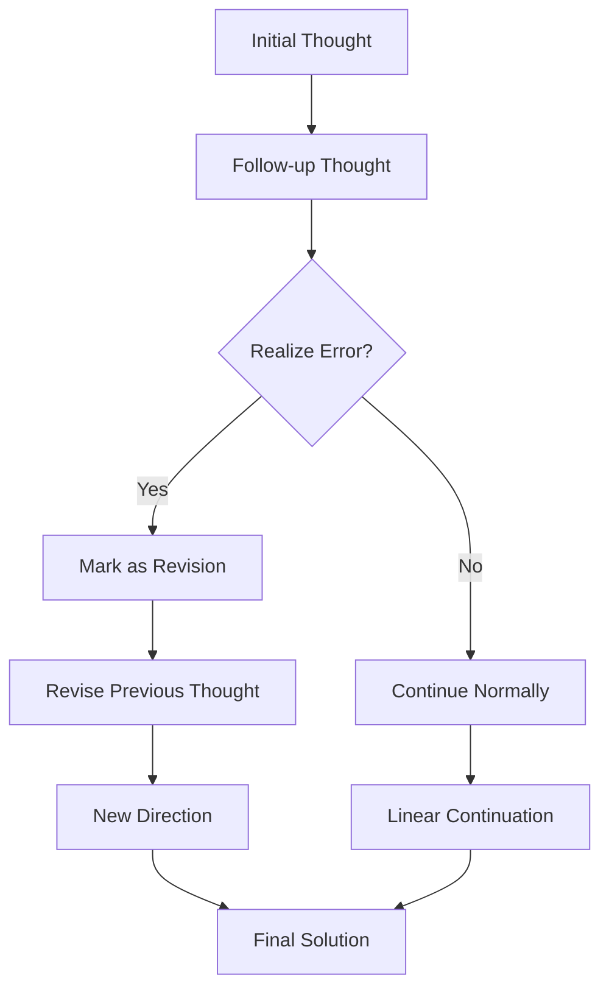
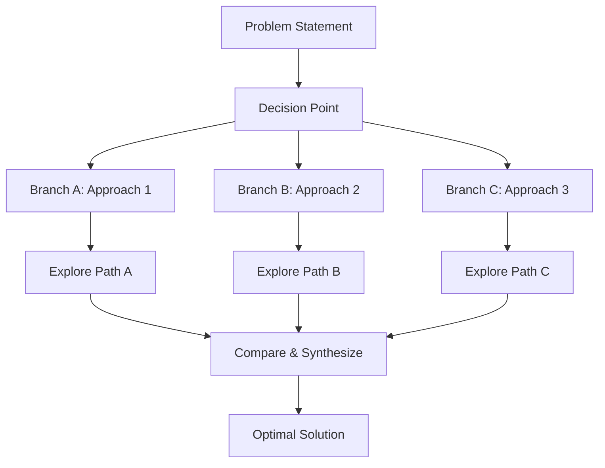
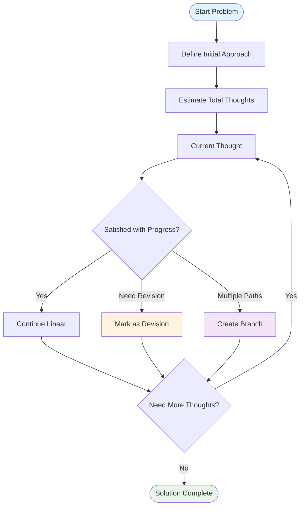
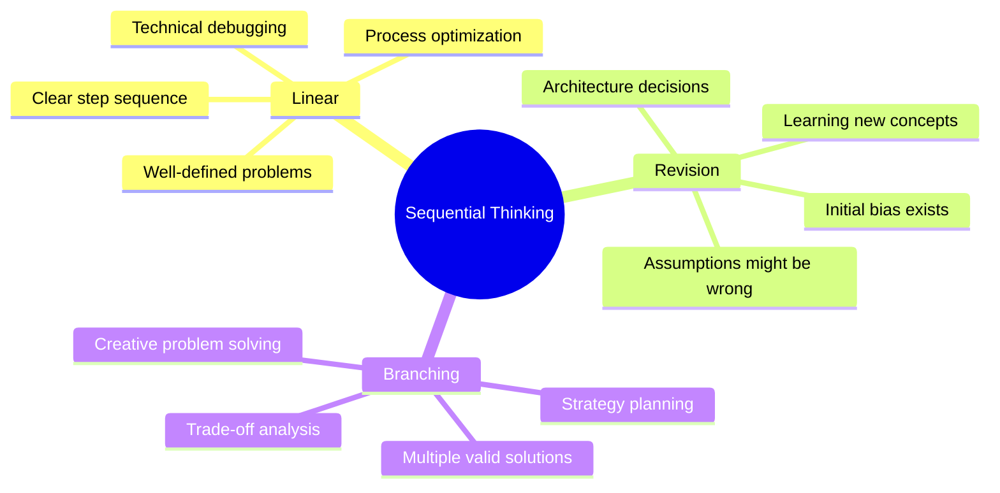
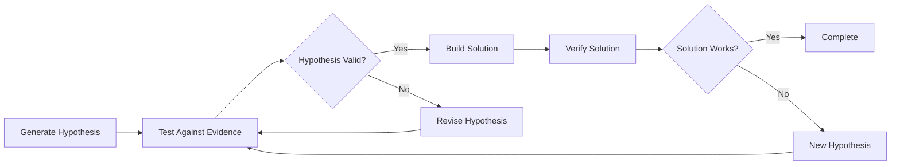
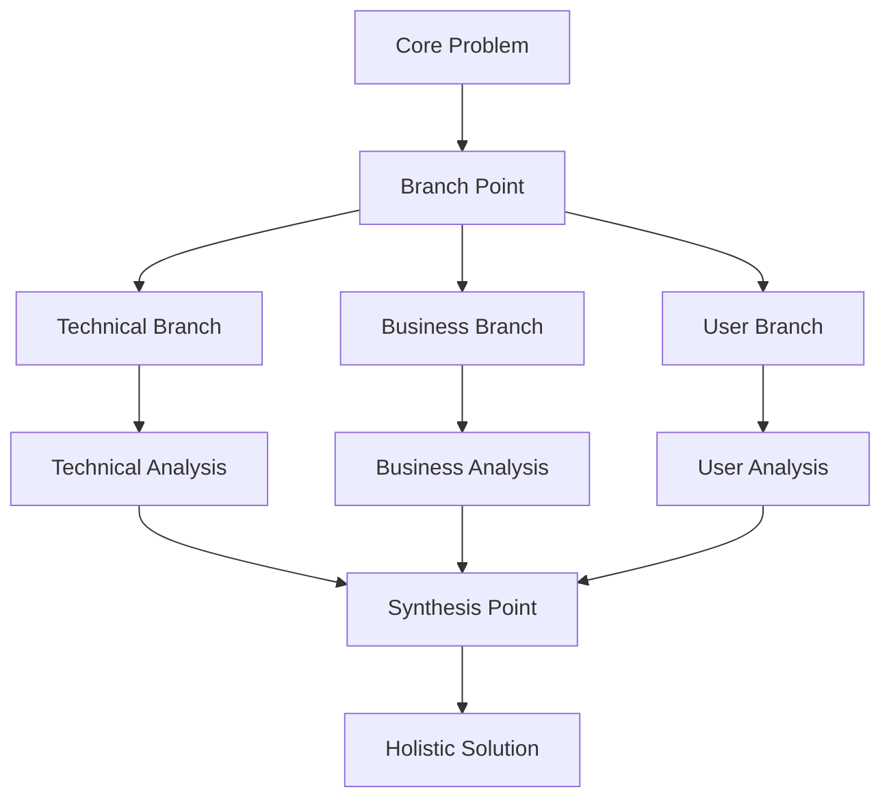

# Sequential Thinking Tool: Complete Usage Guide

## Overview

The `mcp__sequential-thinking__sequentialthinking` tool enables dynamic, step-by-step problem-solving where thoughts can evolve, branch, and revise as understanding deepens. Unlike linear thinking, it allows backtracking, course correction, and exploring multiple paths.

## MCP Server Configuration

Add this to your MCP configuration file:

```json
{
  "mcpServers": {
    "sequential-thinking": {
      "command": "npx",
      "args": [
        "-y",
        "@modelcontextprotocol/server-sequential-thinking"
      ]
    }
  }
}
```

## Core Concepts

### Thought Patterns



## Usage Patterns

### 1. Linear Problem Solving

**Best for:** Well-defined problems with clear steps



**Example Parameters:**
```json
{
  "thought": "Step 1: Identify the performance bottleneck",
  "nextThoughtNeeded": true,
  "thoughtNumber": 1,
  "totalThoughts": 3
}
```

### 2. Revision Pattern

**Best for:** Problems where initial assumptions might be wrong



**Example Usage:**
```json
{
  "thought": "Actually, I need to reconsider my earlier assumption about microservices",
  "isRevision": true,
  "revisesThought": 2,
  "thoughtNumber": 4,
  "totalThoughts": 5
}
```

### 3. Branching Exploration

**Best for:** Problems with multiple valid approaches



**Example Parameters:**
```json
{
  "thought": "Frontend-first approach: Start with React/Vue",
  "branchFromThought": 2,
  "branchId": "frontend-first",
  "thoughtNumber": 3,
  "totalThoughts": 6
}
```

## Parameter Reference

### Required Parameters

| Parameter | Type | Description |
|-----------|------|-------------|
| `thought` | string | Your current thinking step |
| `nextThoughtNeeded` | boolean | Whether another thought is needed |
| `thoughtNumber` | integer | Current step number |
| `totalThoughts` | integer | Estimated total steps (adjustable) |

### Optional Parameters

| Parameter | Type | Description | When to Use |
|-----------|------|-------------|-------------|
| `isRevision` | boolean | Marks thought as revision | When reconsidering previous thoughts |
| `revisesThought` | integer | Which thought to revise | With `isRevision: true` |
| `branchFromThought` | integer | Starting point for branch | When exploring alternatives |
| `branchId` | string | Branch identifier | To organize multiple branches |
| `needsMoreThoughts` | boolean | Need to extend beyond estimate | When realizing more steps needed |

## Decision Flow



## Best Practices

### When to Use Each Pattern



### Quality Indicators

✅ **Good Usage:**
- Express uncertainty when present
- Revise when realizing errors
- Adjust `totalThoughts` as understanding grows
- Use specific, actionable thoughts
- Only finish when truly satisfied

❌ **Poor Usage:**
- Forcing linear progression when revision needed
- Setting `nextThoughtNeeded: false` prematurely
- Avoiding revisions to save time
- Vague or non-actionable thoughts

## Advanced Techniques

### Hypothesis Testing Pattern



### Multi-Branch Synthesis



## Common Scenarios

### Debugging Complex Issues

1. **Symptom Identification** (Linear)
2. **Root Cause Analysis** (May require revision)
3. **Solution Brainstorming** (Branching)
4. **Implementation Planning** (Linear)

### Architecture Decisions

1. **Requirements Gathering** (Linear)
2. **Option Generation** (Branching)
3. **Trade-off Analysis** (Often requires revision)
4. **Decision Justification** (Synthesis)

### Learning New Technologies

1. **Initial Research** (Linear)
2. **Assumption Validation** (Revision-heavy)
3. **Hands-on Exploration** (Branching)
4. **Knowledge Consolidation** (Synthesis)

## Tool Response Format

The tool returns:
```json
{
  "thoughtNumber": 3,
  "totalThoughts": 5,
  "nextThoughtNeeded": true,
  "branches": ["frontend-first", "backend-first"],
  "thoughtHistoryLength": 12
}
```

Use this feedback to understand:
- Current position in thinking process
- Active branches being explored
- Total context accumulated

## Tips for Mastery

1. **Start Simple:** Begin with linear problems to understand the flow
2. **Embrace Uncertainty:** Don't pretend to know when you don't
3. **Revise Boldly:** It's better to correct course than continue wrong
4. **Branch Wisely:** Only branch when genuinely exploring alternatives
5. **Synthesize Thoughtfully:** Bring branches together meaningfully
6. **Finish Deliberately:** Only complete when truly satisfied with solution

The sequential thinking tool transforms complex problem-solving from a rigid process into an adaptive, intelligent exploration that mirrors how experts actually think through difficult challenges.