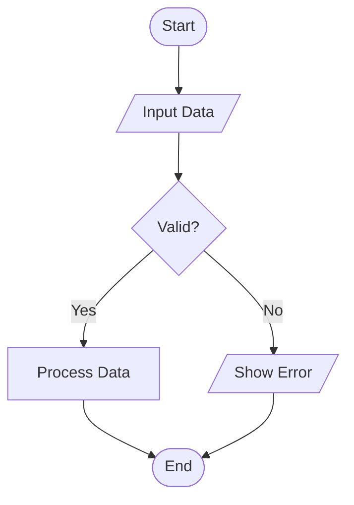
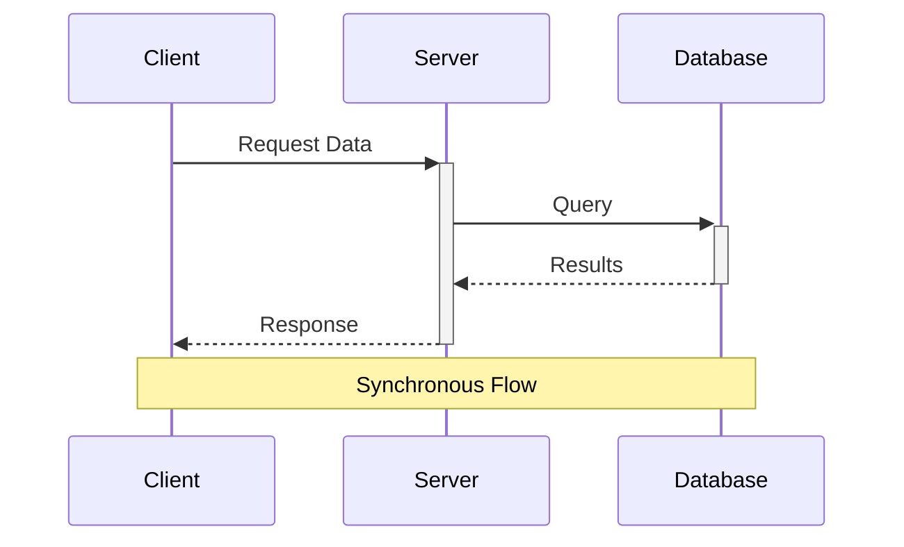
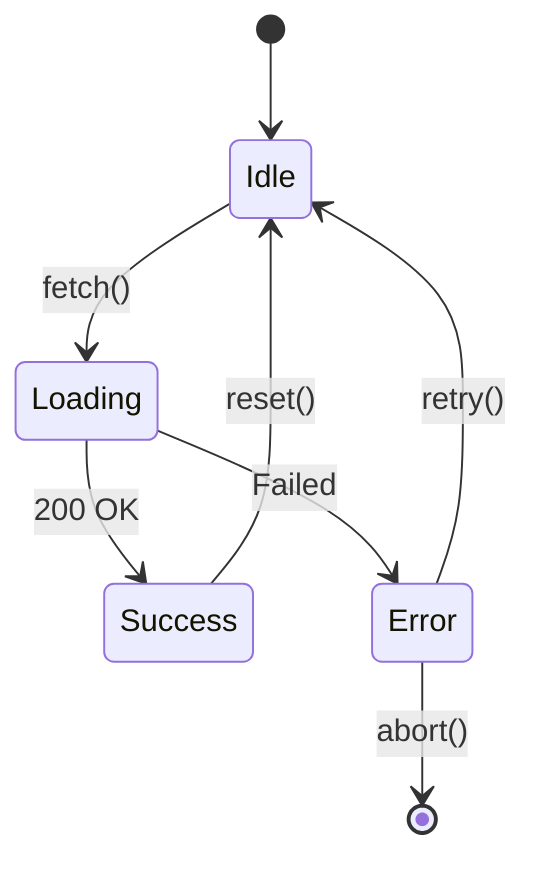
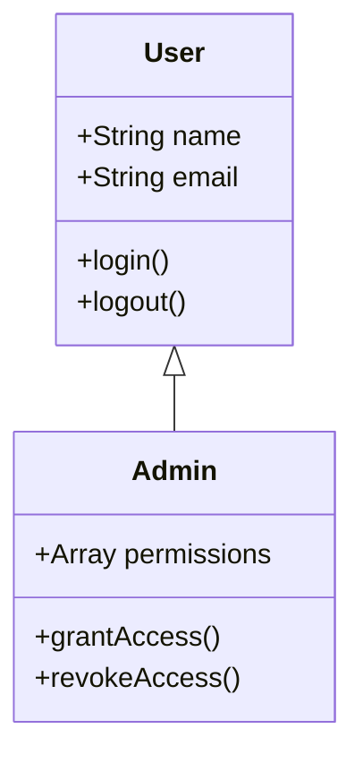
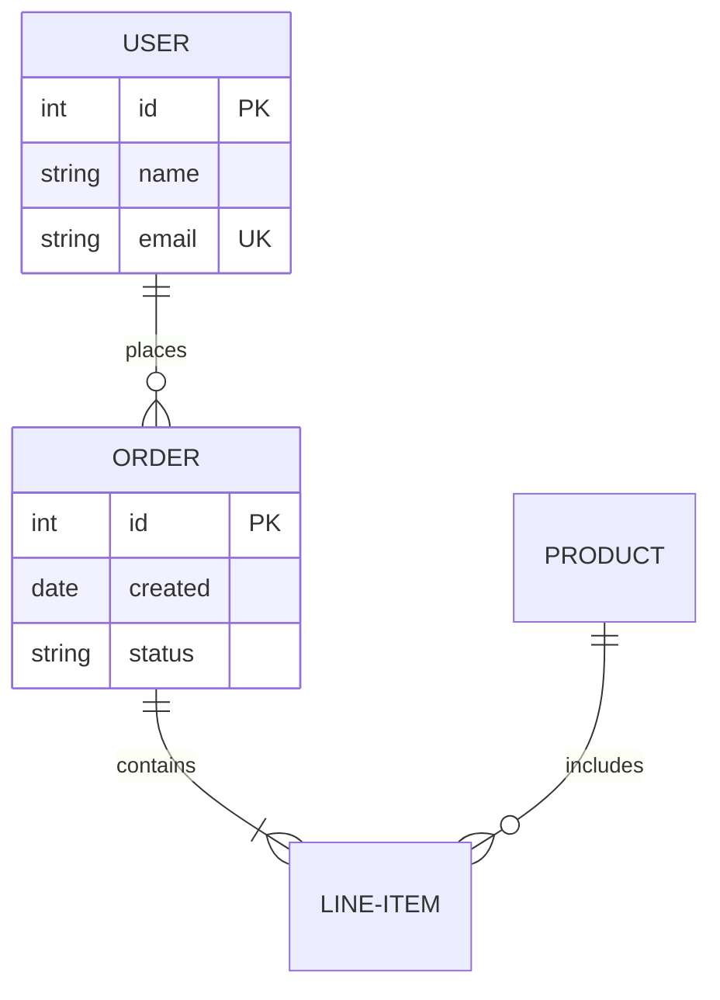
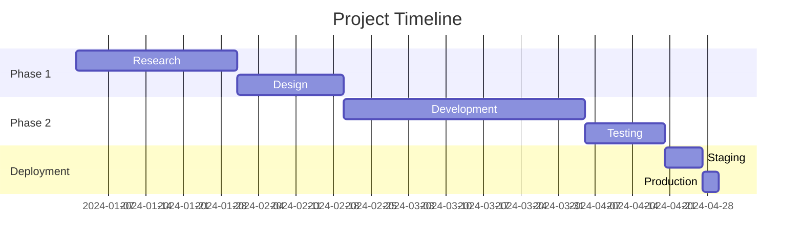
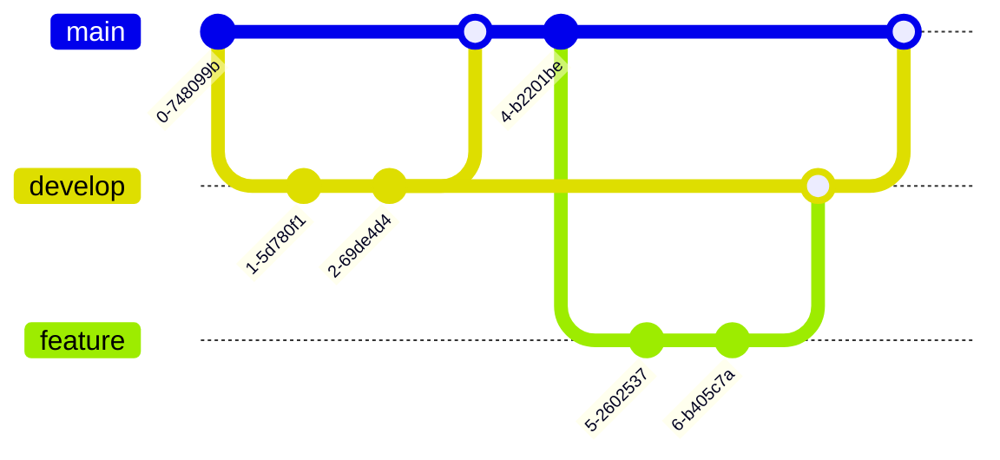
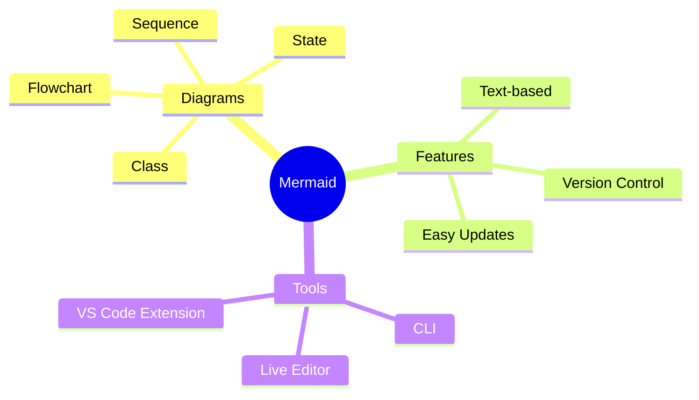
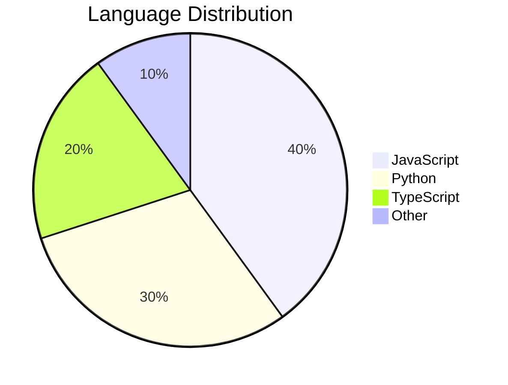

# Mermaid Diagram Guide

A comprehensive guide for creating and validating Mermaid diagrams in documentation.

## Overview

Mermaid is a JavaScript-based diagramming tool that renders text definitions into diagrams. It's perfect for documentation as it keeps diagrams as code, making them version-controllable and easy to maintain.

## Installation

### Global Installation (Recommended)
```bash
# Install Mermaid CLI globally
npm install -g @mermaid-js/mermaid-cli

# Verify installation
mmdc --version
```

### Using with npx (No Installation)
```bash
# Run without installing
npx -p @mermaid-js/mermaid-cli mmdc --help
```

## Syntax Validation

### Validate Standalone Files
```bash
# Validate a .mmd file
mmdc -i diagram.mmd -o output.svg

# Quick validation from stdin
echo "graph TD; A-->B" | mmdc -i - -o -

# Validate without keeping output
mmdc -i diagram.mmd -o /dev/null
```

### Validate Markdown Files
```bash
# Extract and validate all Mermaid blocks in a markdown file
mmdc -i document.md -o /dev/null

# Generate diagrams from markdown
mmdc -i README.md -o README-diagrams.md
```

## Dark Mode Best Practices

Since documentation may be viewed in dark mode:

1. **Use neutral backgrounds**: Prefer `#f8f9fa` over pure white
2. **Ensure contrast**: Dark text on light backgrounds works in both modes
3. **Test both themes**: Validate readability in light and dark environments
4. **Avoid hard-coded colors**: Let the renderer handle theme adaptation

## Diagram Types

### Flowchart


### Sequence Diagram


### State Diagram


### Class Diagram


### Entity Relationship Diagram


### Gantt Chart


### Git Graph


### Mind Map


### Pie Chart


## CLI Options

### Common Flags
```bash
# Theme selection
mmdc -i input.mmd -o output.svg -t dark

# Custom background
mmdc -i input.mmd -o output.png -b transparent

# PDF output with scaling
mmdc -i input.mmd -o output.pdf --pdfFit

# Custom dimensions
mmdc -i input.mmd -o output.png -w 1200 -H 800

# Quiet mode (suppress logs)
mmdc -i input.mmd -o output.svg -q
```

### Output Formats
- **SVG** (default): Scalable, perfect for web
- **PNG**: Raster image with customizable resolution
- **PDF**: Document embedding, print-ready

## Integration Tips

### VS Code Extensions
- **Mermaid Preview**: Live preview while editing
- **Markdown Preview Mermaid Support**: Render in markdown preview

### GitHub
- Mermaid diagrams render automatically in markdown files
- Use ```mermaid code blocks

### Documentation Sites
- **MkDocs**: Use `pymdown-extensions` with `superfences`
- **Docusaurus**: Built-in Mermaid support
- **GitBook**: Mermaid plugin available

## Common Issues

### Syntax Errors
```bash
# Debug syntax issues
mmdc -i broken.mmd -o test.svg 2>&1 | grep Error

# Common fixes:
# - Check for missing semicolons in flowcharts
# - Verify participant names in sequence diagrams
# - Ensure proper indentation in state diagrams
```

### Rendering Issues
- **Large diagrams**: Increase dimensions with `-w` and `-H`
- **Text cutoff**: Adjust node spacing in config
- **Dark mode**: Use theme-neutral colors

### Performance
- **Complex diagrams**: Split into multiple smaller diagrams
- **Batch processing**: Use shell scripts for multiple files
- **Caching**: Save rendered SVGs for static content

## Best Practices

1. **Keep it simple**: Prefer clarity over complexity
2. **Use descriptive labels**: Make diagrams self-documenting
3. **Version control**: Track diagram source in Git
4. **Consistent style**: Maintain uniform appearance across docs
5. **Accessibility**: Include diagram descriptions in surrounding text
6. **Responsive design**: Use SVG format for web display

## Resources

- [Official Mermaid Documentation](https://mermaid.js.org/)
- [Mermaid Live Editor](https://mermaid.live/)
- [Mermaid CLI GitHub](https://github.com/mermaid-js/mermaid-cli)
- [Diagram Syntax Reference](https://mermaid.js.org/syntax/flowchart.html)

## Quick Reference

```bash
# Validate syntax
mmdc -i diagram.mmd -o /dev/null

# Generate SVG
mmdc -i diagram.mmd -o diagram.svg

# Dark theme PNG
mmdc -i diagram.mmd -o diagram.png -t dark -b "#1e1e1e"

# Extract from markdown
mmdc -i README.md -o output.md

# Batch process
for f in *.mmd; do mmdc -i "$f" -o "${f%.mmd}.svg"; done
```