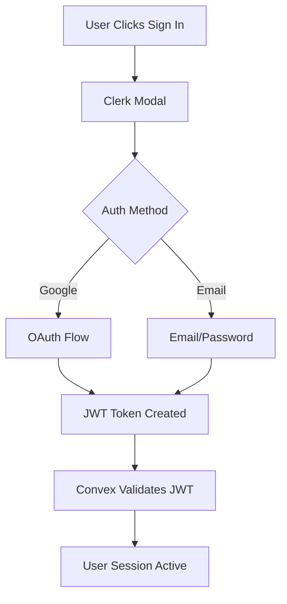
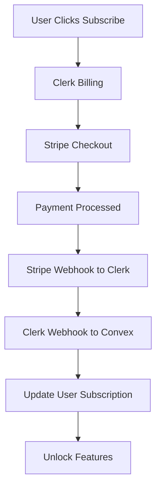

# Zero to Paid SaaS in 10 Minutes - Clerk + Convex + Stripe Stack

> **Source**: [YouTube - Ray Fernando](https://www.youtube.com/watch?v=1ewb59kUuuE)  
> **Starter Template**: [elite-next-clerk-convex-starter](https://github.com/RayFernando1337/elite-next-clerk-convex-starter)  
> **Author**: Ray Fernando (Former Apple Engineer)  
> **Stack**: Clerk (Auth) + Convex (Backend/DB) + Stripe (Payments)  
> **Time to Deploy**: 10 minutes  
> **Result**: Fully functional SaaS with auth, payments, and real-time database

## Overview

This guide documents a rapid SaaS development approach that combines three powerful tools to create a production-ready application with authentication, payments, and database in under 10 minutes. The stack eliminates weeks of traditional setup time by leveraging pre-configured integrations and webhooks.

### What You Get

- ✅ Google Sign-in + Email authentication
- ✅ Stripe subscription payments with payment-gated features  
- ✅ Real-time database with automatic syncing
- ✅ Webhooks that actually work
- ✅ Production-ready security (JWT tokens, webhook secrets)
- ✅ Dark mode support
- ✅ Fully typed TypeScript

### Time Comparison

| Traditional Setup | This Stack |
|------------------|------------|
| Auth: 3-5 days | 2 minutes |
| Stripe: 3-5 days | 3 minutes |
| Database: 2-3 days | 2 minutes |
| Webhooks: 2-3 days | 3 minutes |
| **Total: 2-3 weeks** | **10 minutes** |

## The Stack

### 1. Clerk (Authentication + Billing)
- Handles all authentication flows
- **Built-in Stripe integration** for subscription management
- Manages webhooks between services
- JWT tokens for secure API calls
- SSO connections (Google, Apple, etc.)

### 2. Convex (Backend + Database)
- Real-time database with TypeScript
- Automatic API generation
- Handles all CRUD operations
- Built-in webhook endpoints
- Automatic data syncing

### 3. Stripe (via Clerk)
- Subscription management
- Payment processing
- Billing webhooks
- Customer portal
- All managed through Clerk's dashboard

## Step-by-Step Setup

### Prerequisites

```bash
# Required tools
- Git
- Node.js/Bun
- Cursor/VS Code
- GitHub account
- Clerk account
- Convex account
```

### Step 1: Repository Setup

```bash
# 1. Use the starter template from GitHub
# Go to: https://github.com/RayFernando1337/elite-next-clerk-convex-starter
# Click "Use this template" > "Create a new repository"
# Repository name: 3-commas (or your project name)

# 2. Create workspace and clone
cd ~/workspace
git clone https://github.com/[your-username]/[your-repo-name].git

# 3. Open in Cursor/VS Code
cursor 3-commas
# or
code 3-commas

# 4. Install dependencies
bun install
# or
npm install
```

### Step 2: Clerk Configuration

#### 2.1 Create Clerk Application

1. Sign in to [Clerk Dashboard](https://dashboard.clerk.com)
2. Click "Create Application"
3. Name: Your project name
4. Auth methods: Email + Google (default)
5. Click "Create Application"

#### 2.2 Configure JWT Template for Convex

```javascript
// In Clerk Dashboard:
// 1. Go to JWT Templates
// 2. Click "Add New Template"
// 3. Select "Convex" from dropdown
// 4. Click "Save"
// 5. Copy the "Issuer" URL (you'll need this)
```

#### 2.3 Set Up Stripe Integration

```javascript
// In Clerk Dashboard:
// 1. Go to "Billing" section
// 2. Click "Add Plan"
// Plan details:
{
  name: "Pro Plan",  // or your plan name
  monthly_fee: 420,   // in cents ($4.20) or your price
}
// 3. Click "Save"
// 4. Enable Billing toggle
```

#### 2.4 Copy Environment Variables

```bash
# From Clerk Dashboard, copy these keys:
CLERK_PUBLISHABLE_KEY=pk_test_...
CLERK_SECRET_KEY=sk_test_...
CLERK_JWT_ISSUER_URL=https://...  # From JWT Template
```

### Step 3: Convex Setup

#### 3.1 Create Convex Project

```bash
# 1. Go to Convex Dashboard
# 2. Create new project: "3-commas"
# 3. In terminal, link the project:
bunx convex dev
# This will prompt you to select your project
```

#### 3.2 Configure Environment Variables

```bash
# Convex automatically creates .env.local with:
CONVEX_DEPLOYMENT=...
NEXT_PUBLIC_CONVEX_URL=...

# Add Clerk variables:
NEXT_PUBLIC_CLERK_PUBLISHABLE_KEY=pk_test_...
CLERK_SECRET_KEY=sk_test_...
NEXT_PUBLIC_CLERK_JWT_ISSUER_URL=https://...
```

### Step 4: Webhook Configuration

#### 4.1 Get Convex Webhook URL

```javascript
// In Convex Dashboard:
// 1. Go to Settings > Project Settings
// 2. Copy the "HTTP Actions URL"
// Format: https://[your-project].convex.site
```

#### 4.2 Configure Clerk Webhook

```javascript
// In Clerk Dashboard:
// 1. Go to Webhooks
// 2. Click "Add Endpoint"
// 3. URL: https://[your-project].convex.site/webhook/clerk
// 4. Select events:
//    - user.created
//    - user.updated
//    - user.deleted
//    - payment.attempt.updated
// 5. Click "Create"
// 6. Copy the "Signing Secret"
```

#### 4.3 Add Webhook Secret to Convex

```bash
# In Convex Dashboard:
# 1. Go to Settings > Environment Variables
# 2. Add new variable:
CLERK_WEBHOOK_SECRET=whsec_...
# 3. Save
```

### Step 5: Run the Application

```bash
# Terminal 1: Run Convex
bunx convex dev

# Terminal 2: Run Next.js
bun dev
# or
npm run dev

# Open http://localhost:3000
```

## Key Code Components

### Webhook Handler (convex/webhooks.ts)

```typescript
import { httpAction } from "./_generated/server";
import { Webhook } from "svix";

export const clerk = httpAction(async (ctx, request) => {
  const webhookSecret = process.env.CLERK_WEBHOOK_SECRET;
  
  // Verify webhook signature
  const svix = new Webhook(webhookSecret);
  const payload = await request.text();
  const headers = request.headers;
  
  const evt = svix.verify(payload, headers);
  
  // Handle different event types
  switch (evt.type) {
    case "user.created":
      // Create user in database
      break;
    case "payment.attempt.updated":
      // Update subscription status
      break;
  }
  
  return new Response("Success", { status: 200 });
});
```

### Protected Routes Example

```typescript
// app/dashboard/page.tsx
import { auth } from "@clerk/nextjs";
import { redirect } from "next/navigation";

export default async function Dashboard() {
  const { userId } = auth();
  
  if (!userId) {
    redirect("/sign-in");
  }
  
  // Check subscription status
  const user = await getUser(userId);
  if (!user.subscription) {
    redirect("/pricing");
  }
  
  return <DashboardContent />;
}
```

### Convex Schema Example

```typescript
// convex/schema.ts
import { defineSchema, defineTable } from "convex/server";
import { v } from "convex/values";

export default defineSchema({
  users: defineTable({
    clerkId: v.string(),
    email: v.string(),
    subscription: v.optional(v.object({
      plan: v.string(),
      status: v.string(),
      invoiceId: v.string(),
    })),
  }).index("by_clerk", ["clerkId"]),
  
  payments: defineTable({
    userId: v.id("users"),
    amount: v.number(),
    status: v.string(),
    stripeInvoiceId: v.string(),
    createdAt: v.number(),
  }).index("by_user", ["userId"]),
});
```

## Features Breakdown

### Authentication Flow



### Payment Flow



## Advanced Configuration

### Adding More SSO Providers

```javascript
// In Clerk Dashboard:
// 1. Go to SSO Connections
// 2. Click "Add Connection"
// 3. Select provider (Apple, Microsoft, etc.)
// 4. Configure OAuth settings
// 5. Save and it's automatically available
```

### Custom Subscription Plans

```javascript
// Multiple tiers example:
const plans = [
  {
    name: "Starter",
    price: 9.99,
    features: ["Basic features", "10 projects"],
  },
  {
    name: "Pro",
    price: 29.99,
    features: ["All features", "Unlimited projects", "Priority support"],
  },
  {
    name: "Enterprise",
    price: 99.99,
    features: ["Everything in Pro", "SSO", "SLA"],
  },
];
```

### Database Queries with Convex

```typescript
// convex/queries.ts
import { query } from "./_generated/server";
import { v } from "convex/values";

export const getUser = query({
  args: { clerkId: v.string() },
  handler: async (ctx, args) => {
    return await ctx.db
      .query("users")
      .withIndex("by_clerk", (q) => q.eq("clerkId", args.clerkId))
      .unique();
  },
});

export const getUserPayments = query({
  args: { userId: v.id("users") },
  handler: async (ctx, args) => {
    return await ctx.db
      .query("payments")
      .withIndex("by_user", (q) => q.eq("userId", args.userId))
      .collect();
  },
});
```

## Production Checklist

- [ ] Environment variables set in production
- [ ] Webhook URLs updated for production domain
- [ ] Stripe in production mode (not test mode)
- [ ] SSL certificates configured
- [ ] Rate limiting enabled
- [ ] Error monitoring (Sentry, etc.)
- [ ] Analytics tracking
- [ ] Privacy policy and terms of service
- [ ] GDPR compliance if applicable

## Troubleshooting

### Common Issues

1. **Webhook signature verification fails**
   - Ensure CLERK_WEBHOOK_SECRET is correct
   - Check that webhook URL ends with `/webhook/clerk`

2. **Authentication not working**
   - Verify all Clerk environment variables
   - Check JWT template is configured for Convex

3. **Payments not updating**
   - Ensure billing is enabled in Clerk
   - Verify payment.attempt.updated webhook is selected

4. **Database not syncing**
   - Check Convex is running (`bunx convex dev`)
   - Verify NEXT_PUBLIC_CONVEX_URL is correct

## Resources

- [Starter Template Repository](https://github.com/RayFernando1337/elite-next-clerk-convex-starter) - The official template from Ray Fernando
- [Clerk Documentation](https://clerk.com/docs)
- [Convex Documentation](https://docs.convex.dev)
- [Stripe Documentation](https://stripe.com/docs)
- [Ray Fernando's Channel](https://www.youtube.com/@rayfernando) - More speedrun content

## Key Advantages

1. **Speed**: 10-minute setup vs 2-3 weeks traditional
2. **Integration**: Everything works together out of the box
3. **Type Safety**: Full TypeScript support across stack
4. **Real-time**: Database updates sync automatically
5. **Managed Webhooks**: No manual webhook configuration
6. **Built-in Billing**: Stripe integration handled by Clerk
7. **Security**: JWT tokens, webhook verification built-in
8. **Scalability**: All services are cloud-native and scale automatically

## Cost Analysis

| Service | Free Tier | Paid Starting |
|---------|-----------|---------------|
| Clerk | 10,000 MAU | $25/mo |
| Convex | Generous free tier | $25/mo |
| Stripe | 2.9% + $0.30/transaction | Volume discounts |

**Total to start**: $0 (all have free tiers)  
**At scale**: ~$50/mo + transaction fees

## Conclusion

This stack represents a paradigm shift in SaaS development speed. What traditionally required a team and weeks of setup can now be accomplished by a solo developer in 10 minutes. The combination of Clerk's auth/billing integration, Convex's real-time backend, and Stripe's payment processing creates a powerful foundation for any SaaS application.

The key insight is that these tools were designed to work together - Clerk has native Convex support, webhooks are pre-configured, and everything is type-safe with TypeScript. This isn't just prototyping; it's production-ready infrastructure that can scale to millions of users.

---

*"Stop watching YouTube and go build your SaaS. You literally have no excuse now."* - Ray Fernando